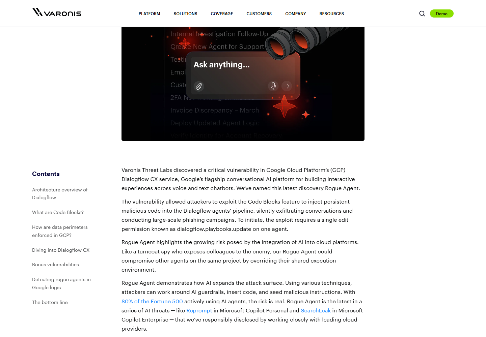
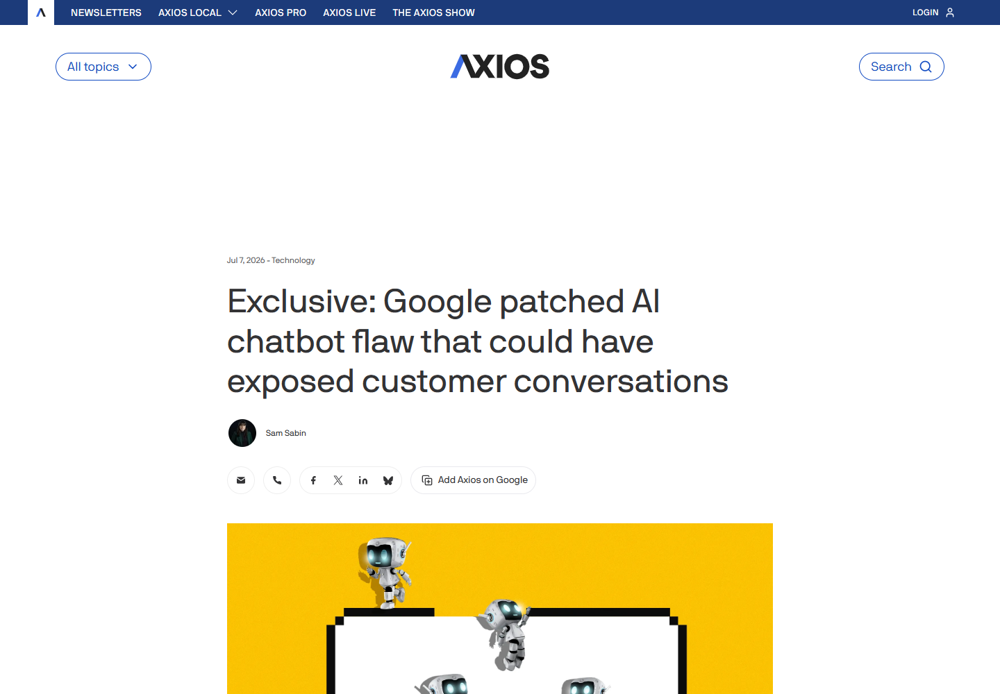
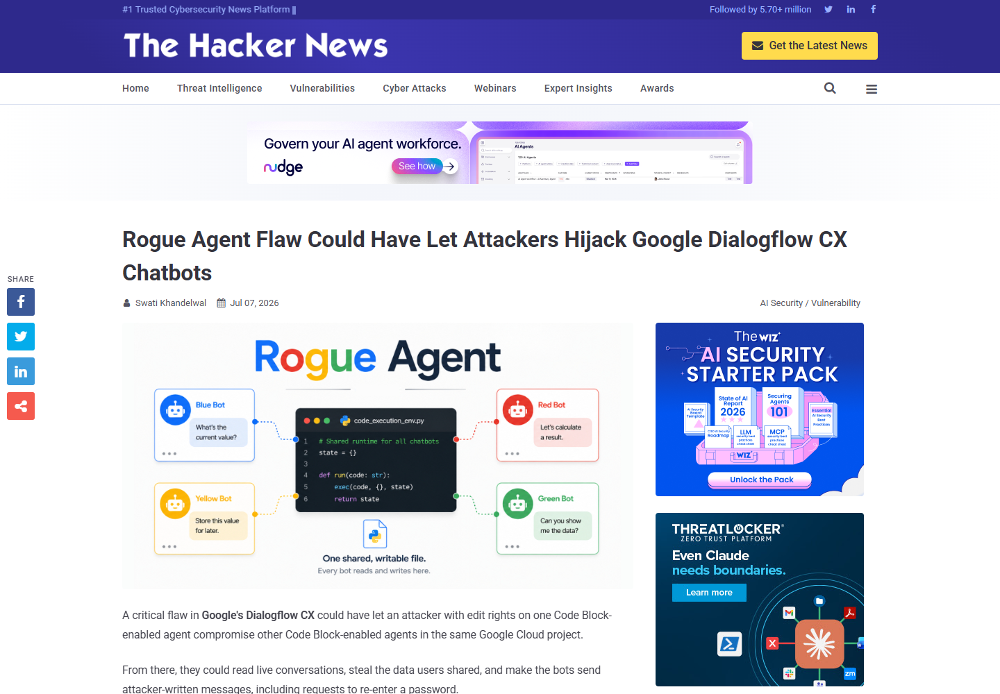
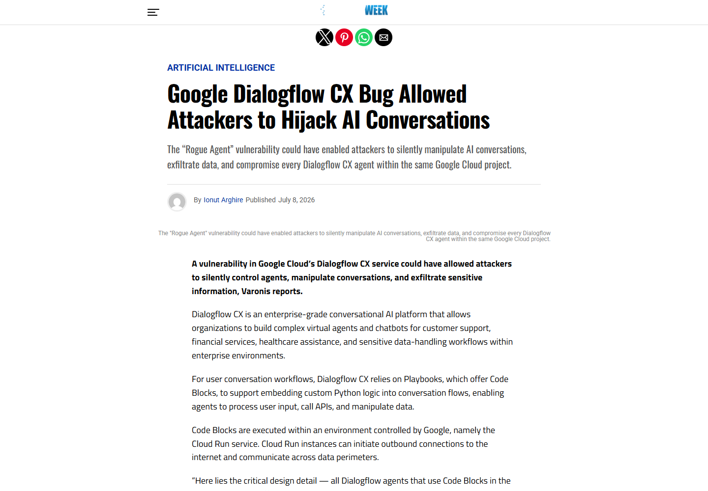
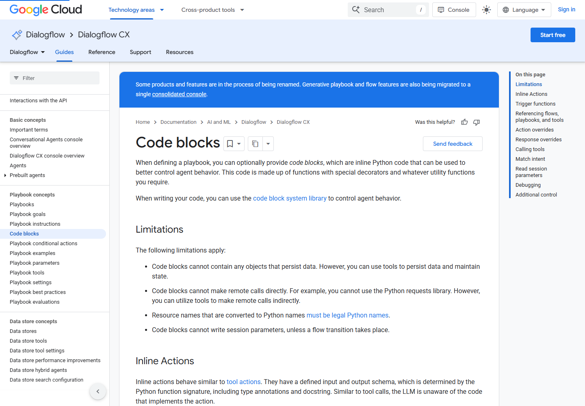

# Google Dialogflow CX Rogue Agent Conversation Hijack (2026)
> Google Dialogflow CX Rogue Agent 跨智能体会话劫持漏洞

| Field | Value |
|---|---|
| Category | cloud-iac |
| Severity | critical |
| AI Tool | Google Cloud Dialogflow CX, Conversational Agents Playbooks |
| Language | Python / Google Cloud |
| Real Incident | Yes |
| Reproducible | Yes |
| Disclosed | 2026-07-07 |

## TL;DR
Dialogflow CX 的 Playbook Code Blocks 在同一项目内共享可写执行环境。研究人员发现，拥有一个智能体 `dialogflow.playbooks.update` 权限的人可以写入内联 Python，覆盖运行环境中的关键文件，使恶意逻辑在后续会话中持续执行。攻击者因而能够读取完整对话、伪造智能体回复，并把数据发送到外部服务器；影响还可能越过最初被编辑的智能体，扩展到同一 Google Cloud 项目中的其他 Dialogflow CX 智能体。

---

## 详细分析 / Full Analysis

## 一、事件概况

Dialogflow CX 用 Playbook 编排生成式客服和语音智能体的任务流程，Code Blocks 则允许开发者把 Python 函数直接放进流程。Varonis Threat Labs 在 2025 年 11 月向 Google 报告了这一执行链中的隔离缺陷，并在 Google 完成修复后于 2026 年 7 月公开技术细节。Google 先在 2026 年 4 月部署初步更新，6 月完成修复。

公开测试中，研究人员只需要取得一个智能体的 `dialogflow.playbooks.update` 权限。这个权限表面上用于维护 Playbook，却同时允许配置可执行的 Code Block。进入运行环境后，代码能够看到会话历史和状态参数，还能修改承载 Code Blocks 的共享文件。原本针对单个智能体的内容编辑权限，由此跨越了配置、代码执行和项目级会话隔离三道界面。

Varonis 明确表示未发现修复前存在在野利用。因此，本案例记录的是经过负责任披露并已修复的真实产品漏洞和可复现实验，而不是已经确认发生客户数据泄露的攻击事件。

## 二、公开材料与时间线

Varonis 的原始报告给出了权限名称、共享 Cloud Run 环境、关键文件、利用步骤和处置建议。Axios 在同日的报道中确认 Google 已修复该问题，并说明潜在后果包括劫持客户对话和诱导用户提交敏感信息。SecurityWeek 与 The Hacker News 随后分别核对了披露时间、补丁时间和攻击所需权限。Google Cloud 的产品文档则确认 Code Blocks 是 Playbook 中用于控制智能体行为的内联 Python 代码，并说明代码可以访问会话状态、调用工具和覆盖后续动作。

### 证据矩阵

| 来源 | 类型 | 证明内容 |
|---|---|---|
| Varonis Threat Labs | 原始技术披露 | 权限前提、共享执行环境、持久化方法、影响和修复时间 |
| Axios | 独立新闻报道 | Google 修复情况、产品用途和潜在数据风险 |
| The Hacker News | 安全媒体报道 | 攻击链、跨智能体影响和公开时间 |
| SecurityWeek | 安全媒体报道 | 负责任披露、补丁时间与通知型影响描述 |
| Google Cloud 文档 | 厂商产品文档 | Code Blocks、Playbook、会话状态与动作覆盖的正常设计 |

这些来源在核心事实上相互吻合：入口是单个智能体的 Playbook 更新权限，执行点是 Code Blocks，放大影响的条件是共享且可写的托管运行环境。媒体报道没有提供新的利用证据，技术细节仍以研究团队报告为准。

## 三、系统结构与触发条件

正常情况下，Playbook 把自然语言步骤、工具调用和流程跳转组织在一起。Code Blocks 为这套生成式流程补充确定性的 Python 逻辑，例如在模型预测下一动作前运行触发函数，或者通过 `respond()` 强制返回特定内容。Google 文档还说明，代码可以读取会话状态，并把动作加入待执行队列。这意味着 Code Block 并非普通展示脚本，而是位于智能体决策和用户响应之间的高权限执行组件。

漏洞触发需要两个条件。第一，攻击者已经获得某个 Agent 范围内的 Playbook 更新权限；第二，该项目使用受影响时期的 Code Blocks 执行环境。研究人员没有把攻击描述成匿名互联网入口。实际环境中应重点审查哪些人员、自动化账号或外部集成拥有该权限，以及这些身份是否本应只负责编辑对话流程。

关键结构问题在于，同一 GCP 项目内使用 Code Blocks 的多个 Dialogflow 智能体实际上共用一个由 Google 管理的 Cloud Run 执行环境。客户看不到该环境内部的文件变化，常规权限模型却仍把 Agent 级 Playbook 编辑视作局部操作。当执行环境既有可写文件系统又允许公网出站时，局部权限就有机会改变共享基础设施。

## 四、攻击链与持久化过程

研究人员首先在获准编辑的 Playbook 中加入 Python Code Block。运行环境会把用户代码追加到内部系统代码，再交给 `exec()` 执行；同一作用域中已经存在 `history`、`state` 和 `respond()` 等对象。恶意代码因此可以直接读取历史用户话语、智能体回复、会话 ID 等信息，也能生成看似由智能体正常输出的钓鱼提示。

随后，研究人员发现负责执行 Code Blocks 的 `code_execution_env.py` 可被当前代码改写。他们让初始 Code Block 从外部位置取得修改后的文件并覆盖原文件。此后每次用户发言都会先经过植入的逻辑，即使攻击者把控制台中的恶意 Code Block 恢复成正常内容，运行环境里的改动仍然存在。这种“配置已恢复、执行层仍被污染”的状态显著增加了排查难度。

恶意执行层能够在调用正常逻辑前复制对话，将数据经公网出口发送到攻击者控制的端点，再用 `respond()` 插入伪造的重新认证请求。用户输入的凭据会作为下一轮会话内容再次经过同一植入逻辑。由于环境被多个 Agent 共用，后门并不局限于最初被修改的 Playbook。

## 五、AI 安全问题分析

这起漏洞与生成式智能体强相关，因为受保护对象不是普通 Web 页面或单个函数，而是承接模型决策、会话上下文和工具动作的运行时。`history` 中既有用户输入，也有模型输出和流程状态；`respond()` 又能把攻击者内容包装成可信的智能体回复。执行环境一旦失守，攻击者控制的是人与智能体交互的完整闭环，而不只是后台主机上的一个进程。

另一个问题是权限名称与真实能力不匹配。维护 Playbook 容易被理解为编辑提示词和业务流程，但 Code Blocks 把它变成了 Python 执行权限。智能体平台在评估最小权限时，不能只看控制台资源层级，还要追踪一个配置字段最终是否进入模型上下文、工具调用器、代码解释器或共享运行时。

共享环境进一步打破了租户对 Agent 隔离的直觉。同一项目中的客服、财务或医疗咨询智能体可能面向不同人群并处理不同数据，业务上相互独立，却因 Code Blocks 复用底层环境而共享风险。对 AI 平台而言，隔离单元应覆盖模型上下文、工具凭据、临时文件和可执行扩展，不能只在控制面上区分 Agent 名称。

## 六、影响评估

成功利用后，攻击者可截取对话、修改回复、诱导用户提交凭据，并借公网出口传输数据。具体泄露内容取决于业务 Agent 实际接收的信息：客服场景可能包含身份资料和工单内容，金融或医疗场景还可能出现支付、健康或账户信息。报告还演示了读取托管环境元数据服务令牌，但该令牌在测试时权限较低，不能据此推断已经取得 Google 项目管理员权限。

影响范围应按“曾使用 Code Blocks 的 GCP 项目”梳理，而不是只列出一个被编辑的 Agent。若项目内多个 Agent 共享运行环境，任意一处可疑 Playbook 更新都需要触发项目级会话和凭据调查。已经启用 VPC Service Controls 的组织也不能仅凭网络边界排除数据外传，因为报告指出托管执行环境当时位于客户可见边界之外并具有公网出口。

## 七、处置与排查

Google 已在服务端完成修复，客户无需安装本地补丁，但仍应审计修复前的 Playbook 变更。调查可以从 Cloud Audit Logs 中的 `dialogflow.playbooks.update` 相关活动开始，核对操作者、目标 Agent、变更时间和代码内容，再关联异常对话、外部网络访问、强制重新认证提示及同一项目内其他 Agent 的异常表现。

权限治理上，应把带 Code Blocks 的 Playbook 更新视为生产代码变更，使用单独角色、双人复核和受控发布流程。对高敏感会话，还应保留独立于托管运行时的输入输出审计，以便控制台配置被恢复后仍能重建事件。新增 Agent 时应验证执行扩展是否跨 Agent 共用文件、进程、网络出口或服务身份。

## 八、核验结论

原始披露、三家独立报道和 Google 产品文档共同确认了产品、功能和攻击链。修复时间为 2026 年 6 月，技术报告于 7 月 7 日公开。公开材料支持“可读取和篡改同项目智能体会话”的实验结论，但不支持把它描述为已造成客户泄露的在野攻击。截图均来自下列原始网页的实际渲染，assets 中同时保留对应 HTML 页面。

## 参考资料 / References

1. [Varonis Threat Labs: Rogue Agent](https://www.varonis.com/blog/rogue-agent-dialogflow-attack)
2. [Axios: Google patched Dialogflow CX chatbot flaw](https://www.axios.com/2026/07/07/varonis-google-ai-agent-chatbot-security)
3. [The Hacker News: Rogue Agent flaw in Dialogflow CX](https://thehackernews.com/2026/07/rogue-agent-flaw-could-have-let.html)
4. [SecurityWeek: Dialogflow CX bug allowed chatbot hijacking](https://www.securityweek.com/google-dialogflow-cx-bug-allowed-attackers-to-hijack-ai-conversations/amp/)
5. [Google Cloud documentation: Dialogflow CX Code Blocks](https://docs.cloud.google.com/dialogflow/cx/docs/concept/playbook/code-block)
