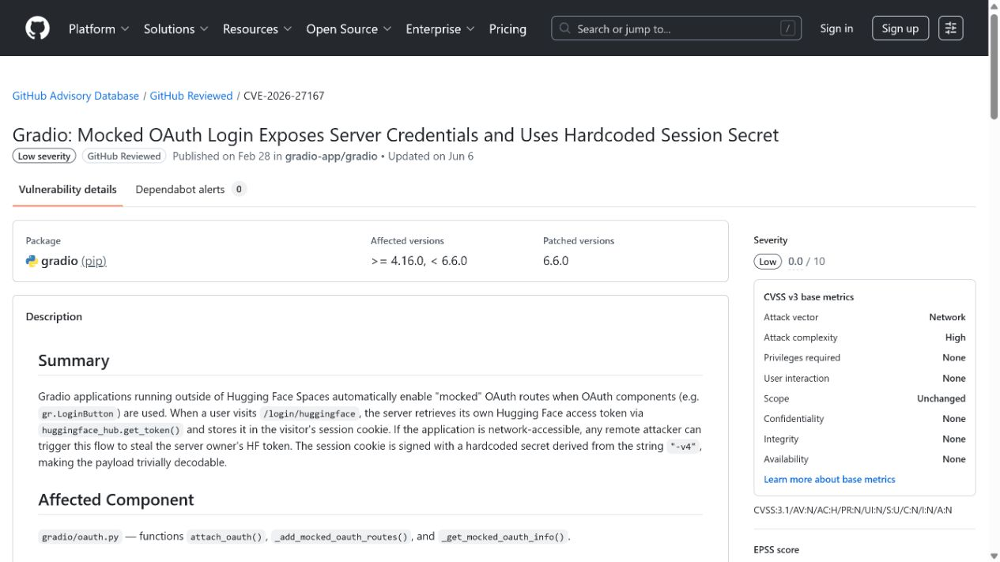
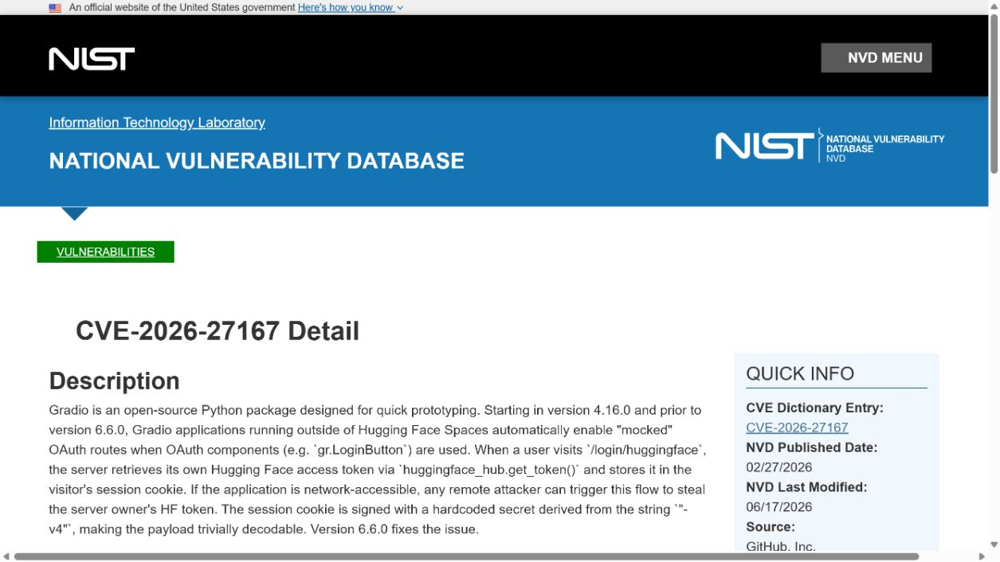
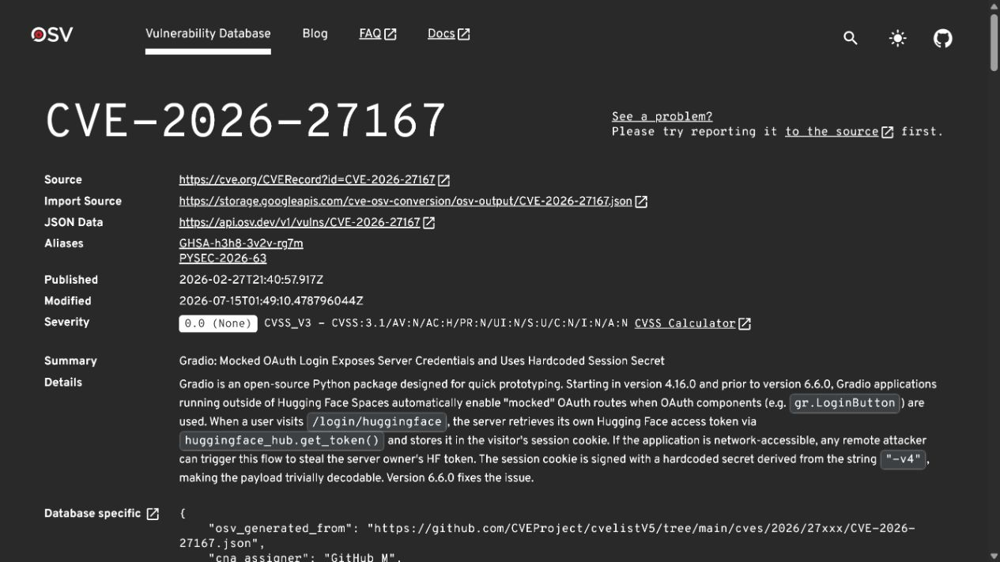
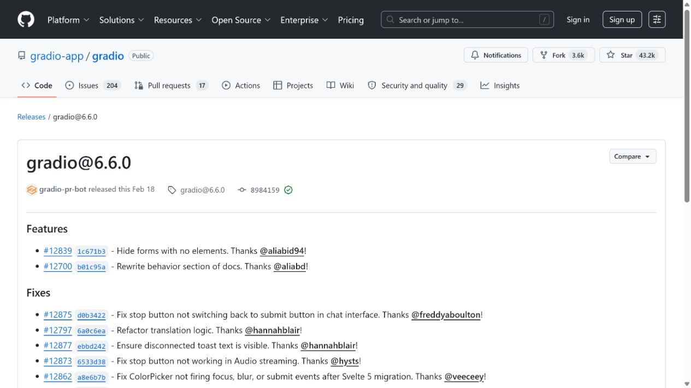
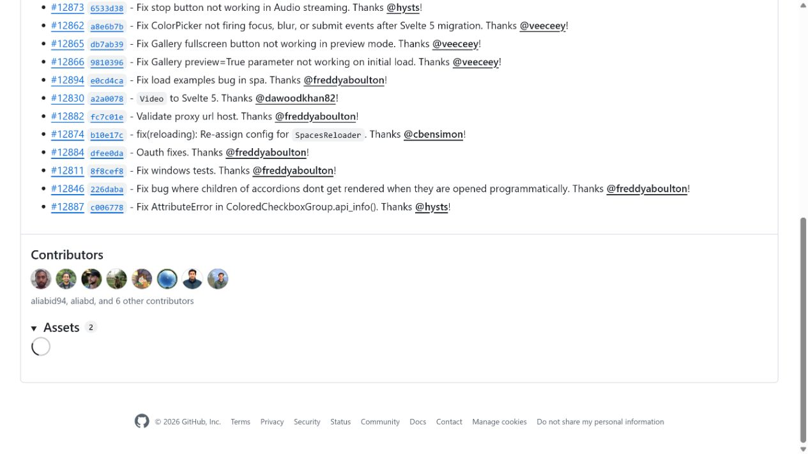

# Gradio Mocked OAuth Hugging Face Token Exposure (2026)
> Gradio Mocked OAuth 路径导致 Hugging Face 令牌暴露

| Field | Value |
|---|---|
| Category | Domain-Specific Risks |
| Severity | High |
| AI Tool | Gradio, Hugging Face OAuth components, AI demo applications |
| Language | Python / OAuth / HTTP |
| Real Incident | Yes |
| Reproducible | Yes |
| Disclosed | 2026-02-27 |
| CVE | CVE-2026-27167 |
| CVSS | 5.9 |

## TL;DR
Network-accessible Gradio apps using mocked OAuth could place the server's Hugging Face token in a visitor-controlled session cookie, exposing credentials through a hardcoded signing secret.
> 使用 mocked OAuth 的可访问 Gradio 应用会把服务器 Hugging Face 令牌写入访问者会话 cookie，并因硬编码签名秘密而造成凭据暴露。

---

## 详细分析 / Full Analysis

## 一、基本信息与事件概况

CVE-2026-27167 影响在 Hugging Face Spaces 外运行、同时启用 Gradio OAuth 组件的应用。受影响版本会自动启用 mocked OAuth 路由；当远程访问者请求特定登录路径时，应用会获取服务器自身的 Hugging Face token 并把它写入访问者会话。会话 cookie 的签名秘密又可由固定字符串推导，使内容容易被解码。

这不是用户自己授权后泄露其 token，而是应用把部署者的服务器端身份材料交给了访问者。令牌的实际权限取决于部署者的设置，可能只影响模型或 Space 访问，也可能涉及私有仓库、组织资源或其他 Hugging Face API 能力。

## 二、事件经过与公开材料

GitHub Advisory Database 于 2026 年 2 月 27 日发布 GHSA-h3h8-3v2v-rg7m，CVE-2026-27167 随后进入 NVD 与 OSV。NVD 在后续分析中记录了 4.16.0 到 6.6.0 之前的影响范围，修复版本为 6.6.0。CISA SSVC 收录了 PoC 与部分技术影响。

公共资料没有报告具体受害部署或已被盗用的 token 数量。案例因此针对的是一个被确认的凭据暴露漏洞，而不是对所有 Gradio 应用做泛化风险判断。

### 证据矩阵

| 来源 | 类型 | 证明内容 |
|---|---|---|
| GitHub Advisory: GHSA-h3h8-3v2v-rg7m | 项目安全公告 | mocked OAuth、cookie 和修复版本 |
| NVD: CVE-2026-27167 | 政府漏洞数据库 | 影响范围、CWE、NVD 评分与 SSVC |
| OSV: CVE-2026-27167 | 独立漏洞数据库 | 包版本和 CVE/GHSA 对照 |
| Gradio release 6.6.0 | 项目发布记录 | 修复版本的上游发布背景 |
| Gradio version comparison: 6.5.1 to 6.6.0 | 项目上游代码记录 | 修复版本前后的官方代码变更 |

## 三、系统背景与触发条件

Gradio 常用于快速部署模型演示、内部工具和面向客户的 AI 应用。OAuth 登录组件让开发者方便地集成身份系统，但本地测试模式与公开部署模式的边界必须明确。将方便测试的 mocked 登录路径自动带入非 Spaces 环境，会把开发假设带到互联网可访问的应用上。

会话 cookie 本身不是问题；问题在于其中装入了服务端 token，并使用可预测秘密签名。身份系统必须区分“给用户的会话状态”和“只应留在服务器的上游凭据”，不能让前者成为后者的载体。

## 四、攻击链路或失效过程

攻击者发现一个使用受影响 Gradio 版本、在 Spaces 外网络可达且配置 OAuth 组件的应用。攻击者访问 mocked OAuth 登录路由，服务端读取自己的 Hugging Face token 并将其放入会话 cookie。由于签名秘密可推导，攻击者解码 cookie 后获得 token，并按 token 权限访问相应资源。

不需要攻击者提前登录，也不要求受害用户交互；但目标必须满足特定部署条件。升级后，仍应轮换旧 token，因为版本修复不能使已经发出的凭据失效。

## 五、技术根因与 AI 风险分析

根因包括两层设计失效：测试用的 mocked OAuth 路由在公开部署中自动启用，以及服务器端 token 被序列化进用户会话。硬编码会话签名进一步削弱了原本应保护 cookie 内容的完整性和保密性。

修复措施应禁止生产环境自动进入模拟认证，并让服务端 token 只存在于后端受控存储。任何认证回调都需要清楚验证部署模式、来源和会话内容，测试捷径不能成为默认的公开接口。

Gradio 经常承载模型演示、内部知识库和临时业务原型，这些应用虽然界面轻量，却可能继承部署者的 Hugging Face 身份、模型访问权限和私有仓库权限。认证流程中的错误会把这类服务器端能力从幕后配置变成用户可取得的数据，因此影响并不限于登录体验。对于依赖私有模型或受限数据集的团队，一枚泄露 token 还可能成为枚举项目资源和继续访问 API 的入口。

该问题也反映出 AI 原型进入生产后的常见落差。开发期间为了验证 OAuth 或方便演示而保留的选项，往往不会出现在产品主流程中，因而更容易逃过人工测试。上线检查应覆盖实际启动参数、环境变量、公开路由和 cookie 内容，而不是只确认页面能够登录。将测试认证配置与生产密钥分开管理，能降低一次配置失误同时泄露真实身份材料的概率。

## 六、影响范围与处置建议

泄露的 Hugging Face token 可能被用于访问与其范围一致的模型、仓库、组织或 API 服务。受影响应用应升级到 6.6.0 或更高版本，禁用不必要的 agent 或 OAuth 配置，并立即撤销和重新签发部署者 token。日志中应检索异常的登录路径访问和随后出现的 token API 调用。

由于没有公开受害统计，组织应以自身 token 范围与应用公开程度评估优先级。使用最小权限、短有效期令牌和服务端密钥管理可以显著降低类似配置错误的后果。

## 七、结论

AI 演示框架的登录组件同样属于高价值身份边界。开发便利功能一旦混入公网部署，就可能让模型平台凭据通过看似普通的会话流程离开服务器。

## 八、参考来源

- [GitHub Advisory: GHSA-h3h8-3v2v-rg7m](https://github.com/advisories/GHSA-h3h8-3v2v-rg7m)
- [NVD: CVE-2026-27167](https://nvd.nist.gov/vuln/detail/CVE-2026-27167)
- [OSV: CVE-2026-27167](https://osv.dev/vulnerability/CVE-2026-27167)
- [Gradio release 6.6.0](https://github.com/gradio-app/gradio/releases/tag/gradio%406.6.0)
- [Gradio version comparison: 6.5.1 to 6.6.0](https://github.com/gradio-app/gradio/compare/gradio%406.5.1...gradio%406.6.0)
