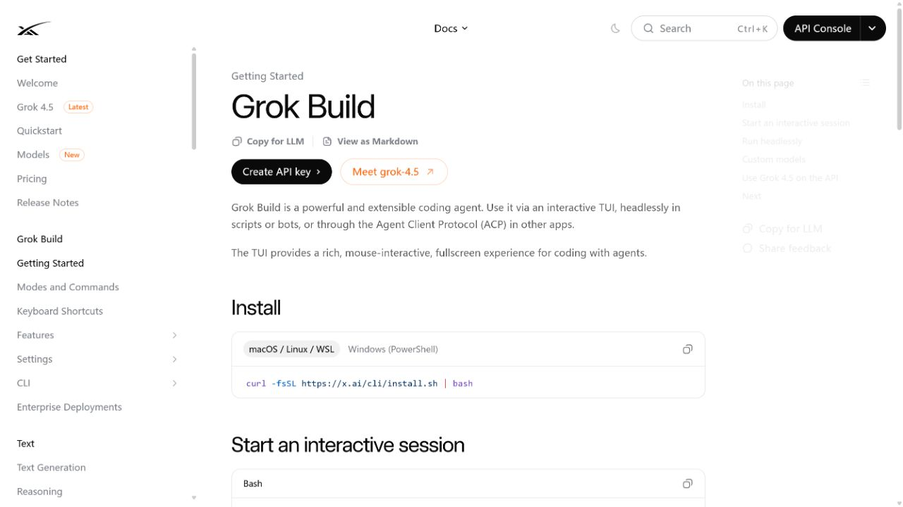
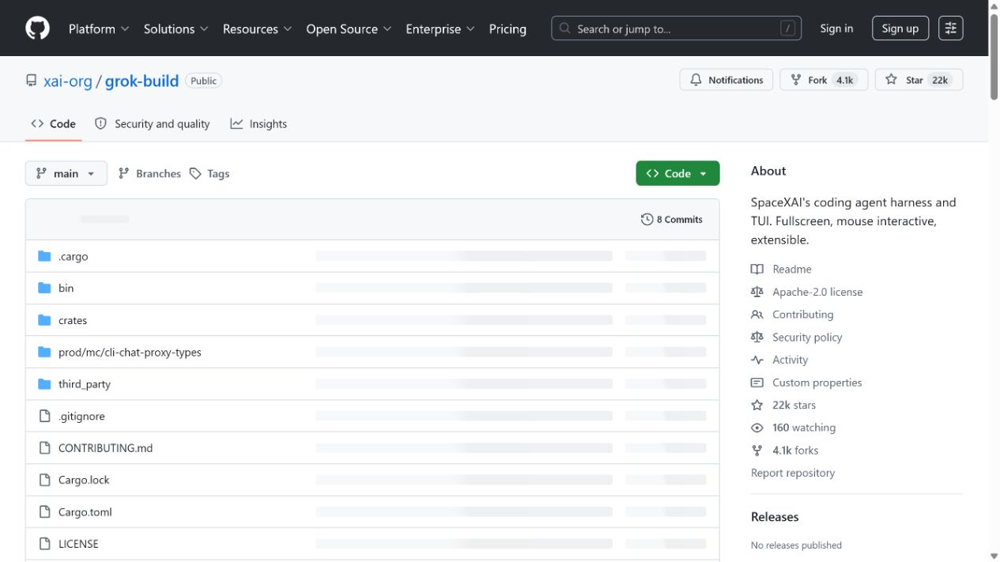
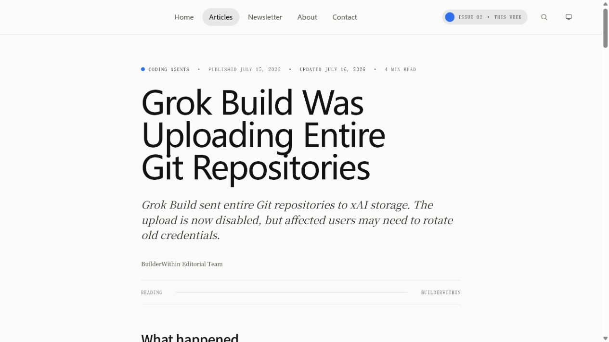
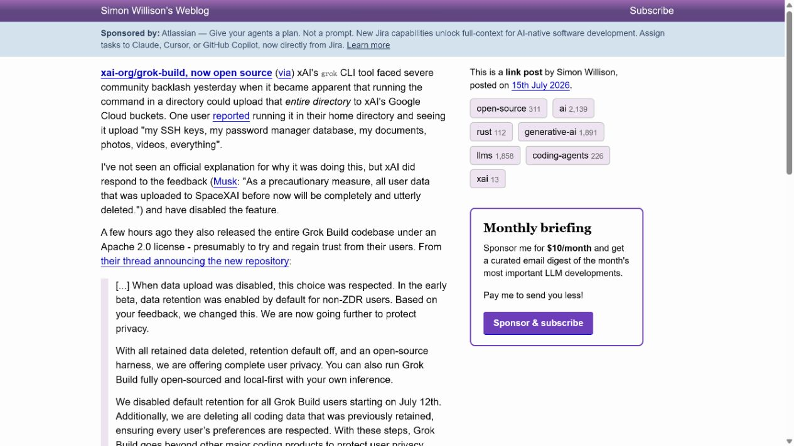

# Grok Build Full Git Repository Upload Data Exposure (2026)
> Grok Build 全量 Git 仓库上传导致的数据暴露风险

| Field | Value |
|---|---|
| Category | Human Factor |
| Severity | High |
| AI Tool | Grok Build, Grok coding CLI, xAI cloud storage |
| Language | Rust / Git |
| Real Incident | Yes |
| Reproducible | Yes |
| Disclosed | 2026-07-10 |

## TL;DR
Grok Build 0.2.93 was observed uploading whole Git repositories and history to xAI-controlled storage even when the task did not require that data, creating a source-code and credential-exposure risk.
> 研究人员观察到 Grok Build 0.2.93 会把完整 Git 仓库及历史上传到 xAI 控制的存储，即使任务不需要这些内容，因而带来源代码和凭据暴露风险。

---

## 详细分析 / Full Analysis

## 一、基本信息与事件概况

2026 年 7 月，研究人员对 Grok Build 终端编码 Agent 进行网络抓包，发现其在测试中把完整 Git 仓库和提交历史打包上传到 xAI 控制的云存储。公开报道指出，这一上传并不等同于模型为了回答某个问题而读取的少量文件；即使任务只需极少上下文，客户端仍可能创建并上传大体积 Git bundle。

风险在于仓库历史和未被当前任务读取的文件可能包含旧凭据、内部地址、客户数据或已从工作树删除但仍存在于提交中的敏感内容。案例不声称 xAI 已公开确认每个上传文件的实际保留、人工查看或训练用途，只讨论已经被流量观察到的越界数据传输及其后续处置。

## 二、事件经过与公开材料

研究人员在 7 月 10 日发布观察结果。The Hacker News、Axios 和 Simon Willison 分别报道了全量上传、设置开关和开源代码中遗留上传路径。公开信息称，7 月 12 日或 13 日后，同一客户端从服务端获得 disable_codebase_upload 和 trace_upload_enabled 的变化，后续复测未再看到相同存储请求。

xAI 随后开源 Grok Build，并在公开说法中讨论数据保留设置。服务器端开关能迅速停止上传，说明事件的处置并非完全依赖用户本地升级；但这也意味着事后不能仅从本地版本号判断旧会话是否发生过数据传输。

### 证据矩阵

| 来源 | 类型 | 证明内容 |
|---|---|---|
| xAI Docs: Grok Build overview | 产品公告 | Grok Build 的编码 Agent 定位和产品上下文 |
| xAI: Grok Build source repository | 官方后续公告 | 开源时间和后续处置背景 |
| The Hacker News: Grok Build uploaded entire Git repositories | 独立技术报道 | 流量观察、设置变化和版本范围 |
| BuilderWithin: Grok Build uploaded entire Git repositories | 独立报道 | 量化传输、潜在秘密和删除声明 |
| Simon Willison: xai-org/grok-build now open source | 独立代码审阅 | 开源代码中的上传路径和开关状态 |

## 三、系统背景与触发条件

编码 Agent 为理解项目常会读取工作目录、Git 状态和历史。这样的能力有实际价值，但“需要读取以完成当前任务”和“将整个仓库传送到远端存储”是两种不同的数据处理目的。若界面只提供模型改进或数据保留开关，而实际上传路径独立于用户可见选项，用户就难以做出有效授权。

Git bundle 还会扩大传统文件扫描遗漏的范围。提交历史中常包含被轮换的 API key、旧配置、私有依赖地址和删除前的文档，开发者未必意识到它们仍会随仓库被打包。对企业仓库而言，这类背景上传应被当作受控的数据出境，而不是普通遥测。

## 四、攻击链路或失效过程

该事件不以外部攻击者为起点。用户在本地仓库中运行 Grok Build，客户端收集代码库状态并形成 Git bundle，随后向 xAI 存储服务发起上传。研究人员的对照测试显示，上传的数据规模远超过回答简单任务所需的数据量，并且关闭“Improve the model”并未在最初测试中阻止该行为。

一旦仓库中存在凭据、配置或敏感历史，传输本身就跨越了企业数据边界。后续风险取决于存储访问控制、保留策略、服务端日志和是否存在进一步处理；这些细节尚未由公开技术公告完整披露，因此本文不推断实际二次泄露。

## 五、技术根因与 AI 风险分析

根因是 Agent 的代码库上下文收集范围与用户授权、最小化传输原则没有对齐。客户端将完整仓库状态当成可上传的会话材料，服务端设置又能改变传输行为，使用户难以从本地界面判断真实的数据路径。问题不在模型生成的代码质量，而在工具链把“获取上下文”实现成了超出任务必要性的远端复制。

这类风险需要以数据流控制处理：明确列出将上传的文件和历史范围，默认拒绝提交凭据与忽略文件，提供本地优先的可验证模式，并为每次出站传输保留可审计清单。企业还应通过网络出口策略限制未知的对象存储上传。

代码 Agent 的上下文收集具有一个容易被忽略的特点：仓库并不只包含当前正在修改的文件。提交历史、分支引用、忽略文件、生成配置和本地未提交内容都可能携带密钥、内部地址或尚未发布的业务信息。只要上传范围以“帮助理解项目”为由扩大，开发者很难仅凭聊天界面判断哪些数据已经离开设备。这个问题直接关系到 AI 编码工具的默认数据边界，而不是一次普通的文件同步体验。

企业使用此类工具时，代码仓库应被视为受分类管理的数据源。较稳妥的做法是让工具在收集上下文前给出可核对的文件清单和大小摘要，并使忽略规则、密钥扫描和网络出口策略能够共同生效。对于包含客户代码或生产凭据的项目，还应将远端分析能力限定在经过批准的目录和临时副本中，避免开发环境中的无关材料随会话一并传出。

## 六、影响范围与处置建议

公开测试中最直观的量化信号是一次约 192 KB 任务伴随 5.1 GB 数据传输。它不代表所有用户或所有仓库都发生相同规模上传，但足以说明风险不能用“少量上下文”描述。使用过受影响版本的团队应审计 Agent 日志与网络记录，识别上传会话，并优先轮换曾出现在仓库历史中的密钥。

对企业管理者而言，后续应区分服务端宣称删除数据与自身完成的凭据轮换、代码访问审计和数据处理确认。删除声明不能自动撤销已经发生的数据出境或排除历史内容被访问的可能性。

## 七、结论

Grok Build 事件将编码 Agent 的安全问题从生成代码扩展到上下文收集和出站传输。只有当用户能看到、限制并审计工具实际带走的内容时，“本地运行”才具有可靠的安全含义。

## 八、参考来源

- [xAI Docs: Grok Build overview](https://docs.x.ai/build/overview)
- [xAI: Grok Build source repository](https://github.com/xai-org/grok-build)
- [The Hacker News: Grok Build uploaded entire Git repositories](https://thehackernews.com/2026/07/grok-build-uploads-entire-git.html)
- [BuilderWithin: Grok Build uploaded entire Git repositories](https://builderwithin.com/articles/grok-build-uploaded-entire-git-repositories/)
- [Simon Willison: xai-org/grok-build now open source](https://simonwillison.net/2026/Jul/15/grok-build/)
