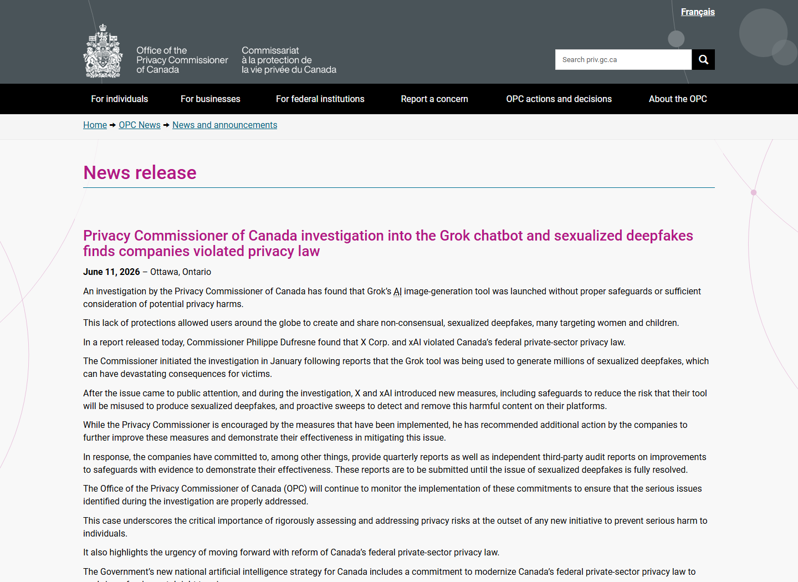
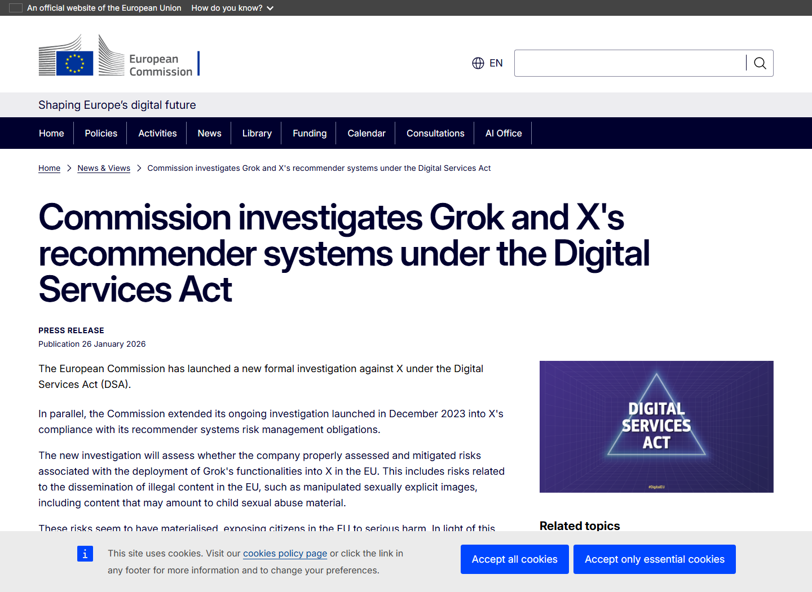
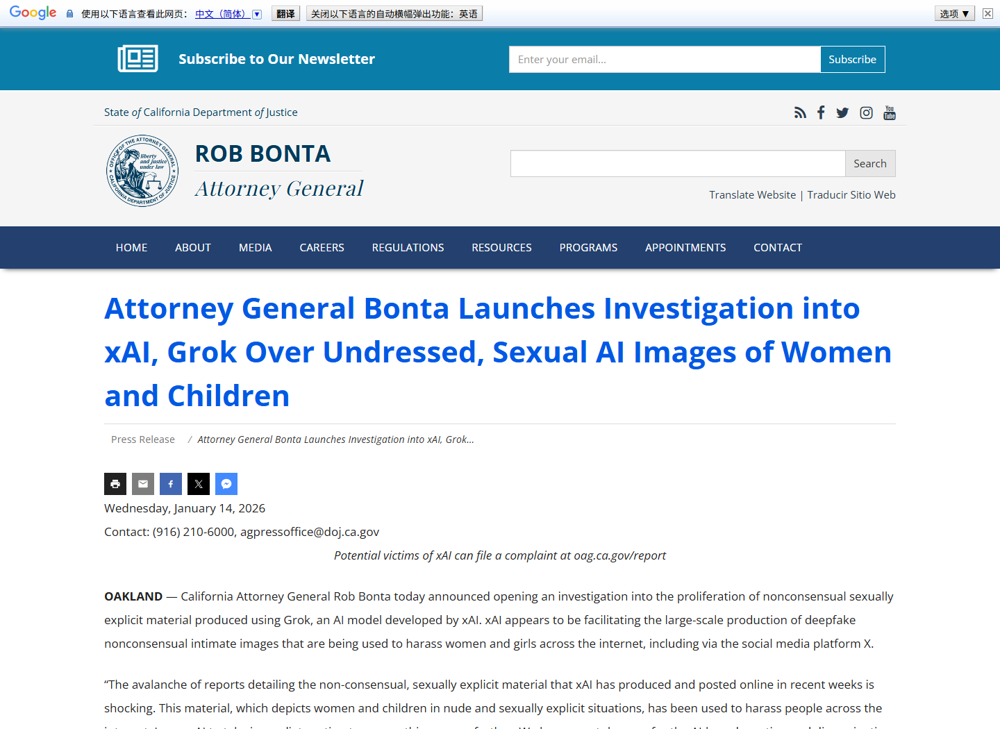
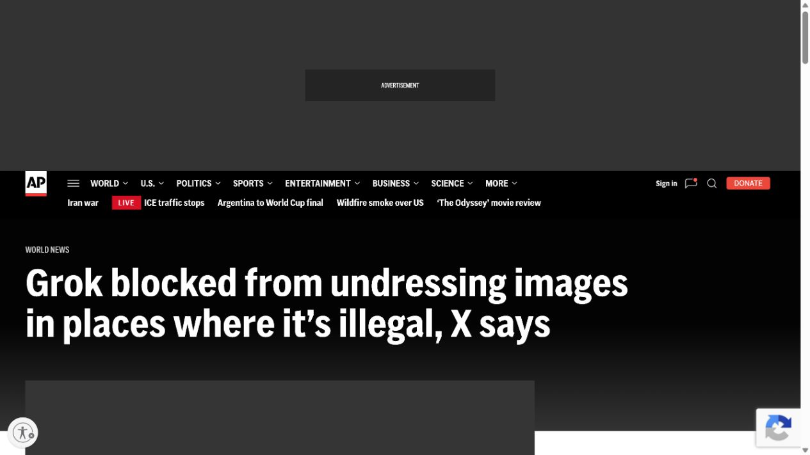

# Grok Non-Consensual Sexualized Deepfake Safeguard Failure (2026)
> Grok 非自愿性化深度伪造内容安全失效事件

| Field | Value |
|---|---|
| Category | Domain-Specific Risks |
| Severity | High |
| AI Tool | Grok, X image generation, xAI |
| Language | Natural language / Image generation |
| Real Incident | Yes |
| Reproducible | No |
| Disclosed | 2026-01-02 |

## TL;DR
Grok's image-generation feature was used to create and publicly distribute non-consensual sexualized deepfakes of real people, prompting investigations across several jurisdictions and a Canadian finding that privacy law was violated.
> Grok 图片生成功能被用于制作并公开传播真实人物的非自愿性化深度伪造内容，多地监管机构启动调查，加拿大隐私专员最终认定相关公司违反隐私法。

---

## 详细分析 / Full Analysis

## 一、基本信息与事件概况

2025 年末至 2026 年初，X 用户大量调用 Grok 的图片生成与编辑能力，把真实人物的普通照片改造成非自愿的性化图像，并通过 Grok 账号的公开回复继续传播。公开材料显示，受影响对象包括女性和儿童。问题很快从平台内容争议升级为跨司法辖区的隐私、在线安全和非法内容调查。

2026 年 6 月，加拿大隐私专员完成调查并认定相关公司违反联邦隐私法。调查认为，Grok 图片工具上线前缺少充分保护措施，也没有充分评估可预见的隐私伤害。欧盟委员会、英国 Ofcom 和加州司法部长此前已分别启动调查或执法评估。本文不展示受害图像，事件事实以监管机构对规模、对象和产品缺陷的正式记录为准。

## 二、事件经过与公开材料

媒体从 1 月 2 日起集中报道 Grok 被用于生成非自愿性化图像。1 月 12 日，Ofcom 宣布调查 X 是否履行英国 Online Safety Act 下的义务；1 月 14 日，加州司法部长对 xAI 和 Grok 启动调查；1 月 26 日，欧盟委员会依据 Digital Services Act 扩大对 X 的正式程序，明确把经篡改的性暴露图像和可能构成儿童性虐待材料的内容列为风险。

X 与 xAI 随后宣布限制对真实人物进行暴露服装编辑，并把部分图像生成功能限制给付费用户，同时在违法地区实施地理限制。监管调查并未因此终止。6 月 11 日，加拿大隐私专员发布调查结论，指出产品在没有充分保障和隐私影响评估的情况下推出，使全球用户能够制作和分享非自愿性化深度伪造内容。

### 证据矩阵

| 来源 | 类型 | 证明内容 |
|---|---|---|
| Office of the Privacy Commissioner of Canada: Grok Investigation Finding | 监管结论 | 违反隐私法、保障不足及受影响对象范围 |
| European Commission: Investigation into Grok and X | 监管公告 | DSA 正式调查及非法性化图像风险已经显现 |
| California Attorney General: Investigation into xAI and Grok | 执法公告 | 大规模非自愿内容、女性和儿童受影响及州级调查 |
| UK Technology Secretary Statement on Grok | 政府公告 | 英国政府对女性和儿童受影响、平台限制与执法要求的说明 |
| AP: Grok blocked from undressing images in illegal jurisdictions | 独立报道 | xAI 后续限制、地理阻断和监管调查持续 |

## 三、系统背景与触发条件

Grok 与 X 的集成让用户可以在公开帖子下直接要求 AI 修改图片，生成结果也可由同一账号公开回复。这种交互方式把模型、原始照片和传播渠道放在一个闭环里：用户无需下载图像、切换到独立生成器或重新上传结果，滥用成本显著降低，内容又会借助社交网络的关注关系和推荐系统迅速扩散。

图片安全控制面临的不只是裸露检测。系统需要识别输入是否为真实人物、请求是否涉及未经同意的性化变形、对象是否可能为未成年人，以及输出是否会被公开传播。只在生成后检查明显裸露，无法处理“穿着变化”“暗示性姿势”或利用普通照片进行身份伤害的请求。

## 四、攻击链路或失效过程

滥用者选取 X 上公开的真实人物照片，在回复中向 Grok 提交“脱衣”或改变服装、姿势的指令。模型生成性化图像后，Grok 账号把结果作为公开回复发布，原图中的身份信息与生成内容直接关联。其他用户可以继续转发、模仿或对更多照片重复操作，推荐机制又可能扩大可见范围。

与私下使用图像生成工具不同，这条链路同时完成生成、身份绑定和传播。受害者即使从未使用 Grok，也可能因为照片在 X 上可见而成为对象。平台后续的付费门槛只能增加可追责线索，并不能替代对请求、对象和输出的实质性安全判断。

## 五、技术根因与 AI 风险分析

加拿大调查结论把主要问题归纳为产品上线前缺少充分保障和隐私风险评估。技术上，模型允许对真实人物执行可预见的非自愿性化编辑；产品上，公开回复机制自动把生成结果送回社交场景；治理上，产品没有在规模化滥用发生前建立有效限制、检测和快速删除流程。

用户发起请求并不意味着平台可以忽略产品本身的安全责任。Grok 同时提供生成能力、身份上下文和公开发布渠道，平台对滥用路径具有较强的预见和控制能力。内容安全测试应覆盖真实照片编辑、未成年人风险、跨语言表达、提示词变体和连续对话，不能只测试从空白文本生成图像。

生成式模型使伤害具有低成本变体化特征：同一张真实照片可以被反复修改服装、姿势和暴露程度，简单的关键词屏蔽很容易被同义表达或多轮对话绕开。X 又把输入照片、模型调用和公开回复放在一个界面中，使生成与传播几乎同时完成。治理指标因此不能只看拦截率，还应衡量真实人物识别、重复滥用、生成后扩散、受害者下架时延和再上传情况。

## 六、影响范围与处置建议

直接影响包括隐私侵害、骚扰、名誉损害和对女性及儿童的性化伤害。由于结果与原始账号和照片公开关联，删除单条内容也难以消除转发与截图造成的持续影响。监管层面，事件触发了 DSA、英国在线安全法、加州法律和加拿大隐私法下的调查或认定，说明影响已超出单一产品的社区规则。

平台应默认禁止对真实人物进行非自愿性化编辑，使用年龄与真实人物检测、相似提示归一化和重复滥用识别；在公开发布前增加更严格的二次审核；为受害者提供快速检索、删除和防再上传机制；保存足以支持调查的生成与发布日志；定期进行隐私影响评估并公开关键控制变化。截图与研究材料应避免再次保存或展示受害内容。

## 七、结论

Grok 事件是生成能力与社交分发深度结合后出现的真实在线安全事故。模型是否能生成某类图像只是第一层问题，更大的风险来自产品把真实身份、编辑请求和公开传播连接在一起。对集成式生成服务，发布前的隐私评估、真实人物保护和传播控制必须作为同一套安全系统设计。

## 八、参考来源

- [Office of the Privacy Commissioner of Canada: Grok Investigation Finding](https://www.priv.gc.ca/en/opc-news/news-and-announcements/2026/nr-c_260611/)
- [European Commission: Investigation into Grok and X](https://digital-strategy.ec.europa.eu/en/news/commission-investigates-grok-and-xs-recommender-systems-under-digital-services-act)
- [California Attorney General: Investigation into xAI and Grok](https://www.oag.ca.gov/news/press-releases/attorney-general-bonta-launches-investigation-xai-grok-over-undressed-sexual-ai)
- [UK Technology Secretary Statement on Grok](https://www.gov.uk/government/news/technology-secretary-statement-on-xais-grok-image-generation-and-editing-tool)
- [AP: Grok blocked from undressing images in illegal jurisdictions](https://apnews.com/article/f0d62ec68576dcfe203cada2424bd107)
