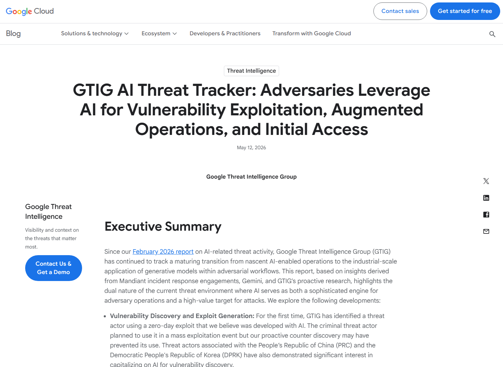
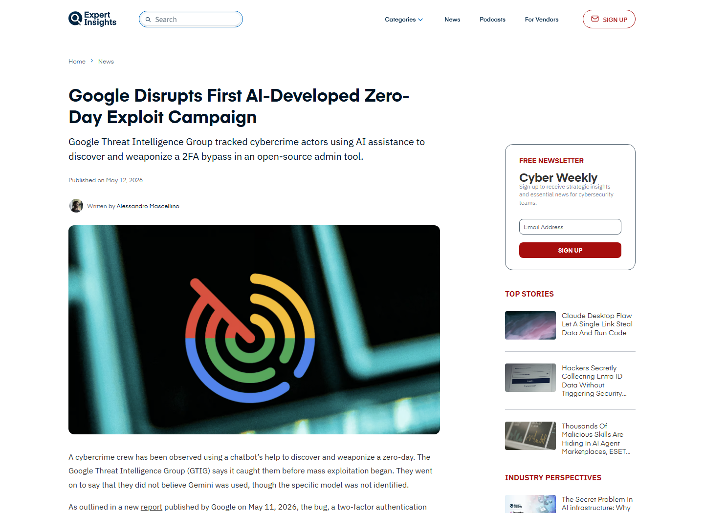
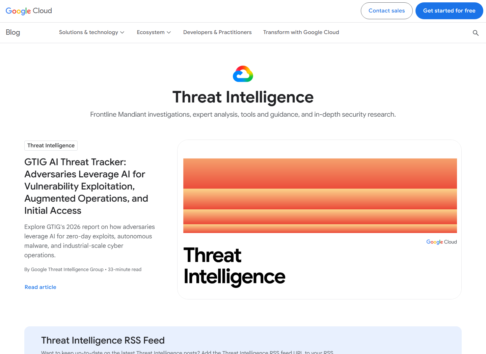
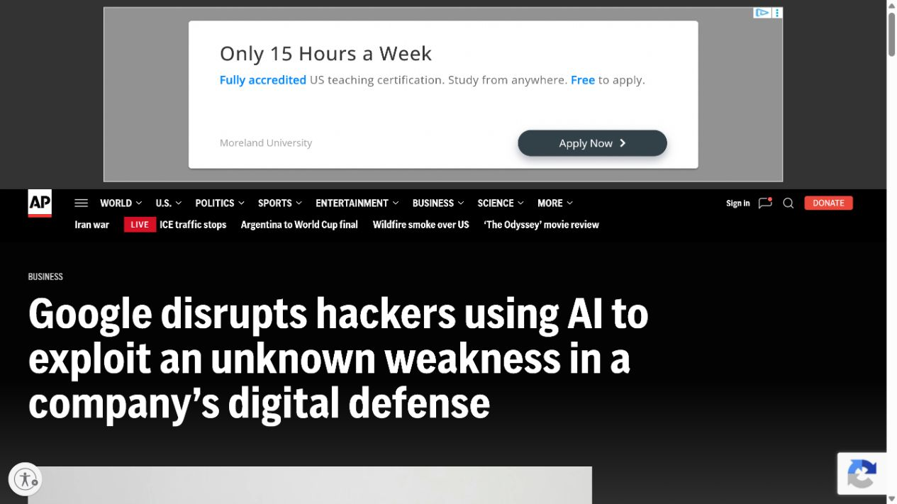

# GTIG Identifies AI-Assisted Zero-Day Exploitation (2026)
> GTIG 识别攻击者借助 AI 开发并使用零日利用

| Field | Value |
|---|---|
| Category | Human Factor |
| Severity | High |
| AI Tool | Generative AI used by a criminal threat actor, Google Threat Intelligence Group |
| Language | Python / Exploit development |
| Real Incident | Yes |
| Reproducible | No |
| Disclosed | 2026-05-11 |

## TL;DR
GTIG observed a criminal actor using a previously unknown exploit that Google assessed was developed with AI assistance to bypass two-factor authentication in a popular open-source administration system.
> Google 威胁情报团队发现，犯罪攻击者使用一个此前未知的利用程序绕过热门开源管理系统的双因素认证；Google 评估该利用程序是在 AI 辅助下开发的。

---

## 详细分析 / Full Analysis

## 一、基本信息与事件概况

2026 年 5 月 11 日，Google Threat Intelligence Group 在 AI Threat Tracker 中披露一起具有标志性的攻击活动。GTIG 发现一名犯罪攻击者使用此前未知的零日利用，绕过一个热门开源 Web 管理系统的双因素认证。Google 根据调查证据评估，该利用程序是在 AI 辅助下开发的；攻击者还计划把它用于更广泛的批量入侵。

Google 没有公开受影响产品、漏洞编号、攻击者身份、使用的模型或受害组织，因此无法将事件对应到某个已知 CVE。公开资料能够确认：漏洞在被使用时尚未披露，利用目标是绕过 2FA，代码涉及 Python 脚本，Google 在实际威胁调查中发现并干预了该活动。这里记录的是现实攻击，而非实验室中的 PoC 生成测试。

## 二、事件经过与公开材料

GTIG 于 5 月 11 日发布报告，称这是其首次识别到“我们认为由 AI 开发”的在用零日利用。Google 的调查人员发现多个知名网络犯罪角色合作寻找和武器化漏洞，目标系统是一款流行的开源 Web 管理工具。攻击者将针对 Python 脚本的缺陷转化为 2FA 绕过，并准备扩大利用规模。

Expert Insights、AP 和 TechRadar 随后采访或引用 Google 威胁情报人员，确认了实际攻击、AI 辅助开发、产品未公开和批量利用意图等要点。现有资料无法判断 AI 具体完成了哪些步骤，因此本文只采用“AI 参与或加速漏洞发现与利用开发”的表述。

### 证据矩阵

| 来源 | 类型 | 证明内容 |
|---|---|---|
| Google Cloud GTIG: Adversaries Leverage AI for Vulnerability Exploitation | 原始情报报告 | AI 辅助零日、2FA 绕过、攻击者活动和批量利用计划 |
| Expert Insights: Google Disrupts First AI-Developed Zero-Day Exploit Campaign | 独立报道 | GTIG 报告时间、2FA 绕过、Python 利用代码和处置结果 |
| Associated Press: Google disrupts hackers using AI | 独立报道 | Google 干预真实攻击及威胁情报负责人说明 |
| TechRadar: Hackers used AI to discover and weaponize a zero-day | 独立报道 | Python 缺陷、2FA 绕过和知名犯罪角色合作背景 |
| Google Cloud: AI Threat Intelligence Topic | 官方索引 | GTIG 报告归属、发布时间及相关威胁情报上下文 |
| ITPro: Google AI Zero-Day and Mass Exploitation Event | 独立报道 | AI 辅助零日、2FA 绕过、Python 特征和批量利用计划 |

## 三、系统背景与触发条件

生成式 AI 已长期被用于编写脚本、解释代码和调整公开 exploit，但零日开发要求发现未知缺陷、构造可工作利用并理解目标认证流程。GTIG 过去的报告更多记录攻击者使用模型进行侦察、翻译、钓鱼和已知漏洞利用。此次活动向前移动了一步：AI 参与了此前未知漏洞的发现或武器化，并进入真实犯罪行动。

目标是 Web 管理系统的 2FA 流程。管理工具通常位于网络边界，成功绕过二次认证后，攻击者可能获得高权限控制面。即使基础漏洞本身是传统 Python 代码问题，AI 降低了分析、试错和修改利用代码的时间成本，也使攻击者更容易并行筛选多个目标。

## 四、攻击链路或失效过程

根据 Google 的公开描述，犯罪团伙先选择一个流行开源管理系统作为目标，并利用 AI 分析代码或漏洞条件，形成能够绕过 2FA 的零日利用。随后攻击者在真实目标上使用该利用，并准备将其扩展到大规模攻击。GTIG 在威胁监测和调查过程中识别活动，采取干扰措施并与相关方处置。

公开报告没有给出 payload、受害数量或补丁信息，因此无法安全复现。防守视角可以把链路拆成五个可观察阶段：对开源代码和认证逻辑的集中研究、利用脚本快速迭代、针对管理界面的异常请求、绕过 2FA 后的会话建立，以及批量扫描或重复利用准备。

## 五、技术根因与 AI 风险分析

事件的技术根因属于未公开软件缺陷，公开资料不足以判断具体 CWE。AI 风险来自攻击者能力放大：模型能够解释代码、生成和修正 Python、根据错误反馈调整 payload，并把人工研究拆成多个快速循环。它不需要独立决定攻击目标，也能显著缩短从缺陷发现到可用 exploit 的时间。

没有公开 CVE 并不代表风险较低。边界管理系统、认证插件和开源控制面可能在漏洞编号出现前就被攻击者分析。组织应监测异常认证行为、2FA 流程偏差和管理接口请求模式，不能只依赖漏洞扫描器中的编号。

AI 对攻防节奏的影响主要体现在经济性：模型可以批量阅读代码、解释开发者意图、提出语义假设并根据错误结果修改利用脚本，使攻击者更容易并行筛选传统扫描器难以发现的逻辑缺陷。防守方原本依赖“漏洞公开后再补丁”的时间窗口会缩短。代码审计应优先检查认证例外、硬编码信任和跨函数状态假设，并把异常会话行为与软件资产信息联动，而不是只等待特征库更新。

## 六、影响范围与处置建议

Google 没有公开受害者数量或最终损失，但零日用于绕过 2FA 且具有批量利用计划，说明潜在影响涉及管理账号接管、持久访问和后续数据或系统操作。相关软件名称被保密后，组织无法只靠产品清单定位风险，只能提升通用控制面的监测和隔离水平。

防护重点包括：限制 Web 管理界面的互联网暴露；使用设备绑定、硬件密钥和风险自适应认证，避免单一 2FA 流程成为唯一边界；监测认证成功前后的异常请求与会话变化；对开源管理工具保持快速更新；在日志中保留足够的请求和身份上下文。安全团队也可使用受控 AI 加速代码审计，但发现结果必须进入成熟的修复和披露流程。

## 七、结论

GTIG 披露的事件表明，AI 辅助利用开发已经从演示进入真实网络犯罪行动。公开信息不足以量化 AI 的独立贡献，却足以确认攻击者把 AI 纳入零日研究与武器化流程。防守方应假设漏洞发现窗口正在缩短，把管理面隔离、认证异常检测和补丁速度放到更高优先级。

## 八、参考来源

- [Google Cloud GTIG: Adversaries Leverage AI for Vulnerability Exploitation](https://cloud.google.com/blog/topics/threat-intelligence/ai-vulnerability-exploitation-initial-access/)
- [Expert Insights: Google Disrupts First AI-Developed Zero-Day Exploit Campaign](https://expertinsights.com/news/google-disrupts-first-ai-developed-zero-day-exploit-campaign)
- [Associated Press: Google disrupts hackers using AI](https://apnews.com/article/926aea7f7dc5e0e61adce3273c55c6d4)
- [TechRadar: Hackers used AI to discover and weaponize a zero-day](https://www.techradar.com/pro/security/this-is-the-tip-of-the-iceberg-google-experts-say-they-have-seen-hackers-using-ai-to-discover-and-weaponize-a-zero-day-for-the-first-time)
- [Google Cloud: AI Threat Intelligence Topic](https://cloud.google.com/blog/topics/threat-intelligence)
- [ITPro: Google AI Zero-Day and Mass Exploitation Event](https://www.itpro.com/security/google-threat-intelligence-group-first-ai-zero-day-exploit-discovery)
