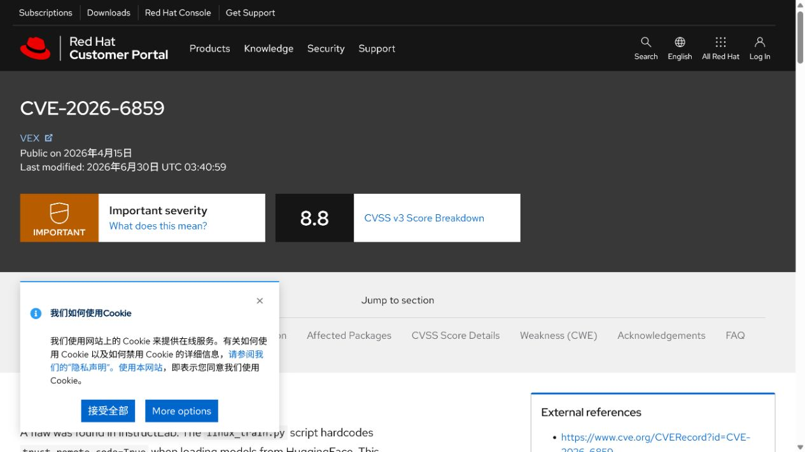
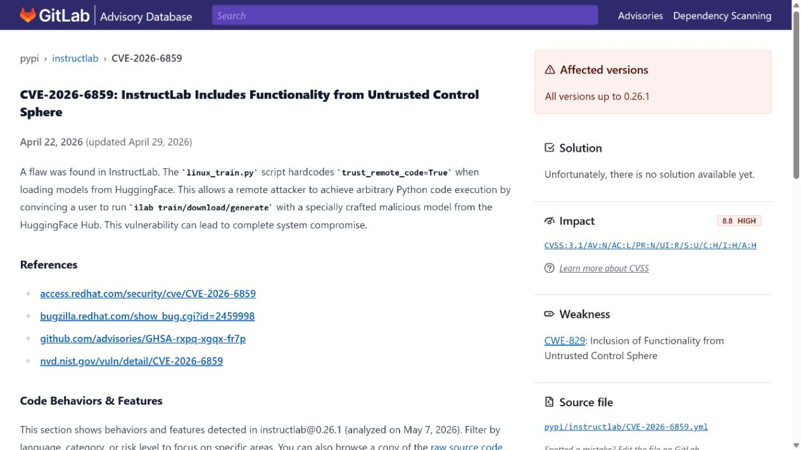
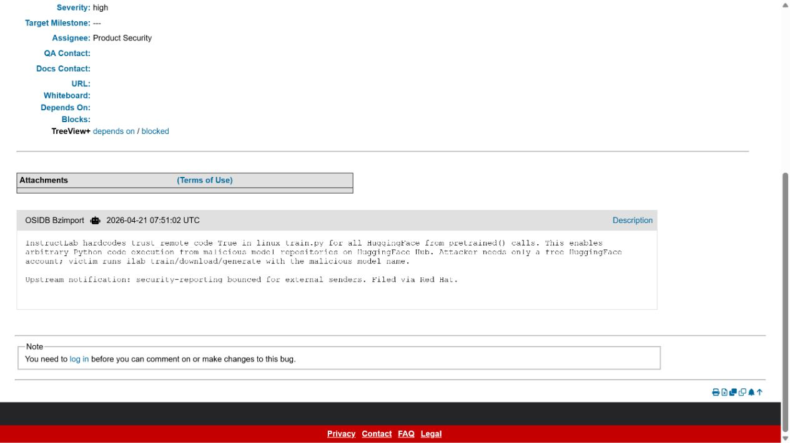
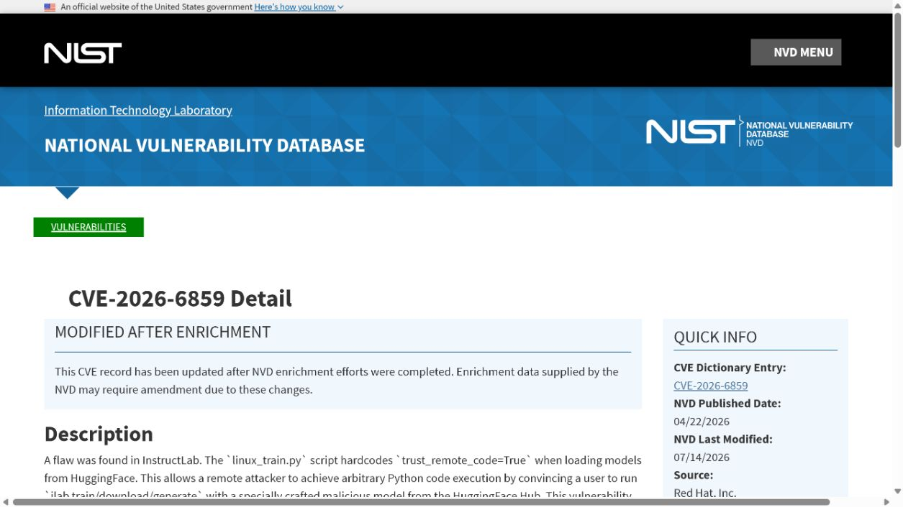
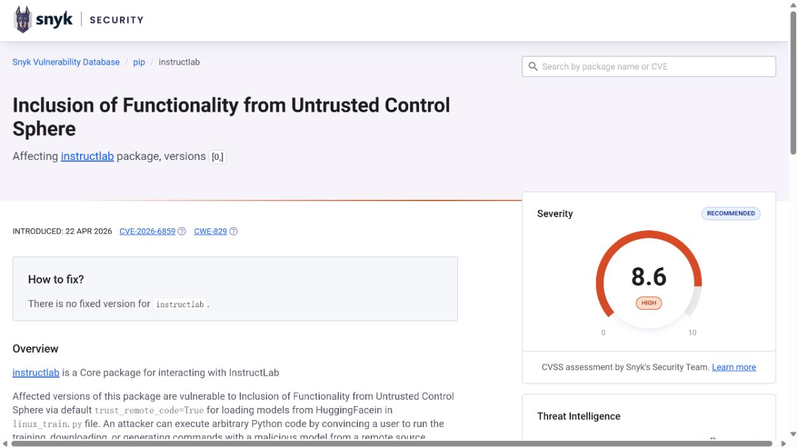

# InstructLab Hardcoded Remote Model Code Execution (2026)
> InstructLab 硬编码远程模型代码信任导致的执行漏洞

| Field | Value |
|---|---|
| Category | supply-chain |
| Severity | high（Red Hat CVSS 3.1：8.8） |
| AI Tool | InstructLab training and model-loading workflow |
| Language | Python |
| Real Incident | Yes（已公开确认的真实漏洞；不表示已有受害事件） |
| Reproducible | No |
| Disclosed | 2026-04-22 |
| CVE | CVE-2026-6859 |
| CVSS | 8.8 |

## TL;DR / 摘要

InstructLab hardcoded trust_remote_code during model loading, so a malicious model repository could run Python on the training host.

InstructLab 事件表明，模型仓库既可能分发权重，也可能分发将在训练节点导入的程序。模型来源治理应覆盖这两种内容。

---

## 详细分析 / Full Analysis

### 一、事件概况与公开记录

InstructLab 的训练和模型准备流程会从 Hugging Face 等模型仓库获取配置与实现。部分模型仓库可提供自定义 Python 代码，以适配非标准架构；`trust_remote_code` 是 Transformers 生态中允许加载这类实现的明确开关。训练节点通常同时拥有 GPU、数据集、访问令牌和云端网络权限。

Red Hat 漏洞页及 Bugzilla、NVD、GitLab Advisory 与 Snyk 对 CVE-2026-6859 的描述一致：`linux_train.py` 在加载 Hugging Face 模型时写死 `trust_remote_code=True`。Red Hat 的两份记录用于确认厂商描述与跟踪状态，GitLab 和 Snyk 用于复核 Python 包范围；两份包级公告均没有列出已修复版本。

### 二、AI 工作流与攻击入口

与常见依赖投毒相比，本案的入口是 AI 训练链路中的模型选择。团队往往会核验模型名称、许可证和评测分数，却忽略某些模型为了实现自定义架构而携带可导入代码。训练平台若默认把模型当成纯权重文件，就会把供应链信任问题带进拥有高价值数据和算力的环境。

外部内容在这些工作流中并不总以“命令”或“程序”的形式出现。模型制品、提示词配置、连接器对象、缓存记录以及 Agent 工具参数往往先被视为普通数据，随后才在框架内部获得文件读取、解释执行或状态写入能力。

### 三、漏洞触发与技术路径

攻击者发布带有自定义模型代码的恶意仓库，或诱使操作者在训练配置中选择该仓库。受影响脚本在加载模型时无条件信任远程代码，Transformers 因而会导入仓库附带的 Python 实现。代码执行发生在训练主机的模型加载阶段，早于任何模型输出评估，也不需要攻击者再单独投递一个 Python 包。

### 四、技术根因

受影响训练脚本硬编码 `trust_remote_code=True`，绕过了操作者对远程模型代码的逐次信任决定。模型仓库不再只是权重来源，而能在加载阶段向训练节点提供将被导入的 Python 实现。

### 五、利用前提与影响范围

风险要求目标运行了受影响训练流程，并且加载到攻击者控制或被篡改的模型来源。模型仓库来源、网络镜像和内部制品库因此都属于安全边界。公开公告说明了漏洞机理和产品版本信息，但并未提供可归因的受害机构清单，分析不据此推断实际攻击规模。

公开记录给出的受影响范围是：GitLab lists versions through 0.26.1 as affected, while Snyk currently lists all published versions; both identify the hardcoded trust_remote_code=True path.

评估具体部署时，应逐项确认相关功能是否启用、是否接收第三方内容或制品、运行账户可访问哪些目录和令牌，以及组件是否已经升级。本文采用 Red Hat CNA 的 CVSS 3.1 8.8 High；该向量包含用户交互，因为受害者需要运行指向恶意模型的训练、下载或生成命令。

### 六、AI 安全问题分析

训练平台的模型选择经常来自配置文件、实验管理平台或内部模型目录。排查应找出这些位置是否允许填写任意 Hugging Face 仓库或分支，并检查下载缓存是否会在不同项目之间复用。对确需使用自定义架构的实验，建议将模型提交固定到不可变哈希，并把“允许导入远程代码”作为一个独立的、可审计的批准项，而不是训练脚本的默认行为。

### 七、修复与处置

截至本次核验，公开包级公告没有给出已修复的 InstructLab 版本，因此不能把“升级到某版本”写成既定处置。部署方应先禁用或本地修改无条件的 `trust_remote_code=True`，只对经过代码审计并固定提交哈希的模型显式启用远程代码。训练任务应在隔离运行器中使用短期令牌，数据集与云凭据按需挂载。

公开材料给出的处置状态为：No vendor-confirmed fixed InstructLab package version is identified in the archived public advisories.

### 八、部署排查与本地验证

验收可检查训练脚本是否仍显式或隐式传入 `trust_remote_code=True`，并用一个带自定义代码标记但无害的测试仓库确认系统会阻止或要求审批。还应审阅运行器权限：修复代码只能降低触发概率，低权限和网络隔离才会限制异常加载的后果。

对于可能触发代码执行、文件读取或越权写入的案例，README 不提供可直接复制的攻击载荷。本地验收应检查版本、配置、已注册工具、缓存权限、文件挂载和审计日志，并在隔离测试环境中使用无害边界输入确认修复行为。

Red Hat 漏洞页、Bugzilla 和 NVD 提供厂商及标准漏洞体系中的记录，GitLab 与 Snyk 从 Python 包角度复核版本和触发条件。五份来源都出现 `trust_remote_code=True` 或等价描述，但没有任何一份给出已修复包版本，因此处置建议以禁用该默认行为和隔离训练节点为主。

### 九、证据材料

| 来源 | 类型 | 证明内容 |
|---|---|---|
| Red Hat: CVE-2026-6859 | 厂商公告 | 说明 linux_train.py 硬编码 trust_remote_code=True 及 RHEL AI 产品状态 |
| GitLab advisory: CVE-2026-6859 | 独立漏洞库 | 列出截至 0.26.1 的受影响范围、8.8 High 评分，并明确未列出可用修复版本 |
| Red Hat Bugzilla: CVE-2026-6859 | 厂商问题跟踪 | 核验 Red Hat 对漏洞机制、CVE 编号、公开时间和处置状态的记录 |
| NVD: CVE-2026-6859 | 漏洞数据库 | 复核公开日期、8.8 High 向量和厂商引用 |
| Snyk: CVE-2026-6859 | 独立漏洞库 | 将当前已发布版本列为受影响，复核恶意 Hugging Face 模型触发条件并明确无固定版本 |

`assets/` 保存上述五个来源抓取时返回的原始 HTML，以及与同一页面对应的真实浏览器截图。动态网站离线打开时可能缺少外部样式或脚本，但源文件保留服务器返回内容，可用于复核标题、描述、版本和链接。

### 十、结论

InstructLab 事件表明，模型仓库既可能分发权重，也可能分发将在训练节点导入的程序。模型来源治理应覆盖这两种内容。

完成版本修复后，仍应保留来源治理、最小权限、任务隔离和结构化授权。这些措施既用于缓解当前漏洞，也能限制后续模型制品、Agent 工具或 AI 框架解析缺陷造成的影响。

### 参考来源

- [Red Hat: CVE-2026-6859](https://access.redhat.com/security/cve/CVE-2026-6859)
- [GitLab advisory: CVE-2026-6859](https://advisories.gitlab.com/pypi/instructlab/CVE-2026-6859/)
- [Red Hat Bugzilla: CVE-2026-6859](https://bugzilla.redhat.com/show_bug.cgi?id=2459998)
- [NVD: CVE-2026-6859](https://nvd.nist.gov/vuln/detail/CVE-2026-6859)
- [Snyk: CVE-2026-6859](https://security.snyk.io/vuln/SNYK-PYTHON-INSTRUCTLAB-16323407)
