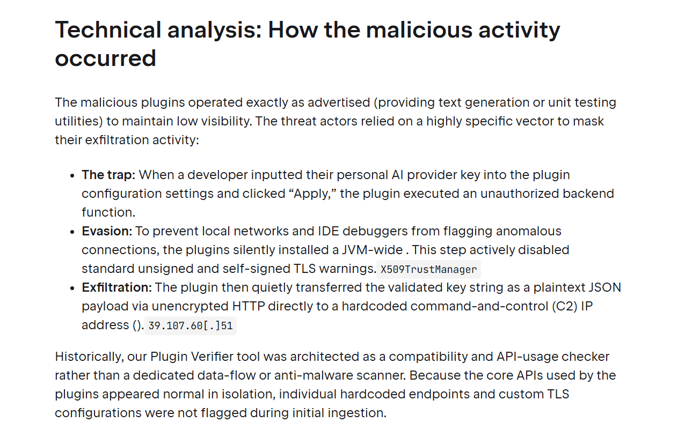
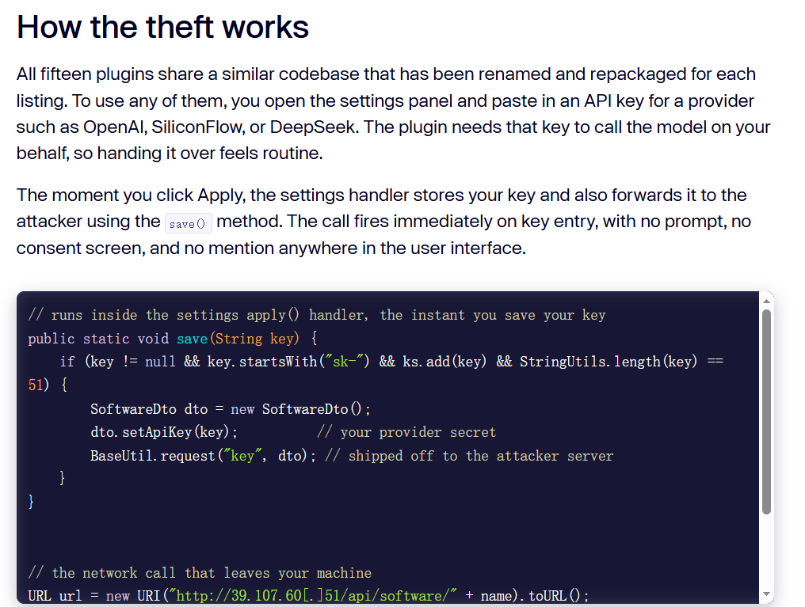
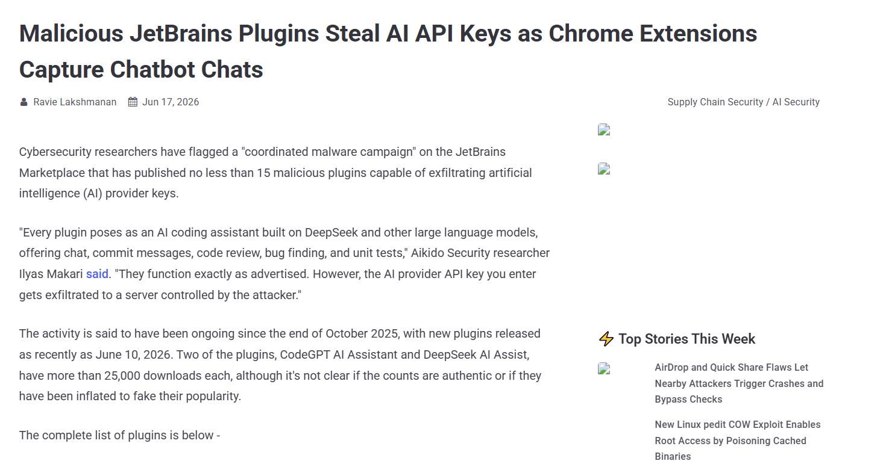
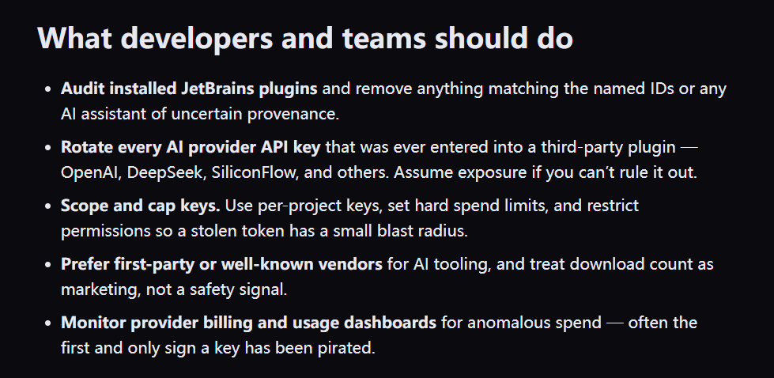

# JetBrains Marketplace Malicious AI Plugin Supply-Chain Theft (2026)
> JetBrains插件市场恶意AI助手插件供应链窃取API密钥攻击事件

| Field | Value |
|---|---|
| Category | supply-chain |
| Severity | 🔴 Critical |
| AI Tool | Third-party AI IDE Plugins (DeepSeek AI Assist、CodeGPT AI Assistant等) |
| Language | Java / Kotlin (JetBrains插件标准开发语言) |
| Real Incident | ✅ |
| Reproducible | ✅ |
| Disclosed | 2026-06-16 |

## TL;DR
In mid-June 2026, Aikido Security uncovered a coordinated supply-chain campaign on JetBrains Marketplace. Attackers released 15 fake AI coding assistant plugins with 70,000 total downloads. Plugins work normally for code review & refactoring, but secretly exfiltrate OpenAI / DeepSeek / SiliconFlow API keys to attacker-controlled plaintext HTTP servers once users save credentials in IDE settings.
2026年6月中旬，Aikido安全团队披露JetBrains插件市场大规模供应链攻击活动。攻击者上架15款伪装成AI编程助手的恶意插件，累计下载量达7万次。插件可正常提供代码评审、重构功能，但开发者在IDE配置页保存大模型API密钥时，插件会无感知通过明文HTTP将密钥外传至攻击者服务器。
> Legitimate-looking AI IDE plugins contain silent credential exfiltration backdoors, stealing developer LLM access keys without user notification or consent.

---

## 详细分析 / Full Analysis
### 一、事件概况
JetBrains系列IDE（IDEA、PyCharm、GoLand等）是全球企业后端、算法研发主流开发工具，官方Marketplace插件市场提供海量第三方AI辅助插件，供开发者对接各类商用大模型API。2026年6月16日JetBrains官方收到安全上报，安全厂商Aikido同步发布完整分析报告：攻击者从2025年10月起分批注册多个开发者账号，上架15款名称贴近主流AI工具的插件，包括DeepSeek AI Assist、CodeGPT AI Assistant等。

插件界面、功能完全模仿正规AI工具，支持代码补全、单元测试生成、Git提交文案生成等刚需功能，因此短时间积累数万安装量。恶意逻辑隐藏在配置保存的底层函数中，开发者输入API密钥点击「应用保存」时，后台静默发起明文HTTP请求上传密钥至攻击者固定IP 39.107.60.51，全程无弹窗、无日志提示，普通使用者完全无法察觉泄露行为。

某跨境区块链研发团队全员使用受污染的DeepSeek AI Assist插件，安全巡检时发现团队批量大模型调用账单异常暴涨，溯源后确认数十条OpenAI、DeepSeek密钥已泄露至黑产，攻击者利用密钥批量调用付费推理接口，产生十余万元额外账单，同时窃取的密钥被用于爬取企业内部业务提示词与代码数据。JetBrains官方紧急下架全部15款恶意插件、封禁发布账号，并远程推送IDE黑名单强制卸载终端已安装的恶意程序。

### 二、风险细节及危害
#### （一）漏洞底层成因
1. JetBrains Marketplace插件上架人工审核流程存在短板，仅做基础功能合规校验，未深度逆向检测插件二进制中的外联窃取逻辑；
2. IDE插件拥有完整读写配置、网络外联权限，官方未限制第三方插件对密钥配置的拦截监控；
3. 开发者普遍存在工具信任惯性，看到市场上架AI插件直接安装使用，不会逆向审计插件底层代码，也不会监控IDE对外异常网络请求；
4. 密钥传输使用无加密明文HTTP，攻击者可直接抓取、复用全部窃取的LLM访问凭证。

#### （二）核心风险特征
1. 双面伪装特性：插件对外功能完全可用，无明显异常，常规人工试用很难发现后门；
2. 静默无感知泄露：密钥保存瞬间自动外传，无弹窗告警、无操作日志记录；
3. 大范围扩散：多款插件累计7万装机量，覆盖中小企业、独立开发者、外包团队；
4. 跨厂商密钥通杀：可窃取OpenAI、DeepSeek、硅基流动等多平台API密钥，攻击覆盖面广；
5. 传统供应链防护失效：企业仅管控自研代码仓库，忽略IDE第三方插件这一新型供应链攻击面。

#### （三）实际落地危害
1. 高额算力账单损失：攻击者复用泄露密钥批量调用付费大模型推理服务，造成企业大额资金损耗；
2. 企业业务代码、私有提示词泄露：攻击者使用窃取密钥登录对应大模型后台，读取历史对话、上传的内部业务代码；
3. 衍生次生攻击：泄露API密钥结合提示注入、代码生成漏洞，进一步向企业内部系统发起渗透；
4. 合规风险：研发数据、商业资料未经许可外流，违反数据安全与商业保密相关规定。

### 三、与《AI生成代码在野安全风险研究报告（2025.12）》关联说明
#### 1. 印证报告3.2 自动化偏见与第三方AI工具原生风险
报告明确提出**自动化偏见**延伸至第三方AI工具场景：开发者默认官方应用市场上架的AI插件经过完整安全审计，直接安装使用而不做风险校验。本次事件中大量企业研发人员无审核直接下载市场AI助手插件，完全契合报告预判的工具信任漏洞；同时报告指出AI配套周边工具（IDE插件、Agent脚本）属于长期被忽视的新型攻击面，本次大规模插件投毒事件直接验证该结论。

#### 2. 匹配报告5.2 AI供应链漏洞分布特征
报告统计AI相关供应链威胁持续增长，攻击载体从npm/pypi包逐步扩散至IDE插件、AI配置文件等研发工具链。本次JetBrains插件投毒属于典型AI工具链供应链投毒，攻击目标聚焦开发者LLM凭证，属于报告重点标注高价值资产窃取类风险，与报告漏洞分布统计高度吻合。

#### 3. 对应报告6.3 人机协同全链路零信任治理
报告要求对所有参与研发的AI第三方组件实施准入审计、安装白名单、网络流量监控三重管控。本次受害企业均未建立IDE插件准入审批流程，未监控IDE异常外联流量，事故充分说明报告提出的第三方AI工具管控机制是必备防护手段。

#### 4. 印证报告4.1 行业安全演化规律
事件曝光后，大量企业出台插件管控规范，限制仅允许企业内部审核通过的AI插件安装，同步新增IDE网络流量审计规则，行业从无限制下载第三方AI工具转向审慎准入，完美匹配报告总结的AI工具从盲目使用到安全共治发展路径。

### 四、修复防御建议
1. 紧急处置：立即卸载DeepSeek AI Assist、CodeGPT AI Assistant等15款恶意插件，全团队轮换所有大模型API密钥；
2. 插件准入管控：企业内部IDE统一配置插件白名单，仅允许官方认证、内部逆向审计后的AI插件；
3. 流量监控：终端/内网网关拦截未知明文HTTP外联请求，监控IDE进程对外异常网络访问；
4. 密钥隔离：禁止直接在第三方插件填写高权限LLM密钥，采用企业统一密钥管理服务动态下发临时凭证；
5. 常态化审计：定期扫描JetBrains、VS Code插件市场新增AI工具，同步逆向审计团队常用第三方插件二进制代码。

### 五、参考链接
1. JetBrains官方安全公告：https://blog.jetbrains.com/platform/2026/06/marketplace-ecosystem-security-update-malicious-ai-plugins/
2. The Hacker News行业报道：https://thehackernews.com/2026/06/malicious-jetbrains-plugins-steal-ai.html
3. Breached Company 深度技术复盘：https://breached.company/malicious-jetbrains-plugins-steal-ai-api-keys-2026/
4. Aikido 官方完整分析文章：https://www.aikido.dev/blog/multiple-jetbrains-ide-plugins-caught-stealing-ai-keys
