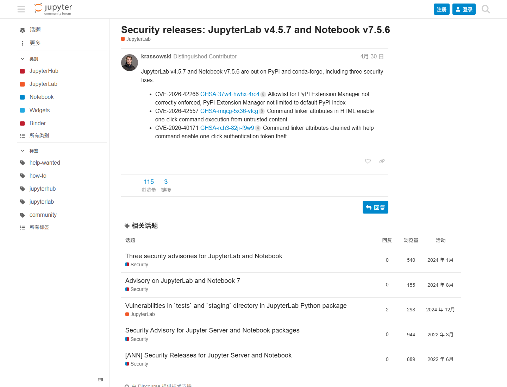
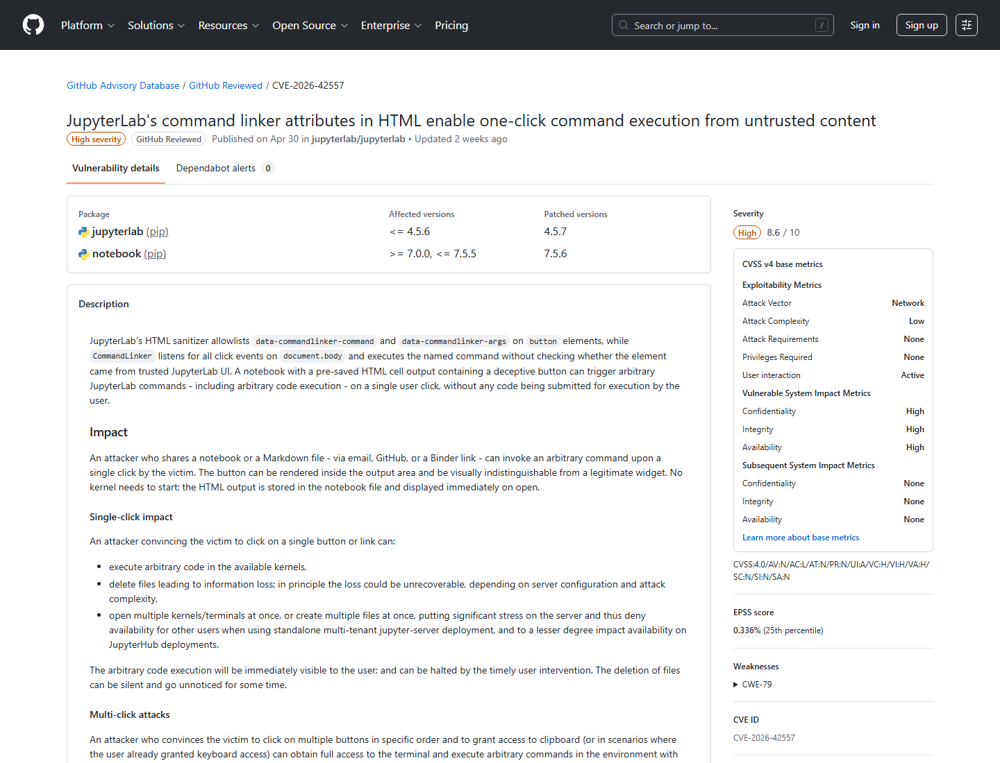
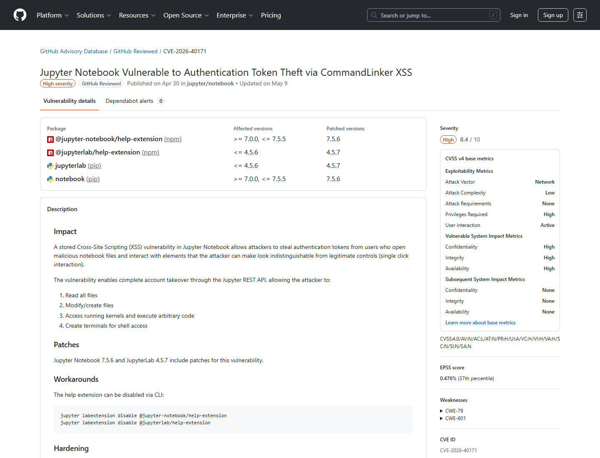
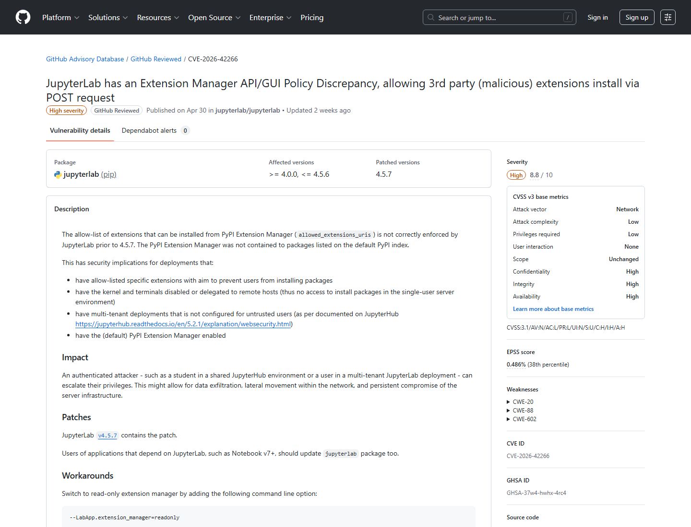
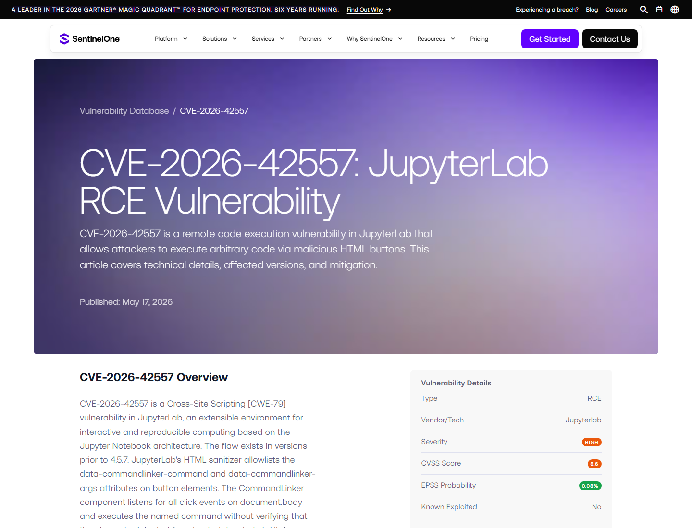
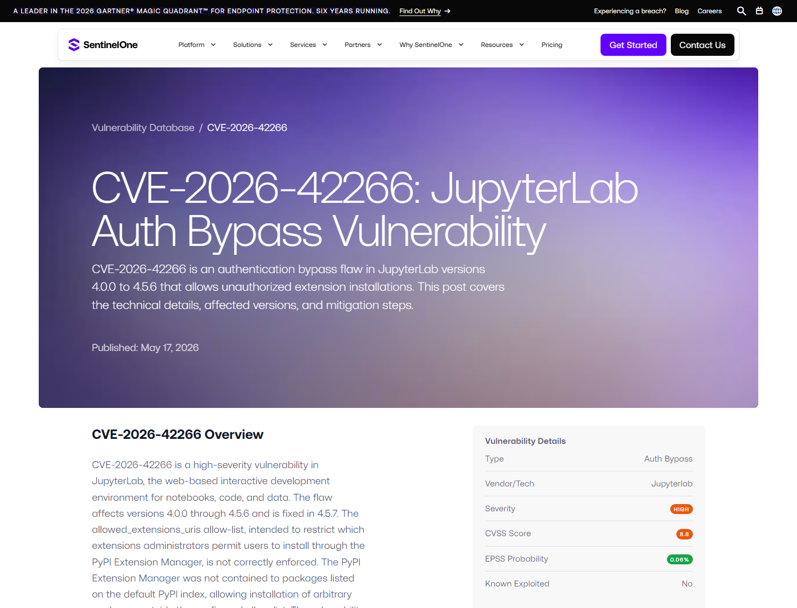

# JupyterLab Command Linker and Extension Manager Security Release (2026)
> JupyterLab Command Linker 与扩展管理器安全发布

| Field | Value |
|---|---|
| Category | Domain-Specific Risks |
| Severity | High |
| AI Tool | JupyterLab, Notebook, Jupyter AI / notebook AI workflow |
| Language | Python / JavaScript |
| Real Incident | Yes |
| Reproducible | Yes |
| Disclosed | 2026-04-30 |
| CVE | CVE-2026-42266 / CVE-2026-42557 / CVE-2026-40171 |

## TL;DR
JupyterLab v4.5.7 fixed three notebook security issues: extension allowlist bypass, one-click command execution from untrusted HTML, and command-linker chaining that could steal authentication tokens.
> JupyterLab 是 AI/数据科学工作台的底座。2026 年这组安全修复说明，notebook 前端里的扩展安装、HTML 渲染和命令系统同样会影响凭据、代码执行和数据访问边界。

---

## 详细分析 / Full Analysis

# JupyterLab 2026 安全发布案例分析：扩展管理器、Command Linker 与 Notebook 凭据风险

## 基本信息

JupyterLab 是数据科学、机器学习和 AI 原型开发中最常见的交互式工作台之一。随着 Jupyter AI、MCP server、agent notebook 和远程协作功能进入 Jupyter 生态，Notebook 前端不再只是代码编辑器，也承载扩展安装、命令系统、文件浏览、终端、内核和认证 token。2026 年 4 月 30 日，Jupyter 发布 JupyterLab v4.5.7 和 Notebook v7.5.6，修复三项安全问题。

Jupyter 安全发布列出的三个问题分别是：CVE-2026-42266，PyPI Extension Manager 的 allowlist 未正确限制；CVE-2026-42557，HTML 中的 command linker attributes 可造成来自不可信内容的一键命令执行；CVE-2026-40171，command linker attributes 与 help command 链接后可导致认证 token theft。[Jupyter Discourse](https://discourse.jupyter.org/t/security-releases-jupyterlab-v4-5-7-and-notebook-v7-5-6/38532)

## 一、事件核验与证据范围

### 证据矩阵

| 来源 | 类型 | 证明内容 | 备注 |
|---|---|---|---|
| Jupyter Discourse | 项目发布证据 | v4.5.7 / v7.5.6，三项 CVE，修复范围 | 发布主证据 |
| GHSA-mqcg-5x36-vfcg / NVD | 主证据 | CVE-2026-42557，command linker attributes 触发命令执行 | 漏洞记录 |
| GHSA-rch3-82jr-f9w9 | 主证据 | CVE-2026-40171，command linker 与 help command 链导致 token theft | 漏洞记录 |
| GHSA-37w4-hwhx-4rc4 | 主证据 | CVE-2026-42266，PyPI Extension Manager allowlist 未正确执行 | 漏洞记录 |
| SentinelOne | 复核证据 | JupyterLab RCE / auth bypass 场景、受影响版本和修复建议 | 第三方复核 |

GitHub Advisory 对 CVE-2026-42557 的描述指出，JupyterLab 的 HTML sanitizer 允许 button 元素上的 `data-commandlinker-command` 和 `data-commandlinker-args` 属性；恶意 HTML 可以构造按钮，让用户点击后执行 JupyterLab command。对 notebook 场景来说，这相当于把不可信渲染内容接到前端命令总线。[GitHub Advisory CVE-2026-42557](https://github.com/advisories/GHSA-mqcg-5x36-vfcg)

## 二、系统背景与触发条件

Notebook 环境的风险特点是“前端命令”和“后端执行”离得很近。用户在浏览器里查看 Markdown、HTML、notebook 输出和扩展界面，同时拥有内核、终端、文件系统和 token。CVE-2026-42557 需要用户与恶意 HTML 交互；CVE-2026-40171 则进一步把 command linker 与 help command 组合起来，可能触达认证 token；CVE-2026-42266 则影响扩展安装 allowlist。

这些触发条件看似需要用户动作，但在 notebook 场景中并不罕见。研究者会打开他人 notebook、渲染报告、查看富文本输出、安装推荐扩展，或在共享 JupyterHub 中处理来自同事和外部数据源的内容。AI 工作流还会自动生成 notebook、Markdown、HTML 可视化和 agent 建议操作，进一步扩大不可信内容进入前端的机会。

## 三、攻击链与处置过程

对 command linker 问题，攻击者准备包含特殊 `data-commandlinker-*` 属性的 HTML 元素。用户在 JupyterLab 中打开或渲染该内容后，点击按钮会触发 JupyterLab command，而不是单纯点击网页元素。若命令可打开 help、访问 URL 或联动其他功能，就可能扩大到 token theft。CVE-2026-42557 和 CVE-2026-40171 共同说明，前端命令系统不应由未可信 HTML 直接驱动。

对 PyPI Extension Manager 问题，管理员原本可能通过 `allowed_extensions_uris` 限制允许安装的扩展来源；CVE-2026-42266 说明该 allowlist 没有正确执行，PyPI Extension Manager 不限于默认 PyPI index 中的包。对企业 Jupyter 环境而言，扩展安装意味着前端代码进入 notebook 工作台，也可能影响用户会话和数据访问。

## 四、技术根因分析

根因之一是 JupyterLab 前端命令总线过于接近 HTML 渲染层。Command linker 是便利功能，可以让 UI 元素触发 JupyterLab command；但如果 sanitizer 允许未可信 HTML 携带这些属性，就把内容层变成了控制层。Notebook 中的 rich output 本来就会包含 HTML，这让边界更容易被误判。

根因之二是扩展管理策略没有完全落到安装执行路径上。JupyterLab 扩展不是普通文档，而是能改变前端行为的代码。allowlist 如果失效，用户可能安装到未被管理员允许的扩展，进而影响 notebook 会话、凭据和数据访问。

## 五、AI 参与方式与风险归因

JupyterLab 自身是 notebook 平台，但它已经是 AI 工作流的重要承载层。Jupyter AI 把 agent chat、文件读写、终端命令、notebook interaction 和 MCP server 接入 JupyterLab。即使这组 CVE 不依赖 Jupyter AI，它们影响的仍是 AI 和数据科学团队日常使用的工作台边界：前端渲染内容、命令系统、扩展安装和 token。

风险归因应落在 notebook front-end trust boundary 上，而不是模型本身。AI 生成的 Markdown/HTML、外部 notebook、共享输出和扩展推荐，都可能成为不可信内容来源。Notebook 平台需要把前端命令触发和扩展安装视为高敏感操作。

## 六、与团队技术报告风险框架的关系

团队技术报告关注 AI 开发环境和工具链风险。JupyterLab 案例说明，AI 工作台中的传统 Web 前端漏洞会被数据和执行权限放大。认证 token 一旦泄露，攻击者可能访问 notebook server；扩展安装一旦被绕过，攻击者可能进入长期驻留的前端代码；命令执行一旦被 HTML 触发，用户点击就可能触达敏感功能。

这类问题也提示安全评估不能只扫 Python 包。JupyterLab 这类工具同时包含 Python server、JavaScript frontend、extension ecosystem、kernel、terminal 和 token；AI 团队使用它时，需要按完整应用平台治理。

## 七、影响范围与社会后果

JupyterLab 被广泛用于教育、研究、企业数据分析、机器学习和 AI 原型。许多 JupyterHub 环境服务多个用户，Notebook server 后端可能连接数据库、对象存储、内部 API 和模型服务。恶意 notebook 或 HTML 输出看起来像普通协作内容，但如果能触发 command 或偷 token，就可能突破用户会话边界。

社会后果主要是协作数据科学环境的信任压力。团队常通过 notebook 交换实验结果，AI agent 还会生成可视化、HTML 和交互式组件；这些内容进入 JupyterLab 后，不能默认视为无害展示。

## 八、治理建议

用户应升级 JupyterLab 到 4.5.7 或更高版本，Notebook 到 7.5.6 或更高版本。共享环境应限制扩展安装权限，统一管理 extension allowlist，审计异常扩展和用户 token 使用。对外部 notebook、HTML 输出和 AI 生成报告，应默认以不可信内容处理。

平台侧应确保 sanitizer 不允许未可信 HTML 触发 command linker；涉及 token、help command、文件系统、终端和扩展安装的前端命令应有额外确认和来源检查。JupyterHub 环境应缩短 token 生命周期，隔离用户 server，限制终端能力，并记录扩展安装和命令调用。

## 九、结论

JupyterLab 2026 安全发布提醒我们，AI notebook 安全不只在内核执行层。前端 HTML、command linker、extension manager 和 auth token 都是 AI/数据科学工作台的高价值边界。随着 agent 和 notebook 更深地结合，任何能从不可信内容触发前端命令或扩展安装的路径，都应按潜在代码执行和凭据泄露风险处理。

## 参考来源

- [Jupyter Discourse: JupyterLab v4.5.7 and Notebook v7.5.6 security releases](https://discourse.jupyter.org/t/security-releases-jupyterlab-v4-5-7-and-notebook-v7-5-6/38532)
- [GitHub Advisory: CVE-2026-42557](https://github.com/advisories/GHSA-mqcg-5x36-vfcg)
- [GitHub Advisory: CVE-2026-40171](https://github.com/advisories/GHSA-rch3-82jr-f9w9)
- [GitHub Advisory: CVE-2026-42266](https://github.com/advisories/GHSA-37w4-hwhx-4rc4)
- [NVD: CVE-2026-42557](https://nvd.nist.gov/vuln/detail/CVE-2026-42557)
- [SentinelOne: CVE-2026-42557 JupyterLab RCE](https://www.sentinelone.com/vulnerability-database/cve-2026-42557/)
- [SentinelOne: CVE-2026-42266 JupyterLab auth bypass](https://www.sentinelone.com/vulnerability-database/cve-2026-42266/)
