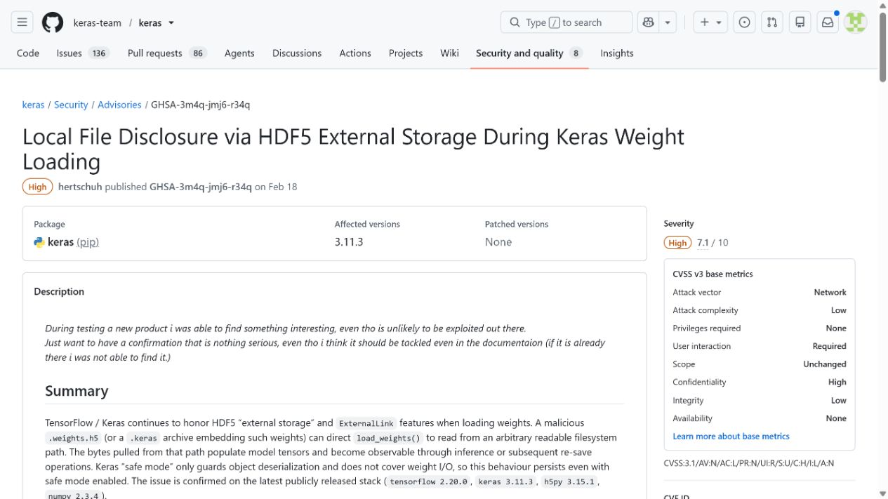
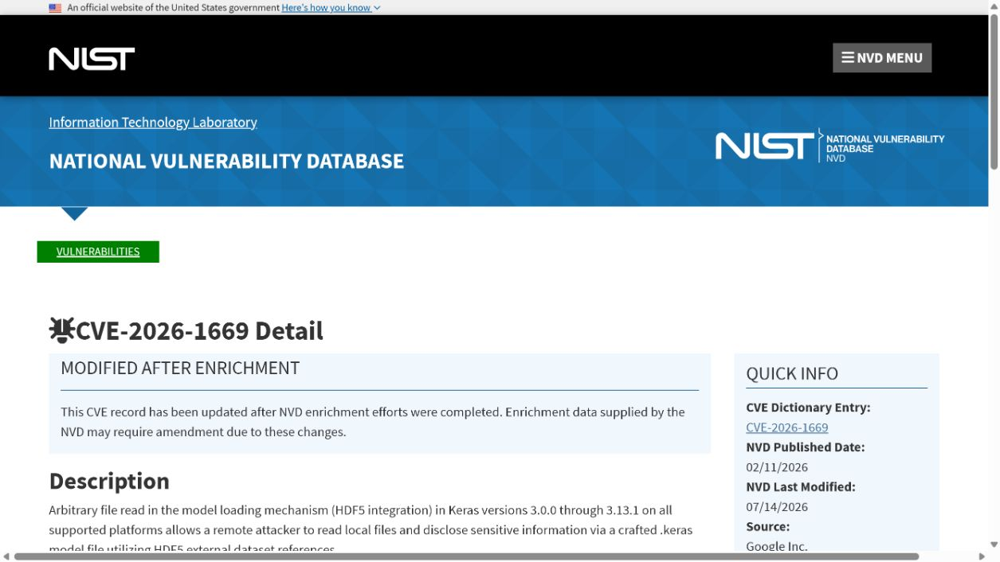
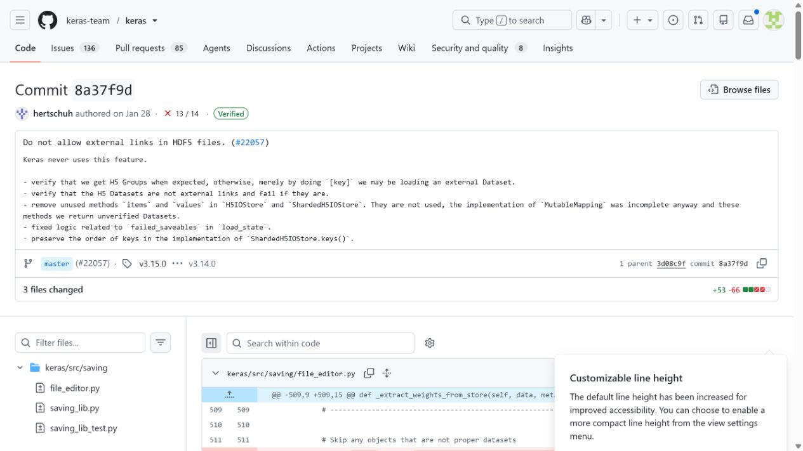
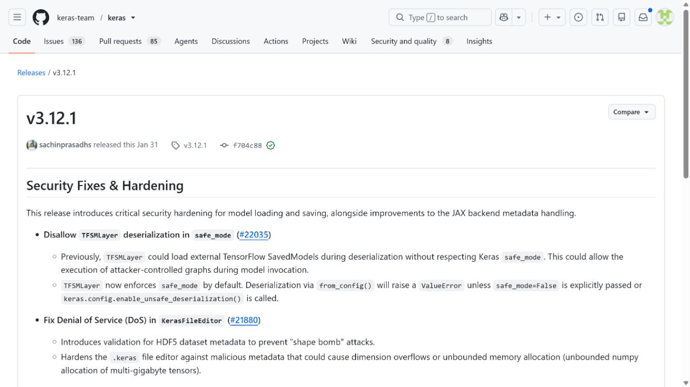
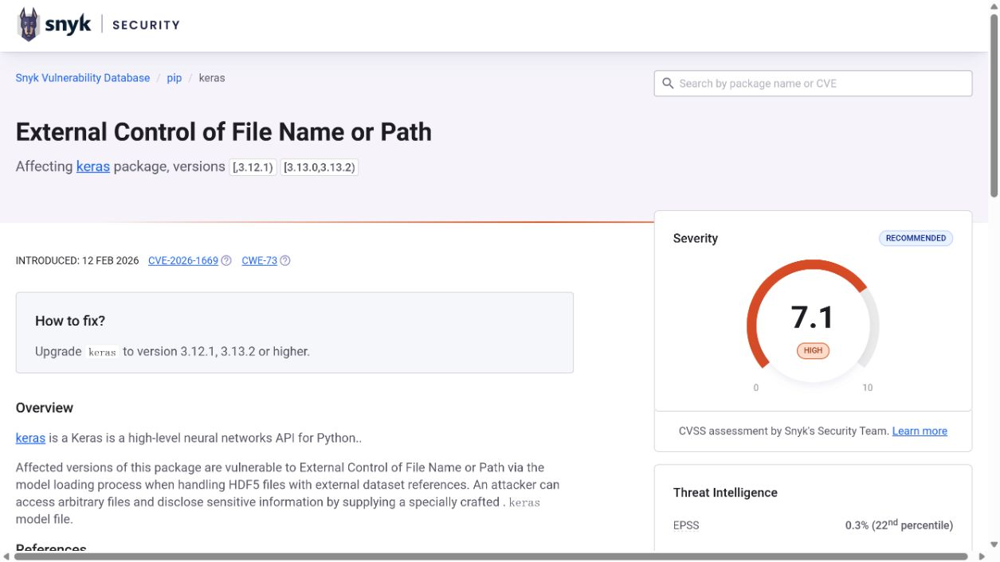

# Keras HDF5 External Storage Local File Disclosure (2026)
> Keras HDF5 外部存储权重加载本地文件泄露漏洞

| Field | Value |
|---|---|
| Category | supply-chain |
| Severity | high（NVD CVSS 3.1：7.5） |
| AI Tool | Keras model and weight loading |
| Language | Python |
| Real Incident | Yes（已公开确认的真实漏洞；不表示已有受害事件） |
| Reproducible | No |
| Disclosed | 2026-02-11 |
| CVE | CVE-2026-1669 |
| CVSS | 7.5 |

## TL;DR / 摘要

A crafted Keras weight file could direct HDF5 loading to readable local files and expose their bytes through model tensors.

Keras 案例把模型加载的攻击面从“执行代码”扩展到“解释文件格式中的引用”。模型制品需要和软件包一样经过来源、内容和运行环境三层审查。

---

## 详细分析 / Full Analysis

### 一、事件概况与公开记录

Keras 模型和权重经常在训练、评测与部署之间以 `.weights.h5` 或 `.keras` 制品交换。团队通常把权重文件视为数据，而加载过程却会调用底层 HDF5 库读取其中描述的对象。因而模型导入并不是单纯的“下载一个文件”，它同时触发了解析器和文件系统访问。

Keras 项目安全公告、NVD、Snyk 与上游修复提交相互印证了 CVE-2026-1669。补丁直接禁止 HDF5 external links 和 external storage，3.12.1 发布页给出对应分支的修复版本。NVD 同时展示 NVD 7.5、Google CNA 7.1 和 Red Hat 6.5 三套评分，本文表格采用 NVD 的 7.5，并保留评分来源。

### 二、AI 工作流与攻击入口

模型权重是 AI 供应链中最常见也最容易被默认信任的工件。此前对模型安全的讨论常集中在 pickle 执行，本案补充了另一条路径：即使没有对象反序列化，通用科学数据格式中的引用语义也可能把模型加载变成本地文件读取。审核模型制品时只扫描 Python 源码并不足够。

外部内容在这些工作流中并不总以“命令”或“程序”的形式出现。模型制品、提示词配置、连接器对象、缓存记录以及 Agent 工具参数往往先被视为普通数据，随后才在框架内部获得文件读取、解释执行或状态写入能力。

### 三、漏洞触发与技术路径

攻击者首先准备一个格式合法、但在内部数据集引用中写入外部路径的 HDF5 权重文件。受害者调用 `load_weights()` 或通过 `.keras` 制品加载权重时，HDF5 会跟随该引用读取宿主机文件；读取出的字节可落入模型张量或后续导出的制品。风险的核心是本地文件内容被带入可观察的数据结构，而不是把恶意 Python 对象反序列化执行。

### 四、技术根因

Keras 允许底层 HDF5 加载器解析外部数据引用，却没有在模型导入边界禁止引用宿主机路径。权重文件因此能够要求加载器读取制品之外的数据，模型格式的合法性与数据来源的安全性被错误地视为同一件事。

### 五、利用前提与影响范围

利用需要受害者加载攻击者提供的权重，并且目标文件对运行进程可读。共享模型市场、自动基准测试、CI 训练作业和由用户上传模型的推理平台都应纳入排查。服务进程权限越高、容器挂载越宽，可能读取的范围越大；但漏洞不会凭空突破操作系统权限。

公开记录给出的受影响范围是：Keras versions before 3.12.1 and the affected 3.13 branch before 3.13.2.

评估具体部署时，应逐项确认相关功能是否启用、是否接收第三方内容或制品、运行账户可访问哪些目录和令牌，以及组件是否已经升级。本文采用 NVD CVSS 3.1 7.5 High；同页还列出 Google CNA CVSS 4.0 7.1 和 Red Hat CVSS 3.1 6.5，三者因用户交互和影响判断不同而存在差异。

### 六、AI 安全问题分析

模型治理中的一个常见盲点是把 `.h5` 文件与脚本、容器镜像分属不同的审查流程。对本案而言，权重加载日志、模型来源、评测作业和容器挂载配置应放在一起审计：前两者判断是否接触不可信制品，后两者决定一次异常读取能看见什么。若模型评测服务与生产密钥共享同一文件系统，即使只发生读取，后果也会被放大。

### 七、修复与处置

上游修复版本为 3.12.1 与 3.13.2 及后续版本，使用方应根据自身分支完成升级。对来源不明的模型，先在没有生产密钥、没有宿主机敏感挂载的隔离环境中加载；在制品接收流程中检查 HDF5 是否含有外部链接或外部存储声明。训练、评测和生产推理最好使用不同凭据与文件系统视图。

公开材料给出的处置状态为：Upgrade to Keras 3.12.1, 3.13.2, or a later maintained release.

### 八、部署排查与本地验证

验证修复时应加载正常权重确认兼容性，再使用仅指向不存在测试路径的受控样本确认加载器拒绝外部引用，而不是读取该路径。审计容器配置也很重要：即使应用升级，宽泛的主机目录挂载仍会放大任何未来解析缺陷的后果。

对于可能触发代码执行、文件读取或越权写入的案例，README 不提供可直接复制的攻击载荷。本地验收应检查版本、配置、已注册工具、缓存权限、文件挂载和审计日志，并在隔离测试环境中使用无害边界输入确认修复行为。

项目 Advisory 与修复提交直接讨论 HDF5 external links，NVD 与 Snyk 用于核验 CVE、评分差异和受影响范围，发布页说明 3.12.1 分支的版本修复点。材料没有把该问题称为任意代码执行；文中也据此把它和 pickle 模型反序列化明确区分。

### 九、证据材料

| 来源 | 类型 | 证明内容 |
|---|---|---|
| Keras advisory: HDF5 external link file disclosure | 项目安全公告 | 说明 HDF5 外部存储导致本地文件披露的入口和受测 3.11.3；页面本身未列 patched version |
| NVD: CVE-2026-1669 | 漏洞数据库 | 核验 CVE 描述、NVD 7.5 与 CNA 7.1 两套评分及其向量差异 |
| Keras security fix commit | 上游提交 | 展示拒绝 HDF5 external links 和 external storage 的代码修改 |
| Keras 3.12.1 release | 项目发布 | 证明 3.12.1 分支包含相应安全加固 |
| Snyk: CVE-2026-1669 | 独立漏洞库 | 复核 3.12.1、3.13.2 修复范围及模型加载条件 |

`assets/` 保存上述五个来源抓取时返回的原始 HTML，以及与同一页面对应的真实浏览器截图。动态网站离线打开时可能缺少外部样式或脚本，但源文件保留服务器返回内容，可用于复核标题、描述、版本和链接。

### 十、结论

Keras 案例把模型加载的攻击面从“执行代码”扩展到“解释文件格式中的引用”。模型制品需要和软件包一样经过来源、内容和运行环境三层审查。

完成版本修复后，仍应保留来源治理、最小权限、任务隔离和结构化授权。这些措施既用于缓解当前漏洞，也能限制后续模型制品、Agent 工具或 AI 框架解析缺陷造成的影响。

### 参考来源

- [Keras advisory: HDF5 external link file disclosure](https://github.com/keras-team/keras/security/advisories/GHSA-3m4q-jmj6-r34q)
- [NVD: CVE-2026-1669](https://nvd.nist.gov/vuln/detail/CVE-2026-1669)
- [Keras security fix commit](https://github.com/keras-team/keras/commit/8a37f9dadd8e23fa4ee3f537eeb6413e75d12553)
- [Keras 3.12.1 release](https://github.com/keras-team/keras/releases/tag/v3.12.1)
- [Snyk: CVE-2026-1669](https://security.snyk.io/vuln/SNYK-PYTHON-KERAS-15268069)
