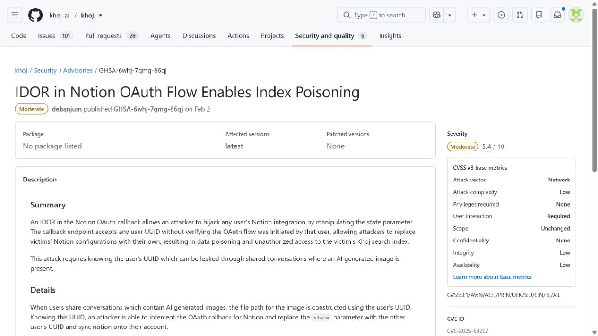
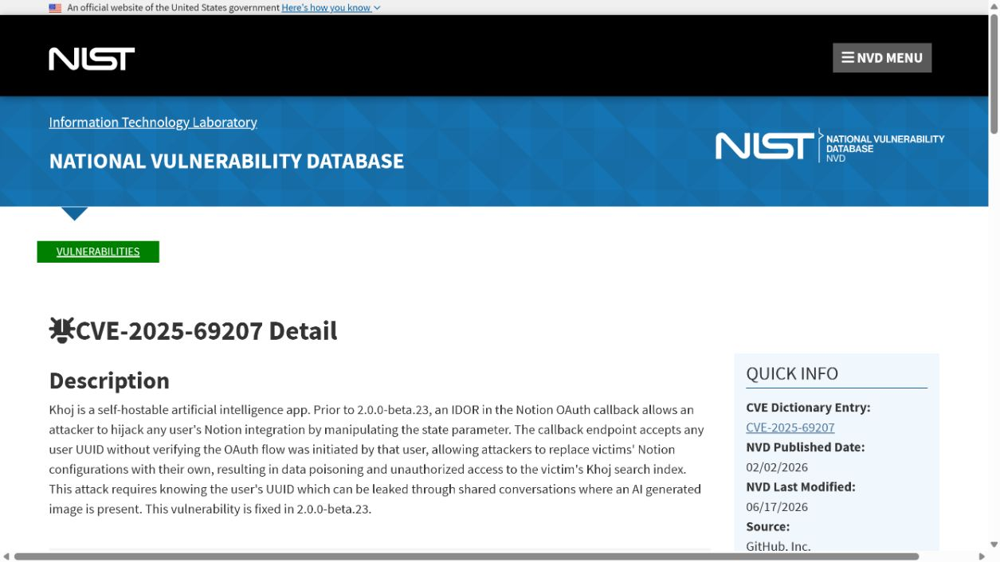
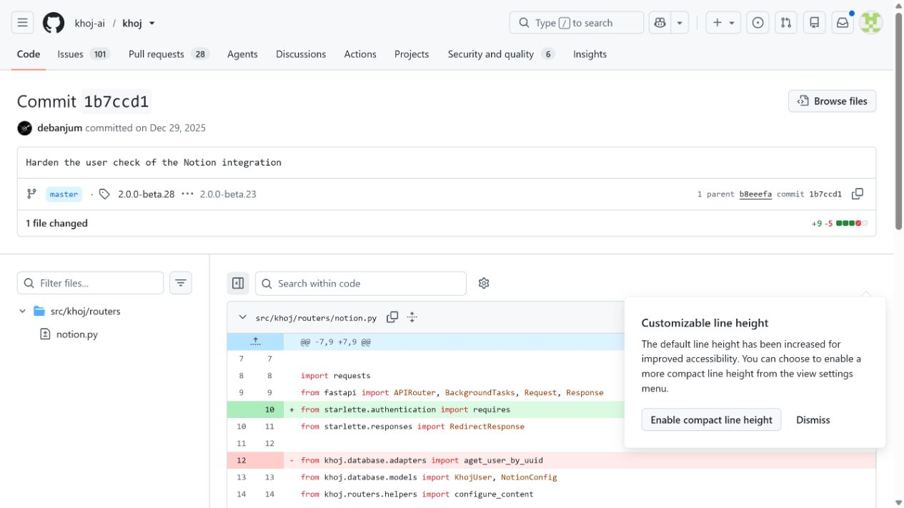
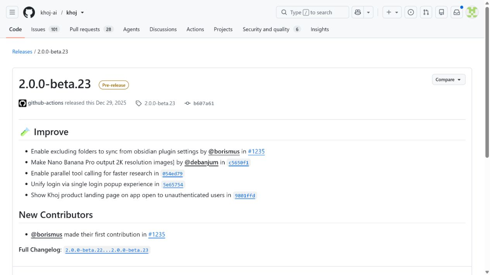
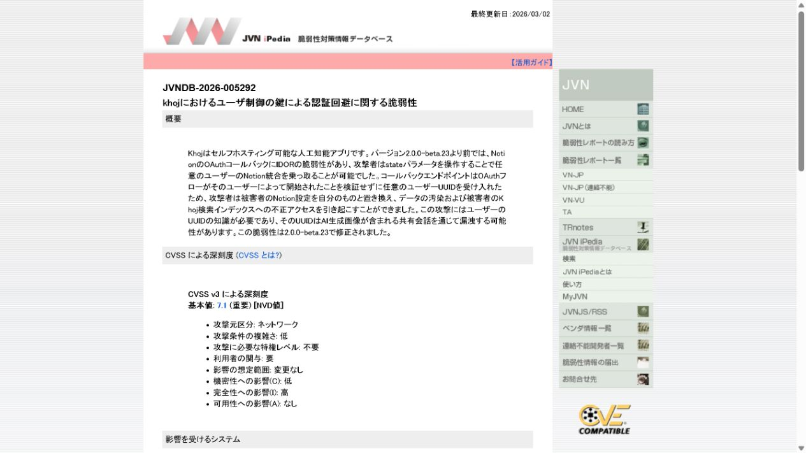

# Khoj Notion OAuth Index Poisoning (2026)
> Khoj Notion OAuth 集成对象引用缺陷导致的索引投毒漏洞

| Field | Value |
|---|---|
| Category | domain-specific |
| Severity | high（NVD CVSS 3.1：7.1） |
| AI Tool | Khoj personal RAG assistant and Notion connector |
| Language | Python |
| Real Incident | Yes（已公开确认的真实漏洞；不表示已有受害事件） |
| Reproducible | No |
| Disclosed | 2026-02-02 |
| CVE | CVE-2025-69207 |
| CVSS | 7.1 |

## TL;DR / 摘要

An authorization flaw in Khoj's Notion OAuth flow enabled cross-user access that could poison another user's indexed knowledge base.

Khoj 案例说明，RAG 系统的答案可信度取决于知识接入的完整性。OAuth 对象校验失效会把传统越权扩展为持续影响检索上下文的问题。

---

## 详细分析 / Full Analysis

### 一、事件概况与公开记录

Khoj 会将 Notion 等外部知识库接入个人 RAG 助手，为文档建立索引并在回答时检索相关片段。连接器需要同时维护 OAuth 授权、用户或工作区身份、外部对象和本地索引，它们之间的归属关系决定了哪些内容可以被导入和检索。

Khoj 的 GitHub Security Advisory 以“Notion OAuth Flow Enables Index Poisoning”概括问题；NVD、JVNDB 和上游修复提交提供了独立复核。提交标题为 “Harden the user check of the Notion integration”，与公告关于对象引用授权不足的描述相吻合，发布页则用于定位修复版本。

### 二、AI 工作流与攻击入口

传统 IDOR 的影响常被描述为读取或修改某条业务记录。本案的 AI 特征在于，连接器导入的内容会进入知识库并影响后续模型检索，因此完整性问题可能以间接、延迟的形式出现在回答中。RAG 的安全控制不能只检查聊天接口权限，也要覆盖数据接入时的对象所有权。

外部内容在这些工作流中并不总以“命令”或“程序”的形式出现。模型制品、提示词配置、连接器对象、缓存记录以及 Agent 工具参数往往先被视为普通数据，随后才在框架内部获得文件读取、解释执行或状态写入能力。

### 三、漏洞触发与技术路径

攻击者在 Notion OAuth 相关流程中操纵对象引用，使服务端没有把操作对象与当前授权主体充分绑定。这样可能访问或影响另一个用户关联的索引内容。对 RAG 应用而言，后果不止是一次越权读取：被不当导入的文本会成为后续检索候选，进而改变模型获得的上下文和回答依据。

### 四、技术根因

Khoj 的 Notion 集成没有在对象访问时持续绑定当前用户、OAuth 授权和索引记录，客户端可控的对象标识因此越过租户边界。错误导入的数据还会进入后续检索，使一次授权缺陷具有持续的知识库完整性影响。

### 五、利用前提与影响范围

利用需要攻击者拥有可操作的 Khoj 账户和 Notion 集成流程，并能够命中存在归属校验缺陷的对象。不同部署的风险取决于是否启用了 Notion 连接器、是否共享同一实例以及索引是否允许自动刷新。公开资料未提供每个被影响工作区的实际内容或持续时间，不能把理论上的索引污染直接等同为已发生的错误回答。

公开记录给出的受影响范围是：Khoj releases before 2.0.0-beta.23 with the vulnerable Notion OAuth ownership checks.

评估具体部署时，应逐项确认相关功能是否启用、是否接收第三方内容或制品、运行账户可访问哪些目录和令牌，以及组件是否已经升级。本文采用 NVD CVSS 3.1 7.1 High；GitHub CNA 的原始评分为 5.4 Medium。两套评分对机密性和完整性影响的判断不同。

### 六、AI 安全问题分析

对 RAG 连接器的排查不能只看 OAuth token 是否有效，还要核对每一条索引记录归属于哪个用户、工作区和外部页面。若修复前曾允许自动同步，升级后可考虑按授权主体重建索引，而不是继续沿用旧记录。这样既能消除可能的错误归属，也能让后续审计明确知道某段回答上下文来自哪一次授权导入。

### 七、修复与处置

升级项目公布的修复版本，撤销并重新核验历史 OAuth 授权，对已有 Notion 索引执行归属审计和必要的重建。服务端应在每次读取、刷新和删除连接器对象时同时校验用户、工作区、授权记录与外部资源标识，而不能仅相信客户端传来的 ID。

公开材料给出的处置状态为：Upgrade to Khoj 2.0.0-beta.23 or later and rebuild indexes whose ownership cannot be verified.

### 八、部署排查与本地验证

验收可建立两个隔离的测试账户和 Notion 工作区，确认任一账户都无法列举、刷新或修改另一账户的连接器和索引。对于生产环境，应抽查索引记录是否带有可追溯的授权主体与导入时间，并为异常批量刷新建立告警。

对于可能触发代码执行、文件读取或越权写入的案例，README 不提供可直接复制的攻击载荷。本地验收应检查版本、配置、已注册工具、缓存权限、文件挂载和审计日志，并在隔离测试环境中使用无害边界输入确认修复行为。

Khoj 的安全公告给出了“IDOR”和“index poisoning”两个关键事实，修复提交表明开发者强化了 Notion 集成的用户检查，NVD 与 JVNDB 提供独立记录。证据支持的是授权链失效与索引完整性风险；它没有提供被污染回答的样本，因此报告将影响表述为可能的后续检索偏差，而不是既成事实。

### 九、证据材料

| 来源 | 类型 | 证明内容 |
|---|---|---|
| Khoj advisory: Notion OAuth IDOR and index poisoning | 项目安全公告 | 说明 Notion OAuth state IDOR、用户 UUID 前提和索引投毒影响 |
| NVD: CVE-2025-69207 | 漏洞数据库 | 核验 NVD 7.1 与 CNA 5.4 两套评分、版本范围和 PoC 状态 |
| Khoj ownership fix commit | 上游提交 | 展示 Notion 集成用户归属检查的修复 |
| Khoj 2.0.0-beta.23 release | 项目发布 | 证明 2.0.0-beta.23 是包含修复的发布版本 |
| JVNDB-2026-005292 | 国家漏洞库 | 从 JVNDB 独立复核编号、影响描述和评分信息 |

`assets/` 保存上述五个来源抓取时返回的原始 HTML，以及与同一页面对应的真实浏览器截图。动态网站离线打开时可能缺少外部样式或脚本，但源文件保留服务器返回内容，可用于复核标题、描述、版本和链接。

### 十、结论

Khoj 案例说明，RAG 系统的答案可信度取决于知识接入的完整性。OAuth 对象校验失效会把传统越权扩展为持续影响检索上下文的问题。

完成版本修复后，仍应保留来源治理、最小权限、任务隔离和结构化授权。这些措施既用于缓解当前漏洞，也能限制后续模型制品、Agent 工具或 AI 框架解析缺陷造成的影响。

### 参考来源

- [Khoj advisory: Notion OAuth IDOR and index poisoning](https://github.com/khoj-ai/khoj/security/advisories/GHSA-6whj-7qmg-86qj)
- [NVD: CVE-2025-69207](https://nvd.nist.gov/vuln/detail/CVE-2025-69207)
- [Khoj ownership fix commit](https://github.com/khoj-ai/khoj/commit/1b7ccd141d47f365edeccc57d7316cb0913d748b)
- [Khoj 2.0.0-beta.23 release](https://github.com/khoj-ai/khoj/releases/tag/2.0.0-beta.23)
- [JVNDB-2026-005292](https://jvndb.jvn.jp/ja/contents/2026/JVNDB-2026-005292.html)
