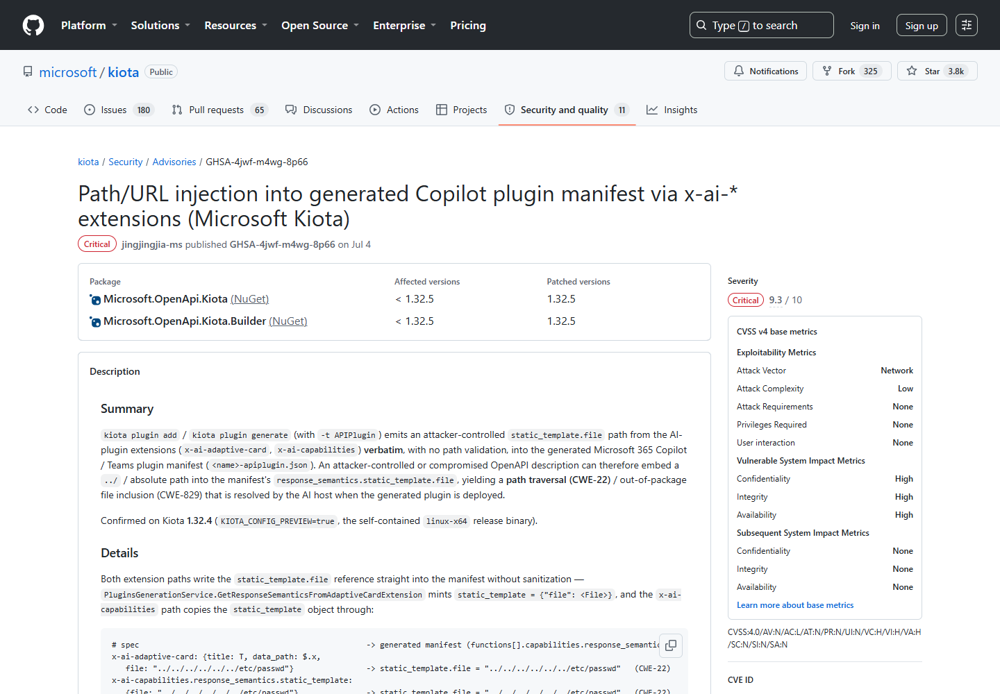
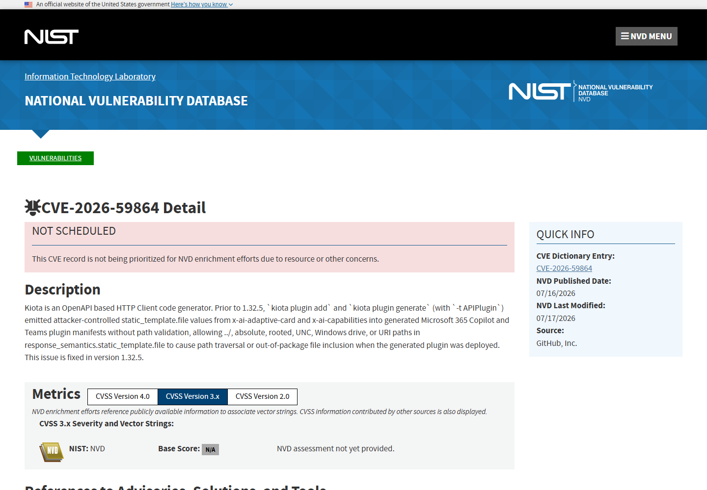
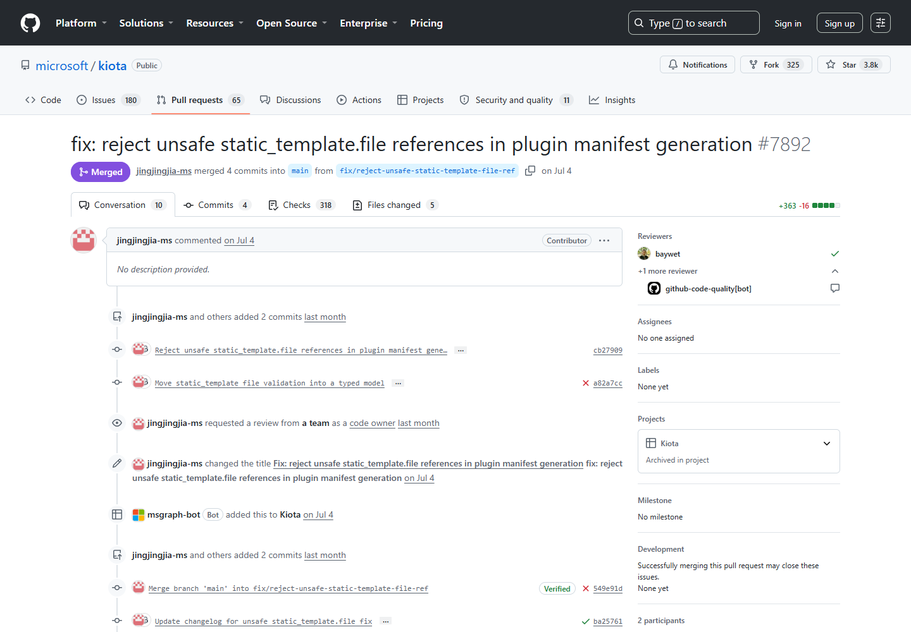
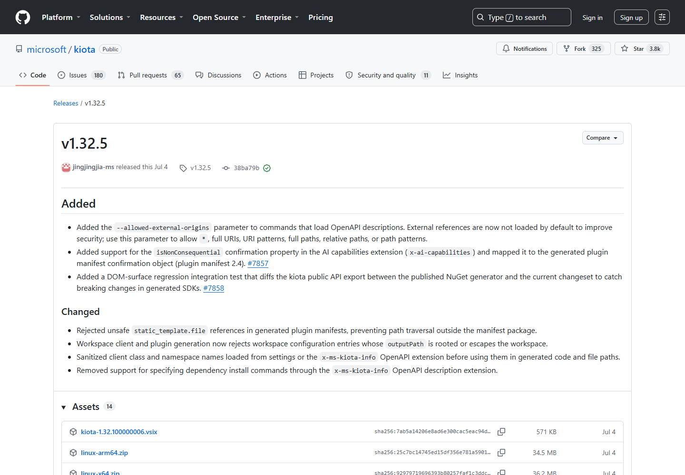
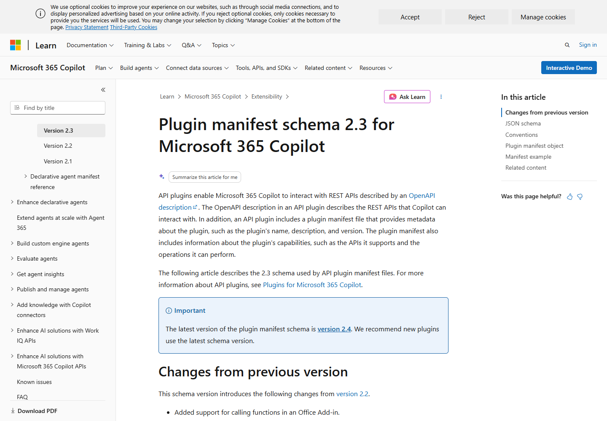

# Microsoft Kiota Copilot Plugin Manifest Path and URL Injection (2026)
> Microsoft Kiota Copilot 插件清单路径与 URL 注入

| Field | Value |
|---|---|
| Category | supply-chain |
| Severity | critical |
| AI Tool | Microsoft Kiota, Microsoft 365 Copilot plugins, OpenAPI |
| Language | .NET / JSON / OpenAPI |
| Real Incident | Yes |
| Reproducible | Yes |
| Disclosed | 2026-07-04 |
| CVE | CVE-2026-59864 |

## TL;DR
Kiota 生成 Microsoft 365 Copilot API 插件清单时，直接采用 OpenAPI 的 x-ai-* 扩展值，恶意规范可把攻击者控制的路径或 URL 写入生成的插件清单。

---

## 详细分析 / Full Analysis

## 一、基本信息与事件概况

Kiota 能从 OpenAPI 描述生成客户端和 Copilot API 插件。CVE-2026-59864 位于插件生成路径：x-ai-adaptive-card、x-ai-capabilities 等扩展中的 static_template.file 未经路径或 URL 校验，就进入生成的 apiplugin.json。开发者把外部 API 规范当作数据导入，结果却在插件制品中保留了攻击者指定的资源位置。

受影响范围为 Kiota 1.32.5 之前版本，修复版本为 1.32.5。GitHub CNA 给出的 CVSS 4.0 基础分为 9.3；公开记录未显示该漏洞已被用于真实攻击，本文所称事件是经过项目公告和补丁确认的产品安全缺陷。

## 二、公开披露与材料核验

Microsoft Kiota 项目安全公告于 2026 年 7 月 4 日发布，CVE 记录随后进入 NVD。公告、修复 PR、补丁提交和 1.32.5 发布页能够对应到同一处处理逻辑。公开描述把问题定为 Critical，并明确涉及 `kiota plugin add`、`kiota plugin generate -t APIPlugin` 以及 Microsoft 365 Copilot/Teams 插件清单。

### 证据矩阵

| 来源 | 类型 | 证明内容 |
|---|---|---|
| Microsoft Kiota repository advisory | 项目公告 | 漏洞机制、影响命令、版本范围与评分 |
| NVD CVE record | 公开记录 | 版本、技术机制、修复或产品背景 |
| Microsoft Kiota remediation pull request 7892 | 修复记录 | 路径校验逻辑、测试范围与修复代码 |
| Microsoft Kiota 1.32.5 release | 版本发布 | 已修复版本及发布内容 |
| Microsoft Copilot API plugin manifest documentation | 厂商文档 | 清单字段在 Copilot 插件中的用途 |

## 三、系统背景与触发条件

入口是开发者或流水线导入的 OpenAPI 文档，影响发生在 `APIPlugin` 生成路径。只有包含相关 `x-ai-*` 扩展、并进入 Copilot 或 Teams 插件打包流程的规范会触发；普通 Kiota 客户端生成任务不应被笼统列入范围。

`static_template.file` 用于告诉宿主到哪里取得响应模板。合法值通常指向插件包中的相对文件，而受影响版本接受了 `../`、绝对路径、UNC 路径、Windows 盘符和 URI。于是，原本应该被限制在插件目录内的资源引用，可以被 OpenAPI 作者带到包外文件或远程位置。

攻击者不需要直接控制 Copilot 租户，但需要让恶意 OpenAPI 文档进入插件生成流程。常见入口包括第三方 API 规范、自动拉取的接口描述、测试样例或被篡改的上游仓库。生成产物还必须被后续打包或部署，风险才会从构建阶段延伸到插件使用阶段。

## 四、攻击链与失效过程

攻击者提供带恶意 x-ai-* 扩展的 OpenAPI 文档。开发者或自动化流水线使用 Kiota 生成 APIPlugin，工具把 static_template.file 原样写入插件清单。后续导入、打包或运行插件时，宿主可能访问非预期路径或远端 URL，使原本的数据生成步骤影响 Copilot 插件运行时的资源边界。

这条链路具有明显的供应链特征。恶意值最初藏在结构合法的 OpenAPI 扩展中，生成命令可以正常结束，产物也仍是有效 JSON；如果审查只关心构建是否成功，很难从流水线状态发现问题。直到插件宿主解析 `response_semantics.static_template.file` 时，路径才真正影响文件包含或远端资源访问。

公开公告描述的是可造成路径穿越或包外文件包含的能力，具体能读到什么、宿主如何处理远端 URI，取决于部署平台和插件权限。因此，不能把每个恶意清单都直接写成已经完成主机代码执行，但它足以破坏插件包的资源完整性和数据来源控制。

## 五、技术根因与 AI 安全分析

AI 插件供应链中，OpenAPI 文档不只是接口说明，还能影响 Agent 的能力描述、模板和资源引用。安全审查如果只检查生成后的代码，容易忽略清单里的外部 URL 与路径。生成器应把扩展字段视为不可信输入，限制协议、主机和相对路径，并在产物阶段对 manifest 做独立策略校验。

Copilot 插件会把 API 操作、响应语义和展示模板组合成 Agent 可调用的能力。模板来源一旦超出插件包，攻击者就可能改变用户看到的内容或让宿主接触意外资源。问题不在模型对提示词的判断，而在插件生成工具把不可信规范提升成了受信清单配置。

1.32.5 的修复通过拒绝不安全引用来恢复目录约束。流水线仍应增加产物检查：对 `apiplugin.json` 中所有文件字段执行规范化，拒绝绝对路径、父目录跳转、UNC 和 URI，并记录 OpenAPI 规范的来源与哈希。这样即使未来出现新的扩展字段，也不必完全依赖生成器内部校验。

## 六、影响范围与处置建议

使用来源不明 OpenAPI 规范生成 Copilot 插件的团队风险最高。应升级 Kiota，重新生成并比较现有 apiplugin.json，搜索 x-ai-adaptive-card、x-ai-capabilities 和 static_template.file，确认资源均来自批准位置。CI 中可以在发布前拒绝绝对路径、父目录跳转和非白名单 URL。

历史排查不能只查看当前 OpenAPI 文件，因为恶意值可能已经固化在构建产物、插件包或制品仓库中。应对已发布清单做反向搜索，定位包含 `response_semantics.static_template.file` 的条目，并核对引用目标是否位于对应插件目录。

发现异常清单后，应停止分发并用 1.32.5 或更高版本重新生成。若插件宿主曾访问外部 URI，还需要检查代理和 DNS 日志；若引用指向本地或共享路径，则应确认相关文件是否被读取、打包或展示。

## 七、结论

Kiota 案例说明，Copilot 插件的 OpenAPI 输入已经具有构建配置的影响力，不能继续按普通接口文档处理。升级到 1.32.5、重建已有插件并扫描历史清单，才能同时处理生成器缺陷和已经落地的异常资源引用。

## 八、参考来源

- [Microsoft Kiota repository advisory](https://github.com/microsoft/kiota/security/advisories/GHSA-4jwf-m4wg-8p66)
- [NVD CVE record](https://nvd.nist.gov/vuln/detail/CVE-2026-59864)
- [Microsoft Kiota remediation pull request 7892](https://github.com/microsoft/kiota/pull/7892)
- [Microsoft Kiota 1.32.5 release](https://github.com/microsoft/kiota/releases/tag/v1.32.5)
- [Microsoft Copilot API plugin manifest documentation](https://learn.microsoft.com/en-us/microsoft-365-copilot/extensibility/api-plugin-manifest-2.3)

