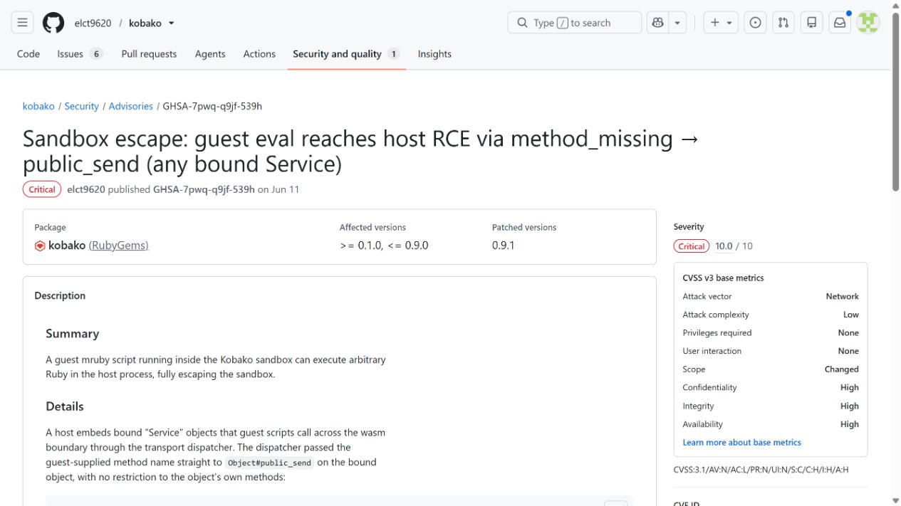
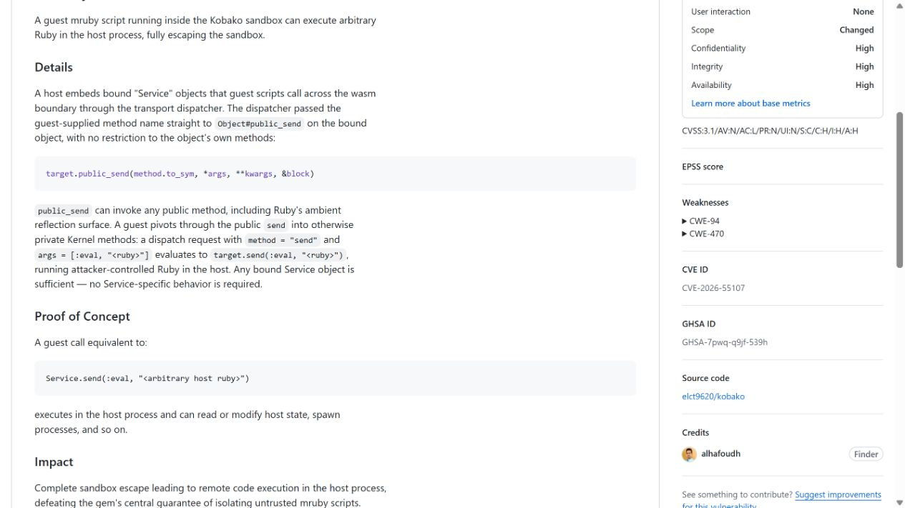
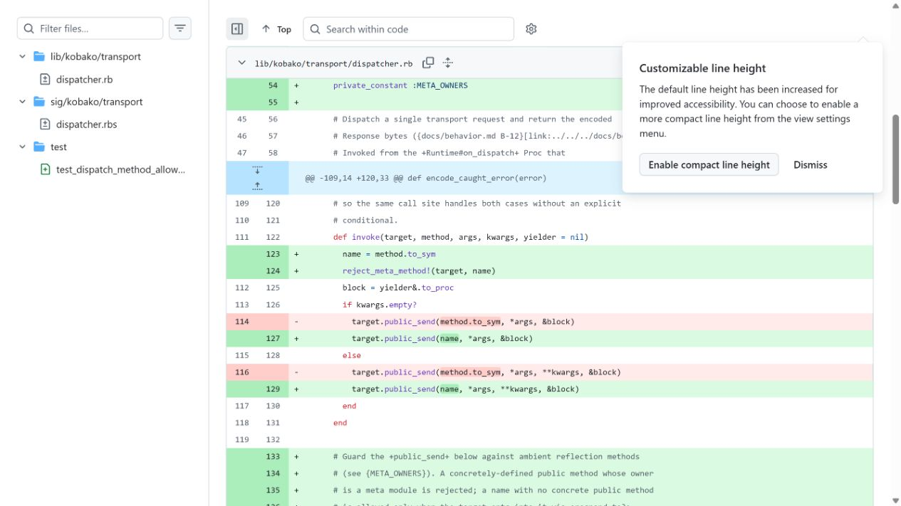
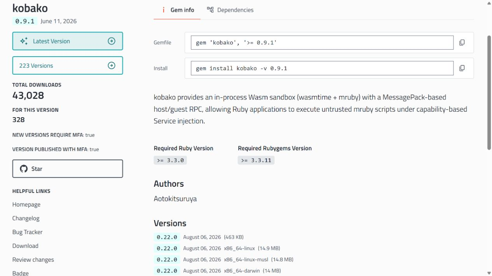
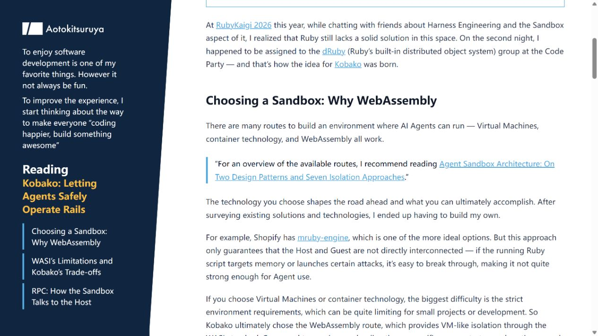

# Kobako AI Sandbox Escape to Host Code Execution (2026)
> Kobako AI 代理沙箱逃逸并在宿主执行代码

| Field | Value |
|---|---|
| Category | agent-risk |
| Severity | Critical |
| CVE | CVE-2026-55107 |
| AI Tool | Kobako, Ruby AI agents |
| Language | Ruby |
| Real Incident | Yes |
| Reproducible | Yes |
| Disclosed | 2026-06-11 |

## TL;DR
Kobako 用于隔离 AI 代理生成的 Ruby 代码，但旧版服务分发允许调用继承方法，沙箱内代码可经 `send(:eval, ...)` 在宿主进程执行。

---

## 详细分析 / Full Analysis

## 一、事件概况

Kobako 是为 AI Agent 执行 Ruby/Rails 操作提供的沙箱。作者介绍明确把它定位为让代理在受控环境中操作应用对象。2026 年 6 月公开的 CVE-2026-55107 影响 0.1.0 至 0.9.0：来宾代码可利用服务方法分发调用不应暴露的继承方法，最终在宿主 Ruby 进程执行任意代码。0.9.1 已修复。

该漏洞直接击中产品的安全承诺。用户正是因为模型生成代码不可完全预测才使用沙箱；一旦边界可被来宾主动穿透，原本允许尝试的低信任代码就取得了宿主应用的数据库连接、环境变量和文件权限。

## 二、公开材料与事实核对

项目 advisory 和 GitHub Advisory Database 对版本与 CVSS 10.0 一致，修复提交展示代码变化，RubyGems 证明 0.9.1 已发布，作者文章说明产品与 AI Agent 的直接用途。

| 来源 | 类型 | 主要内容 |
|---|---|---|
| GitHub Advisory | 项目公告 | 逃逸调用链与版本 |
| GitHub Advisory Database | 漏洞数据库 | CVE 与最高评分 |
| 修复提交 | 代码证据 | 方法分发限制 |
| RubyGems | 包生态记录 | 0.9.1 发布 |
| 作者文章 | 产品资料 | AI Agent 沙箱场景 |

## 三、攻击或事件链路

来宾与宿主之间通过绑定服务对象交互。旧版根据来宾提供的方法名调用 `public_send`，但 Ruby 对象继承了 `send` 等通用方法。攻击者先要求绑定对象执行 `send`，再把 `:eval` 和 Ruby 代码作为参数传入。调用发生在宿主对象上，代码因此脱离来宾隔离区。

这一链路不依赖复杂内存破坏，调用内容完全符合 Ruby 的动态消息机制。只要 Agent 可以生成或运行来宾代码，恶意提示、被污染的任务或模型自身错误都可能产生逃逸序列。

## 四、技术根因

根因是用黑名单思路暴露对象方法。服务接口没有建立明确的可调用方法集合，而是相信 `public_send` 会排除危险能力；实际上 public 只描述 Ruby 可见性，不代表适合跨安全边界。继承自 Object、Kernel 等模块的方法同样可能改变控制流。

修复需要对每个绑定对象声明允许的方法，并拒绝继承的元编程入口。更强的隔离还应使用独立进程、操作系统账户、资源限制和网络策略，避免语言级代理对象成为唯一边界。

## 五、AI 安全问题

在普通脚本执行器中，用户通常知道自己提交了什么代码；Kobako 面向的 Agent 会自行生成步骤，并可能根据外部文本调整程序。沙箱因此必须假设来宾会积极寻找边界，而不是只防止偶然错误。CVE-2026-55107 让模型生成的代码从受限对象操作升级为宿主执行，是典型的 Agent 权限放大。

此外，宿主往往已经加载 Rails 应用和数据库连接。逃逸后不需要再突破一层认证，攻击者可直接使用进程内对象。把 AI 代码放进语言级沙箱，却与生产应用处于同一地址空间，会让一次接口错误具有极高影响。

## 六、影响、处置与排查

公开证据是可复现漏洞和修复记录，没有披露真实受害组织。所有 0.1.0 至 0.9.0 部署应升级到 0.9.1 以上，并回看 Agent 运行内容中对 `send`、`eval`、`instance_eval`、常量解析和宿主对象反射的调用。宿主进程若出现异常文件、网络连接或数据库查询，应按代码执行事件处理。

在无法立即升级时，应停止执行不可信 Agent 代码，或将 Kobako 放进无生产凭据的独立容器。仅在提示词中禁止 eval 不足以形成控制，因为攻击载荷由来宾代码直接表达。

## 七、治理建议

维护者需要让服务绑定采用显式 capability：每个对象只暴露完成业务所需的少量方法，参数也做类型和大小约束。安全测试应枚举祖先链、元编程方法、序列化钩子和异常处理路径。

部署者应把来宾执行进程与 Web 应用、数据库管理账户分离，设置只读数据视图和短时凭据，并记录每次来宾代码、绑定调用与宿主系统调用。即使语言层再次出现缺陷，操作系统隔离仍能限制损失。

## 八、结论

Kobako 案例说明，AI 代码沙箱不能只依赖语言对象的可见性。模型生成代码天然属于不可信输入，服务分发层必须按最小能力设计，宿主还要有第二层进程与网络隔离。0.9.1 修复了已知方法链，使用方仍需检查部署架构是否把沙箱和生产 Rails 进程放在同一信任域。

### 参考来源

1. [GitHub Security Advisory GHSA-7pwq-q9jf-539h](https://github.com/elct9620/kobako/security/advisories/GHSA-7pwq-q9jf-539h)
2. [GitHub Advisory Database CVE-2026-55107](https://github.com/advisories/GHSA-7pwq-q9jf-539h)
3. [Kobako security fix commit](https://github.com/elct9620/kobako/commit/64f84700c81f44902bed9211318d5362f44987b3)
4. [RubyGems Kobako 0.9.1](https://rubygems.org/gems/kobako/versions/0.9.1)
5. [Kobako author introduction for AI agents](https://blog.aotoki.me/en/posts/2026/05/20/kobako-ruby-sandbox-for-ai/)
