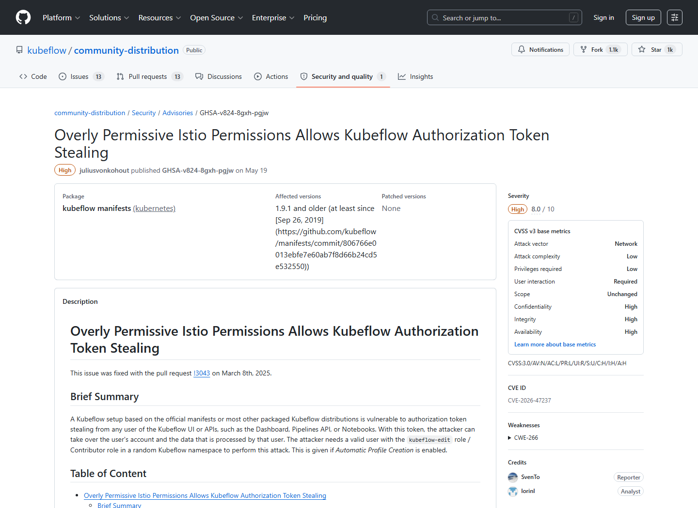
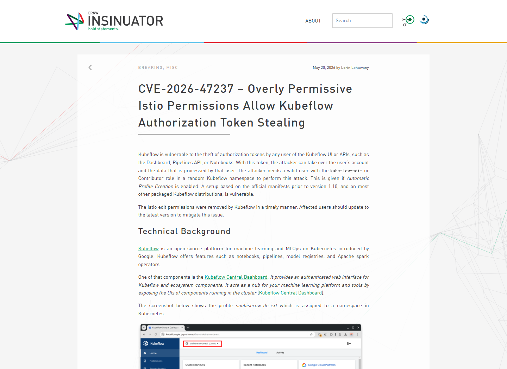
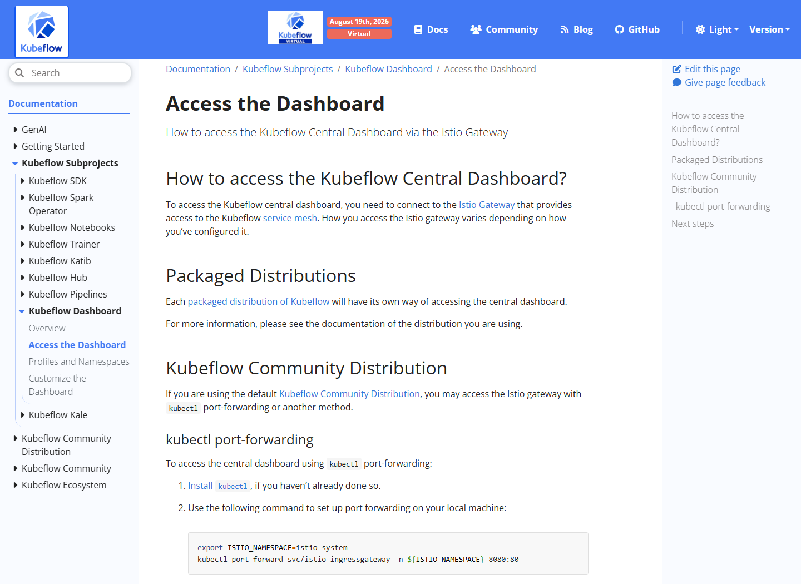
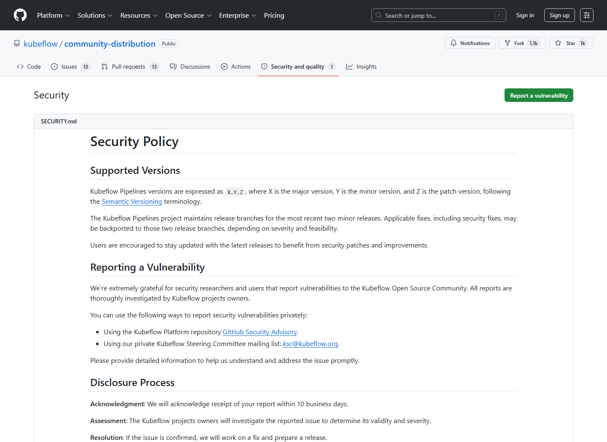
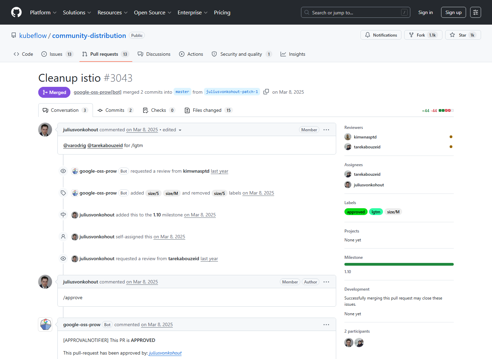

# Kubeflow Istio Permissions Authorization Token Stealing (2026)
> Kubeflow Istio 过宽权限导致授权令牌窃取

| Field | Value |
|---|---|
| Category | Cloud / IaC |
| Severity | High |
| AI Tool | Kubeflow, Istio, Kubeflow Notebooks |
| Language | Kubernetes YAML / Istio VirtualService |
| Real Incident | Yes |
| Reproducible | Yes |
| Disclosed | 2026-05-19 |
| CVE | CVE-2026-47237 |
| CVSS | 8.0 |

## TL;DR
A Kubeflow contributor could create Istio VirtualServices on the shared gateway, route a commonly loaded dashboard asset to an attacker-controlled pod, capture session cookies, and impersonate other users.
> 拥有任意命名空间 Contributor 权限的 Kubeflow 用户可在共享网关创建 Istio VirtualService，把常用资源请求导向攻击者 Pod，窃取会话并冒充其他用户。

---

## 详细分析 / Full Analysis

## 一、基本信息与事件概况

CVE-2026-47237 是 Kubeflow 官方 manifests 中的多租户授权问题。受影响配置为 kubeflow-edit 角色和默认 editor ServiceAccount 赋予了过宽的 Istio API 权限。攻击者只需在任意一个 Kubeflow 命名空间中拥有 Contributor 权限，就可以创建指向共享 kubeflow-gateway 的 VirtualService，覆盖 Dashboard、Pipelines API 或 Notebook 使用的路由。

项目公告以加载频繁的 favicon 为例：攻击者把该路径路由到自己的 Pod，受害者访问 Kubeflow 页面时，带有会话 cookie 的请求就会到达攻击者服务。拿到令牌后，攻击者可冒充受害用户并访问其 Kubeflow 数据与资源。公告给出 CVSS 8.0，并确认 1.9.1 及更早的官方 manifests 受到影响。

## 二、事件经过与公开材料

修复 PR #3043 在 2025 年 3 月 8 日移除了相关 Istio 权限，但漏洞直到 2026 年 5 月 19 日才以 GHSA-v824-8gxh-pgjw 和 CVE-2026-47237 公开。ERNW 研究人员次日发布技术分析，列出攻击前提、默认权限、VirtualService 配置、会话捕获和修复建议。公开时间与修复合并时间相隔较长，因此部署方不能只看披露日期判断自己是否安全，应核对实际 manifests 内容。

上游公告还检查了多个打包发行版，许多基于官方角色定义的分发可能继承问题。由于不同供应商的清单和补丁节奏不同，不能仅用 Kubeflow 品牌版本推断状态；最可靠的办法是检查 kubeflow-edit、kubeflow-admin 以及默认 editor ServiceAccount 是否仍能创建或修改 networking.istio.io 资源。

### 证据矩阵

| 来源 | 类型 | 证明内容 |
|---|---|---|
| Kubeflow Advisory: GHSA-v824-8gxh-pgjw | 项目公告 | 影响版本、CVSS 8.0、完整 PoC、影响和修复建议 |
| ERNW Insinuator: CVE-2026-47237 | 原始研究 | 默认权限、VirtualService 攻击链和会话接管说明 |
| Kubeflow Manifests Security Overview | 项目安全索引 | 上游仓库对 GHSA-v824-8gxh-pgjw 的正式列示 |
| Kubeflow Fix PR #3043 | 修复记录 | 移除过宽 Istio 权限的代码变更和合并时间 |
| Kubeflow Docs: Access the Dashboard | 产品文档 | Central Dashboard 通过 Istio Gateway 提供访问的架构背景 |

## 三、系统背景与触发条件

Kubeflow 在 Kubernetes 上提供 Notebook、训练管线、模型服务和中央控制台，常以 Profile/Namespace 实现团队隔离。用户访问中央 Dashboard 时，请求通过共享 Istio Gateway，再由 VirtualService 路由到各组件。Kubernetes RBAC 负责控制谁能创建资源，Istio 配置则决定网络流量最终进入哪个服务。

问题来自两个作用域没有对齐：Contributor 角色本意是让用户管理自己命名空间内的工作负载，却同时允许其创建能够影响集群共享 Gateway 的路由。资源位于攻击者命名空间，并不意味着影响也局限于该命名空间。只要 VirtualService 能绑定共享网关，它就可能截获其他租户的入口流量。

## 四、攻击链路或失效过程

攻击者先以合法 Kubeflow 用户身份创建 Notebook 或 Pod，取得默认 editor ServiceAccount。该账号具备对 *.networking.istio.io 的创建和修改权限。攻击者部署记录请求头的服务，再创建绑定 kubeflow/kubeflow-gateway 的 VirtualService，把 /assets/favicon.ico 等路径指向恶意服务。为绕过命名空间 AuthorizationPolicy，攻击者还可利用 Contributor 管理逻辑或通配形式覆盖目标用户范围。

当受害者打开 Dashboard 或 Notebook 时，浏览器自动请求该资源，流量经共享网关进入恶意 Pod，认证 cookie 随请求被记录。攻击者把获取的 cookie 写入自己的浏览器或请求，即可冒充受害用户。上游 PoC 证明这一过程可以从低权限命名空间扩展为跨用户会话接管。

## 五、技术根因与 AI 风险分析

根因是 Kubernetes RBAC 授权时只关注“用户能否在自己的命名空间创建 VirtualService”，没有约束该 VirtualService 可以绑定哪些 Gateway。Istio 路由对象的影响范围由 gateway 引用决定，可能跨越命名空间边界。给普通编辑角色开放完整 Istio API，就相当于让租户参与共享入口的路由管理。

漏洞来自多套权限模型组合后的空隙。Kubernetes 对象位于用户命名空间，Istio Gateway 却处理共享入口流量，而 Kubeflow 又依赖该入口实现用户隔离。审查权限时不能只查看 verbs 和 resources，还要确认用户创建的对象会影响哪些共享基础设施。

Kubeflow 把 Notebook、Pipeline、实验、模型制品和训练数据集中在多租户控制面后方，因此被窃取的会话令牌可能通往多个 AI 工作流，而不只是一个普通网页。平台应把共享 Gateway、用户命名空间和工作负载凭据放在同一条信任链中审查，防止底层路由权限绕过上层实验隔离。

## 六、影响范围与处置建议

成功利用会暴露其他用户的会话令牌，攻击者可访问其 Notebook、Pipeline、模型和处理数据，并以被冒充用户的权限修改或删除资源。受影响环境应采用已移除过宽权限的最新 manifests，检查 kubeflow-edit 和 kubeflow-admin 对 istio.io、networking.istio.io 的授权，并确认普通命名空间不能绑定共享 kubeflow-gateway。

处置还应包括使现有会话失效、检查异常 VirtualService 和 DestinationRule、核对 Dashboard 静态资源路由、审计 Contributor 变更和陌生 Pod 日志。平台方可以通过准入策略禁止租户对象引用共享 Gateway，并把入口路由变更集中到受控管理命名空间。

## 七、结论

CVE-2026-47237 的关键不在单个 Kubeflow 组件，而在多租户权限与共享服务网格入口的组合。命名空间内的编辑权限一旦能够改变集群级用户流量，就不再是低权限。MLOps 平台必须把共享 Gateway 视为高敏感控制面，并用 RBAC 与准入策略同时限制。

## 八、参考来源

- [Kubeflow Advisory: GHSA-v824-8gxh-pgjw](https://github.com/kubeflow/manifests/security/advisories/GHSA-v824-8gxh-pgjw)
- [ERNW Insinuator: CVE-2026-47237](https://insinuator.net/2026/05/cve-2026-47237-overly-permissive-istio-permissions-allow-kubeflow-authorization-token-stealing/)
- [Kubeflow Manifests Security Overview](https://github.com/kubeflow/manifests/security)
- [Kubeflow Fix PR #3043](https://github.com/kubeflow/manifests/pull/3043)
- [Kubeflow Docs: Access the Dashboard](https://www.kubeflow.org/docs/components/central-dash/access/)
