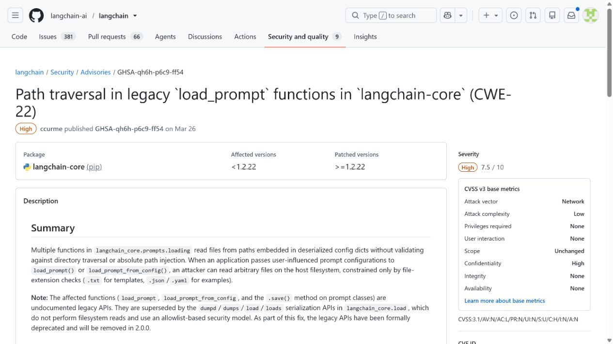
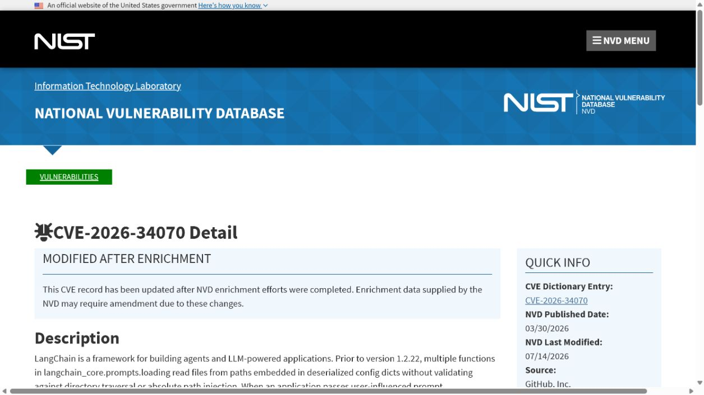
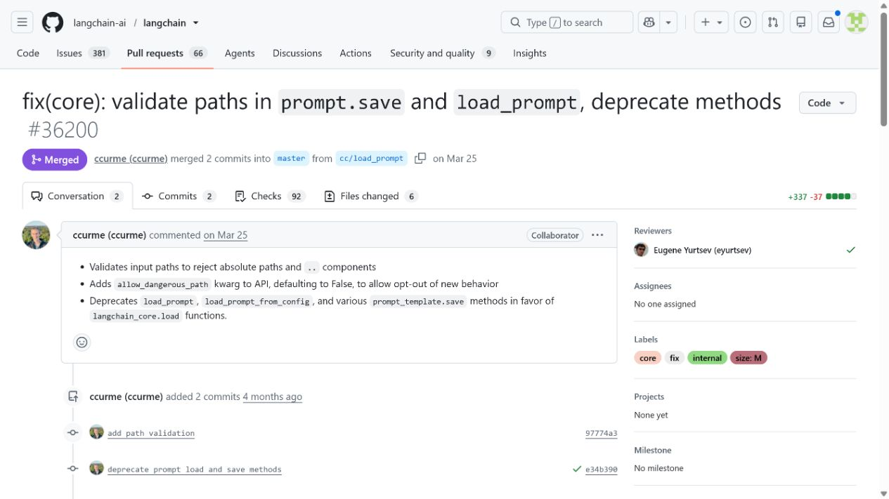
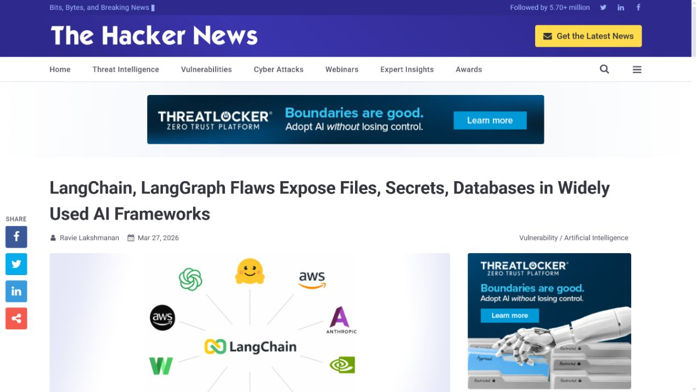
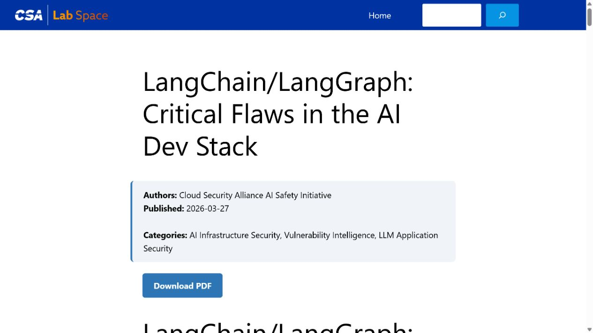

# LangChain Prompt Configuration Path Traversal (2026)
> LangChain Prompt 配置加载路径穿越漏洞

| Field | Value |
|---|---|
| Category | code-vulns |
| Severity | high（GitHub CNA CVSS 3.1：7.5） |
| AI Tool | LangChain prompt loading APIs |
| Language | Python |
| Real Incident | Yes（已公开确认的真实漏洞；不表示已有受害事件） |
| Reproducible | No |
| Disclosed | 2026-03-26 |
| CVE | CVE-2026-34070 |
| CVSS | 7.5 |

## TL;DR / 摘要

Legacy LangChain prompt loaders accepted user-influenced paths embedded in prompt configurations and could read host files outside the expected directory.

LangChain 的缺陷发生在提示词配置与本地文件系统相接的地方。把 prompt 当作数据文件管理时，也必须限制它能够引用的数据范围。

---

## 详细分析 / Full Analysis

### 一、事件概况与公开记录

LangChain 的历史 `load_prompt` 与 `load_prompt_from_config` API 用于读取提示词模板、few-shot 示例和相关配置。它们被低代码应用、实验脚本和服务端接口复用，因此一个看似静态的 prompt 配置可能包含继续读取本地文件的指令。

LangChain 项目公告 GHSA-qh6h-p6c9-ff54、NVD、PR #36200 以及独立安全报道共同记录了 CVE-2026-34070。公告与 NVD 明确受影响版本低于 `langchain-core` 1.2.22；PR 展示了对 `prompt.save` 和 `load_prompt` 的路径校验及旧方法弃用。The Hacker News 与 Cloud Security Alliance 的材料用于补充行业部署影响，不作为版本范围的唯一依据。

### 二、AI 工作流与攻击入口

提示词配置在 AI 应用中既是行为定义，也是数据来源。与普通 JSON 配置不同，LangChain 会继续解析其中的路径并把结果送入模型上下文，使文件读取与模型回答形成一条链路。这个案例说明，配置化并不会自动消除执行或 I/O 风险；对外开放的模板系统也需要输入边界。

外部内容在这些工作流中并不总以“命令”或“程序”的形式出现。模型制品、提示词配置、连接器对象、缓存记录以及 Agent 工具参数往往先被视为普通数据，随后才在框架内部获得文件读取、解释执行或状态写入能力。

### 三、漏洞触发与技术路径

公告列出的 `template_path`、`prefix_path`、`examples` 与 `example_prompt_path` 等字段可以出现在配置中。旧实现没有充分拒绝绝对路径、父目录跳转和符号链接等情形，外部输入便可能让服务读取预期目录之外、但扩展名被允许的文本、JSON 或 YAML 文件。读取内容随后可被组装进提示词或接口返回。

### 四、技术根因

旧版 prompt 加载 API 接受配置中的路径字段，却没有完整处理绝对路径、父目录跳转和符号链接。模板目录这一逻辑边界没有落实到最终文件解析结果，外部配置便可把读取目标指向目录之外。

### 五、利用前提与影响范围

漏洞需要应用把不可信或跨租户的 prompt 配置交给旧 API 处理；仅使用服务端固定模板的部署并不具备同样入口。实际可读取的范围仍受进程权限限制，但 Agent 服务通常需要访问配置、密钥引用或挂载知识文件，因而不能把“只是读取文本”视为低影响问题。

公开记录给出的受影响范围是：Affected langchain-core prompt loading APIs before 1.2.22.

评估具体部署时，应逐项确认相关功能是否启用、是否接收第三方内容或制品、运行账户可访问哪些目录和令牌，以及组件是否已经升级。本文采用 GitHub CNA CVSS 3.1 7.5 High；受影响范围为低于 langchain-core 1.2.22 的相关 prompt 加载 API。

### 六、AI 安全问题分析

服务端排查时要特别留意兼容层和历史 API。很多系统并不直接调用 `load_prompt`，而是在模板市场、工作流编辑器或内部 SDK 中间接使用它。审计应从接收的配置 schema 回溯到最终文件读取点，并检查容器内是否挂载了不应进入提示词服务的配置文件。若业务确实要让用户上传模板，模板内容与可引用资源的 ID 应由服务端分别管理。

### 七、修复与处置

应升级到包含修复的 `langchain-core` 版本，并尽量迁移到不进行文件 I/O 的序列化 API。服务端不应接受任意路径字段，而应通过模板 ID 从受控目录中选择内容；使用容器时只挂载任务所需的只读目录，并避免把长期密钥与模板加载进同一进程视图。

公开材料给出的处置状态为：Upgrade langchain-core to 1.2.22 or later and migrate away from deprecated file-loading APIs.

### 八、部署排查与本地验证

功能测试应覆盖合法的相对模板路径、越界路径、绝对路径和符号链接。期望结果是前者按预期加载，后三者被拒绝或解析为无效配置。日志应记录模板标识而非敏感正文，以便审计来源而不把被读取文件再次泄露到日志系统。

对于可能触发代码执行、文件读取或越权写入的案例，README 不提供可直接复制的攻击载荷。本地验收应检查版本、配置、已注册工具、缓存权限、文件挂载和审计日志，并在隔离测试环境中使用无害边界输入确认修复行为。

PR #36200 的修复说明具有较高信息量：它验证路径、拒绝绝对路径和 `..` 组成，并将相关方法弃用。安全公告、NVD、发布页和该 PR 形成从漏洞记录到代码处置的完整链条。文中不把它泛化为“任意文件读取”，因为实际可访问文件仍受允许后缀和运行进程权限约束。

### 九、证据材料

| 来源 | 类型 | 证明内容 |
|---|---|---|
| LangChain advisory: prompt config path traversal | 项目安全公告 | 说明 legacy load_prompt 路径穿越、受影响 API、评分与 1.2.22 修复版本 |
| NVD: CVE-2026-34070 | 漏洞数据库 | 核验 CVE、7.5 High 评分、文件后缀限制和版本范围 |
| LangChain PR #36200: validate prompt paths | 上游修复 | 展示绝对路径、父目录跳转等路径校验及旧 API 弃用 |
| The Hacker News: LangChain and LangGraph flaws | 独立报道 | 复核 prompt 配置文件读取风险和企业 AI 工作流影响 |
| Cloud Security Alliance research note | 安全研究机构 | 从 AI 框架供应链角度复核该 CVE 与修复版本 |

`assets/` 保存上述五个来源抓取时返回的原始 HTML，以及与同一页面对应的真实浏览器截图。动态网站离线打开时可能缺少外部样式或脚本，但源文件保留服务器返回内容，可用于复核标题、描述、版本和链接。

### 十、结论

LangChain 的缺陷发生在提示词配置与本地文件系统相接的地方。把 prompt 当作数据文件管理时，也必须限制它能够引用的数据范围。

完成版本修复后，仍应保留来源治理、最小权限、任务隔离和结构化授权。这些措施既用于缓解当前漏洞，也能限制后续模型制品、Agent 工具或 AI 框架解析缺陷造成的影响。

### 参考来源

- [LangChain advisory: prompt config path traversal](https://github.com/langchain-ai/langchain/security/advisories/GHSA-qh6h-p6c9-ff54)
- [NVD: CVE-2026-34070](https://nvd.nist.gov/vuln/detail/CVE-2026-34070)
- [LangChain PR #36200: validate prompt paths](https://github.com/langchain-ai/langchain/pull/36200)
- [The Hacker News: LangChain and LangGraph flaws](https://thehackernews.com/2026/03/langchain-langgraph-flaws-expose-files.html)
- [Cloud Security Alliance research note](https://labs.cloudsecurityalliance.org/research/csa-research-note-langchain-langgraph-critical-vulns-framewo/)
