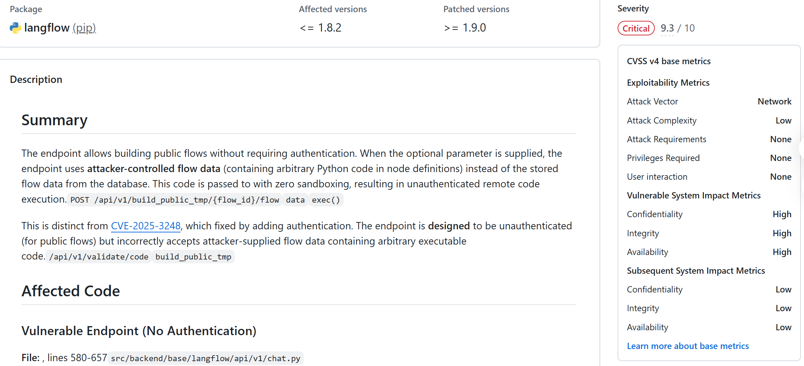
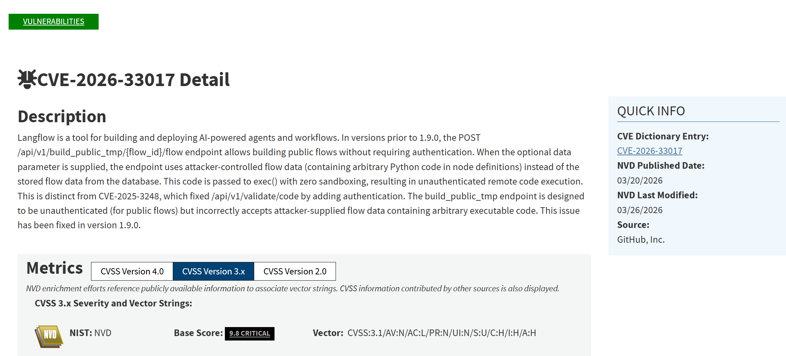
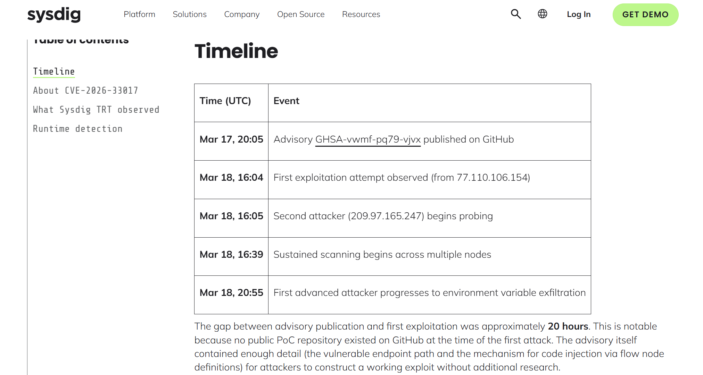

# Langflow Public Flow Build Endpoint RCE (2026)

> Langflow 公共 Flow 构建端点远程代码执行事件

| Field         | Value                                             |
| ------------- | ------------------------------------------------- |
| Category      | Agent Risks                                       |
| Severity      | 🔴 Critical                                        |
| AI Tool       | Langflow, AI workflow builder, AI agent framework |
| Language      | Python                                            |
| Real Incident | ✅                                                 |
| Reproducible  | ✅                                                 |
| Disclosed     | 2026-03-16                                        |
| CVE           | CVE-2026-33017                                    |
| CVSS          | 9.8                                               |

## TL;DR

Langflow public flow build endpoint allowed unauthenticated RCE and was exploited within 20 hours.

> Langflow 公共 Flow 构建端点在未认证情况下接受攻击者控制的工作流数据，并将其中 Python 代码传入无沙箱执行路径，导致远程代码执行；Sysdig 在公告发布约 20 小时后观测到真实利用。

------

## 详细分析 / Full Analysis

# Langflow 公共 Flow 构建端点远程代码执行事件分析：AI 工作流执行链路中的无认证 RCE 与凭据外泄风险

## 基本信息

案例时间：2026 年 3 月
事件对象：Langflow AI 工作流与 Agent 构建平台
涉及组件：`POST /api/v1/build_public_tmp/{flow_id}/flow` 公共 Flow 构建端点
漏洞编号：CVE-2026-33017
漏洞类型：无认证远程代码执行、代码注入、缺失关键函数认证、无沙箱执行
影响版本：Langflow 1.9.0 之前版本
修复版本：Langflow 1.9.0 及之后版本
风险归类：AI Agent 工作流执行风险、无认证 API 暴露、AI 流程节点代码注入、凭据外泄、供应链横向移动
案例定位：本案例可作为团队报告中 AI 代码安全风险从代码生成扩展到 AI 工作流平台、Agent 执行环境、运行时凭据保护和全生命周期治理的补充案例。

## 摘要

2026 年 3 月，Langflow 官方安全公告披露 CVE-2026-33017。该漏洞位于公共 Flow 构建接口 `POST /api/v1/build_public_tmp/{flow_id}/flow`。该接口原本用于允许未认证用户构建公开 Flow，但在接收可选 `data` 参数时，会使用攻击者提供的 Flow 数据替代数据库中已存储的 Flow 数据。攻击者可以在节点定义中嵌入任意 Python 代码，随后该代码进入 Langflow 的图构建与组件实例化流程，并最终传入 `exec()` 无沙箱执行路径，形成无认证远程代码执行。GitHub 官方安全公告将该漏洞评为 Critical，影响版本为 `<= 1.8.2`，修复版本为 `>= 1.9.0`。([GitHub](https://github.com/langflow-ai/langflow/security/advisories/GHSA-vwmf-pq79-vjvx))

NVD 对该漏洞的描述与官方公告一致，并给出 CVSS 3.1 评分 9.8 Critical。NVD 记录显示，漏洞涉及 CWE-94、CWE-95 和 CWE-306，分别对应代码生成控制不当、动态代码执行输入未正确中和，以及关键函数缺失认证。NVD 同时显示该漏洞已进入 CISA Known Exploited Vulnerabilities Catalog，要求相关机构在 2026 年 4 月 8 日前按供应商指导缓解或停用相关产品。([NVD](https://nvd.nist.gov/vuln/detail/CVE-2026-33017))

该漏洞不是停留在理论层面的代码缺陷。Sysdig Threat Research Team 在公告发布后约 20 小时即观测到首次真实利用，攻击者在没有公开 PoC 的情况下，仅根据公告描述构造出可运行 exploit，并开始扫描互联网暴露的 Langflow 实例。Sysdig 后续观察到 6 个不同源 IP 的攻击活动，其中部分攻击链进入环境变量转储、`.env` 文件读取、数据库文件查找、凭据收集和二阶段载荷投递阶段。([Sysdig](https://www.sysdig.com/blog/cve-2026-33017-how-attackers-compromised-langflow-ai-pipelines-in-20-hours))

本案例与 AI 代码安全高度相关。Langflow 是用于构建 AI Agent、RAG 管线和 AI 工作流的开源可视化平台，用户通过拖拽节点和配置 Flow 构建可执行的 AI 应用。该漏洞暴露的问题不只是普通 Web API 缺少认证，而是 AI 工作流平台把用户可控的节点数据直接进入运行时代码执行链路，并且未建立足够沙箱、认证和输入隔离。对于 AI Agent 基础设施而言，Flow 不应被视为普通配置文件，而应被视为可执行程序。

## 一、事件核验与证据边界

本案例的公开证据主要来自四类来源：Langflow 官方 GitHub Security Advisory、NVD、CISA KEV 记录，以及 Sysdig 与 BleepingComputer 对真实利用活动的复核报道。GitHub 官方公告明确给出漏洞位置、影响版本、修复版本、代码执行路径和 PoC 结果；NVD 给出 CVSS 评分、CWE 分类和 CISA KEV 状态；Sysdig 提供真实攻击时间线、攻击源 IP、攻击载荷、凭据外泄行为和 C2 基础设施观察；BleepingComputer 则对 CISA 加入 KEV、主动利用和修复建议进行独立报道。([GitHub](https://github.com/langflow-ai/langflow/security/advisories/GHSA-vwmf-pq79-vjvx))

GitHub 官方公告显示，`build_public_tmp` 端点本身是无认证设计，用于构建公共 Flow。但问题在于该端点错误接受攻击者提供的 `data` 参数，并将其中节点定义传入后端图构建逻辑。攻击者控制的数据经过 `start_flow_build()`、`generate_flow_events()`、`create_graph()`、`Graph.from_payload()`、`instantiate_component()` 等流程后，进入 `eval_custom_component_code()` 和 `prepare_global_scope()`，最终被 `exec(compiled_code, exec_globals)` 执行。该链路不是简单的输入未过滤，而是 AI 工作流平台将用户提供的 Flow 数据视为可信可执行节点定义。([GitHub](https://github.com/langflow-ai/langflow/security/advisories/GHSA-vwmf-pq79-vjvx))

NVD 将该漏洞描述为 Langflow 1.9.0 之前版本中公共 Flow 构建端点错误接受攻击者控制的 Flow 数据，并将其中 Python 代码传入无沙箱 `exec()`，导致无认证远程代码执行。NVD 同时记录 CVSS 3.1 为 9.8，CVSS 4.0 基础评分为 9.3，并显示该漏洞已由 CISA 加入 Known Exploited Vulnerabilities Catalog。([NVD](https://nvd.nist.gov/vuln/detail/CVE-2026-33017))

证据边界需要明确。本案例并非某一企业公开披露的单一数据泄露事故，而是一个已进入 KEV、已被真实扫描和利用的 AI 工作流平台漏洞。Sysdig 的观测证明攻击者已经在互联网环境中利用该漏洞，并进行了系统指纹识别、环境变量读取、`.env` 文件查找和二阶段载荷投递尝试；但公开材料没有给出某个具体企业因此泄露多少条数据或造成多少金额损失。因此，本案例的社会影响应表述为已在野利用、攻击面面向 AI 工作流基础设施、可导致凭据外泄和软件供应链横向移动，而不是写成已确认造成某个固定金额的损失。([Sysdig](https://www.sysdig.com/blog/cve-2026-33017-how-attackers-compromised-langflow-ai-pipelines-in-20-hours))

## 二、系统背景与触发条件

Langflow 是面向 AI Agent、RAG 管线和 LLM 工作流的开源可视化平台。它允许用户通过拖拽方式连接节点，构建可运行的 AI 工作流，同时提供 REST API 供程序化构建和执行 Flow。Sysdig 指出，Langflow 在 GitHub 上拥有 145,000+ stars，广泛用于 AI 工作流与 RAG 管线构建，因此其互联网暴露实例具备较高攻击价值。([Sysdig](https://www.sysdig.com/blog/cve-2026-33017-how-attackers-compromised-langflow-ai-pipelines-in-20-hours))

漏洞触发点是公共 Flow 构建端点。该端点设计上允许未认证用户构建公开 Flow，这本身并不必然构成漏洞；问题在于端点在请求体中接受可选 `data` 参数，并在 `data` 存在时使用攻击者提供的 Flow 数据，而不是只使用数据库中已存储、已授权、已发布的 Flow 数据。攻击者因此可以构造包含恶意 Python 节点定义的请求，直接触发后端图构建流程。([GitHub](https://github.com/langflow-ai/langflow/security/advisories/GHSA-vwmf-pq79-vjvx))

该漏洞具有典型 AI 工作流平台特征。普通 Web 应用中的公开接口通常只处理数据读取或简单业务逻辑，而 AI 工作流平台中的 Flow 数据本身包含节点类型、组件定义、参数、代码片段和执行逻辑。若平台没有区分普通配置与可执行工作流定义，攻击者提供的 Flow 数据就可能转化为运行时代码。该问题说明，在 AI Agent 平台中，工作流文件、节点定义和低代码配置都应被视为潜在代码，而不能仅作为业务数据处理。

## 三、攻击过程与在野利用

Sysdig 的观测显示，CVE-2026-33017 的利用窗口非常短。GitHub 安全公告在 2026 年 3 月 17 日 20:05 UTC 发布；2026 年 3 月 18 日 16:04 UTC，Sysdig 即在蜜罐中观察到首次利用尝试，间隔约 20 小时。Sysdig 明确指出，当时 GitHub 上还没有公开 PoC 仓库，攻击者仅凭公告中的端点路径和代码注入机制，即构造出可运行 exploit 并开始扫描互联网。([Sysdig](https://www.sysdig.com/blog/cve-2026-33017-how-attackers-compromised-langflow-ai-pipelines-in-20-hours))

早期攻击主要表现为自动化扫描。Sysdig 在 48 小时内记录了来自 6 个不同源 IP 的利用事件，其中最早一批请求使用类似 nuclei 的扫描特征，并通过执行 `id` 命令、Base64 编码输出和回连 interactsh / OAST 域名来确认代码执行。随后出现自定义 Python 脚本攻击者，开始执行 `ls -al /root`、`cat /etc/passwd`、查找应用目录和投递二阶段脚本。进一步攻击活动包括执行 `env` 获取环境变量、搜索 `.env` 和数据库文件、读取敏感配置，并将数据回传到外部 C2。([Sysdig](https://www.sysdig.com/blog/cve-2026-33017-how-attackers-compromised-langflow-ai-pipelines-in-20-hours))

BleepingComputer 后续报道称，CISA 已将 CVE-2026-33017 加入 KEV，并要求相关机构在 2026 年 4 月 8 日前应用更新、采取缓解措施或停止使用该产品。报道同时指出，该漏洞可通过单个特制 HTTP 请求触发，影响 Langflow 1.8.1 及更早版本，并可执行任意 Python 代码。([BleepingComputer](https://www.bleepingcomputer.com/news/security/cisa-new-langflow-flaw-actively-exploited-to-hijack-ai-workflows/))

该攻击链与传统 RCE 相比具有更强的 AI 基础设施特征。Langflow 实例通常连接模型 API、向量数据库、数据源、云服务和内部知识库。Sysdig 指出，Langflow 实例中可能配置 OpenAI、Anthropic、AWS、数据库连接等凭据，一旦实例被攻陷，攻击者不仅能控制单台服务器，还可能获取 API Key、数据库凭证和云 token，从而触发后续数据访问和供应链横向移动。([Sysdig](https://www.sysdig.com/blog/cve-2026-33017-how-attackers-compromised-langflow-ai-pipelines-in-20-hours))

## 四、技术根因分析

CVE-2026-33017 的直接技术根因是无认证公共端点接受攻击者控制的可执行 Flow 数据，并将其传入无沙箱执行路径。该问题由三个安全边界同时失效构成。

首先，公共端点缺少对关键功能的认证约束。`build_public_tmp` 被设计为允许未认证用户构建公共 Flow，但该功能本身已经涉及工作流构建和组件实例化，应属于高风险执行路径。GitHub 公告明确对比了该端点与经过认证的 build endpoint，指出前者缺少 `Depends(get_current_active_user)` 等认证约束。([GitHub](https://github.com/langflow-ai/langflow/security/advisories/GHSA-vwmf-pq79-vjvx))

端点错误接受攻击者控制的 `data` 参数。公共 Flow 的合理执行路径应当只执行数据库中已发布、已授权的 Flow 数据，而不应允许外部请求覆盖 Flow 定义。GitHub 公告的推荐修复即明确要求移除 `data` 参数，公共 Flow 应只使用存储数据，不能执行攻击者提供的数据。([GitHub](https://github.com/langflow-ai/langflow/security/advisories/GHSA-vwmf-pq79-vjvx))

Langflow 的组件实例化链路存在无沙箱 `exec()`。攻击者控制的节点定义经过图构建和组件加载流程后，最终进入 `prepare_global_scope()`，并被 `exec(compiled_code, exec_globals)` 执行。由于执行环境允许导入模块，攻击者可以执行系统命令、读取文件、访问环境变量并发起外联请求。GitHub 官方公告中的影响描述包括完整服务器接管、任意文件读写、命令执行、环境变量外泄、反连 shell、横向移动，以及对 Flow、消息和数据库中存储凭据的数据外泄。([GitHub](https://github.com/langflow-ai/langflow/security/advisories/GHSA-vwmf-pq79-vjvx))

该根因说明，AI 工作流平台中的节点定义和 Flow 数据不能按普通 JSON 配置处理。只要工作流节点支持自定义代码、动态组件或模型工具调用，Flow 数据就具备代码属性。将攻击者提供的 Flow 数据传入构建链路，相当于允许攻击者上传一段可执行程序。该问题与传统代码注入类似，但发生在 AI 工作流运行时，而不是普通 Web 表单或模板引擎。

## 五、AI 参与证据与责任边界

本案例与 AI 的关联来自系统对象本身，而不是 AI 生成代码署名。Langflow 是用于构建和部署 AI-powered agents and workflows 的平台，NVD 对 CVE-2026-33017 的描述也明确将 Langflow 定义为构建和部署 AI Agent 与工作流的工具。该漏洞影响的是 AI 工作流的公共构建端点，攻击者注入的是工作流节点中的可执行 Python 代码。([NVD](https://nvd.nist.gov/vuln/detail/CVE-2026-33017))

该案例不应表述为某个大模型直接生成了漏洞代码。公开证据没有显示漏洞由 Claude、GPT、Copilot 或其他模型生成。更准确的归类是 AI Agent 基础设施漏洞。它说明，当 AI 应用平台提供低代码节点、公共 Flow、REST API、模型工具调用和运行时执行能力时，平台本身成为 AI 安全边界的一部分。

Langflow 官方公告确认漏洞存在并给出修复版本，NVD 和 CISA 记录确认其严重程度和在野利用状态；Sysdig 则提供真实利用观测。报告应将责任归结为公共执行端点设计、可执行 Flow 数据处理和无沙箱运行时隔离不足，而不是将其泛化为 AI 模型不可控或用户使用不当。([GitHub](https://github.com/langflow-ai/langflow/security/advisories/GHSA-vwmf-pq79-vjvx))

## 六、与团队技术报告风险框架的关系

团队报告强调，AI 代码生成已经从局部补全扩展到覆盖开发全生命周期的智能化生态系统，风险不再只发生在代码片段中，而会延伸到工具链、开发流程、运行环境和组织治理。Langflow 事件可补充该框架中的 AI 工作流执行风险：平台本身不是普通 Web 应用，而是 AI Agent、RAG 管线、模型调用和数据源连接的运行底座。

该案例首先补充了 AI 代码安全中的运行时执行边界问题。团队报告关注 AI 生成代码可能带来的漏洞注入和上下文理解不足，而 Langflow 事件说明，即便不是由 AI 生成的代码，AI 应用平台中的工作流定义、节点配置和自定义代码也需要进入同一套安全治理。对 AI Agent 平台而言，Flow 文件、节点参数和低代码配置都可能变成代码执行入口。

该案例补充了供应链边界重塑问题。Langflow 实例通常连接模型 API、数据库、云服务、内部知识库和外部工具。Sysdig 观测到攻击者利用漏洞后尝试读取 `.env` 文件、转储环境变量并寻找数据库文件，说明 AI 工作流平台被攻陷后可能成为进入企业数据系统和云账户的跳板。([Sysdig](https://www.sysdig.com/blog/cve-2026-33017-how-attackers-compromised-langflow-ai-pipelines-in-20-hours)) 这与团队报告中风险从代码本体外溢到软件供应链和组织治理的判断一致。

该案例也补充了人机协同治理中的发布与暴露控制问题。Langflow 提供低代码方式构建 AI 工作流，降低了部署门槛，也使数据科学团队、业务团队或原型团队更容易把实验环境暴露到公网。Sysdig 明确建议组织不要将 Langflow 直接暴露到互联网，并要求监控异常外联、轮换 API Key、数据库凭据和云密钥。([Sysdig](https://www.sysdig.com/blog/cve-2026-33017-how-attackers-compromised-langflow-ai-pipelines-in-20-hours)) 这说明 AI 工具的安全治理不能只落在代码审查上，还必须覆盖资产盘点、网络暴露面、运行时监控和凭据轮换。

## 七、损失影响与社会后果

CVE-2026-33017 的直接影响是无认证远程代码执行。攻击者无需账号、无需用户交互，只需构造一个 HTTP 请求，即可在暴露的 Langflow 实例上执行任意 Python 代码。NVD 给出 CVSS 3.1 9.8，影响机密性、完整性和可用性。([NVD](https://nvd.nist.gov/vuln/detail/CVE-2026-33017))

Sysdig 的在野观测表明，攻击者已经将漏洞用于真实环境中的侦察和凭据收集。攻击活动包括执行 `id`、读取 `/etc/passwd`、枚举应用目录、查找 `.env` 文件、转储环境变量、寻找数据库文件，以及尝试投递二阶段 payload。Sysdig 明确指出，外泄信息包括 keys 和 credentials，可能提供对连接数据库的访问并造成软件供应链 compromise。([Sysdig](https://www.sysdig.com/blog/cve-2026-33017-how-attackers-compromised-langflow-ai-pipelines-in-20-hours))

该影响对 AI 基础设施尤其严重。Langflow 往往承载模型 API Key、向量数据库连接、云凭据、企业知识库接口、RAG 数据源和工作流运行记录。攻击者一旦控制 Langflow 实例，可能不只获得服务器权限，还可能通过 API Key 和数据库凭据访问企业内部数据，修改 AI 工作流行为，窃取对话历史或利用 Agent 流程进行后续横向移动。BleepingComputer 报道也强调，Langflow 作为 AI 工作流构建平台具有广泛采用度，因此成为攻击者高价值目标。([BleepingComputer](https://www.bleepingcomputer.com/news/security/cisa-new-langflow-flaw-actively-exploited-to-hijack-ai-workflows/))

本案例已经产生明确社会安全影响。CISA 将其加入 KEV，说明美国政府机构已将其视为已知在野利用漏洞；Sysdig 在真实蜜罐中观察到攻击者利用并进入凭据收集阶段；BleepingComputer 报道 CISA 要求相关机构限期修复或停用产品。([NVD](https://nvd.nist.gov/vuln/detail/CVE-2026-33017)) 虽然公开资料没有给出具体受害企业损失金额，但该漏洞已经从安全公告进入真实攻击活动，并对暴露的 AI 工作流基础设施构成直接威胁。

## 八、治理建议

Langflow 事件的治理重点不是单纯升级某个版本，而是把 AI 工作流平台作为高风险执行基础设施进行管理。所有连接模型、数据库、云服务和内部知识库的 AI 工作流平台，都应纳入生产系统资产清单、漏洞管理和运行时监控。

首先，应立即升级至 Langflow 1.9.0 或更高版本。对无法立即升级的环境，应限制或关闭 `build_public_tmp` 等公共构建端点，禁止公网直接访问 Langflow 管理面和 API 面。NVD 和 BleepingComputer 均给出修复版本和限制暴露面的建议。([NVD](https://nvd.nist.gov/vuln/detail/CVE-2026-33017))

应对 Langflow 实例实施强制认证与网络隔离。即使某些 Flow 需要公开访问，工作流构建、节点加载、API 配置、凭据管理和自定义代码执行等功能也不应暴露给匿名访问者。对于企业环境，应通过反向代理、VPN、零信任访问网关或 API gateway 限制入口，并记录所有构建和执行请求。

对 AI 工作流中的可执行节点实施沙箱。任何自定义 Python 代码、动态组件、外部工具调用和 MCP / Agent 工具连接，都应在受限容器、低权限用户、只读文件系统、出站网络限制和资源配额下运行。无沙箱 `exec()` 不应出现在未认证路径，也不应处理攻击者提供的工作流数据。

轮换可能暴露的凭据。对于曾运行受影响版本且暴露到公网的 Langflow 实例，应视为已可能被访问，检查访问日志、出站连接、进程创建、`.env` 文件访问和异常 DNS / OAST 回连。Sysdig 建议在发现可疑活动时轮换 API Key、数据库凭据和云密钥。([Sysdig](https://www.sysdig.com/blog/cve-2026-33017-how-attackers-compromised-langflow-ai-pipelines-in-20-hours))

最后，应建立 AI 工作流平台专项评测基准。团队报告提出建立多维度安全评测基准；在 AI Agent 平台场景中，该基准应覆盖公共 Flow 构建、节点注入、自定义代码执行、工具调用、凭据读取、环境变量泄露、外联请求和工作流供应链污染。评测目标不应只验证功能是否可用，而应验证攻击者是否能通过 Flow 数据控制运行时执行。

## 九、结论

Langflow CVE-2026-33017 是 2026 年 AI 工作流平台安全风险中的代表性案例。漏洞根因在于公共 Flow 构建端点在无认证情况下接受攻击者控制的 Flow 数据，并将其中 Python 节点代码传入无沙箱 `exec()` 执行路径。该漏洞被评为 Critical，NVD CVSS 3.1 评分为 9.8，并已被 CISA 加入 Known Exploited Vulnerabilities Catalog。([NVD](https://nvd.nist.gov/vuln/detail/CVE-2026-33017))

该漏洞的现实危险性已由 Sysdig 在野观测验证。攻击者在公告发布约 20 小时后即构造出可运行 exploit，并在没有公开 PoC 的情况下开始扫描互联网暴露实例。后续攻击活动进入系统侦察、环境变量转储、`.env` 文件读取、数据库文件查找、凭据外泄和二阶段载荷投递阶段。([Sysdig](https://www.sysdig.com/blog/cve-2026-33017-how-attackers-compromised-langflow-ai-pipelines-in-20-hours))

本案例对 AI 代码安全研究的补充价值在于，它将风险从 AI 生成代码扩展到 AI 工作流运行时。Langflow 不是普通 Web 应用，而是连接模型、工具、数据库、云服务和内部知识库的 AI Agent 基础设施。此类平台中的 Flow 数据、节点配置和低代码组件都可能具有代码属性，必须被纳入代码执行、权限隔离和供应链治理框架。

## 参考来源

1. GitHub Security Advisory，Unauthenticated Remote Code Execution in Langflow via Public Flow Build Endpoint。用于核验漏洞根因、影响版本、修复版本、代码执行链路和官方 PoC。([GitHub](https://github.com/langflow-ai/langflow/security/advisories/GHSA-vwmf-pq79-vjvx))
2. NVD，CVE-2026-33017。用于核验 CVSS 9.8、CWE-94 / CWE-95 / CWE-306、CISA KEV 状态和修复版本。([NVD](https://nvd.nist.gov/vuln/detail/CVE-2026-33017))
3. Sysdig，CVE-2026-33017: How attackers compromised Langflow AI pipelines in 20 hours。用于核验公告后 20 小时在野利用、6 个源 IP、凭据收集、`.env` 文件读取、二阶段载荷投递和 C2 观测。([Sysdig](https://www.sysdig.com/blog/cve-2026-33017-how-attackers-compromised-langflow-ai-pipelines-in-20-hours))
4. BleepingComputer，CISA: New Langflow flaw actively exploited to hijack AI workflows。用于核验 CISA KEV 加入、修复期限、漏洞影响版本和安全建议。([BleepingComputer](https://www.bleepingcomputer.com/news/security/cisa-new-langflow-flaw-actively-exploited-to-hijack-ai-workflows/))