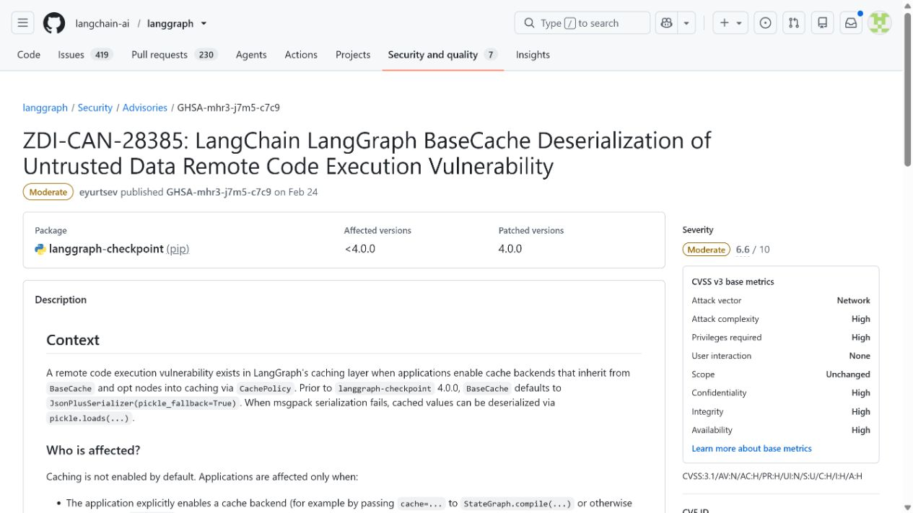
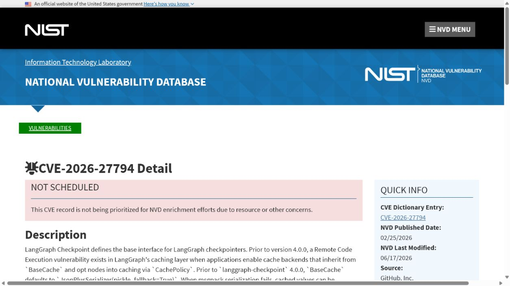
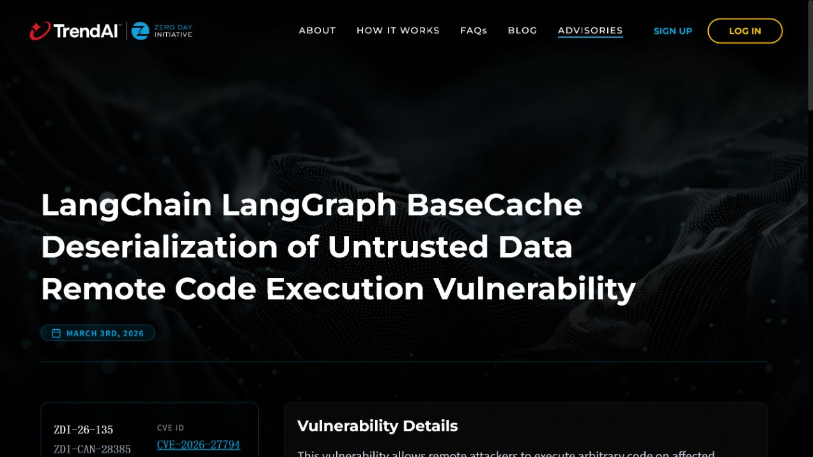
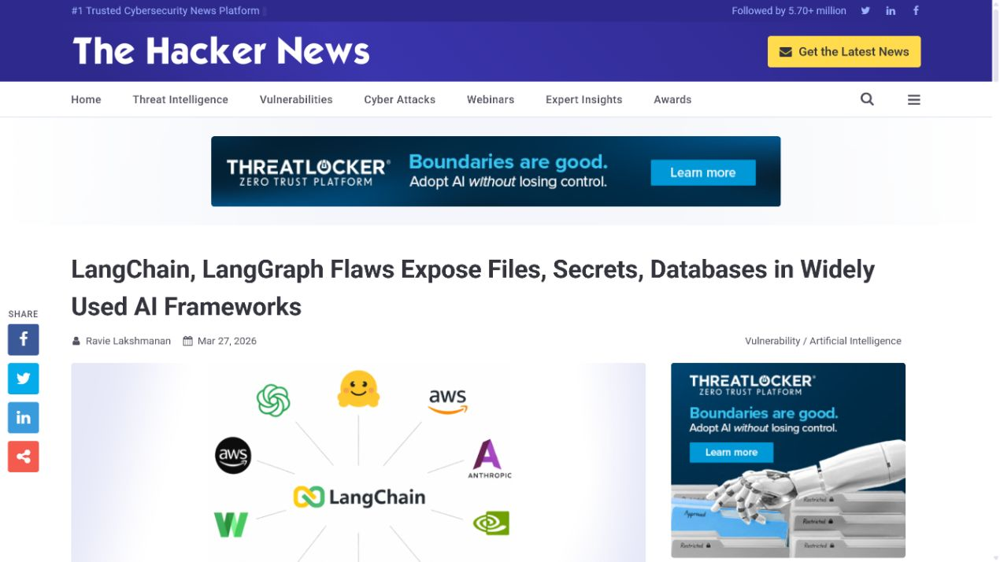
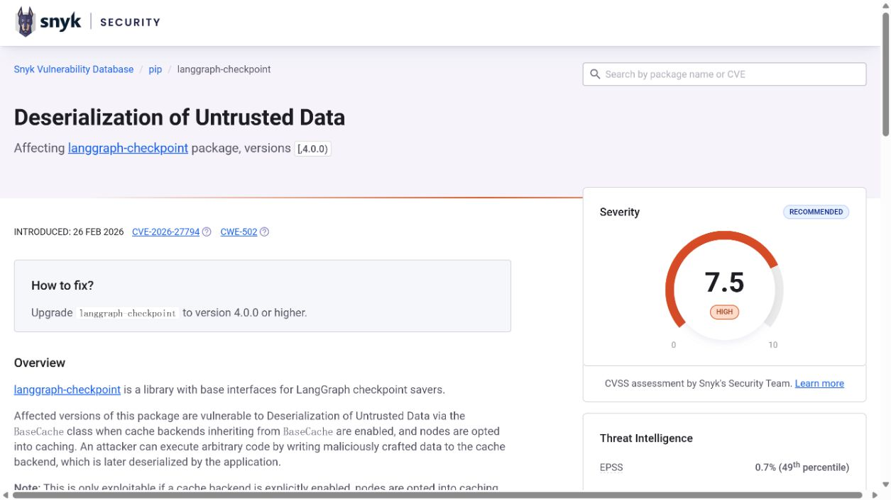

# LangGraph Cache Deserialization Remote Code Execution (2026)
> LangGraph Agent 缓存反序列化远程代码执行漏洞

| Field | Value |
|---|---|
| Category | agent-risk |
| Severity | medium（GitHub CNA CVSS 3.1：6.6） |
| AI Tool | LangGraph agent caching and checkpointing |
| Language | Python |
| Real Incident | Yes（已公开确认的真实漏洞；不表示已有受害事件） |
| Reproducible | No |
| Disclosed | 2026-02-25 |
| CVE | CVE-2026-27794 |
| CVSS | 6.6 |

## TL;DR / 摘要

A writable LangGraph cache could supply bytes that the framework deserialized with pickle fallback, escalating cache compromise into application-runtime code execution.

LangGraph 案例的核心不是缓存“泄露”，而是缓存被改写后能够改变 Agent 的执行。状态完整性与模型输入完整性同样重要。

---

## 详细分析 / Full Analysis

### 一、事件概况与公开记录

LangGraph 用缓存和检查点保存长流程 Agent 的节点结果，以支持重试、恢复和跨步骤复用。实际部署常把这些数据放入 Redis、数据库或共享卷，缓存因此不只是性能组件，而是会参与 Agent 后续执行的数据通道。

LangGraph 项目安全公告、NVD、ZDI-26-135、Snyk 与独立报道对 CVE-2026-27794 的核心描述相互对应：问题位于 BaseCache 的 pickle fallback，修复版本为 `langgraph-checkpoint` 4.0.0。公告同时列出三个必要条件，即显式启用缓存、节点采用 CachePolicy，以及攻击者能够写入缓存后端。

### 二、AI 工作流与攻击入口

长任务 Agent 的状态比普通 Web 会话更复杂，往往包含工具结果、检索上下文和中间决策。缓存一旦被当成可信内部数据，攻击者就能绕过最初的输入校验，在恢复流程中获得新的执行机会。该案特别适合提醒团队把 Agent 状态后端当作完整性敏感资产，而不是可随意写入的临时存储。

外部内容在这些工作流中并不总以“命令”或“程序”的形式出现。模型制品、提示词配置、连接器对象、缓存记录以及 Agent 工具参数往往先被视为普通数据，随后才在框架内部获得文件读取、解释执行或状态写入能力。

### 三、漏洞触发与技术路径

在启用节点缓存策略时，框架需要把结果编码后写入后端。受影响逻辑在正常序列化失败时可能退回到 pickle，并在读取缓存时对字节反序列化。攻击者若已拥有缓存写权限，便能置入精心构造的数据，使下一次命中缓存的 Agent 进程执行代码；这是一条从状态存储完整性失守到应用运行时执行的升级路径。

### 四、技术根因

BaseCache 在常规序列化失败后回退到 pickle，并在缓存命中时自动反序列化。这个兼容性分支把缓存写权限升级成了代码执行条件；问题并非缓存本身，而是消费者把可写状态存储中的类型标记和字节内容当成可信对象。

### 五、利用前提与影响范围

前提是攻击者能够写入目标缓存，或能借助另一个已失陷服务写入相同后端。因此它不等同于一个默认未认证的网络入口。共享 Redis、弱认证、跨租户键空间和把缓存暴露给多个作业的设计都会提高风险；影响范围取决于消费该缓存的 Agent 服务权限。

公开记录给出的受影响范围是：LangGraph checkpoint cache implementations using the unsafe serialization fallback before 4.0.0.

评估具体部署时，应逐项确认相关功能是否启用、是否接收第三方内容或制品、运行账户可访问哪些目录和令牌，以及组件是否已经升级。本文采用 GitHub CNA CVSS 3.1 6.6 Medium；Snyk 给出 7.5，但项目公告明确要求攻击者已能写入缓存，因此正文保留这一高权限前提。

### 六、AI 安全问题分析

缓存排查可以先回答三个问题：缓存后端是否被网络访问，谁拥有写权限，以及键空间是否与其他服务或租户共享。只有把这三个答案与 LangGraph 的缓存策略一起看，才能判断 CVE 前提是否满足。对于使用 SQLite 文件缓存的部署，还应检查共享卷、备份恢复脚本和文件权限，因为写入能力未必来自网络 Redis。

### 七、修复与处置

升级到 `langgraph-checkpoint` 4.0.0 或项目指定的后续修复版本，并清除或重新生成由旧版本写入的不可信缓存。缓存后端应按应用和租户分隔凭据、限制写权限、启用网络访问控制；对于无法保证完整性的存储，不应保存需要反序列化的对象。

公开材料给出的处置状态为：Upgrade langgraph-checkpoint to 4.0.0 or later and discard cache entries written by untrusted principals.

### 八、部署排查与本地验证

验证应检查修复后序列化格式和回退行为，并对旧缓存设定失效策略。可以在隔离环境中写入无害的异常字节，确认读取端报告错误而不是尝试 pickle 还原。还要核查 Redis 或数据库账户是否仍被开发脚本、调试容器和多租户服务共用。

对于可能触发代码执行、文件读取或越权写入的案例，README 不提供可直接复制的攻击载荷。本地验收应检查版本、配置、已注册工具、缓存权限、文件挂载和审计日志，并在隔离测试环境中使用无害边界输入确认修复行为。

ZDI、项目公告和 NVD 对 pickle fallback 与 BaseCache 的描述相互支持，Snyk 复核受影响包和 4.0.0 修复版本。材料明确写出“攻击者能写入缓存”且应用已经启用缓存策略的前提，因而本文把它定位为已有缓存访问后的权限扩大链，而不是默认开放的网络入口。

### 九、证据材料

| 来源 | 类型 | 证明内容 |
|---|---|---|
| LangGraph advisory: unsafe cache deserialization | 项目安全公告 | 说明 pickle fallback、缓存启用条件、写缓存前提和 4.0.0 修复 |
| NVD: CVE-2026-27794 | 漏洞数据库 | 核验 CVE、6.6 Medium 评分及攻击者需写入缓存的限制 |
| ZDI-26-135: LangGraph cache deserialization | 漏洞研究机构 | 独立复核 BaseCache 反序列化路径与代码执行结果 |
| The Hacker News: LangChain and LangGraph flaws | 独立报道 | 补充 LangGraph 状态存储在 AI Agent 部署中的现实位置 |
| Snyk: CVE-2026-27794 | 独立漏洞库 | 复核受影响包、修复版本，并展示 Snyk 自有 7.5 评分 |

`assets/` 保存上述五个来源抓取时返回的原始 HTML，以及与同一页面对应的真实浏览器截图。动态网站离线打开时可能缺少外部样式或脚本，但源文件保留服务器返回内容，可用于复核标题、描述、版本和链接。

### 十、结论

LangGraph 案例的核心不是缓存“泄露”，而是缓存被改写后能够改变 Agent 的执行。状态完整性与模型输入完整性同样重要。

完成版本修复后，仍应保留来源治理、最小权限、任务隔离和结构化授权。这些措施既用于缓解当前漏洞，也能限制后续模型制品、Agent 工具或 AI 框架解析缺陷造成的影响。

### 参考来源

- [LangGraph advisory: unsafe cache deserialization](https://github.com/langchain-ai/langgraph/security/advisories/GHSA-mhr3-j7m5-c7c9)
- [NVD: CVE-2026-27794](https://nvd.nist.gov/vuln/detail/CVE-2026-27794)
- [ZDI-26-135: LangGraph cache deserialization](https://www.zerodayinitiative.com/advisories/ZDI-26-135/)
- [The Hacker News: LangChain and LangGraph flaws](https://thehackernews.com/2026/03/langchain-langgraph-flaws-expose-files.html)
- [Snyk: CVE-2026-27794](https://security.snyk.io/vuln/SNYK-PYTHON-LANGGRAPHCHECKPOINT-15353408)
