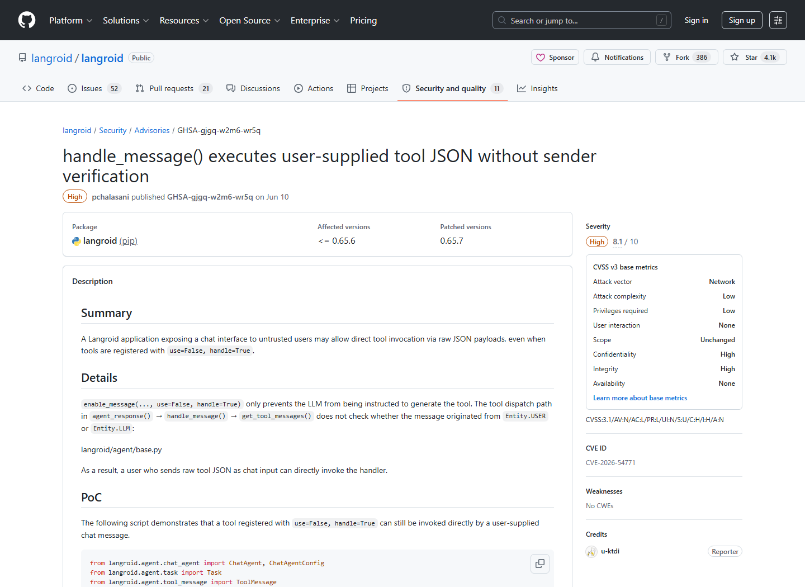
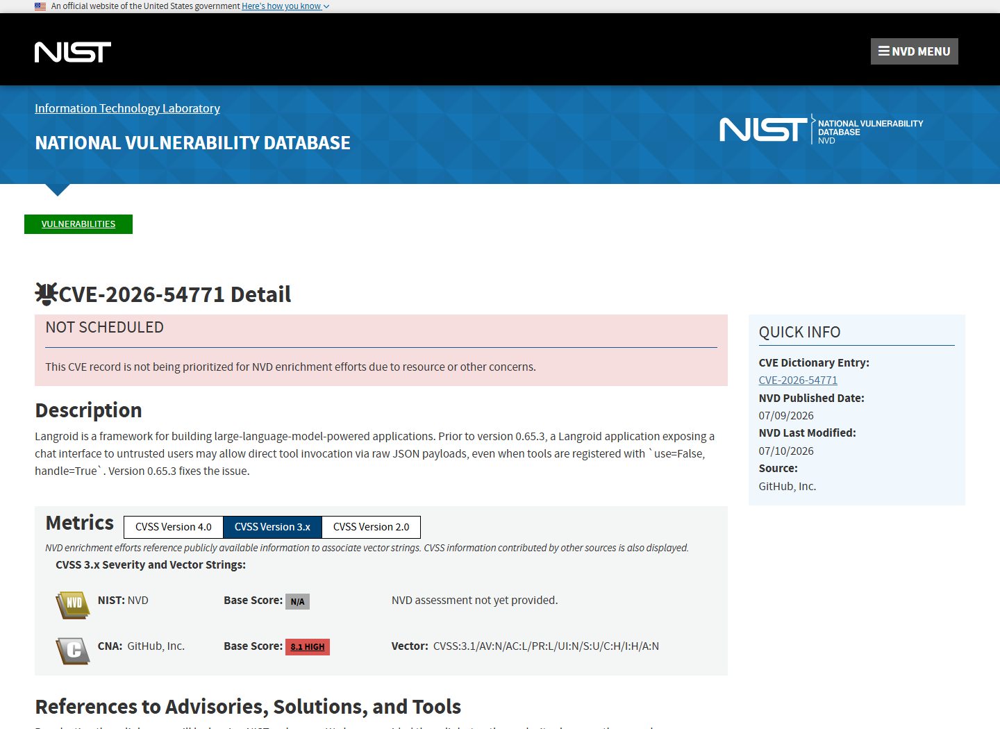
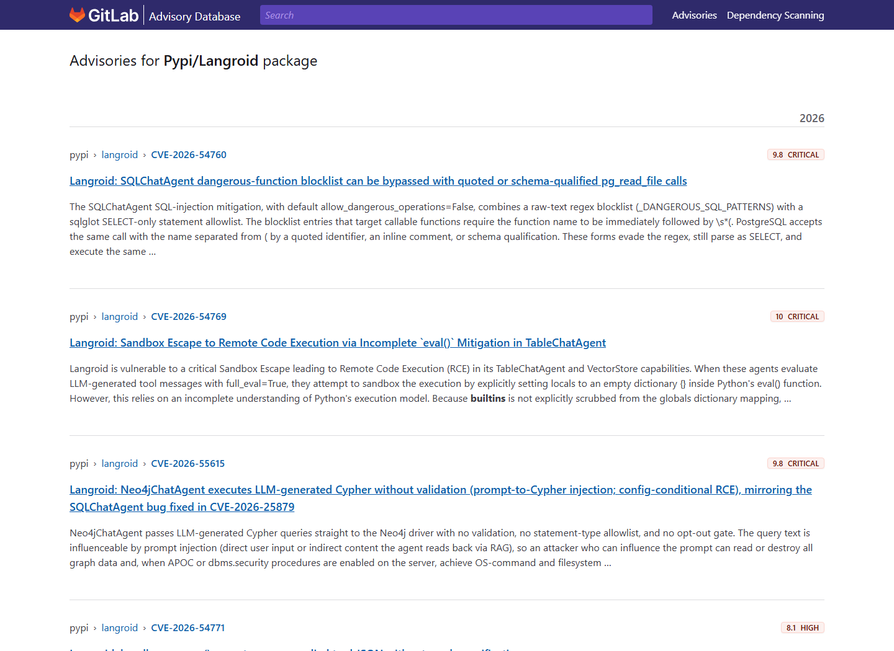
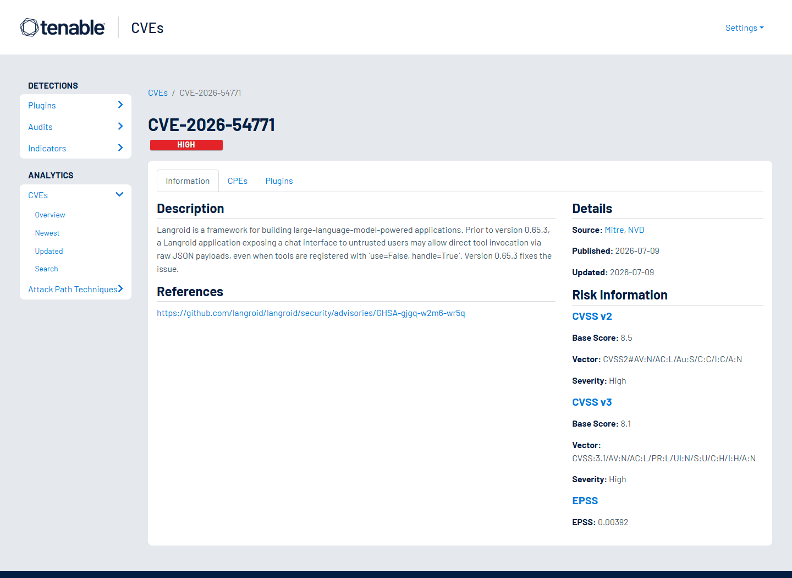
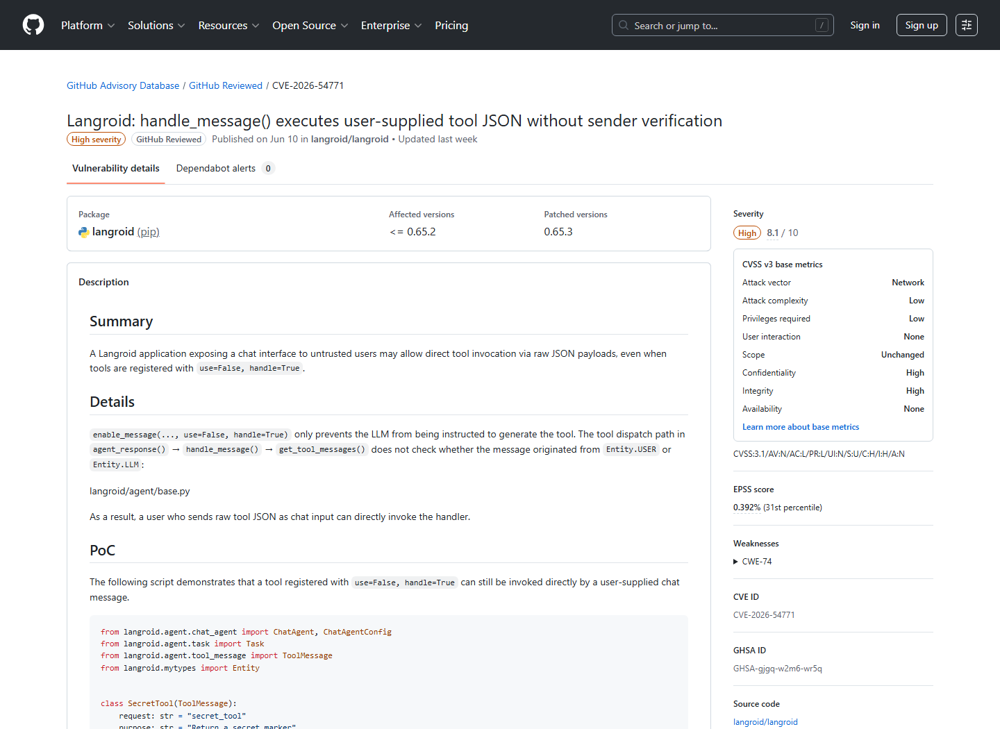

# Langroid Raw Tool Invocation Origin Authorization Bypass (2026)
> Langroid 原始工具调用来源授权绕过

| Field | Value |
|---|---|
| Category | Agent Risks |
| Severity | High |
| AI Tool | Langroid, ToolMessage, Multi-agent chat |
| Language | Python / JSON |
| Real Incident | Yes |
| Reproducible | Yes |
| Disclosed | 2026-07-06 |
| CVE | CVE-2026-54771 |
| CVSS | 8.1 |

## TL;DR
Langroid dispatched user-supplied JSON as a registered tool message without first confirming that it came from an authorized tool-producing agent, bypassing use=False restrictions.
> Langroid 会把用户提交的工具形 JSON 交给已注册处理器，却未先确认消息是否来自获准生成工具调用的 Agent，使 use=False 的限制被绕过。

---

## 详细分析 / Full Analysis

## 一、基本信息与事件概况

Langroid 是用于构建 LLM 应用和多 Agent 协作流程的 Python 框架。CVE-2026-54771 影响 0.65.3 之前的版本：当应用向不可信用户开放聊天接口时，用户可以直接发送符合 ToolMessage 结构的原始 JSON。框架的 handle_message() 会识别消息类型并调用对应处理器，但旧逻辑没有先验证消息发送方是否具备生成该工具调用的资格。

在常见的 use=False、handle=True 配置下，开发者可能认为工具不会暴露给模型或用户，但 handle 为真时框架仍保留本地处理器。攻击者只要掌握工具消息格式，就可以跳过模型决策，直接把 JSON 交给处理器。具体影响取决于工具能力，可能包括读取敏感数据、修改应用状态或执行高权限业务操作。

## 二、事件经过与公开材料

Langroid 项目于 2026 年 7 月 6 日发布 GHSA-gjgq-w2m6-wr5q，CVE 记录随后以 CVE-2026-54771 收录。公告将 0.65.3 列为修复版本，并给出“用户提交工具 JSON 未验证发送方”的具体说明。GitHub Advisory Database、NVD、GitLab Advisory Database 和 Tenable 都采用相同的漏洞摘要和影响范围。

项目后来在 0.65.7 中继续加固工具来源标记，处理多 Agent 转发不可信内容时可能发生的来源“洗白”。这一后续变化说明工具来源不是单个入口的字符串检查，而需要在消息被包装、转发和重新标记时持续保留不信任状态。本文的主记录仍以 CVE-2026-54771 和 0.65.3 修复为准，不把后续加固自动并入同一 CVE 的影响范围。

### 证据矩阵

| 来源 | 类型 | 证明内容 |
|---|---|---|
| Langroid Advisory: GHSA-gjgq-w2m6-wr5q | 项目公告 | 原始 JSON 工具调用、缺少发送方验证和 0.65.3 修复 |
| GitHub Advisory Database: GHSA-gjgq-w2m6-wr5q | 安全公告 | CVE 映射、CVSS 8.1、影响包和修复版本 |
| NVD: CVE-2026-54771 | 漏洞数据库 | CVE 状态、漏洞描述和外部参考 |
| GitLab Advisory Database: Langroid | 依赖库公告 | Langroid 2026 年安全条目及 CVE-2026-54771 摘要 |
| Tenable: CVE-2026-54771 | 独立复核 | 高危评分、攻击前提和修复版本 |
| Langroid Changelog | 版本记录 | 0.65.3 初始修复与 0.65.7 来源传播加固背景 |

## 三、系统背景与触发条件

Agent 框架通常把模型输出中的结构化 JSON 解析为工具调用。为了区分“模型可以选择的工具”和“框架内部可以处理的消息”，Langroid 提供 use 与 handle 等配置。use=False 可以避免某个工具出现在模型可用工具列表中，handle=True 则让 Agent 仍能处理相应 ToolMessage。这种设计适合内部控制消息，但前提是框架可靠区分消息来源。

在多 Agent 系统中，文本和工具消息会在用户、LLM、任务协调器和其他 Agent 之间流动。仅靠 JSON 的形状判断消息类型，会把数据格式误当成身份凭证。攻击者无需让模型被提示注入，只要直接构造结构化消息，就可能进入原本面向受信 Agent 的处理分支。

## 四、攻击链路或失效过程

攻击者以普通聊天参与者身份连接应用，并提交一个与目标工具 schema 相符的 JSON 对象。Langroid 解析内容后识别出已注册的 ToolMessage 类型。旧版 handle_message() 检查该工具可被处理，却没有确认消息是否由获准调用工具的 Agent 产生，于是直接执行对应 handler。use=False 并不能阻止这一过程，因为它只控制工具是否提供给 LLM 使用。

后续影响完全取决于 handler。若工具用于读取数据库、发送邮件、修改任务状态或访问外部 API，攻击者就可能获得与该工具相同的业务能力。攻击不依赖模型产生特定回答，也不需要传统代码注入；它利用的是 Agent 协议层把“声明自己是工具消息”误认为“有权调用工具”。

## 五、技术根因与 AI 风险分析

根因是工具消息的类型验证与来源授权混在一起。结构正确只能证明输入可以被解析，不能证明发送者有权请求该动作。框架在 dispatch 前必须同时检查工具是否启用、当前会话角色、消息来源和跨 Agent 转发过程中保存的信任标签。原逻辑缺少发送方校验，导致内部协议成为用户可伪造的控制面。

消息经过 DonePassTool、AgentDoneTool 或任务层重新封装时，来源信息必须继续保留。只看最新的角色标签，会把最初来自不可信用户的内容误认为 Agent 生成的工具调用，即使消息内容从未改变。

LLM 工具调用通常采用 JSON，模型生成的控制消息与用户提交的同格式 JSON 在语法上没有区别。框架应根据调用通道、会话主体和不可伪造的来源元数据授权，不能仅凭消息格式判断。否则，攻击者无需操纵模型，只要复刻协议格式就可能进入工具执行流程。

## 六、影响范围与处置建议

受影响的是把 Langroid 聊天接口开放给不可信参与者，并注册 handle=True 工具的应用。若所有参与者都可信或工具没有敏感能力，实际影响较低；若工具连接业务系统、凭据或自动化执行环境，机密性和完整性影响会显著增加。用户应至少升级到 0.65.3，并优先采用包含后续来源传播加固的更新版本。

应用侧还应为每个 handler 增加独立授权，而不是完全依赖框架的消息解析结果；对工具调用记录原始发送方、转发链和会话角色；拒绝用户直接提交工具协议对象；为敏感操作增加参数校验与确认。日志审计时，可查找用户消息中出现工具 schema、函数名或异常结构化 JSON 的记录。

## 七、结论

CVE-2026-54771 展示了 Agent 工具调用与普通 API 授权的共同原则：消息格式不是身份，能被解析也不代表可以执行。多 Agent 框架需要把来源和信任状态作为消息元数据持续传播，并在最终 handler 处重新授权，才能防止用户绕过模型直接操作工具。

## 八、参考来源

- [Langroid Advisory: GHSA-gjgq-w2m6-wr5q](https://github.com/langroid/langroid/security/advisories/GHSA-gjgq-w2m6-wr5q)
- [GitHub Advisory Database: GHSA-gjgq-w2m6-wr5q](https://github.com/advisories/GHSA-gjgq-w2m6-wr5q)
- [NVD: CVE-2026-54771](https://nvd.nist.gov/vuln/detail/CVE-2026-54771)
- [GitLab Advisory Database: Langroid](https://advisories.gitlab.com/pkg/pypi/langroid/)
- [Tenable: CVE-2026-54771](https://www.tenable.com/cve/CVE-2026-54771)
- [Langroid Changelog](https://data.safetycli.com/packages/pypi/langroid/changelog)
