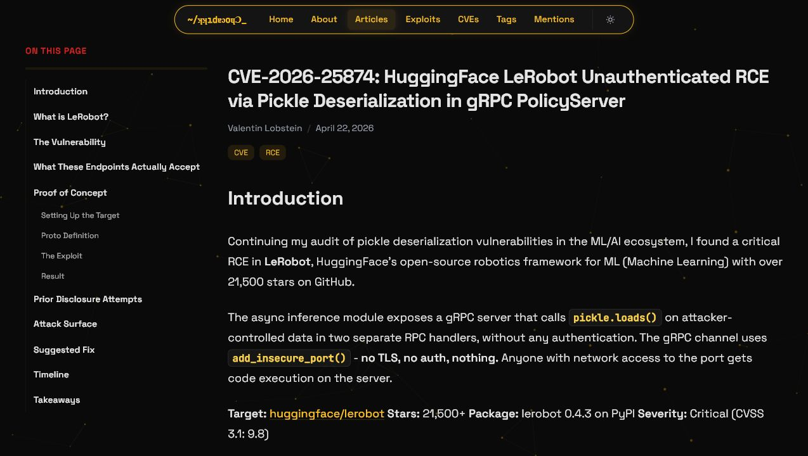
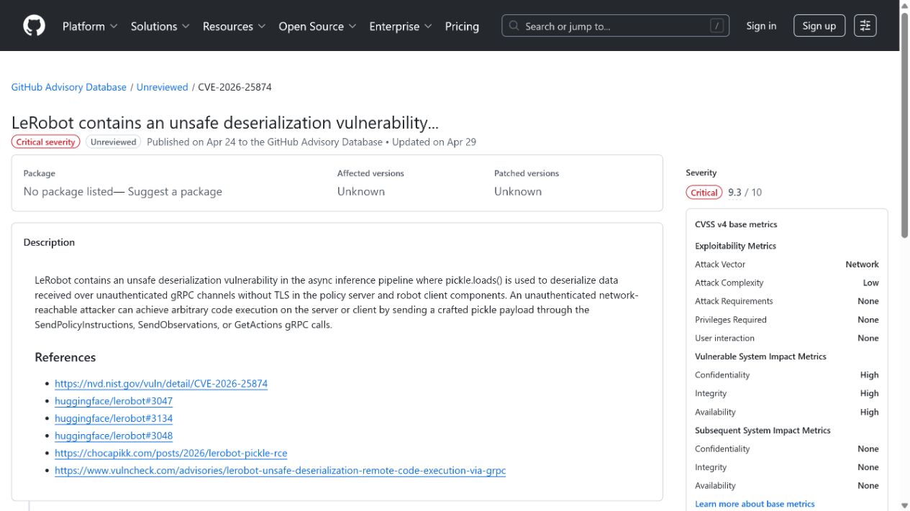
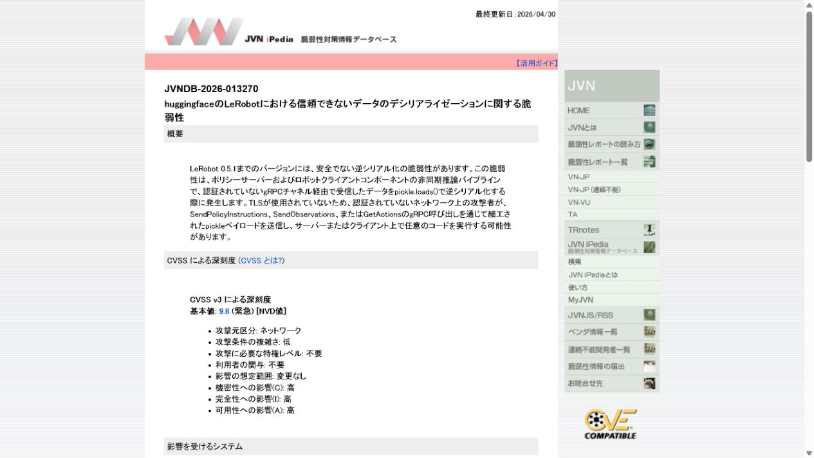
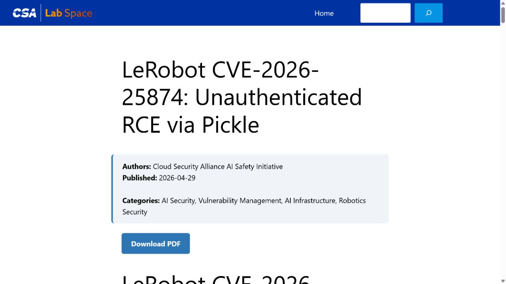
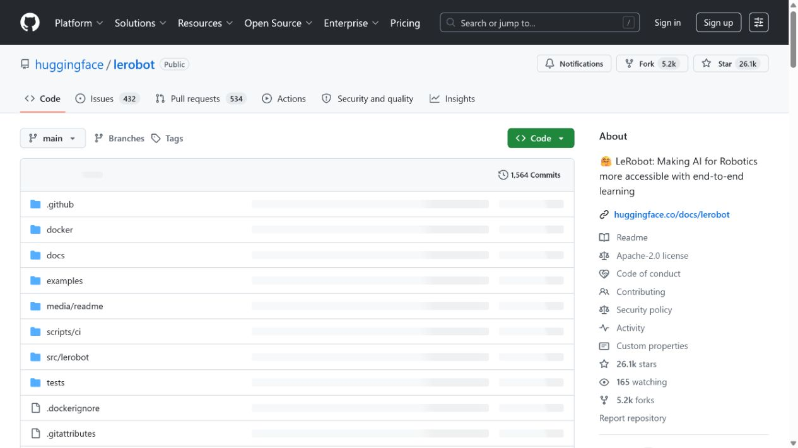

# LeRobot gRPC PolicyServer Unauthenticated RCE (2026)
> LeRobot gRPC PolicyServer 未认证远程代码执行漏洞

| Field | Value |
|---|---|
| Category | Domain-Specific Risks |
| Severity | Critical |
| AI Tool | Hugging Face LeRobot, gRPC PolicyServer, robotics inference workflow |
| Language | Python / gRPC / pickle |
| Real Incident | Yes |
| Reproducible | Yes |
| Disclosed | 2026-04-29 |
| CVE | CVE-2026-25874 |
| CVSS | 9.8 |

## TL;DR
LeRobot's gRPC PolicyServer accepted unsafe serialized policy data, allowing an unauthenticated requester to trigger code execution on hosts exposing the service.
> LeRobot 的 gRPC PolicyServer 接受不安全的策略序列化数据，暴露该服务的主机可能被未认证请求触发代码执行。

---

## 详细分析 / Full Analysis

## 一、基本信息与事件概况

CVE-2026-25874 影响 Hugging Face LeRobot 的 gRPC PolicyServer。公开研究指出，服务端会对网络传入的策略数据执行 Python pickle 反序列化，而该格式在处理攻击者可控内容时能够携带执行语义。若 PolicyServer 对不可信网络可见，攻击者不需要账户即可向其发送构造载荷。

LeRobot 面向机器人学习和策略部署，PolicyServer 可处在连接摄像头、执行器或实验设备的控制主机上。这使风险不止于普通应用进程：成功的主机级执行可能接触机器人项目代码、模型权重、环境凭据或与物理设备相连的控制网络。公开材料没有证明每个 LeRobot 用户都暴露了 gRPC 服务，也没有公开确认现实中的物理设备被操纵。

## 二、事件经过与公开材料

研究人员在 2026 年 4 月公开技术说明，随后 GitHub Advisory Database 以 GHSA-f7vj-73pm-m822 记录问题，CVE-2026-25874 被分配。JVN、Cloud Security Alliance 的研究注记以及多个漏洞数据库随后收录该披露。公开报道把影响版本描述为早期 LeRobot 版本，并建议停止暴露或修复 PolicyServer。

由于安全披露和上游修复节奏可能不同，部署者不能只看项目主页的最新版本。应直接检查运行中的代码是否仍使用 pickle 传输策略，并确认 gRPC 服务监听范围和网络入口。

### 证据矩阵

| 来源 | 类型 | 证明内容 |
|---|---|---|
| Chocapikk: LeRobot unauthenticated RCE via pickle | 原始研究 | gRPC PolicyServer、pickle 路径和攻击前提 |
| GitHub Advisory: GHSA-f7vj-73pm-m822 | 安全公告 | CVE 映射、影响版本和修复状态 |
| JVN: CVE-2026-25874 | 国家漏洞数据库 | 上游公告与研究来源的独立收录 |
| CSA: LeRobot unauthenticated RCE research note | 技术复核 | 漏洞链、生态影响与参考来源 |
| Hugging Face LeRobot repository | 项目背景 | 项目用途和机器人工作流背景 |

## 三、系统背景与触发条件

机器人策略服务通常在训练工作站、边缘设备或实验室服务器之间传递模型和动作信息。Python pickle 在研发中便于传递复杂对象，但它不适合作为跨信任边界的网络协议。服务端一旦在没有认证和内容约束的情况下加载 pickle，攻击者提交的不是“模型数据”，而是能够在解释器中恢复对象的程序化输入。

AI/机器人开发环境还常把实验便捷性置于网络隔离之前。临时开放的 gRPC 端口、共享 Wi-Fi、实验室 VPN 和默认容器网络都可能把原本假定为本地通信的 PolicyServer 暴露给更多主体。

## 四、攻击链路或失效过程

攻击者发现可访问的 PolicyServer 后，构造一个恶意 pickle 载荷并通过 gRPC 请求提交。服务端在反序列化策略对象时执行其中的对象恢复逻辑，代码以 PolicyServer 进程权限运行。之后攻击者可能读取项目文件、环境变量和凭据，修改策略服务，或把主机作为进入实验网络的跳板。

公开研究聚焦于反序列化路径，不意味着攻击者可以直接控制每台机器人动作。物理影响取决于进程是否拥有实际控制接口、是否存在安全控制器以及操作环境是否要求人工确认。本文将网络 RCE 和可能的物理后果明确区分。

## 五、技术根因与 AI 风险分析

根因是把 pickle 用作不可信网络输入的传输格式，并让 PolicyServer 在缺少身份验证、消息签名和协议约束时加载它。可执行序列化格式会把数据通道和代码通道混为一体，任何边界变化都可能把方便的研发机制转化为远程执行入口。

修复应采用不具执行语义的序列化格式并对消息 schema 做严格验证；服务只应在受控网络监听，且必须加入强认证、双向 TLS 或等效的工作负载身份。将端口从公网关闭是必要的临时措施，但不能替代消除 pickle 反序列化。

LeRobot 的 PolicyServer 连接的是策略推理和机器人控制流程，因而其风险不能只按一般 Web 服务看待。远程代码执行首先影响的是运行该服务的主机、模型文件和环境凭据；如果该主机同时承担设备控制、数据采集或实验编排，攻击者还可能借此干扰后续任务。公开材料并未把每一种物理后果都作为既成事实，但机器人研发环境将数字系统与执行设备放在同一链路中，足以提高对网络暴露和运行账户的要求。

在研发阶段，团队常为了联调方便让策略服务器接受来自局域网的请求。更合适的做法是把模型载入、控制指令和实验数据传输分开，并为每个通道设置独立的身份和网络策略。这样即使某个模型服务发生异常，影响也不会自然扩散到设备控制账户或整个实验网络；部署前的端口扫描和未认证连接测试应成为常规检查，而不是事故后的补救步骤。

## 六、影响范围与处置建议

直接影响是运行 PolicyServer 的主机可能被远程执行代码。相关团队应枚举所有实验、边缘和容器部署，检查监听地址和镜像版本，轮换该进程可以读取的凭据，并回溯 gRPC 日志中异常请求。若主机连接机器人控制网，还需检查安全控制器和物理权限是否与计算权限分离。

公开材料没有提供被利用统计或受害机构数量。应把风险评估建立在可达性、服务身份和控制链实际配置上，而不是仅根据项目在 GitHub 上的受欢迎程度估计影响。

## 七、结论

LeRobot 案例说明，AI/机器人系统的模型与策略传输也是安全协议。开发阶段的对象序列化一旦穿过网络边界，必须按远程代码执行面设计，而不能沿用本地 Python 进程间传递的信任假设。

## 八、参考来源

- [Chocapikk: LeRobot unauthenticated RCE via pickle](https://chocapikk.com/posts/2026/lerobot-pickle-rce/)
- [GitHub Advisory: GHSA-f7vj-73pm-m822](https://github.com/advisories/GHSA-f7vj-73pm-m822)
- [JVN: CVE-2026-25874](https://jvndb.jvn.jp/ja/contents/2026/JVNDB-2026-013270.html)
- [CSA: LeRobot unauthenticated RCE research note](https://labs.cloudsecurityalliance.org/research/csa-research-note-lerobot-cve-2026-25874-unauth-rce-20260429/)
- [Hugging Face LeRobot repository](https://github.com/huggingface/lerobot)
