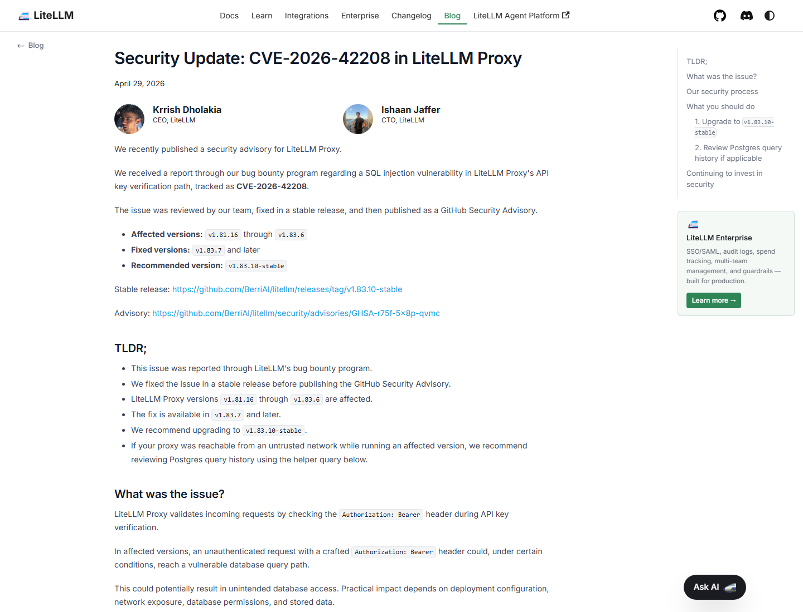
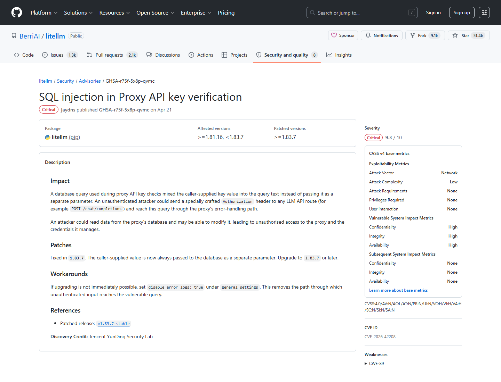
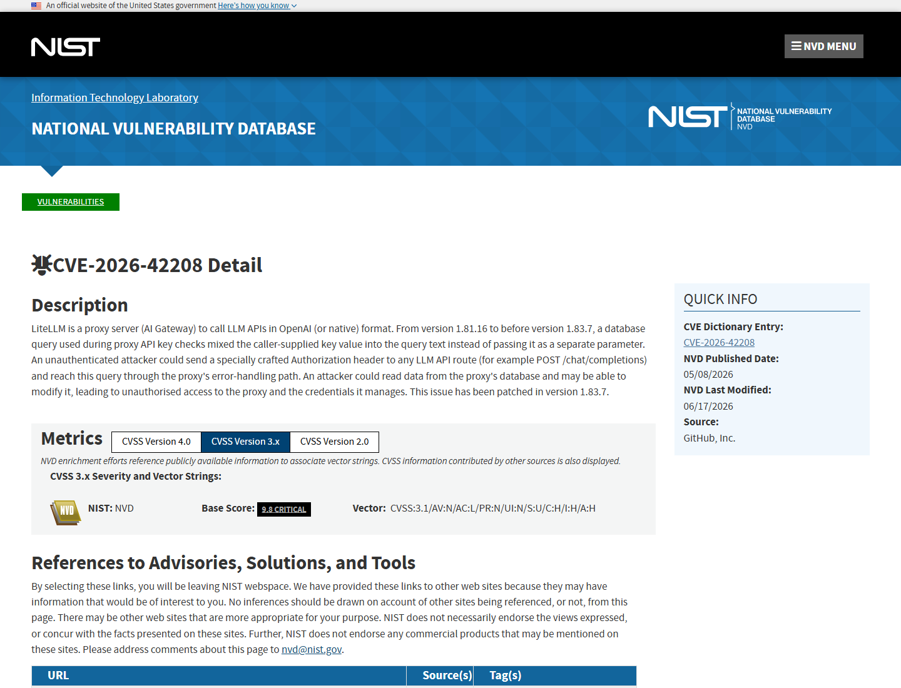
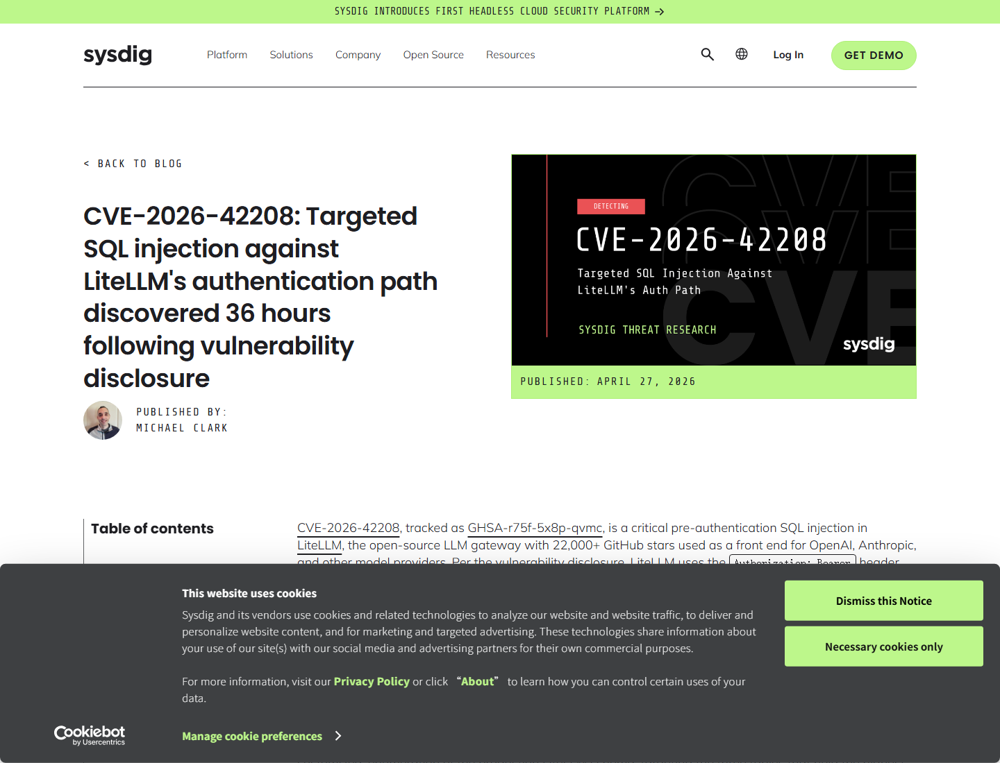
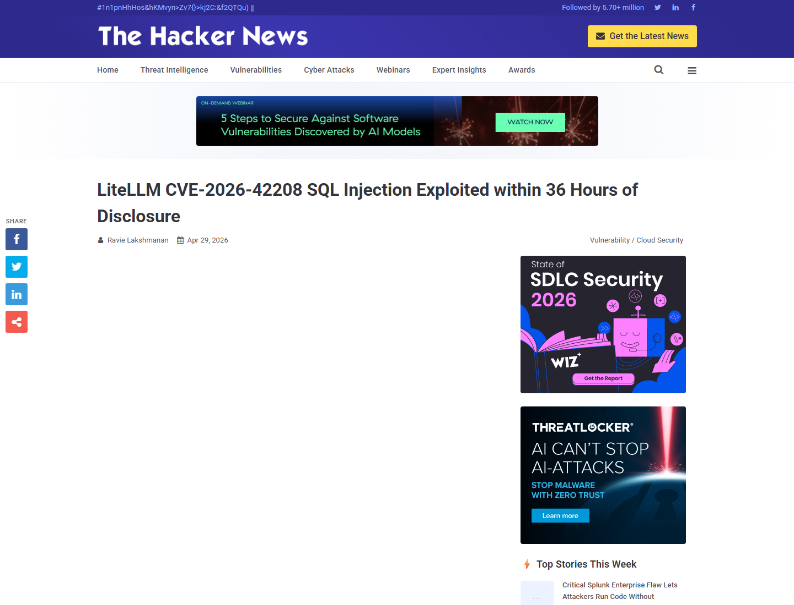
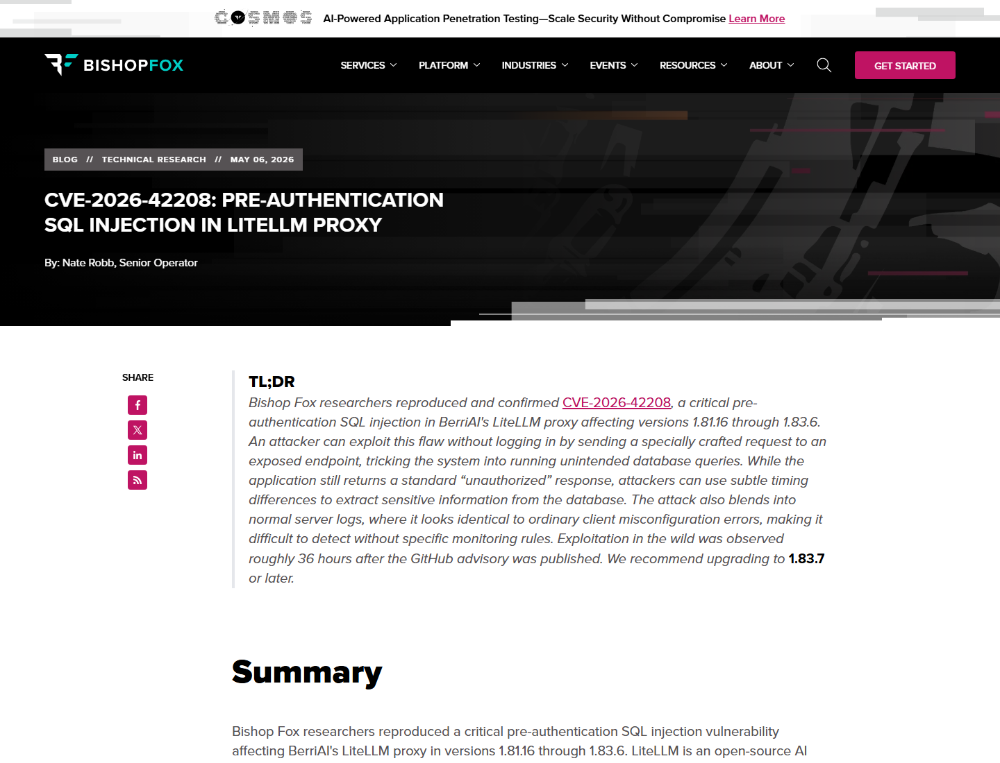

# LiteLLM Proxy Pre-Auth SQL Injection Credential Exposure (2026)
> LiteLLM Proxy 预认证 SQL 注入与 AI 网关凭据暴露

| Field | Value |
|---|---|
| Category | Code Vulnerabilities |
| Severity | Critical |
| AI Tool | LiteLLM Proxy, AI Gateway, OpenAI-compatible LLM proxy |
| Language | Python |
| Real Incident | Yes |
| Reproducible | Yes |
| Disclosed | 2026-04-20 |
| CVE | CVE-2026-42208 |

## TL;DR
LiteLLM Proxy's API key verification path accepted attacker-controlled Bearer tokens into a SQL query, creating a pre-auth SQL injection that could expose virtual keys, provider credentials, and gateway configuration.
> CVE-2026-42208 让攻击者在未认证条件下通过 `Authorization: Bearer` 头触达 LiteLLM Proxy 的数据库查询路径。由于 LiteLLM 常被用作 AI 网关，数据库里保存的往往是跨模型供应商的高价值凭据。

---

## 详细分析 / Full Analysis

# LiteLLM Proxy CVE-2026-42208 案例分析：AI 网关认证路径中的预认证 SQL 注入

## 基本信息

LiteLLM Proxy 是常见的 AI Gateway：它把 OpenAI-compatible API 暴露给内部应用，同时在后端连接 OpenAI、Anthropic、Azure、Vertex AI、Bedrock 等模型提供商。企业用它做统一密钥管理、预算、路由、速率限制和审计。2026 年 4 月披露的 CVE-2026-42208 命中了这个网关最敏感的路径：API key 校验。攻击者可在未登录条件下构造 `Authorization: Bearer` 头，让代理在认证尚未完成时进入易受注入影响的数据库查询。

LiteLLM 官方安全更新称，该问题影响 v1.81.16 到 v1.83.6，修复版本为 v1.83.7 及以后，推荐升级到 v1.83.10-stable。官方说明也提醒，如果受影响 Proxy 曾暴露在不可信网络上，应检查 Postgres 查询历史。这个建议反映了问题的性质：攻击发生在认证路径，且可能直接访问后端数据库。[LiteLLM Security Update](https://docs.litellm.ai/blog/cve-2026-42208-litellm-proxy-sql-injection)

## 一、事件核验与证据范围

### 证据矩阵

| 来源 | 类型 | 证明内容 | 备注 |
|---|---|---|---|
| LiteLLM 官方安全更新 | 厂商主证据 | 影响版本、修复版本、API key verification path、升级和查询审计建议 | 处置基准 |
| GitHub Advisory / NVD | 主证据 | CVE-2026-42208、GHSA-r75f-5x8p-qvmc、预认证 SQL 注入、受影响版本 | 漏洞数据库记录 |
| Sysdig | 攻击观测 / 技术证据 | 披露后约 36 小时出现定向 schema enumeration，目标表包含 virtual keys、provider credentials、config | 提供真实探测时间线 |
| The Hacker News | 复核 / 传播证据 | 36 小时内被利用、凭据泄露与云账号风险 | 媒体复核 |
| Bishop Fox | 复现证据 | 复现并确认 LiteLLM Proxy 1.81.16-1.83.6 的预认证 SQL 注入 | 独立技术验证 |
| CCB Belgium | 政府/行业预警 | 强调 AI gateway 集中凭据，成功攻击相当于丢失多个模型 provider 账号 | 防御视角 |

GitHub Advisory 将该漏洞登记为 `GHSA-r75f-5x8p-qvmc`，NVD 描述了关键路径：LiteLLM Proxy 在 API key 检查期间把调用者提供的 key 值混入查询文本，而不是作为独立参数绑定；未认证攻击者可以向 LLM API route 发送特制 Authorization header，并通过 error-handling path 触达该查询。[GitHub Advisory](https://github.com/BerriAI/litellm/security/advisories/GHSA-r75f-5x8p-qvmc)

## 二、系统背景与触发条件

LiteLLM 的价值在于“统一代理”。对内部应用来说，它只需要调用一个 OpenAI-compatible endpoint；对平台团队来说，LiteLLM 负责校验虚拟 key、映射模型供应商、控制预算、记录 usage，并把请求转发到真实 provider。这个设计让数据库中的几张表格变得非常敏感：virtual API keys、provider credentials、proxy config 和环境变量配置都可能位于同一个控制平面内。

触发条件并不复杂：攻击者需要能访问 LiteLLM Proxy 暴露的 API route，例如 `/chat/completions`，并在 `Authorization: Bearer` 值中放入特制 SQL payload。由于校验 key 的逻辑本来就在认证前运行，攻击者无需有效 key。对公网暴露或内网可达的 AI Gateway，这类入口很容易被扫描器和定向攻击者发现。

## 三、攻击链与处置过程

Sysdig 的报告让这个漏洞从“可利用”变成了“已有定向探测”。其时间线显示，GitHub Advisory 进入全局数据库后约 36 小时，Sysdig TRT 观察到针对生产 LiteLLM schema 的 SQL injection attempt。报告称攻击流量不是泛化的 sqlmap 扫描，而是围绕 LiteLLM 高价值表进行枚举，目标包括 `LiteLLM_VerificationToken`、`litellm_credentials` 和 `litellm_config`。

公开材料没有把该观测写成大规模成功入侵。Sysdig 表示没有看到后续使用外泄 key 的认证调用、生成新 virtual key 或复用 provider credentials 的行为。这个限定很重要：真实风险是攻击者已经快速转向 LiteLLM schema，并瞄准 AI 网关凭据；是否形成完整 compromise，还取决于数据库权限、暴露面、日志、存储内容和响应速度。[Sysdig](https://www.sysdig.com/blog/cve-2026-42208-targeted-sql-injection-against-litellms-authentication-path-discovered-36-hours-following-vulnerability-disclosure)

## 四、技术根因分析

根因是 API key 校验代码把外部输入拼入 SQL 查询文本。认证逻辑常被认为是“保护系统的前门”，但它本身也处理未可信输入。LiteLLM Proxy 需要读取 Bearer token、查询 virtual key 表、判断预算和路由权限；如果这一查询缺少参数化绑定，攻击者就能在系统决定是否认证前控制查询语句。

AI Gateway 场景放大了 SQL 注入的后果。普通应用的 SQL 注入可能泄露用户表或业务数据；LiteLLM 的数据库可能保存上游模型 provider key、代理 master key、成本控制配置和环境变量。攻击者拿到这些信息后，可以绕过网关预算、调用昂贵模型、窃取企业 prompt/response 数据、冒用内部服务，或者把 AI 账号成本和数据流量转移到受害者名下。

## 五、AI 参与方式与风险归因

这个案例中的 AI 参与方式不是模型 hallucination，也不是 prompt injection，而是 AI 基础设施控制面的凭据集中化。LiteLLM 作为代理层连接多个模型供应商和内部应用，认证数据库本身就是 AI 访问权的钥匙圈。攻击者打的是 Web/API 代码缺陷，但拿到的资产是模型访问能力。

Bishop Fox 的复现报告把它放在企业 AI Gateway 的语境中：LiteLLM 越常被用作统一入口，API key verification path 越关键。预认证 SQL 注入意味着攻击者可以在没有任何合法模型 key 的情况下，攻击负责校验 key 的组件本身。[Bishop Fox](https://bishopfox.com/blog/cve-2026-42208-pre-authentication-sql-injection-in-litellm-proxy)

## 六、与团队技术报告风险框架的关系

团队技术报告关注 AI 代码能力背后的工程系统风险。CVE-2026-42208 对应的是“AI 访问控制层”：模型 API、供应商密钥、成本预算和内部服务身份被集中到一个代理中，一旦代理认证路径出现输入处理漏洞，影响会跨越多个模型提供商和业务系统。

这类问题提示我们，AI 安全材料不能只写模型越权，还要写 AI gateway 的传统 Web 安全。参数化查询、最小权限数据库账号、密钥分层、网络隔离和审计日志，都是 AI 基础设施的第一层安全控制。模型只是被代理调用的资源；真正决定损失范围的是代理如何保存和校验凭据。

## 七、影响范围与社会后果

LiteLLM 作为开源 LLM gateway，被用于统一调用多家模型提供商。CCB Belgium 的预警把后果说得很直观：成功攻击可能等价于同时丢失所有连接的 AI provider 账号，因为网关集中保存了这些凭据。对企业而言，这可能导致模型调用费用损失、敏感 prompt 和 response 泄露、供应商账号滥用、内部服务冒用，以及由凭据复用引发的横向风险。[CCB Belgium](https://ccb.belgium.be/advisories/warning-litellm-pre-auth-sql-injection-cve-2026-42208-patch-immediately)

社会后果还体现在响应窗口上。Sysdig 观测到定向探测出现在全局 advisory 公开后约 36 小时，这说明 AI 基础设施漏洞进入公共数据库后，会很快被攻击者转化为 schema-aware payload。对暴露的 AI Gateway，传统“等补丁窗口”的节奏可能已经不够。

## 八、治理建议

LiteLLM 用户应升级到 v1.83.7 或更高版本，优先采用官方推荐的 v1.83.10-stable，并检查受影响窗口内的 Postgres 查询历史、代理访问日志和异常 Authorization header。曾暴露在不可信网络上的实例，应轮换 LiteLLM virtual keys、provider API keys、master key 和相关环境变量。

架构上，AI Gateway 不应直接暴露在公网；数据库账号应限制到必要表和必要操作；provider credentials 应分层保存，优先使用外部 secret manager 和短生命周期凭据。认证路径必须使用参数化查询，并在 API 网关、WAF、日志规则中对异常 Bearer token 做检测。更重要的是，把 LiteLLM 这类网关当作生产特权系统管理，而不是普通开发代理。

## 九、结论

CVE-2026-42208 说明，AI Gateway 是新型高价值控制面。漏洞形式是经典 SQL 注入，但落点是模型供应商凭据、虚拟 key、配置和预算控制。LiteLLM 的案例提醒团队：AI 基础设施的认证路径、数据库权限、密钥存储和外网暴露面，必须按照“多模型访问权集中点”来治理；否则一个预认证输入处理缺陷，就可能打开整个模型访问层。

## 参考来源

- [LiteLLM Security Update: CVE-2026-42208](https://docs.litellm.ai/blog/cve-2026-42208-litellm-proxy-sql-injection)
- [GitHub Advisory: GHSA-r75f-5x8p-qvmc](https://github.com/BerriAI/litellm/security/advisories/GHSA-r75f-5x8p-qvmc)
- [NVD: CVE-2026-42208](https://nvd.nist.gov/vuln/detail/CVE-2026-42208)
- [Sysdig: Targeted SQL injection against LiteLLM authentication path](https://www.sysdig.com/blog/cve-2026-42208-targeted-sql-injection-against-litellms-authentication-path-discovered-36-hours-following-vulnerability-disclosure)
- [The Hacker News: LiteLLM SQL injection exploited within 36 hours](https://thehackernews.com/2026/04/litellm-cve-2026-42208-sql-injection.html)
- [Bishop Fox: Pre-authentication SQL injection in LiteLLM Proxy](https://bishopfox.com/blog/cve-2026-42208-pre-authentication-sql-injection-in-litellm-proxy)
- [CCB Belgium warning: LiteLLM pre-auth SQL injection](https://ccb.belgium.be/advisories/warning-litellm-pre-auth-sql-injection-cve-2026-42208-patch-immediately)
