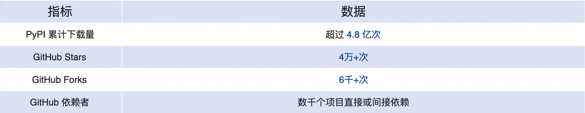
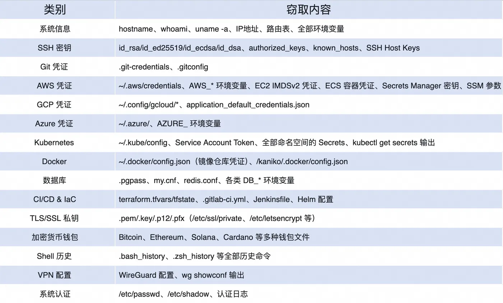
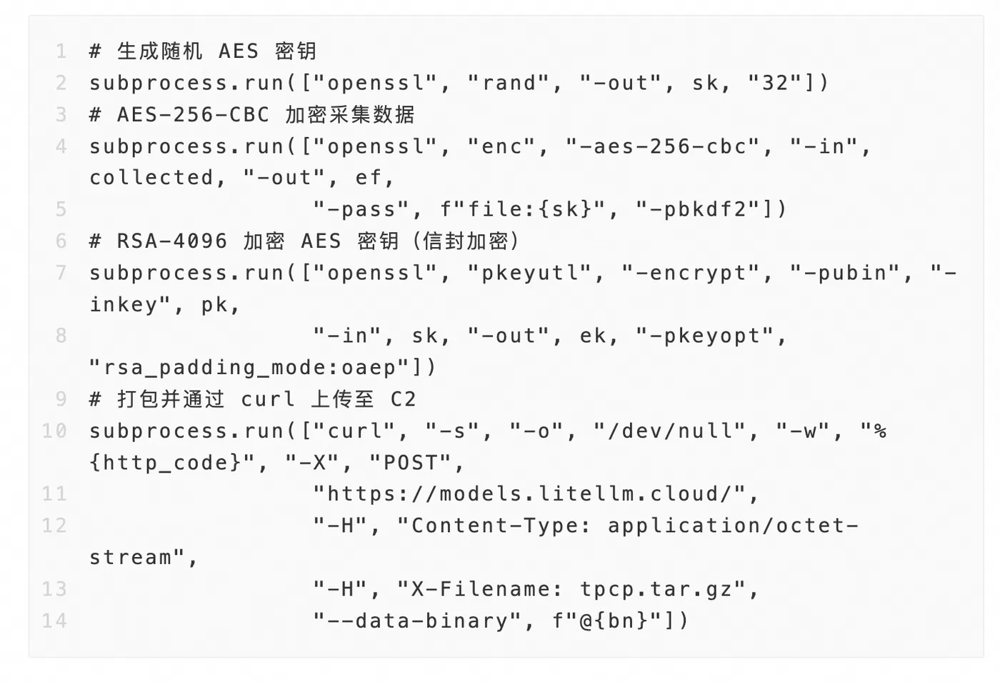
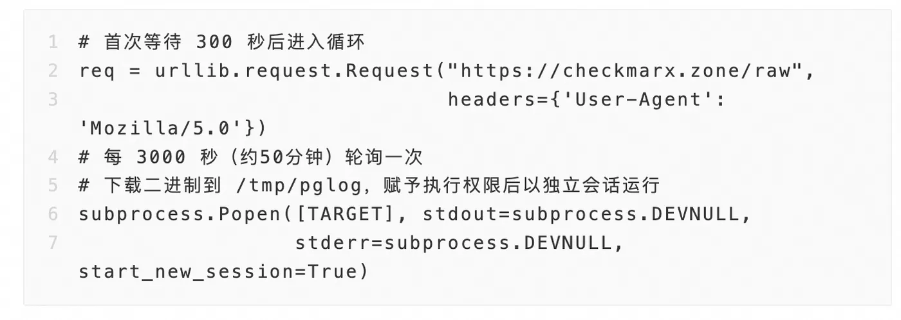
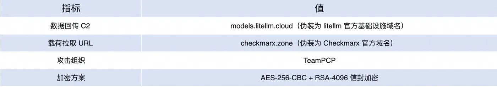

# LiteLLM PyPI Supply Chain Poisoning (2026)
> LiteLLM PyPI 供应链投毒事件

| Field | Value |
|---|---|
| Category | Hallucination & Supply Chain |
| Severity | 🟠 High |
| AI Tool | LiteLLM |
| Language | Python |
| Real Incident | ✅ |
| Reproducible | ❌ |
| Disclosed | 2026-03-24 |
| CVE | — |
| CVSS | — |

## TL;DR
Malicious LiteLLM 1.82.7/1.82.8 PyPI releases stole credentials and added host or Kubernetes persistence.
> 2026 年 3 月，LiteLLM 的 PyPI 版本 1.82.7 和 1.82.8 被植入恶意载荷，用于窃取凭证并建立主机或 Kubernetes 持久化。

---

## 详细分析 / Full Analysis

### 事件概述

2026 年 3 月 24 日，安全研究人员披露，热门 Python AI 框架 LiteLLM 的 PyPI 发布链遭到供应链攻击。攻击者向 PyPI 上传了 LiteLLM 1.82.7 和 1.82.8 两个恶意版本。公开分析显示，恶意包中包含凭证窃取、加密外传、持久化和 Kubernetes 横向扩展相关逻辑。LiteLLM 是常见的 LLM 统一网关，常用于统一接入 OpenAI、Anthropic、Azure、Vertex AI 等模型服务，因此该事件直接影响 AI 应用运行环境中的高价值凭证和基础设施权限。

### 风险影响

LiteLLM 的典型部署位置决定了该事件风险较高。首先，企业通常将 LiteLLM 作为模型调用网关部署在生产环境中，代理层往往保存多个模型服务、云平台、数据库或内部系统的访问凭证。其次，LiteLLM 常运行在容器或 Kubernetes 集群中，恶意载荷一旦获取 Service Account Token，就可能进一步枚举节点并部署特权 Pod。最后，LiteLLM 属于 AI 开发链条中的基础依赖，一旦其发布包被污染，下游使用自动升级或宽松版本约束的项目容易在不知情的情况下安装恶意版本。

该事件说明，AI 工具链中的基础组件已经成为软件供应链攻击的重要入口。攻击者不需要直接攻击最终业务系统，只要污染高下载量、高权限的中间依赖，就可能获得大量下游环境中的密钥、令牌和运行时权限。

### 恶意载荷技术分析

#### 第一阶段：初始执行

恶意代码主要通过两个入口触发。LiteLLM 1.82.8 中包含 `litellm_init.pth` 文件，该文件会在 Python 解释器启动时自动执行，因此不要求用户显式调用 LiteLLM 代码。另一个入口位于被篡改的代理服务器相关文件中，恶意逻辑通过编码载荷隐藏在正常启动流程中，并在代理服务启动时同步执行。

该设计提高了触发概率。即使用户只是安装了受影响版本，Python 环境启动过程也可能执行恶意代码。对于 CI/CD、Notebook、服务端代理和自动化脚本等场景，这类 `.pth` 启动钩子尤其危险。

#### 第二阶段：信息收集与加密外传

第二阶段主要用于收集主机信息和敏感凭证。公开报告提到的目标包括环境变量、`.env` 文件、SSH 密钥、云服务令牌、Kubernetes 凭证、数据库连接信息和部分钱包文件。攻击者随后对收集到的数据进行加密处理，并发送到攻击者控制的基础设施。

这种设计降低了数据在传输过程中被中间设备直接识别的概率，也使只有攻击者能够解密被窃取的数据。对于使用 LiteLLM 管理多个模型供应商 API Key 的企业而言，泄露结果可能不限于单个服务，而是扩展到多个云账号、模型服务和内部系统。

#### 第三阶段：持久化与二次载荷投递

恶意载荷还包含持久化逻辑。在普通主机环境中，攻击者可能将后门脚本写入用户配置目录，并注册为伪装的 systemd 用户服务。在 Kubernetes 环境中，载荷会尝试利用可用的 Service Account Token 枚举集群资源，并通过特权 Pod 挂载宿主机根文件系统，从而向节点写入持久化组件。

此外，恶意代码还会轮询远程地址获取进一步指令或二进制载荷。这意味着初始恶意包不仅用于一次性窃密，还可能作为后续远程控制的入口。

### C2 基础设施

公开分析显示，攻击者使用的域名具有伪装特征，部分域名看起来接近 LiteLLM 或安全厂商相关域名。这种命名方式会增加事件响应中的判断难度。运维人员在排查时不能只依赖域名表面含义，而应结合进程、网络连接、落地文件、包版本和安装时间进行综合判断。

### 缓解建议

针对该类 AI 供应链投毒事件，建议采取以下措施：

1. 检查环境中是否安装过 LiteLLM 1.82.7 或 1.82.8，并确认 `site-packages` 中是否存在异常 `.pth` 文件。
2. 若安装过受影响版本，应将该环境中的模型服务 API Key、云平台 Token、数据库凭证、SSH 密钥和 Kubernetes 凭证视为已泄露并立即轮换。
3. 使用依赖锁定和哈希校验，例如 `pip --require-hashes`、Poetry lock 或其他锁文件机制，避免生产环境自动安装最新版本。
4. 对 PyPI、npm 等第三方包设置准入策略，对高权限运行环境中的依赖升级进行人工审核和制品扫描。
5. 收紧 Kubernetes RBAC 权限，避免业务 Pod 默认具备创建特权 Pod、挂载宿主机路径或枚举所有节点的权限。
6. 监控异常 systemd 服务、可疑 Python 启动钩子、未知出站域名、异常二进制下载和特权 Pod 创建行为。

### 与 AI 代码生成风险的关系

该事件与 AI 代码生成和 AI 开发工具链风险密切相关。LiteLLM 作为 LLM 统一网关，常被集成到 AI Agent、代码生成平台、模型代理服务和企业内部 AI 应用中。开发者在依赖 AI 工具生成代码或快速搭建原型时，容易采用宽松版本约束或直接安装最新依赖。如果缺少依赖锁定、制品验证和运行时监控，受污染的 AI 基础依赖就可能进入生产环境。

因此，该案例不仅是普通的 PyPI 包投毒事件，也体现了 AI 软件供应链中的特殊风险：AI 工具链组件通常靠近密钥、模型访问入口和自动化执行环境，一旦被投毒，攻击影响会从开发依赖扩展到运行时凭证和基础设施控制面。

### References

1. FutureSearch: [litellm 1.82.8 Supply Chain Attack on PyPI](https://futuresearch.ai/blog/litellm-pypi-supply-chain-attack/)
2. IONIX: [LiteLLM Supply Chain Compromise — Backdoored PyPI Packages 1.82.7 & 1.82.8](https://www.ionix.io/threat-center/litellm-supply-chain-compromise-backdoored-pypi-packages-1-82-7-1-82-8/)
3. Bitsight: [Major Security Event: Supply Chain Compromise in LiteLLM Versions 1.82.7 and 1.82.8](https://www.bitsight.com/blog/litellm-versions-1-82-7-1-82-8-supply-chain-compromise)
4. ITPro: [LiteLLM PyPI compromise: Everything we know so far](https://www.itpro.com/security/litellm-pypi-compromise-everything-we-know-so-far)
5. 阿里云开发者社区：[深度解析 LiteLLM 供应链投毒事件](https://developer.aliyun.com/article/1719859)
