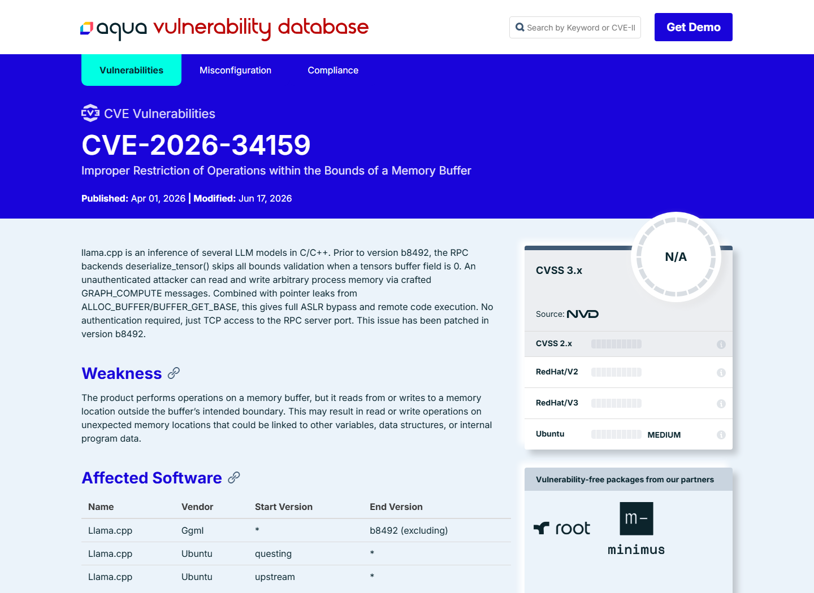
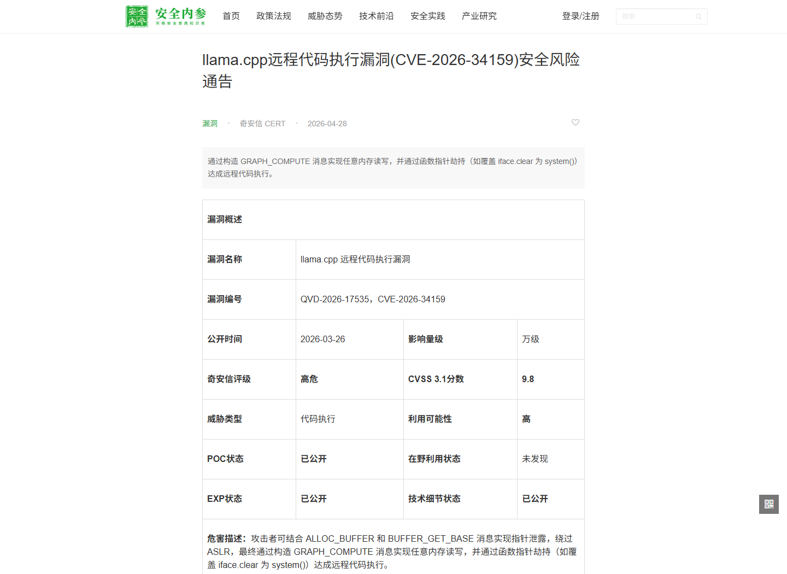
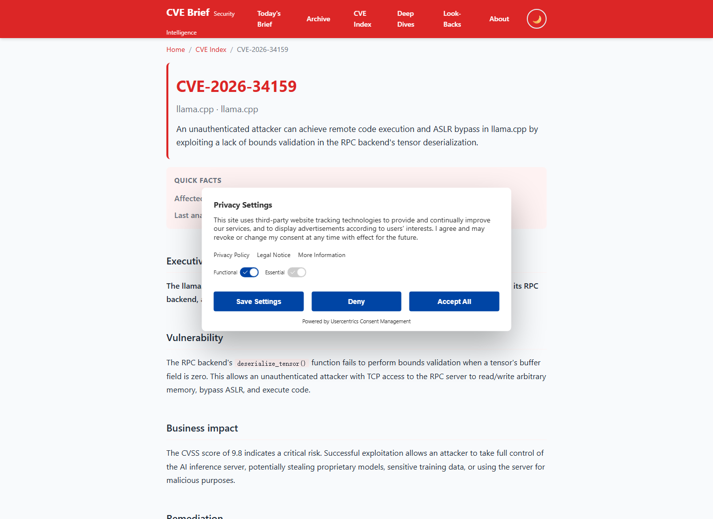
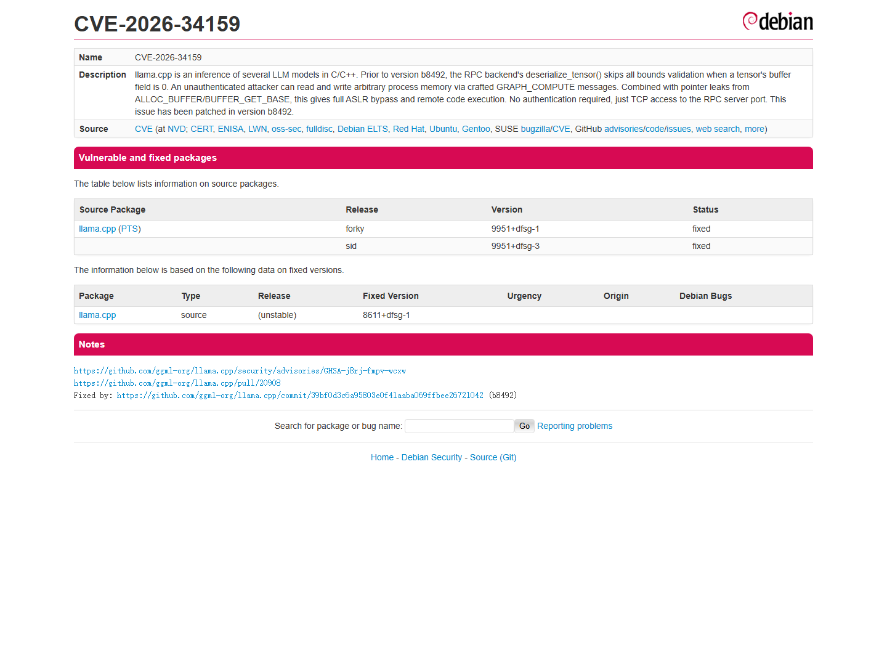
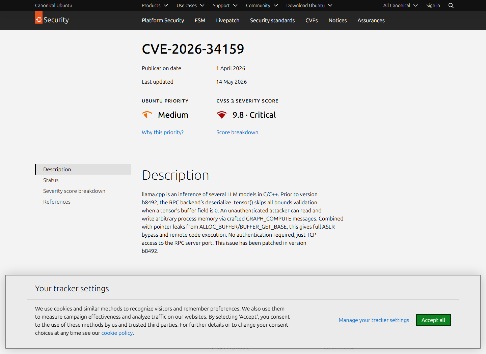

# llama.cpp RPC GRAPH_COMPUTE Unauthenticated RCE (2026)
> llama.cpp RPC GRAPH_COMPUTE 未认证远程代码执行

| Field | Value |
|---|---|
| Category | Code Vulnerabilities |
| Severity | Critical |
| AI Tool | llama.cpp, GGML RPC backend, Distributed inference |
| Language | C++ / Binary RPC |
| Real Incident | Yes |
| Reproducible | Yes |
| Disclosed | 2026-03-26 |
| CVE | CVE-2026-34159 |
| CVSS | 9.8 |

## TL;DR
Crafted unauthenticated GRAPH_COMPUTE messages could bypass tensor bounds checks when buffer was zero, yielding arbitrary process-memory access, ASLR bypass, and code execution on the llama.cpp RPC server.
> 攻击者向 llama.cpp RPC 服务发送构造的 GRAPH_COMPUTE 消息，可利用 buffer=0 跳过张量边界检查，完成任意内存读写、绕过 ASLR 并执行代码。

---

## 详细分析 / Full Analysis

## 一、基本信息与事件概况

CVE-2026-34159 影响 llama.cpp 的 GGML RPC 后端。该后端用于把推理计算分布到远程机器或 GPU 节点。RPC 处理 GRAPH_COMPUTE 时会反序列化客户端提供的 tensor；旧版 deserialize_tensor() 仅在 buffer 非空时校验 data 指针。当攻击者把 buffer 字段设为 0，data 就能绕过边界检查并进入计算 kernel。

项目公告给出了从任意内存读写到远程代码执行的完整链：协议先泄露堆指针，攻击者据此绕过 ASLR；随后读取函数指针和 GOT，计算 system() 地址；最后覆盖 buffer 结构中的 clear 函数指针并触发调用。任何能够连接 RPC 端口的未认证客户端都可尝试利用，官方 CVSS 为 9.8。

## 二、事件经过与公开材料

研究者于 2026 年 2 月向 CERT/CC 报告问题，并在 3 月 26 日通过 llama.cpp GitHub Security Advisory 发布 GHSA-j8rj-fmpv-wcxw。4 月 1 日，漏洞以 CVE-2026-34159 进入 NVD。上游 PR #20908 和提交 39bf0d3c6a95803e0f41aaba069ffbee26721042 修复相关检查，NVD 将 b8492 列为补丁版本。

上游公告页面的 package 元数据仍显示“Patched versions: None”，同时正文和 NVD 指向修复提交。部署方应核对实际构建 commit 是否包含修复，而不要只依赖一个发行标签。公告还说明 RPC 后端需要显式编译启用并默认监听 localhost，但其设计用途正是跨机器分布式推理，实际部署中经常需要网络可达。

### 证据矩阵

| 来源 | 类型 | 证明内容 |
|---|---|---|
| llama.cpp Advisory: GHSA-j8rj-fmpv-wcxw | 项目公告 | 完整漏洞链、PoC、CVSS 9.8、攻击前提和影响 |
| NVD: CVE-2026-34159 | 漏洞数据库 | CVE、b8492 修复版本、CWE 和评分 |
| llama.cpp Fix Commit 39bf0d3 | 修复记录 | deserialize_tensor 相关边界校验修改 |
| llama.cpp Pull Request #20908 | 修复讨论 | 上游合并过程和修复上下文 |
| llama.cpp Security Policy | 项目文档 | RPC 后端默认使用警告与不可信网络部署建议 |
| Aqua Security: CVE-2026-34159 | 独立漏洞数据库 | GRAPH_COMPUTE、buffer=0、b8492 和 RCE 的交叉记录 |
| 安全内参: llama.cpp 远程代码执行漏洞通告 | 独立安全通报 | deserialize_tensor 根因、无需认证条件和修复建议 |
| CVE Brief: CVE-2026-34159 | 独立复核 | RPC 后端远程代码执行影响和版本信息摘要 |

## 三、系统背景与触发条件

llama.cpp 主要以本地推理工具著称，RPC 后端则允许一台协调节点把计算发送给远程后端。为了提高性能，协议直接传递和返回内存地址形式的句柄，远程节点又在原生 C/C++ 计算 kernel 中处理张量。这样的设计减少了抽象开销，也把协议校验错误直接连接到进程内存。

项目安全文档明确建议在不可信网络中不要使用 RPC backend、rpc-server 和 llama-server。该建议降低默认暴露，但无法保护已经为分布式推理开放端口的环境。Docker `-p 50052:50052`、Kubernetes Service 或平面网络都可能让本应受控的 RPC 端口被其他租户或外部网络访问。

## 四、攻击链路或失效过程

攻击者连接 RPC 默认端口 50052，先调用 ALLOC_BUFFER 和 BUFFER_GET_BASE，获得原始堆地址。随后发送 buffer=0 的 GRAPH_COMPUTE 消息，通过 OP_CPY 等操作把任意地址内容复制到可读取缓冲区，泄露库函数指针并计算模块与 libc 基址。攻击者再用写原语覆盖 buffer 接口中的 clear 指针，并准备命令字符串。

最后，BUFFER_CLEAR 调用被篡改的函数指针，实际执行 system("attacker_command")。公告 PoC 在 Docker 中验证命令以 RPC 服务进程用户运行，示例环境为 root。利用后进程可能因结构破坏而崩溃，但命令已在响应返回前执行；攻击者也可尝试恢复结构以降低崩溃迹象。

## 五、技术根因与 AI 风险分析

直接根因是 buffer=0 时跳过了 data 指针校验。代码把空 buffer 视为无需检查的特殊状态，却仍然接受客户端提供的 data 地址。协议还把原始指针用作远程句柄，并在多个命令路径中分别实现边界检查。此前对 GET_TENSOR 和 SET_TENSOR 的修复没有覆盖 GRAPH_COMPUTE 的独立反序列化路径。

面向分布式推理的高性能 RPC 不应把网络输入直接映射为进程地址。更稳健的设计是使用不可伪造的句柄表、统一对象生命周期与范围校验，并在每个计算操作前重新验证 tensor 所属 buffer。协议认证和传输加密也不能替代内存安全，但能显著减少可达攻击者。

该攻击面由分布式 AI 推理需求直接产生：为了跨节点调度 tensor 和计算图，RPC 需要表达模型缓冲区、张量偏移和执行关系。若协议把这些对象近似为进程指针，远程客户端就获得了影响推理进程内存布局的能力。推理节点还常同时持有模型权重、系统提示、请求上下文和加速器资源，内存破坏可能同时危及模型资产、用户数据与集群可用性。

## 六、影响范围与处置建议

成功利用可获得 RPC 服务进程权限下的任意命令执行，并读取同一进程中的模型、数据和凭据。GPU 服务器常被配置为高资源、长生命周期节点，若容器以 root 运行或挂载模型仓库与云凭据，后续影响会进一步扩大。组织应部署包含修复提交的 b8492 或更新构建，并重新构建相关容器。

无法立即更新时，应停用 RPC 后端，或至少把端口限制在专用、双向认证的推理网络，禁止公网和普通工作负载访问。检查端口 50052 暴露、异常 GRAPH_COMPUTE 流量、RPC 进程崩溃、未知子进程和 /tmp 写入。容器应使用非 root 用户、只读文件系统和最小凭据。

## 七、结论

CVE-2026-34159 是推理基础设施协议层的高危内存安全漏洞。RPC 服务即使部署在内部网络，也需要严格校验所有远程字段。统一边界检查、不可伪造的对象句柄和网络隔离应共同使用，避免单点防护失效。

## 八、参考来源

- [llama.cpp Advisory: GHSA-j8rj-fmpv-wcxw](https://github.com/ggml-org/llama.cpp/security/advisories/GHSA-j8rj-fmpv-wcxw)
- [NVD: CVE-2026-34159](https://nvd.nist.gov/vuln/detail/CVE-2026-34159)
- [llama.cpp Fix Commit 39bf0d3](https://github.com/ggml-org/llama.cpp/commit/39bf0d3c6a95803e0f41aaba069ffbee26721042)
- [llama.cpp Pull Request #20908](https://github.com/ggml-org/llama.cpp/pull/20908)
- [llama.cpp Security Policy](https://github.com/ggml-org/llama.cpp/security)
- [Aqua Security: CVE-2026-34159](https://avd.aquasec.com/nvd/2026/cve-2026-34159/)
- [安全内参: llama.cpp 远程代码执行漏洞通告](https://www.secrss.com/articles/89833)
- [CVE Brief: CVE-2026-34159](https://cvebrief.com/cve/CVE-2026-34159/)
- [Debian Security Tracker: CVE-2026-34159](https://security-tracker.debian.org/tracker/CVE-2026-34159)
- [Ubuntu Security: CVE-2026-34159](https://ubuntu.com/security/CVE-2026-34159)
