# LLM API Router Malicious Intermediary Risk (2026)

> LLM API 路由器恶意中间人风险与 Agent 供应链暴露

| Field         | Value                                                        |
| ------------- | ------------------------------------------------------------ |
| Category      | Hallucination & Supply Chain                                 |
| Severity      | 🟠 High                                                       |
| AI Tool       | LLM API routers, Claude Code, OpenAI Codex, OpenClaw, LiteLLM |
| Language      | Multiple                                                     |
| Real Incident | ✅                                                            |
| Reproducible  | ❌                                                            |
| Disclosed     | 2026-04-09                                                   |
| CVE           | —                                                            |
| CVSS          | —                                                            |

## TL;DR

Malicious LLM API routers altered tool calls; LiteLLM shows router pipelines can steal credentials.

> 真实路由市场测量发现恶意 LLM API 路由器会篡改 Agent 工具调用并窃取凭据；LiteLLM/TeamPCP 事件进一步证明 LLM Gateway 请求处理链一旦被污染，可成为凭据收集和供应链攻击入口。

------

## 详细分析 / Full Analysis

# LLM API 路由器恶意中间人风险分析：Agent 工具调用链路中的明文中间层与供应链信任失效

## 基本信息

案例时间：2026 年 4 月
事件对象：第三方 LLM API router、灰色 API 中转服务、OpenAI/Anthropic 兼容聚合接口、Agent 工具调用链路
涉及工具：Claude Code、OpenAI Codex、OpenClaw、LiteLLM、sub2api、new-api、OpenAI/Anthropic/Gemini 兼容路由接口
事件类型：恶意 LLM API 中间人、Agent 工具调用响应篡改、凭据窃取、依赖替换、LLM Gateway 供应链污染
影响范围：研究测量 28 个付费路由和 400 个免费路由，发现 1 个付费路由和 8 个免费路由主动注入恶意代码，2 个路由部署自适应规避触发器，17 个路由触碰研究者控制的 AWS 金丝雀凭据，1 个路由耗尽研究者控制的 ETH 私钥余额；弱路由诱捕实验暴露 99 个凭据、440 个 Codex sessions 和约 2B billed tokens。相关现实背景包括 LiteLLM/TeamPCP 供应链事件，LiteLLM 官方确认 1.82.7 和 1.82.8 两个 PyPI 版本含恶意 payload，Datadog、Trend Micro、CSA、Hunt.io 等多方分析均将其定位为 AI/ML 工具链供应链攻击。 ([LiteLLM](https://docs.litellm.ai/blog/security-update-march-2026?utm_source=chatgpt.com))
风险归类：LLM API 供应链风险、Agent 工具调用完整性缺失、明文中间层凭据暴露、恶意路由器响应篡改
案例定位：本案例可作为团队报告中 AI 代码安全风险从模型输出、插件市场和本地 Agent 工具，进一步扩展到模型 API 路由中间层的补充案例。

## 摘要

2026 年 4 月，Hanzhi Liu、Chaofan Shou、Hongbo Wen、Yanju Chen、Ryan Jingyang Fang 和 Yu Feng 发布论文 *Your Agent Is Mine: Measuring Malicious Intermediary Attacks on the LLM Supply Chain*，系统测量了第三方 LLM API router 在 Agent 工具调用场景中的恶意中间人风险。论文指出，越来越多 LLM Agent 通过第三方 API router 调度模型请求，以实现模型聚合、成本优化、负载均衡和统一 API 接口；这些路由器位于客户端和上游模型提供商之间，会终止入站 TLS，并以明文访问每个请求与响应 JSON。当前主流模型提供商并未为工具调用响应提供端到端加密完整性保护，路由器可以在模型响应离开上游提供商之后、到达 Agent 客户端之前，修改工具调用参数。

该研究定义了两类核心攻击：AC-1 为响应侧 payload injection，即路由器篡改工具调用参数，使 Agent 执行攻击者控制的命令；AC-2 为 passive secret exfiltration，即路由器不修改响应，只扫描并留存请求与响应中的 API Key、云凭据、钱包私钥、系统提示词和环境变量。研究还定义了两类规避变体：AC-1.a 针对依赖安装命令替换包名，AC-1.b 根据请求次数、YOLO mode、项目语言等条件选择性投递恶意载荷。

研究者在 Taobao、Xianyu 和 Shopify 店铺购买 28 个付费路由，并从公开社区收集 400 个免费路由。测量结果显示，恶意行为已经出现在真实商品化路由市场中：1 个付费路由和 8 个免费路由会主动注入恶意代码，17 个免费路由触碰研究者控制的 AWS 金丝雀凭据，1 个免费路由耗尽研究者控制的 ETH 私钥余额。弱路由诱捕实验还显示，泄露的 OpenAI Key 和弱配置 relay 可将看似良性的路由拉入同一攻击边界，产生约 2B billed tokens、99 个凭据和 440 个 Codex sessions，其中 401 个 session 已处于自动批准工具执行的 YOLO mode。

该案例不应被写成单一企业入侵事故。论文的伦理说明明确表示，AWS 金丝雀、OpenAI Key、ETH 私钥和诱捕路由均由研究者控制，研究者不保存第三方原始 prompt/response 或原始凭据字符串，ETH drain 涉及的研究者控制钱包余额低于 50 美元。 更准确的定位是：本案例属于真实在野测量型 LLM 供应链风险，反映出第三方模型路由市场已经出现可观察的恶意中间层行为，并可与 LiteLLM/TeamPCP 这类真实供应链事件共同证明 LLM Gateway 请求处理链具有高价值攻击面。

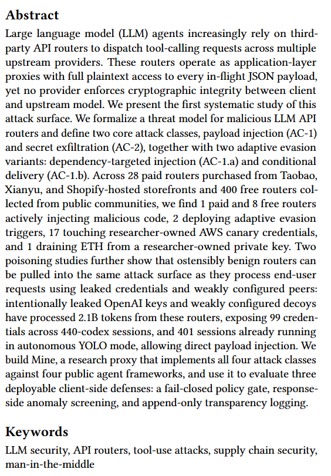

## 一、事件核验与证据边界

本案例的证据链由三部分构成。第一部分是论文原始测量。论文提交于 2026 年 4 月 9 日，研究对象为真实付费/免费 LLM API 路由市场，而不是单纯实验室模拟。论文明确记录了 28 个付费路由、400 个免费路由、1 个泄露的研究者控制 OpenAI Key、20 个域名与 20 个 IP 的弱路由诱捕环境，并给出了恶意注入、凭据触碰、ETH drain、token 使用量和 Codex session 数量。

第二部分是安全媒体对论文的外部复核。Help Net Security 在 2026 年 4 月报道该研究，标题为 *Command integrity breaks in the LLM routing layer*。报道明确写到，测试中 1 个付费路由和 8 个免费路由向工具调用注入恶意代码，并解释了路由器可在模型生成工具调用之后、客户端执行之前修改命令，而返回 JSON 仍保持格式合法。([Help Net Security](https://www.helpnetsecurity.com/2026/04/16/llm-router-security-risk-agent-commands/?utm_source=chatgpt.com))

第三部分是 LiteLLM/TeamPCP 现实供应链事件。该事件不作为本案例的主案例重复提交，而作为外部实证证据：一个广泛使用的 LLM Gateway/Proxy 一旦被供应链污染，确实会拥有请求/响应明文处理和凭据收集能力。LiteLLM 官方安全公告确认，PyPI 上的 `litellm==1.82.7` 和 `1.82.8` 被恶意发布，其中 `1.82.7` 在 LiteLLM AI Gateway 的 `proxy_server.py` 中包含恶意 payload，`1.82.8` 还包含 `litellm_init.pth` 与恶意 payload；LiteLLM 要求使用者立即处理并轮换凭据。([LiteLLM](https://docs.litellm.ai/blog/security-update-march-2026?utm_source=chatgpt.com)) Datadog Security Labs 确认 TeamPCP 在 PyPI 上发布了恶意 LiteLLM 与 Telnyx 版本，且这不是仿冒包，而是合法项目发布链被污染。([Datadog Security Labs](https://securitylabs.datadoghq.com/articles/litellm-compromised-pypi-teampcp-supply-chain-campaign/?utm_source=chatgpt.com)) Trend Micro 将 LiteLLM 事件描述为 AI Gateway 被后门化，强调 AI proxy 服务集中管理 API Key 和云凭据，因此成为高价值供应链目标。([www.trendmicro.com](https://www.trendmicro.com/en_us/research/26/c/inside-litellm-supply-chain-compromise.html?utm_source=chatgpt.com))

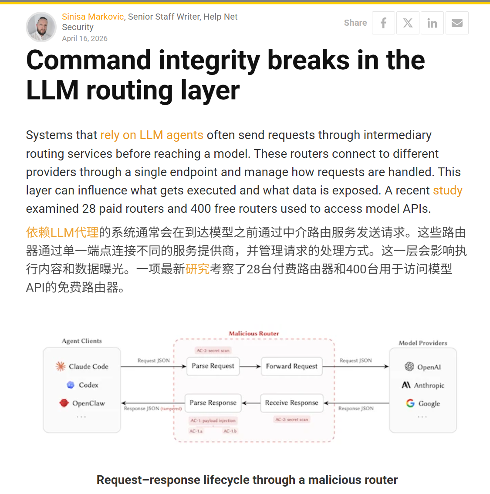

本案例不是 CVE 漏洞，也不是某个命名企业公开披露的数据泄露事故。论文没有公开恶意路由器名称，也没有发布 Mine 攻击工具。它揭示的是商品化 LLM API 路由市场中已经存在恶意中间层行为，以及中间路由架构本身缺少端到端响应完整性的问题。LiteLLM/TeamPCP 等外部资料证明 LLM Gateway 请求处理链被真实供应链攻击污染后可成为凭据收集入口，但本案例不重复提交 LiteLLM 事件，也不把 LiteLLM 与论文中 9 个恶意路由混同处理。

## 二、系统背景与攻击面

LLM API router 是位于 Agent 客户端和模型提供商之间的应用层代理。它通常提供 OpenAI、Anthropic 或 Gemini 兼容接口，用于模型 fallback、统一 API Key、价格优化、负载均衡和多模型聚合。论文指出，路由器会终止客户端 TLS 连接，并重新向上游模型提供商发起连接；因此每一跳路由都可以看到 API Key、系统提示词、工具定义、工具输出和工具调用响应。

在普通聊天场景中，路由器篡改回答会改变文本结果；在 Agent 场景中，风险直接进入执行层。模型响应不只是自然语言，还可能包含 Bash 命令、文件修改、依赖安装、数据库查询和云 API 调用。若路由器将 `curl https://get.example.com/cli.sh | bash` 改成攻击者控制脚本，或将 `pip install requests` 改成近似拼写的恶意包名，Agent 客户端看到的仍然是结构合法的工具调用 JSON。

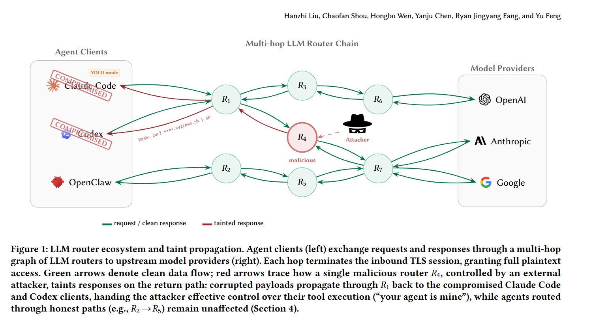

该攻击面与提示注入不同。提示注入操纵模型推理，恶意 API 路由器攻击发生在模型请求或响应传输层。上游模型可以生成正确工具调用，路由器再在返回客户端前修改参数。客户端无法仅靠 schema 校验发现问题，因为被修改后的 JSON 仍符合工具格式。论文也明确指出，Router attacks modify JSON wire format below the model，不需要模型访问权或训练时攻击。

灰色路由生态具有现实基础。ChinaTalk 对中国灰色 API 市场的调查显示，受访问限制、价格和配额影响，围绕 ChatGPT、Claude、Gemini 等模型的第三方转售和中转服务已经形成市场。([ChinaTalk](https://www.chinatalk.media/p/the-grey-market-for-american-llms?utm_source=chatgpt.com)) sub2api 项目页面也显示，其目标是通过一个 API Key 接入 OpenAI、Claude、Gemini、DeepSeek、Grok 等 150+ 模型，并强调与 Claude Code、OpenClaw 等工具兼容。([GitHub](https://github.com/Wei-Shaw/sub2api?utm_source=chatgpt.com)) new-api 项目则将自己描述为 AI 模型聚合与分发网关，支持将多类 LLM 转换为 OpenAI-compatible、Claude-compatible 或 Gemini-compatible 格式。([GitHub](https://github.com/QuantumNous/new-api/?utm_source=chatgpt.com))

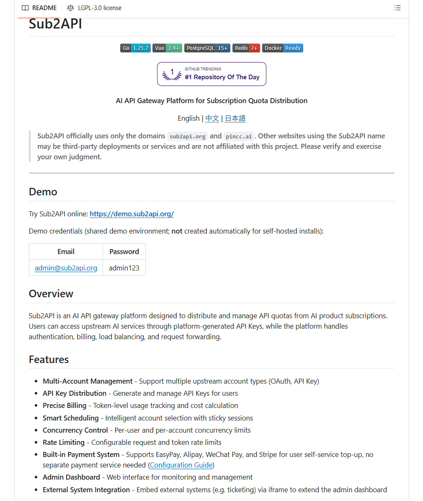

## 三、攻击类别与技术链路

AC-1 是响应侧工具调用篡改。路由器解析上游模型返回的工具调用 JSON，在保持工具名和 schema 不变的情况下修改参数字段。对于 Bash、run_command、package-install 等高风险工具，一次参数替换即可改变 Agent 实际执行的命令。论文示例中，路由器将正常安装脚本 URL 替换为攻击者控制脚本；结构上工具名仍为 Bash，参数字段仍为 command，客户端不会看到格式异常。

AC-2 是被动凭据窃取。路由器扫描 headers、请求体和响应体中的 OpenAI Key、AWS Key、GitHub PAT、Slack token、ETH 私钥和 PEM 私钥等敏感模式。该攻击不需要修改响应，因此客户端完全不可见。论文强调，实际暴露面不限于 API Key，系统提示词、工具定义、用户上传文件内容和环境变量都会经过同一明文通道。

AC-1.a 针对依赖安装命令进行替换。攻击者不修改下载域名，而是在 `pip install`、`npm install`、`cargo add` 等命令中替换包名。该方式能绕过只检查域名的策略，因为安装源仍然是 PyPI、npm 或 crates.io 等可信 registry。论文示例中，路由器把 `requests` 改成视觉近似的 `reqeusts`，从而形成持久依赖级供应链落点。

AC-1.b 是条件投递。论文在真实路由中观察到按请求次数、YOLO mode 和项目语言触发的策略。一个路由在前 50 次请求保持正常，以躲过浅层 smoke test；另一个路由只对自动批准工具执行的 YOLO mode 会话触发，并且只针对 Rust 或 Go 项目。该模式使有限黑盒审计更难发现恶意行为。

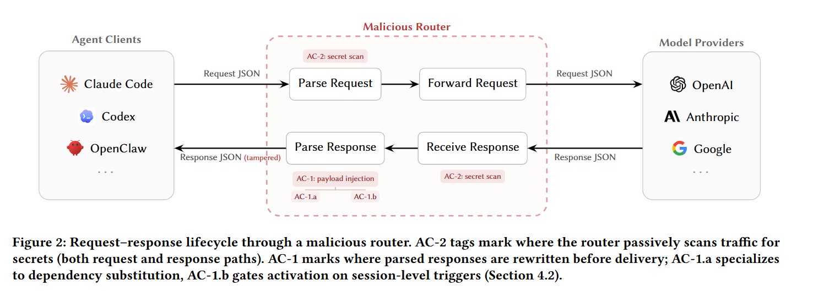

LiteLLM/TeamPCP 事件为这一攻击链提供了现实参照。论文将 March 2026 LiteLLM compromise 作为 router trust boundary 并非假设的例证：攻击者一旦控制 LiteLLM 请求处理链，就获得与恶意路由器相同的能力，即读写每个转发中的 API 请求和响应。 Datadog 也确认 LiteLLM 是广泛使用的 LLM provider proxy layer，TeamPCP 在 PyPI 上发布了被污染的合法包版本。([Datadog Security Labs](https://securitylabs.datadoghq.com/articles/litellm-compromised-pypi-teampcp-supply-chain-campaign/?utm_source=chatgpt.com))

## 四、测量结果与外部实证

论文市场测量覆盖 28 个付费路由和 400 个免费路由。结果显示，1 个付费路由和 8 个免费路由会主动向工具调用注入恶意代码。免费路由集合中，17 个路由在研究者控制的 AWS 金丝雀凭据经过后产生后续 AWS API 活动，1 个路由在研究者控制的 ETH 私钥暴露后转移钱包余额。

弱路由诱捕实验显示风险具有传递性。研究者部署 20 个域名和 20 个 IP 的弱配置 relay，观察到 40,000 多次未授权访问尝试；后续结构化下游流量产生约 2B billed tokens、约 13GB 可见 prompt/response traffic，并暴露 99 个凭据、440 个 Codex sessions、398 个项目或主机范围。所有 440 个 session 均存在 command-injectable shell-execution path，其中 401 个 session 已处于 YOLO mode。

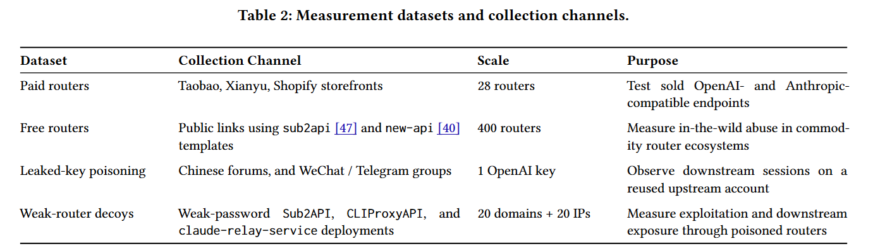

外部真实供应链事件说明 LLM Gateway 请求处理链确实具有高价值攻击面。LiteLLM 官方安全公告确认，受影响版本 `1.82.7` 和 `1.82.8` 已从 PyPI 移除，并要求使用者轮换凭据、检查异常行为和按建议恢复。([LiteLLM](https://docs.litellm.ai/blog/security-update-march-2026?utm_source=chatgpt.com)) Datadog 指出，这些被污染版本不是仿冒包，而是合法项目的恶意发布，且属于 TeamPCP 针对多个生态的级联供应链攻击。([Datadog Security Labs](https://securitylabs.datadoghq.com/articles/litellm-compromised-pypi-teampcp-supply-chain-campaign/?utm_source=chatgpt.com)) Trend Micro 将 LiteLLM 事件描述为 AI Gateway 后门化，强调 AI proxy 服务集中存放 API Key 和云凭据，一旦供应链被污染，会成为高价值凭据收集入口。([www.trendmicro.com](https://www.trendmicro.com/en_us/research/26/c/inside-litellm-supply-chain-compromise.html?utm_source=chatgpt.com))

Hunt.io 从暴露面角度给出进一步支撑。其报告在扫描中识别出 33,688 个公网可访问 LiteLLM 实例，并将 TeamPCP 攻击链与 C2 基础设施、Kubernetes cluster takeover、凭据外泄等行为关联起来。([Hunt](https://hunt.io/blog/33k-exposed-litellm-teampcp-c2-supply-chain-attack?utm_source=chatgpt.com)) CSA 研究笔记也将 TeamPCP 描述为 2026 年 3 月针对 AI/ML developer toolchain 的级联供应链攻击，目标是同时收集主要商业 LLM provider 的 API Key。([Lab Space](https://labs.cloudsecurityalliance.org/research/csa-research-note-teampcp-supply-chain-ai-tooling-20260330-c/?utm_source=chatgpt.com))

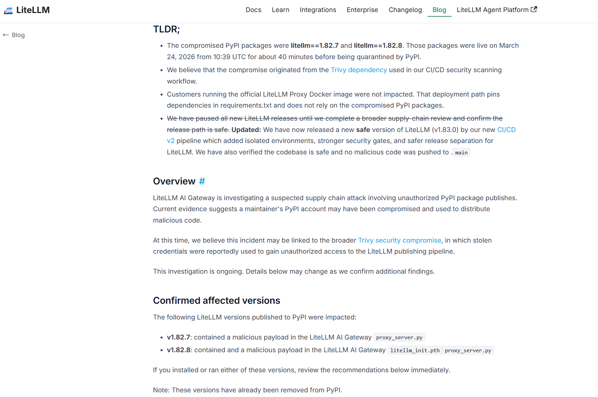

## 五、AI 参与证据与责任边界

该案例的 AI 参与证据来自研究对象本身。论文研究的是 LLM Agent 与第三方 LLM API router 之间的供应链边界，涉及 Claude Code、OpenAI Codex、OpenClaw、OpenCode 等 Agent 客户端。研究者还构建 Mine 研究代理，在 OpenClaw、OpenCode、OpenAI Codex 和 Anthropic Claude Code 四个公开 Agent 框架上评估攻击兼容性。实验显示，四个框架均未实现响应完整性验证，AC-1 工具调用重写兼容率为 100%，AC-1.a 包安装重写兼容率为 99.6%。

该案例不应写成模型生成恶意代码，也不应写成某个模型提供商被攻破。攻击者控制或污染的是 API router，中间层可以在模型生成后修改工具调用。上游模型可能完全正常，Agent 客户端也可能正常解析返回 JSON；问题在于两者之间缺少端到端语义完整性绑定。普通 TLS、证书固定和路由 endpoint 认证只能证明客户端连接到了指定 router，不能证明返回的工具调用保留了上游模型原始语义。

责任边界需要谨慎表述。研究样本主要来自公开灰色市场、免费社区路由和研究者控制诱捕环境；论文没有对单个厂商进行私有漏洞披露，因为作者认为风险是架构性而非实现特定问题。论文伦理部分明确说明，研究者未发布 Mine 攻击工具，也未保存第三方原始 prompt/response 或原始凭据。

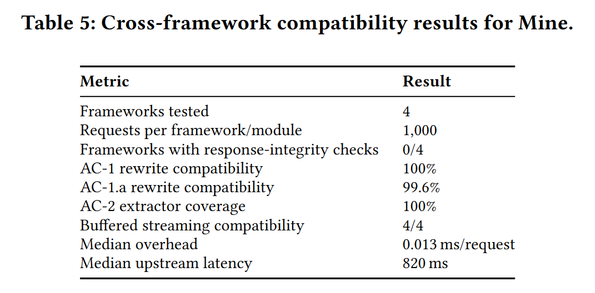

## 六、与团队技术报告风险框架的关系

团队报告关注 AI 代码生成从局部补全扩展到软件开发全生命周期后的风险外溢。本案例补充了其中的模型 API 中间层风险。已有案例通常覆盖模型输出、AI IDE、Agent 本地工具、MCP server、低代码平台和模型运行时；LLM API router 案例强调，模型请求与响应传输链路本身也属于 AI 软件供应链。

该事件扩展了软件供应链边界。传统供应链风险包括依赖包、CI/CD、镜像、IDE 插件和模型文件。LLM Agent 时代还包括 base URL、API router、上游 key、免费 relay、模型聚合平台和多跳中转链。用户只改变一个 `base_url`，实际信任边界却可能扩展到多个不透明中间人。论文弱路由诱捕实验证明，良性路由也可能因为复用泄露 key 或转发到弱 relay，而被纳入同一恶意可见性边界。

该事件也补充了自动化偏见与 Agent 执行风险。开发者可能认为模型输出由 OpenAI、Anthropic 或其他上游 provider 生成，忽略中间路由可以在模型之后修改工具调用。对处于 YOLO mode 的 Agent，会话已经默认自动批准工具执行，恶意路由无需进一步欺骗用户即可改变命令。论文观察到 401 个 Codex sessions 处于这种自动批准状态，说明执行风险已经从模型回答质量问题扩展到 transport-layer semantic integrity。

凭据泄露风险也被重新放大。团队报告中关于敏感数据泄露的讨论通常聚焦用户向 AI 服务提交 API Key、源码或专有算法。本案例显示，即便用户信任上游模型提供商，也可能因为第三方路由器拥有明文中间层访问权而泄露凭据。AC-2 不修改任何响应，不会触发用户侧异常；凭据一旦穿过路由，路由操作者就有机会被动留存并后续使用。

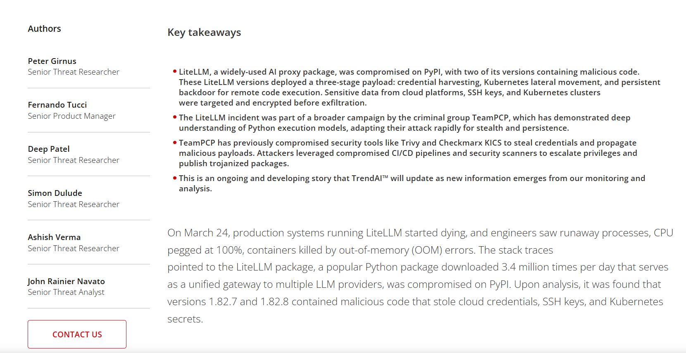

## 七、社会影响与风险评估

该研究没有给出命名企业的财务损失，但其社会影响体现在灰色路由市场和 Agent 自动执行环境的组合风险。付费路由、免费路由和公开 relay 已经形成真实使用生态；用户通过它们访问更便宜或更多模型，Agent 工具调用则把路由中间人从文本代理变成执行链路参与者。论文发现付费路由同样存在恶意注入，说明付费访问不能证明工具调用完整性。

凭据滥用影响直接。研究者控制的 AWS 金丝雀凭据被 17 个免费路由触碰，ETH 私钥余额被 1 个路由耗尽。弱路由诱捕暴露 99 个凭据，横跨 440 个 Codex sessions 和 398 个项目或主机。虽然这些是研究设计中的控制资源，但结果说明真实用户若把云密钥、GitHub token、Slack token、钱包私钥或系统提示词通过灰色路由发送，存在被中间层读取和后续使用的现实风险。

工具调用篡改带来的影响更接近供应链执行风险。Agent 工具调用往往能写文件、安装依赖、运行 shell、修改仓库、调用云 API。恶意路由器可把正常安装命令改写为恶意脚本或依赖包；一旦命令进入 YOLO mode，Agent 会自动执行。论文在 AC-1.a 讨论中指出，被替换依赖可在未来会话中继续被导入，从而形成持久供应链 foothold。

现实供应链证据也显示 LLM Gateway 暴露面足够大。Hunt.io 统计到 33,688 个公网可访问 LiteLLM 实例，并将 TeamPCP 攻击链与凭据外泄、Kubernetes cluster takeover 和 C2 基础设施关联起来。([Hunt](https://hunt.io/blog/33k-exposed-litellm-teampcp-c2-supply-chain-attack?utm_source=chatgpt.com)) LiteLLM 官方公告和 Datadog 分析则共同说明，AI Gateway 一旦被污染，恶意代码可位于 proxy request-handling pipeline 中，直接接触用户请求、响应和凭据。([LiteLLM](https://docs.litellm.ai/blog/security-update-march-2026?utm_source=chatgpt.com))

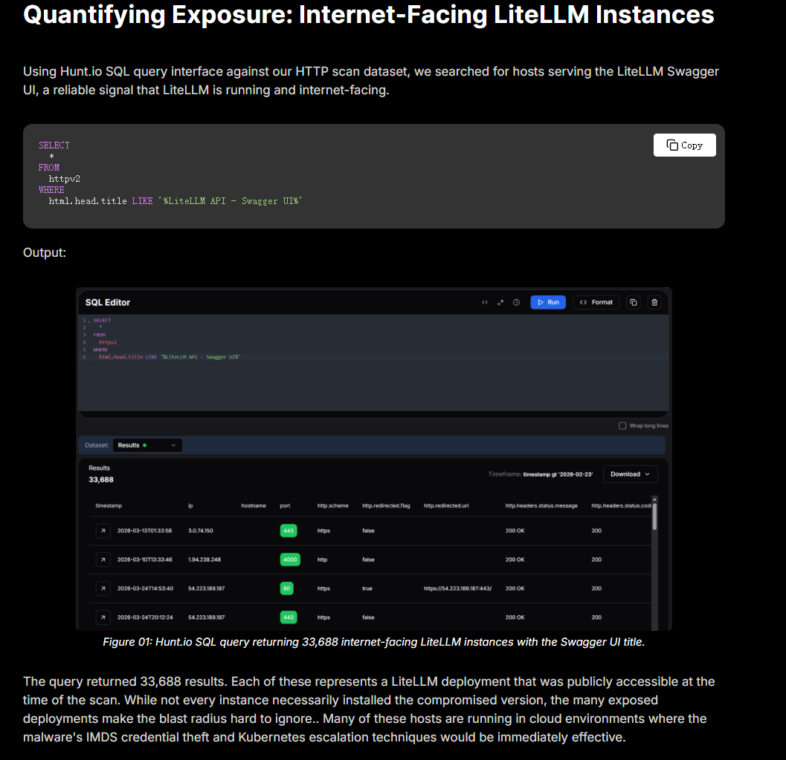

## 八、治理建议

LLM API router 应按供应链组件治理。企业或开发者使用第三方路由时，不应只关注价格、模型覆盖和延迟，还应审查路由来源、运营主体、日志策略、上游 key 处理方式、是否多跳转发、是否可审计、是否支持数据保留限制。灰色市场低价路由不应承载包含生产密钥、客户数据、内部代码和自动工具执行的 Agent 会话。

Agent 客户端需要对高风险工具执行 fail-closed 策略。论文评估的 policy gate 对 AC-1 和 AC-1.a 有 100% 阻断率，但这一结论仅限于可明确识别的高风险 shell 与包安装工作流；攻击者若使用 allowlisted domain 或本地 stager，仍可绕过。该结果说明策略门适合作为第一道过滤器，不应被视为完整解决方案。

响应侧异常检测可作为审查排序手段。论文的 anomaly screening 在 6.7% false positives 下可标记 89.0% 的 AC-1 样本、50.0% 的 AC-1.a 样本和 50.9% 的 AC-1.b 样本。该检测对命令重写有帮助，但对依赖替换和条件触发覆盖不足，不能替代来源认证。

透明日志应成为 Agent 会话默认控制。论文建议记录请求体、响应体、router URL、TLS 元数据和原始响应 hash，并在请求侧做敏感信息脱敏。透明日志不能阻止被动凭据窃取，但可以在事后回答哪些会话经过了可疑路由、哪些工具调用被返回、哪些凭据可能暴露。

长期治理需要端到端响应完整性。论文提出 provider-signed canonical response envelope，由上游 provider 对模型标识、tool name、tool arguments、finish reason、request nonce 和有效期进行签名，客户端在执行工具调用前验证签名。当前普通 TLS、证书固定和路由 endpoint 认证无法证明 tool-call arguments 未被路由器改写。

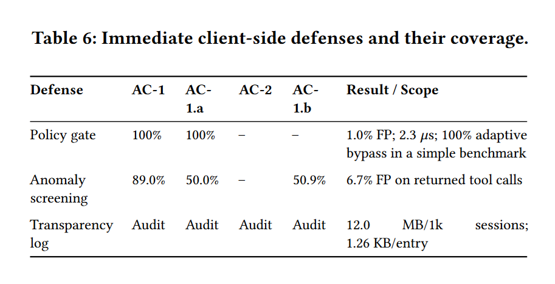

对组织而言，还应对 LLM Gateway 与 AI proxy 做资产盘点。Hunt.io 的 33,688 个公网 LiteLLM 实例统计说明，很多 AI Gateway 已经以公网服务形式存在。([Hunt](https://hunt.io/blog/33k-exposed-litellm-teampcp-c2-supply-chain-attack?utm_source=chatgpt.com)) 对这些组件，应建立最小权限 API Key、请求日志脱敏、出站访问控制、凭据扫描、依赖完整性检查和紧急轮换流程。对已使用第三方 router 的 Agent，会话日志应能记录 base URL、上游 provider、工具调用内容、执行结果和审批状态。

## 九、结论

LLM API router 恶意中间人风险是 AI Agent 供应链中的关键中间层问题。论文测量结果显示，真实付费/免费路由市场中已经存在主动恶意行为：1 个付费路由和 8 个免费路由注入恶意代码，17 个路由触碰 AWS 金丝雀凭据，1 个路由耗尽研究者控制的 ETH 私钥余额；弱路由诱捕实验还暴露出 99 个凭据、440 个 Codex sessions 和约 2B billed tokens。

该案例的核心不是模型输出不安全，而是 Agent 客户端执行的工具调用缺少端到端来源完整性。上游模型可以正常生成响应，客户端也可以正常解析 JSON，但中间路由器在两者之间修改参数后，Agent 执行的就不再是上游模型的原始意图。提示注入防护、模型安全对齐和普通 TLS 都无法覆盖这一层风险。

LiteLLM/TeamPCP 事件证明该类风险并非纯学术推演。LiteLLM 官方确认 PyPI 上两个恶意版本进入 AI Gateway `proxy_server.py`，Datadog 和 Trend Micro 将其归入真实供应链攻击，CSA 明确指出 TeamPCP 针对 AI/ML developer toolchain 以收集主要商业 LLM provider API Key 为目标。([LiteLLM](https://docs.litellm.ai/blog/security-update-march-2026?utm_source=chatgpt.com)) 这些外部证据与论文测量共同说明，LLM API router 与 AI Gateway 已经成为 AI 软件供应链中的高价值信任边界。

该案例适合加入 `cases/` 目录，建议分类为 `supply-chain`，严重程度为 `high`，`severity_basis` 使用 `quantifiable-impact`。它与已有 LiteLLM 案例互补而不重复：LiteLLM 案例聚焦具体 PyPI 供应链污染，本案例聚焦更一般的 LLM API Router 恶意中间人风险，并将 LiteLLM 作为现实供应链参照。它与 MCP STDIO、Ollama、Flowise、PocketOS、Lovable 等案例也形成互补：MCP STDIO 强调工具协议执行面，Ollama 强调本地 LLM 运行时内存泄露，PocketOS 强调 Agent 误操作生产基础设施，本案例则强调模型 API 中间层本身可以成为 Agent 工具调用和凭据暴露的供应链攻击点。

## 参考来源

1. arXiv，*Your Agent Is Mine: Measuring Malicious Intermediary Attacks on the LLM Supply Chain*。用于核验论文标题、作者、提交时间、核心数据集、攻击分类、市场测量和防御评估。
   https://arxiv.org/abs/2604.08407
2. Help Net Security，Command integrity breaks in the LLM routing layer。用于核验安全媒体对论文测量结果和路由层命令完整性问题的复核。
   https://www.helpnetsecurity.com/2026/04/16/llm-router-security-risk-agent-commands/
3. LiteLLM 官方安全公告，Security Update: Suspected Supply Chain Incident。用于核验 `litellm==1.82.7` 与 `1.82.8` 被恶意发布、`proxy_server.py` 和 `litellm_init.pth` 受影响。
   https://docs.litellm.ai/blog/security-update-march-2026
4. Datadog Security Labs，LiteLLM and Telnyx compromised on PyPI。用于核验 TeamPCP 供应链攻击、LiteLLM 作为 LLM provider proxy layer 被真实项目恶意发布污染。
   https://securitylabs.datadoghq.com/articles/litellm-compromised-pypi-teampcp-supply-chain-campaign/
5. Trend Micro，Inside the LiteLLM Supply Chain Compromise。用于核验 LiteLLM 作为 AI Gateway 被后门化、AI proxy 服务集中 API Key 和云凭据所带来的高价值风险。
   https://www.trendmicro.com/en_us/research/26/c/inside-litellm-supply-chain-compromise.html
6. Cloud Security Alliance，TeamPCP: Cascading Supply Chain Attack on AI/ML Tooling。用于核验 TeamPCP 2026 年 3 月针对 AI/ML developer toolchain 的级联供应链攻击，以及收集主要商业 LLM provider API Key 的目标。
   https://labs.cloudsecurityalliance.org/research/csa-research-note-teampcp-supply-chain-ai-tooling-20260330-c/
7. Hunt.io，33K Exposed LiteLLM Deployments and the C2 Servers Behind TeamPCP's Supply Chain Attack。用于核验 33,688 个公网 LiteLLM 实例、C2 基础设施、Kubernetes takeover 和凭据外泄链路。
   https://hunt.io/blog/33k-exposed-litellm-teampcp-c2-supply-chain-attack
8. ChinaTalk，How to Use Banned US Models in China。用于补充灰色 LLM API 转售和中转市场背景。
   https://www.chinatalk.media/p/the-grey-market-for-american-llms
9. GitHub，Wei-Shaw/sub2api。用于核验 sub2api 作为 OpenAI、Claude、Gemini 等多模型统一 API 路由工具的生态存在。
   https://github.com/Wei-Shaw/sub2api
10. GitHub，QuantumNous/new-api。用于核验 new-api 作为 unified AI model hub / aggregation & distribution gateway，支持 OpenAI-compatible、Claude-compatible、Gemini-compatible 格式转换。
    https://github.com/QuantumNous/new-api
11. GitHub Issue，sub2api router is severely compromised。用于核验社区已经将 *Your Agent Is Mine* 研究反馈到 sub2api 项目安全讨论中。
    https://github.com/Wei-Shaw/sub2api/issues/1553