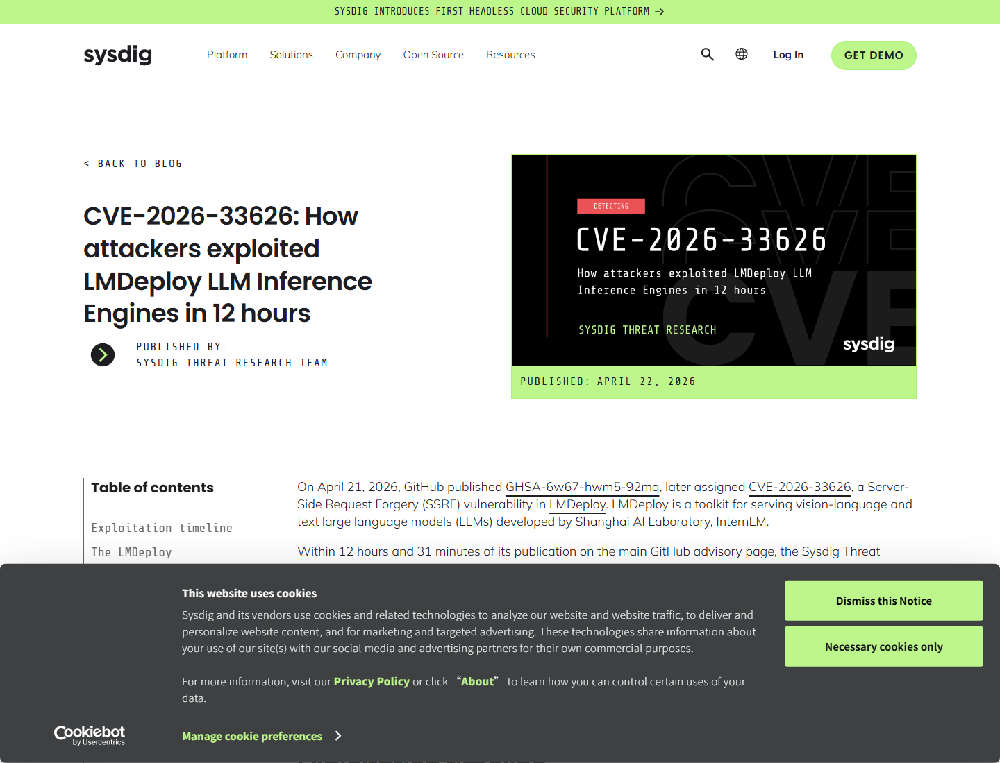
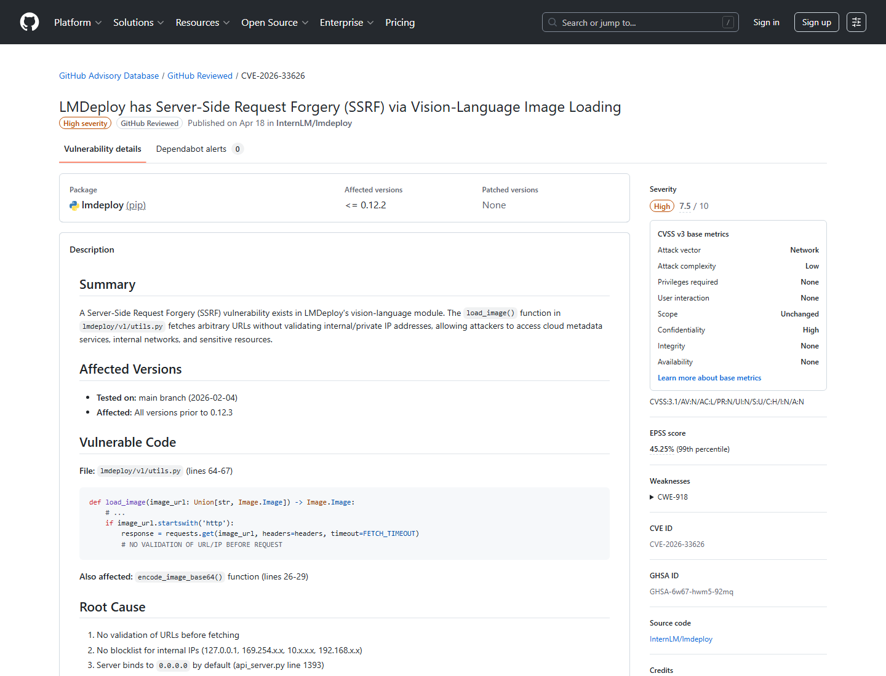
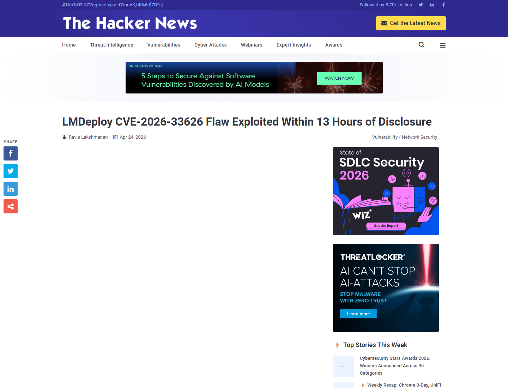
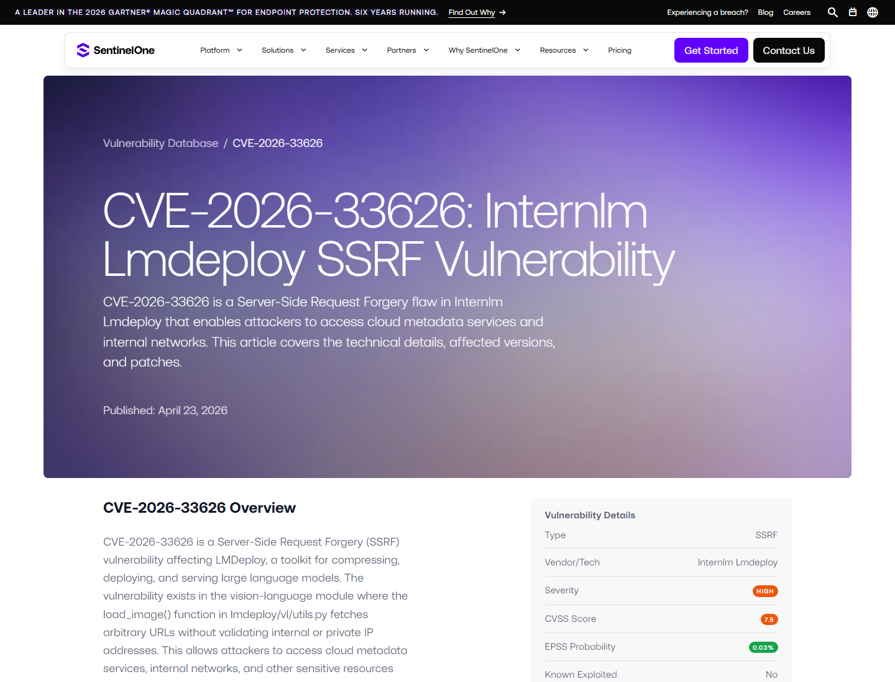
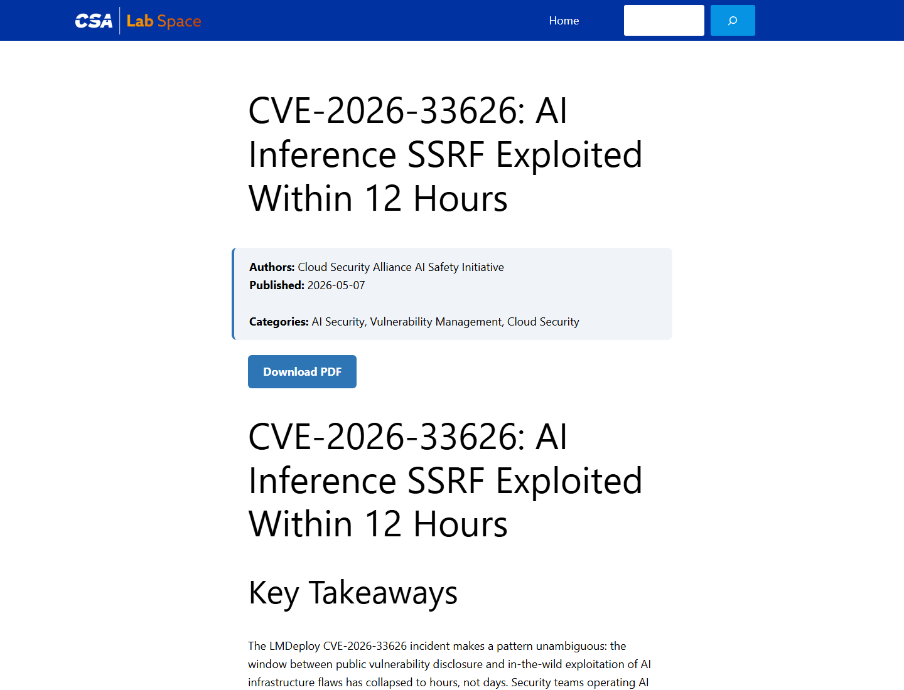
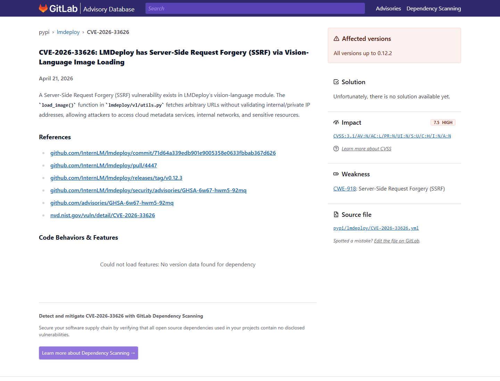

# LMDeploy Vision Image URL SSRF Exploitation (2026)
> LMDeploy 视觉模型 image_url SSRF 利用

| Field | Value |
|---|---|
| Category | Domain-Specific Risks |
| Severity | High |
| AI Tool | LMDeploy, vision-language model serving, OpenAI-compatible inference API |
| Language | Python |
| Real Incident | Yes |
| Reproducible | Yes |
| Disclosed | 2026-04-21 |
| CVE | CVE-2026-33626 |
| CVSS | 7.5 |

## TL;DR
LMDeploy's vision-language image loader fetched attacker-controlled `image_url` values without blocking internal addresses; attackers quickly used the inference endpoint as an SSRF probe against metadata and internal services.
> 这个案例说明，视觉模型的图片加载接口也是服务器端请求能力。攻击者把 `image_url` 指向内网或云 metadata，就能让 AI 推理服务器替自己探测本来不可达的资源。

---

## 详细分析 / Full Analysis

# LMDeploy CVE-2026-33626 案例分析：视觉 LLM image_url 加载与云推理节点 SSRF

## 基本信息

LMDeploy 是 InternLM / Shanghai AI Laboratory 生态中的 LLM 部署与推理工具，可用于压缩、部署和服务文本及视觉语言模型，并提供 OpenAI-compatible HTTP API。视觉语言模型通常允许用户在 chat completion 中提供 `image_url`，服务端随后拉取图片并送入模型上下文。CVE-2026-33626 就出在这条路径上：图片 URL 拉取缺少对内网、私有地址和云 metadata endpoint 的有效过滤。

Sysdig Threat Research Team 报告称，在 GHSA-6w67-hwm5-92mq 发布到 GitHub Advisory 页面后 12 小时 31 分钟，其 honeypot 观察到针对 LMDeploy 的利用尝试。攻击者不是只验证漏洞，而是在 8 分钟内把 vision-language image loader 当作 HTTP SSRF primitive，扫描 AWS IMDS、Redis、MySQL、二级 HTTP 管理界面和 OOB DNS exfiltration endpoint。[Sysdig](https://www.sysdig.com/blog/cve-2026-33626-how-attackers-exploited-lmdeploy-llm-inference-engines-in-12-hours)

## 一、事件核验与证据范围

### 证据矩阵

| 来源 | 类型 | 证明内容 | 备注 |
|---|---|---|---|
| Sysdig | 攻击观测 / 技术证据 | 12 小时 31 分钟 exploitation、honeypot、IMDS/Redis/MySQL/内网探测 | 真实利用观测 |
| GitHub Advisory | 主证据 | GHSA-6w67-hwm5-92mq、影响版本、修复版本、SSRF 描述 | 漏洞主记录 |
| The Hacker News | 复核证据 | 高危 LMDeploy SSRF 在 13 小时内被利用 | 媒体复核 |
| SentinelOne / GitLab Advisory | 技术复核 | `load_image()` / vision-language module、内部地址和 metadata 风险 | 第三方复核 |
| Cloud Security Alliance | 风险分析 | AI inference SSRF、云凭据、快速武器化趋势 | 行业分析 |
| NVD | 数据库证据 | CVE-2026-33626、CWE-918、CVSS 7.5 | 标准化记录 |

GitHub Advisory 对问题的核心描述是：LMDeploy 0.12.3 之前版本在 vision-language module 中存在 SSRF，`load_image()` 会获取任意 URL，但没有校验内部或私有 IP 地址。修复版本 0.12.3 增加了安全 URL 检查，阻断私有地址、localhost 和 metadata 这类危险目的地。[GitHub Advisory](https://github.com/advisories/GHSA-6w67-hwm5-92mq)

## 二、系统背景与触发条件

视觉语言模型服务常见的请求格式，是用户在 messages 中提供图片 URL，服务端把图片下载后交给模型推理。这个设计把“模型输入”扩展成“服务端出网请求”。如果服务端运行在云 GPU 实例或企业内网里，能访问的资源就比外部攻击者多得多：metadata service、内部 Redis、数据库、监控面板、对象存储内网地址和管理接口都可能位于同一网络边界内。

攻击触发方式很直接。攻击者向 LMDeploy 的 OpenAI-compatible vision endpoint 提交包含 `image_url` 的请求，把 URL 指向 `169.254.169.254`、`localhost`、RFC1918 私网地址或攻击者控制的 OOB 域名。服务端若没有 `_is_safe_url()` 一类校验，就会替攻击者发起请求，并把响应或行为差异变成探测信号。

## 三、攻击链与处置过程

Sysdig 观察到的会话展示了 SSRF 的现实用途。攻击者先试探云 metadata，再探测本机和内网服务端口，还使用 OOB DNS 观察是否能触发外带请求。对 AI inference 节点来说，GPU 实例常被赋予读取模型 artifact、访问训练数据、写日志或拉取私有对象存储的 IAM 权限；一次 metadata SSRF 可能就足以泄露临时云凭据。

处置上，LMDeploy 0.12.3 修复了该问题。第三方复核材料提到补丁引入 `_is_safe_url()`，在 HTTP 拉取前检查目标是否为安全 URL，避免内部和私有地址被服务器端请求触达。防御方还需要审计推理服务器的出网日志、metadata 访问、异常 image URL 和云凭据使用记录。

## 四、技术根因分析

根因是图片加载函数把用户输入 URL 当作普通外部图片处理，没有把它视为网络访问能力。对 Web 应用来说，这是经典 SSRF；对视觉 LLM 服务来说，它更隐蔽，因为 `image_url` 看起来是模型输入的一部分。模型服务越接近 OpenAI-compatible API，开发者越容易把它按“推理接口”而非“Web 服务器”治理。

第二个根因是 AI 推理节点通常位于高价值网络位置。它们有 GPU、模型权重、数据集、对象存储凭据和内部监控访问权。SSRF 不需要控制模型，也不需要读写权重；只要能让推理进程出网访问内部地址，就能把 AI 服务器变成内网探针。

## 五、AI 参与方式与风险归因

AI 参与点在视觉模型输入机制。攻击者没有攻击模型推理算法，而是利用模型服务为了支持图片输入而提供的 URL dereference 能力。`image_url` 从语义上属于“用户给模型看的图片”，从系统安全角度却是“服务端要去请求的地址”。这两种视角差异造成了漏洞。

风险归因应落在 inference server 的输入校验和网络隔离上。视觉 LLM endpoint 应该只接受可控来源、对象存储签名 URL 或经过代理拉取的图片，而不应让任意用户 URL 直接由 GPU 服务器访问。SentinelOne 和 GitLab advisory 都将问题归纳为 vision-language module 的 URL 验证缺失。[SentinelOne](https://www.sentinelone.com/vulnerability-database/cve-2026-33626/)

## 六、与团队技术报告风险框架的关系

团队技术报告关注 AI 基础设施的运行时风险。LMDeploy 这个案例说明，模型服务接口并非只有 prompt 和 token 参数；多模态输入会把图片、音频、文件和 URL 都接进推理链路。每一种“输入”都可能对应一个传统安全 sink：文件解析、URL 拉取、对象存储访问或本地解码。

这也说明 AI 服务的边界要从“模型输出安全”扩展到“输入预处理安全”。图像加载器、media fetcher、模型前处理器和 OpenAI-compatible wrapper 都应纳入 SSRF、路径遍历、反序列化和文件格式攻击测试。

## 七、影响范围与社会后果

LMDeploy 的绝对安装规模可能不如 vLLM、Ollama 或 Langflow，但 Sysdig 的时间线显示，小众 AI 基础设施漏洞也会很快被武器化。攻击者不需要等待公开 PoC；GHSA 中包含的文件名、参数名和缺失校验说明，已经足够构造工作 payload。

社会后果在于云 AI 推理节点的权限集中。企业为了让推理服务读取模型权重、缓存数据和内部服务，常给它较宽的 IAM 和网络权限。SSRF 一旦命中，就可能暴露云凭据、内网服务和数据管道，影响远超单次模型请求。

## 八、治理建议

LMDeploy 用户应升级到 0.12.3 或更高版本，并检查是否存在暴露的 vision-language endpoint。推理服务应限制出网，阻断访问 metadata endpoint、localhost、RFC1918 私网和非必要端口；云环境中应启用 IMDSv2、限制 metadata hop、最小化实例角色权限，并监控 metadata 访问。

平台侧应把多模态 URL 输入改为安全下载代理或 allowlist 机制，不让模型服务器直接请求任意 URL。对 image URL，应执行 scheme、DNS、重定向、解析后 IP、私网网段、IPv6、localhost、短域名和 DNS rebinding 检查。日志中应记录每一次 media fetch 的原始 URL、解析 IP 和阻断原因，便于事后审计。

## 九、结论

CVE-2026-33626 展示了视觉 LLM 推理服务的典型安全陷阱：图片 URL 看似只是模型输入，实际却是服务端网络请求。LMDeploy 的漏洞让攻击者把 inference endpoint 变成内网探针，并在数小时内用于 metadata 和内部服务扫描。多模态 AI 服务必须把 media loading 当作高敏感执行路径，而不是普通数据预处理。

## 参考来源

- [Sysdig: LMDeploy exploited in 12 hours](https://www.sysdig.com/blog/cve-2026-33626-how-attackers-exploited-lmdeploy-llm-inference-engines-in-12-hours)
- [GitHub Advisory Database: GHSA-6w67-hwm5-92mq](https://github.com/advisories/GHSA-6w67-hwm5-92mq)
- [The Hacker News: LMDeploy flaw exploited within 13 hours](https://thehackernews.com/2026/04/lmdeploy-cve-2026-33626-flaw-exploited.html)
- [SentinelOne: CVE-2026-33626 LMDeploy SSRF](https://www.sentinelone.com/vulnerability-database/cve-2026-33626/)
- [Cloud Security Alliance: AI inference SSRF exploited within 12 hours](https://labs.cloudsecurityalliance.org/research/csa-research-note-lmdeploy-cve-2026-33626-ai-inference-explo/)
- [GitLab Advisory: CVE-2026-33626](https://advisories.gitlab.com/pypi/lmdeploy/CVE-2026-33626/)
- [NVD: CVE-2026-33626](https://nvd.nist.gov/vuln/detail/CVE-2026-33626)
