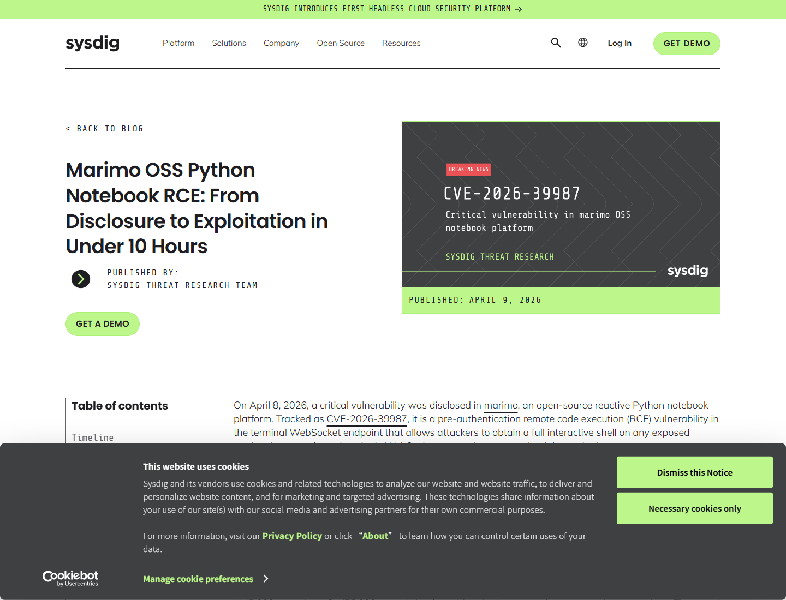
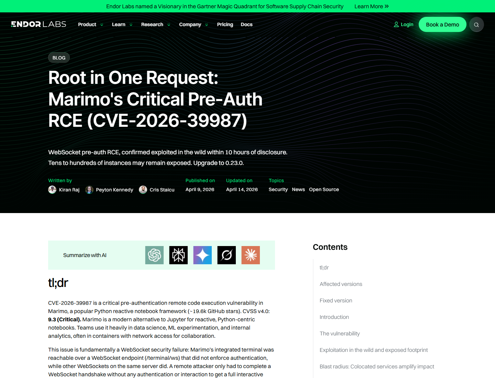
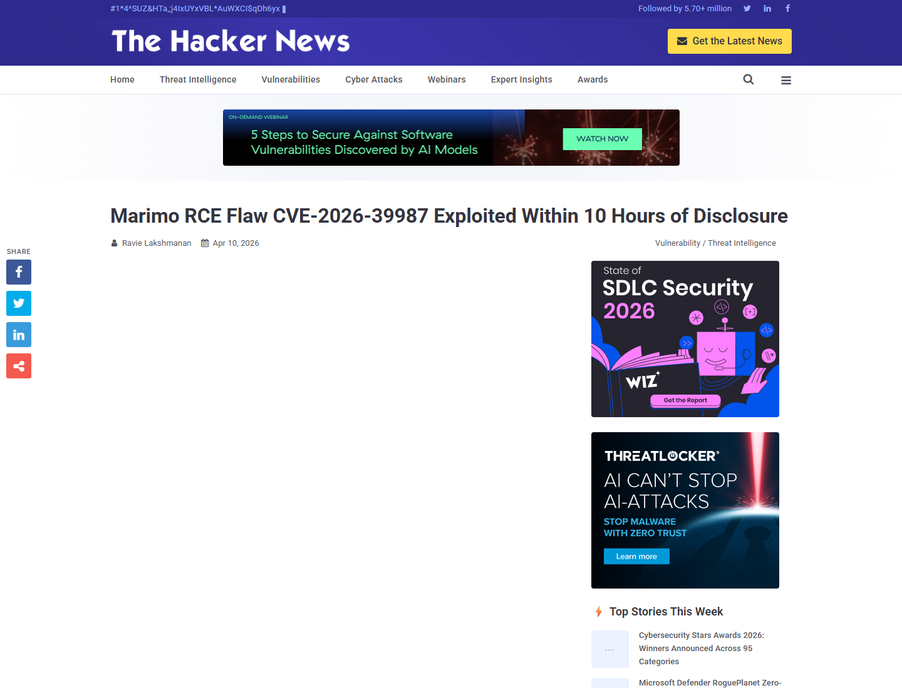
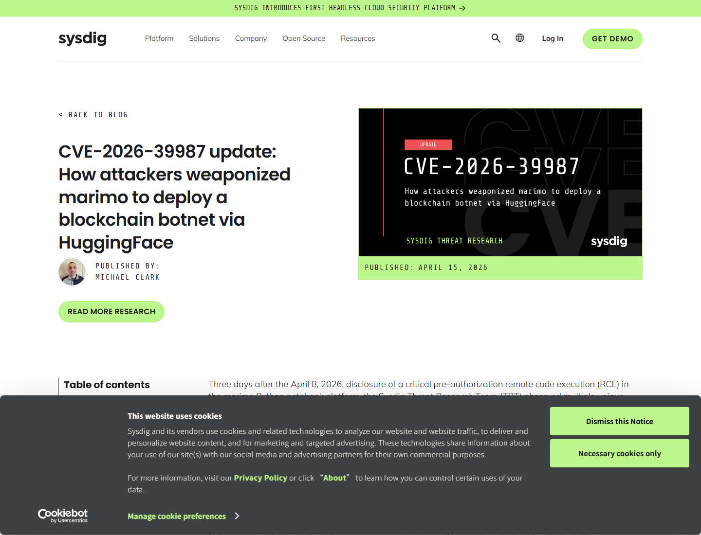
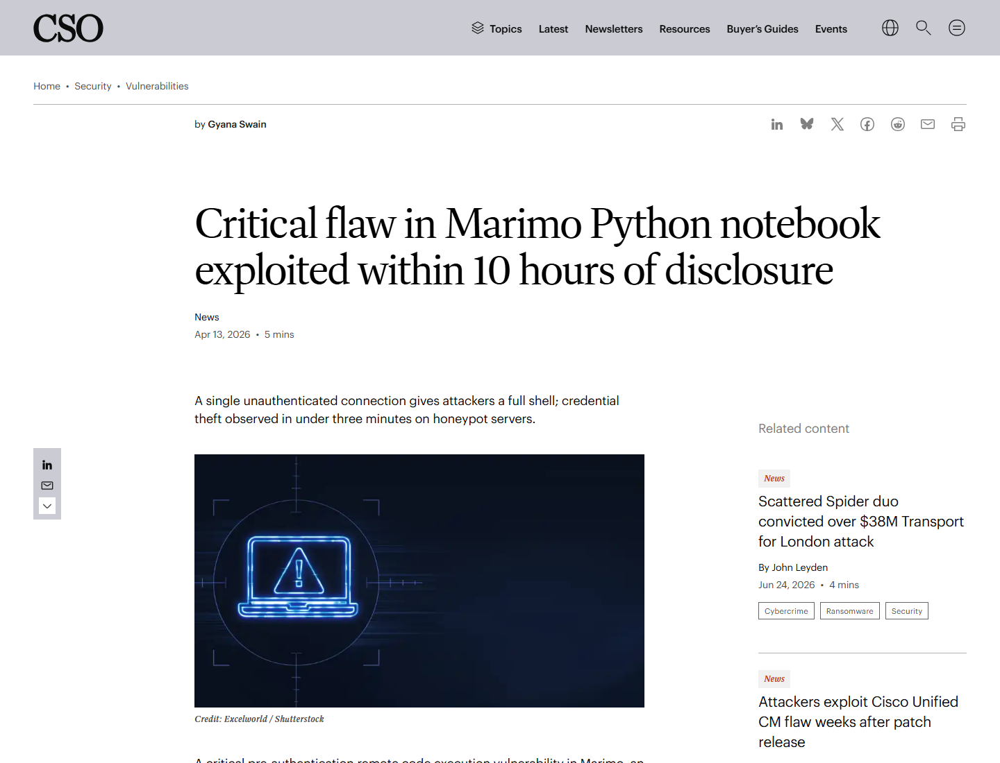

# marimo Terminal WebSocket Pre-Auth RCE (2026)
> marimo 终端 WebSocket 预认证远程代码执行

| Field | Value |
|---|---|
| Category | Domain-Specific Risks |
| Severity | Critical |
| AI Tool | marimo, reactive Python notebook, AI/data science workflow |
| Language | Python |
| Real Incident | Yes |
| Reproducible | Yes |
| Disclosed | 2026-04-08 |
| CVE | CVE-2026-39987 |
| CVSS | 9.3 |

## TL;DR
marimo's `/terminal/ws` endpoint accepted unauthenticated WebSocket connections and spawned a PTY shell; attackers exploited exposed notebook servers within hours and stole credentials from data-science environments.
> marimo 的问题很直接：其他 WebSocket 会走认证，终端 WebSocket 却跳过了认证。攻击者只要连上 `/terminal/ws`，就能获得交互式 shell。

---

## 详细分析 / Full Analysis

# marimo CVE-2026-39987 案例分析：AI notebook 终端 WebSocket 的预认证 RCE

## 基本信息

marimo 是一个 reactive Python notebook 平台，常被用在数据科学、机器学习、AI 原型和交互式数据应用中。Notebook 环境的特殊之处在于，它经常贴近数据、凭据和实验代码：`.env`、云访问 key、数据库连接、模型 API key、训练数据路径和内部服务地址都可能在同一工作目录或运行环境中。CVE-2026-39987 命中了 marimo 的终端能力，影响 0.23.0 之前版本。

Sysdig 的观测显示，GHSA 发布后 9 小时 41 分钟就出现了针对 marimo 的利用尝试，攻击者通过未认证终端 endpoint 获取 shell，并在不到 3 分钟内完成 `.env` 凭据窃取。该报告强调，攻击者不需要公开 PoC，advisory 中给出的 endpoint 路径和缺失认证说明已足以构造利用。[Sysdig](https://www.sysdig.com/blog/marimo-oss-python-notebook-rce-from-disclosure-to-exploitation-in-under-10-hours)

## 一、事件核验与证据范围

### 证据矩阵

| 来源 | 类型 | 证明内容 | 备注 |
|---|---|---|---|
| marimo GitHub Advisory | 主证据 | `/terminal/ws` 缺少 authentication validation，可获得 full PTY shell | 项目 advisory |
| NVD | 主证据 | CVE-2026-39987、0.23.0 修复、pre-auth RCE 描述 | 标准化记录 |
| Endor Labs | 技术分析 | Root in one request、受影响实例、升级到 0.23.0 | 独立分析 |
| Sysdig 初始报告 | 攻击观测 | 9 小时 41 分钟利用、3 分钟内 credential theft | honeypot 证据 |
| Sysdig update | 后续攻击证据 | HuggingFace Spaces 分发 NKAbuse、反弹 shell、横向移动 | 后续活动 |
| The Hacker News / CSO Online | 媒体复核 | 不到 10 小时利用、单个未认证连接给 full shell | 影响解释 |

GitHub Advisory 的描述非常明确：marimo 的 terminal WebSocket endpoint `/terminal/ws` 缺少认证校验，而其他 WebSocket endpoint 例如 `/ws` 会调用 `validate_auth()`。因此，未认证攻击者可通过一个 WebSocket 连接获得完整 PTY shell 并执行系统命令。[marimo GitHub Advisory](https://github.com/marimo-team/marimo/security/advisories/GHSA-2679-6mx9-h9xc)

## 二、系统背景与触发条件

marimo 与 Jupyter 类似，常在研究、数据分析和 AI 应用开发环境中运行。开发者为了远程访问 notebook，可能把服务暴露到内网或公网；同时 notebook 进程往往拥有读取项目目录、调用 Python 包、访问数据和执行 shell 命令的权限。终端 WebSocket 本来是为交互式开发提供便利，一旦缺少认证，就等价于把 shell 暴露给网络访问者。

触发条件是目标运行 marimo 0.23.0 之前版本，并且 `/terminal/ws` 能被攻击者访问。攻击者不需要登录，也不需要用户交互；只要 WebSocket 握手成功，就能得到 PTY-backed terminal。由于 endpoint 本身就是终端功能，攻击后不需要复杂漏洞链，直接进入命令执行阶段。

## 三、攻击链与处置过程

Sysdig honeypot 中的攻击路径非常短。攻击者连到 `/terminal/ws`，获得 shell 后手动探索环境，随后读取 `.env`。这类凭据文件在 notebook 项目中很常见，可能包含数据库密码、云 access key、模型 API key、对象存储 token 和内部服务地址。对数据科学环境来说，拿到 `.env` 往往比控制单个 notebook 文件更严重。

后续活动进一步证明了漏洞的实际价值。Sysdig update 报告称，披露后三天内观察到多个独立攻击，包括通过 HuggingFace Spaces 分发 NKAbuse malware、reverse shell、credential extraction、DNS exfiltration，以及利用泄露凭据横向访问 PostgreSQL 和 Redis。这说明攻击者把 marimo 当作 AI/数据工作流入口，而不是只做一次命令验证。[Sysdig update](https://www.sysdig.com/blog/cve-2026-39987-update-how-attackers-weaponized-marimo-to-deploy-a-blockchain-botnet-via-huggingface)

## 四、技术根因分析

根因是关键功能 endpoint 的认证路径不一致。marimo 的普通 WebSocket endpoint 会调用认证校验，而 `/terminal/ws` 只检查运行模式和平台支持，随后接受连接并创建 PTY。终端是 notebook 平台中最敏感的能力之一，它不只是执行代码单元，而是直接提供系统 shell；认证缺失导致它成为预认证 RCE。

第二个根因是 notebook 运行环境权限过宽。Notebook 为了方便实验，经常运行在开发者或服务账号权限下，能读取项目文件、访问数据、安装包、调用云资源。终端 RCE 一旦成立，攻击者获得的是这个环境的全部上下文，包括凭据、数据和网络位置。

## 五、AI 参与方式与风险归因

marimo 本身不是 LLM 模型，但它是 AI 和数据科学工具链的一部分。AI 团队会在 notebook 中处理数据、调用模型 API、调试 agent、生成报告和部署交互式应用。漏洞影响的不是模型推理结果，而是承载 AI 开发流程的 notebook runtime。

风险归因应落在 notebook 服务暴露、终端 endpoint 认证、凭据管理和运行权限上。CSO Online 对事件的概括是，一个未认证连接就能给攻击者 full shell，并且 honeypot 中观察到不到三分钟的 credential theft。[CSO Online](https://www.csoonline.com/article/4157810/critical-flaw-in-marimo-python-notebook-exploited-within-10-hours-of-disclosure.html)

## 六、与团队技术报告风险框架的关系

团队技术报告强调 AI 开发工具链的运行时风险。marimo 案例说明，AI notebook 不是单纯文档或脚本，而是连接代码执行、数据访问、凭据和云资源的工作台。一个 notebook 平台的未认证终端，可能直接暴露模型密钥、训练数据路径、数据库和内部网络。

这类风险也提醒团队，不要只给生产 AI 服务做暴露面盘点。研究环境、notebook、实验 dashboard 和临时 demo 往往更容易被研究人员自行部署，且更可能持有高价值数据。

## 七、影响范围与社会后果

marimo 不是最大众的软件，但 Sysdig 的观测证明，软件规模不是安全缓冲。攻击者监控 advisory feed 后，可以在数小时内利用小众 AI 工具。对组织来说，最危险的不是 marimo 名气大小，而是 notebook 是否暴露、是否持有凭据、是否能访问云和内网。

社会后果包括研究数据泄露、云凭据滥用、数据库横向移动、恶意软件部署和算力滥用。Sysdig 的后续观察中，HuggingFace Spaces 被用于分发 payload，这也把 AI 社区常用平台卷入了攻击链。

## 八、治理建议

marimo 用户应升级到 0.23.0 或更高版本，并立即检查是否有公网或共享网络可达的 marimo 实例。已经暴露过的实例应轮换 `.env` 中的 API key、云凭据、数据库密码和模型 provider token，并检查 shell 历史、访问日志、异常出网和新建文件。

Notebook 平台应默认绑定 localhost 或受控网络，远程访问必须经过认证网关、VPN 或 SSO。终端功能应默认关闭或单独授权，PTY WebSocket 必须与其他 endpoint 使用一致认证。运行环境应使用最小权限容器，避免把长期云凭据、SSH key 和生产数据库连接放进 notebook 工作目录。

## 九、结论

CVE-2026-39987 的教训很直白：AI notebook 的终端就是生产级执行面。marimo 的 `/terminal/ws` 缺少认证后，攻击者可以用一次 WebSocket 连接获得 shell，并在数分钟内偷走凭据。AI 开发工具链需要和生产服务一样纳入暴露面、认证、凭据和运行时监控，否则研究环境会成为进入云和数据系统的捷径。

## 参考来源

- [Sysdig: marimo RCE exploited in under 10 hours](https://www.sysdig.com/blog/marimo-oss-python-notebook-rce-from-disclosure-to-exploitation-in-under-10-hours)
- [marimo GitHub Advisory: GHSA-2679-6mx9-h9xc](https://github.com/marimo-team/marimo/security/advisories/GHSA-2679-6mx9-h9xc)
- [Endor Labs: Root in one request](https://www.endorlabs.com/learn/root-in-one-request-marimos-critical-pre-auth-rce-cve-2026-39987)
- [NVD: CVE-2026-39987](https://nvd.nist.gov/vuln/detail/CVE-2026-39987)
- [Sysdig update: marimo exploited to deploy blockchain botnet via HuggingFace](https://www.sysdig.com/blog/cve-2026-39987-update-how-attackers-weaponized-marimo-to-deploy-a-blockchain-botnet-via-huggingface)
- [The Hacker News: marimo RCE exploited within 10 hours](https://thehackernews.com/2026/04/marimo-rce-flaw-cve-2026-39987.html)
- [CSO Online: marimo flaw exploited within 10 hours](https://www.csoonline.com/article/4157810/critical-flaw-in-marimo-python-notebook-exploited-within-10-hours-of-disclosure.html)
