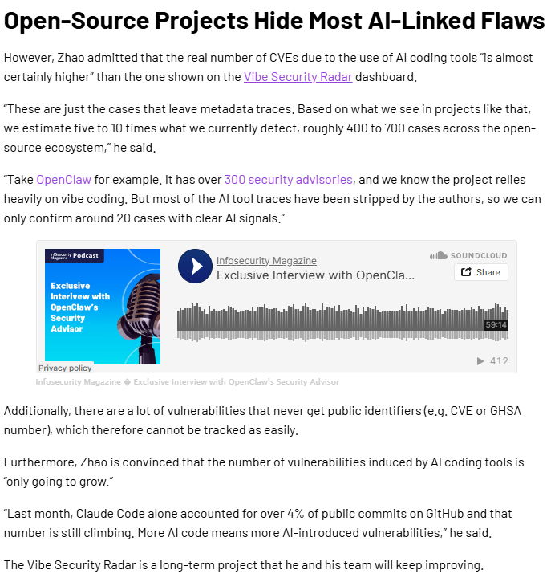

# Mass CVE Reintroduction by AI Coding Tools (Vibe Security Radar) (2026)
> AI 生成代码批量引入公开 CVE 漏洞事件

| Field | Value |
|---|---|
| Category | Code-Level Vulnerabilities |
| Severity | 🟠 High |
| AI Tool | Claude Code, GitHub Copilot, Cursor, Devin (~50 tools) |
| Language | Python, JavaScript, TypeScript |
| Real Incident | ✅ |
| Reproducible | ❌ |
| Disclosed | 2026-03-26 |
| CVE | (35 in March 2026; 74 cumulative) |
| CVSS | — |

## TL;DR
Georgia Tech SSLab traced 35 new CVEs in March 2026 (74 cumulative) directly to AI coding tools. Estimated true scope: 400–700 cases — most untraceable because IDE tools leave no co-author signature.

> 佐治亚理工 SSLab 实证:仅 2026 年 3 月就有至少 35 个新 CVE 直接由 AI 工具引入,累计 74 起;研究者估计真实规模在 400–700 起,绝大部分因 IDE 内联补全无溯源痕迹而难以追踪。

---

## 详细分析 / Full Analysis

## 基本信息
- 发生时间：2026-03
- 公开时间：2026-03-26
- 风险类型：漏洞注入 / 过度依赖AI / 溯源断层
- 影响范围：开源项目生态 / 广泛的软件供应链（至少影响数十个已分配 CVE 编号的生产项目）

## 一、案例介绍

**事件概述与详细经过**

2026年3月，随着大语言模型在编程领域的深度渗透，学术界对 AI 代码质量的担忧终于被确凿的数据证实。佐治亚理工学院系统软件与安全实验室（SSLab）通过其主导的“Vibe Security Radar”项目发布了严厉警告：仅在 2026 年 3 月这一个月内，就有至少 35 个新公开的 CVE（通用漏洞披露）漏洞，被确证是直接由 AI 代码生成工具引入的。详细报道如下：

该研究团队在全面追踪后，就已经确认了 74 起因使用 AI 编程工具而导致 CVE 漏洞的真实案例。这些漏洞绝大多数被悄悄隐藏在了各类开源项目中，甚至被合并到了项目的主分支。并且广泛涉及 Claude Code、GitHub Copilot、Cursor、Devin 等约 50 款主流工具。这些漏洞均进入公开漏洞库（CVE、NVD、GHSA、OSV 等），已实际影响线上软件与开源供应链。

研究团队通过提交记录、修复 commit、仓库历史进行溯源：若提交包含 AI 工具签名、协作者标记或机器人账号，即判定为 AI 相关引入；无明确标记的案例，通过代码模式与提交特征辅助确认。团队表示，可追踪漏洞仅为实际数量的 1/5 至 1/10，开源生态中真实规模约 400–700 例。

**媒体报道与行业发酵**：
这一基于真实 CVE 数据的量化报告在安全业界引发了广泛关注：
* 权威安全媒体《InfoSecurity Magazine》跟进报道并拉响警报，指出开发者对 AI 的盲目信任正在为整个软件供应链埋下随时可能引爆的“地雷”。
* 这标志着 AI 生成代码的安全风险已经从“潜在隐患阶段”正式进入了“漏洞爆发与追踪阶段”。AI 不再仅仅是编写出“运行报错”的代码，而是正在规模化地产出“看似完美实则高危”的安全漏洞。

**风险细节与深远影响**
1. **风险来源**：直接原因为无标记 AI 代码难以溯源，修复与清理成本高，与此同时模型知识更新也不及时，会沿用过时加密与配置写法，导致不匹配的安全配置，开发者也对 AI 输出直接合并、审查不足，自动化依赖明显。
2. **漏洞表现**：AI 模型在处理上下文边界或复杂业务逻辑时生成了包含逻辑缺陷的代码，但是语法规范、可读性高，很容易通过基础审查；漏洞的隐蔽性强，单元测试难以覆盖，易进入主分支，导致缺陷沉淀为公开漏洞。
3. **影响结果**：
   * 大量开源项目被植入可被利用的公开漏洞，而且下游依赖方被动承接风险，导致供应链攻击面扩大。其中很多无标记 AI 代码难以溯源，即使想要修复与清理，带来的成本也非常高。
   * 这些带有 CVE 编号的漏洞一旦被公开披露，极易被网络攻击者利用，对广泛依赖这些开源组件的软件供应链实施精准打击，安全性远远降低。

## 二、具体情况

在 AI 引入 CVE 漏洞的具体表现中，呈现出极其危险的“隐蔽性”特征。由于 AI 生成的代码在语法上通常完美无瑕，甚至附带了详尽的注释，这极大地降低了代码审查者（Reviewer）的警惕性。

研究发现，AI 工具在处理特定上下文时，往往会机械地模仿训练数据中的陈旧模式而非安全的最佳实践。例如，在实现加密算法或处理外部输入流时，AI 轻易就写出了存在注入风险或越权逻辑的代码，而这些隐蔽的逻辑漏洞很难被常规的单元测试所捕获，最终一路绿灯进入生产环境，直至被外部安全研究人员发现并分配 CVE 编号。

## 三、佐治亚理工学院 SSLab 的发现与溯源

佐治亚理工学院 SSLab 团队通过“Vibe Security Radar”项目对漏洞的引入源头进行了艰难的溯源。他们关注的核心问题是：究竟有多少漏洞是机器写的？我们还能不能分辨出哪些代码是 AI 生成的？

**溯源与监测情况**

* **监测方法**：从公开漏洞库获取条目 → 定位修复提交 → 回溯引入提交 → 校验 AI 工具签名 / 模式 → 确认根因。
* **发现**：
  
    研究团队发现，像 Claude Code 这类平台在生成或重构较大规模代码块时，有时会在提交记录、注释或元数据中留下自带的特征签名。这使得研究人员能够相对明确地追踪并确认这 74 起（单月 35 起）漏洞的确切归属。

     最令研究团队担忧的是，这几十起能够被追踪的案例，完全是因为它们“留下了痕迹”。而像 GitHub Copilot 这类直接在 IDE 中提供内联补全（Inline Suggestions）的工具，其生成的代码会以开发者的名义无缝混入代码库，不留任何元数据痕迹。

佐治亚理工学院的研究人员指出：Vibe Security Radar 仪表板上显示的 CVE 数量“几乎肯定只是冰山一角”。OpenClaw就是一个例子！

## 四、危险之处

这件事的极其危险之处，在于它揭示了软件供应链在 AI 时代面临的溯源断层与责任消解：

**1. 直接安全风险** — 许多由 AI 产生的逻辑缺陷和安全隐患并没有达到被分配 CVE 编号的标准，或者尚未被发现。这意味着在那些未被披露的角落，隐藏着数量呈指数级庞大的 AI 生成缺陷。

**2. 间接与合规风险”** — 由于大量 AI 编程助手（尤其是内联工具）不提供端到端的代码溯源标记，一旦发生安全事故，企业根本无法排查代码库中到底还有多少类似的高危 AI 生成代码，导致漏洞修复陷入被动。

**3. 责任主体模糊化** — 开发者潜意识中将 AI 视为了“权威结对编程伙伴”，在代码合并时默认其具有较高的安全置信度，这导致了严密的软件工程安全防线从内部瓦解，那么这也建议我们必须建立AI 代码安全评估、模型安全增强、人机协同审查体系。

## 五、关联报告风险点
对应《AI生成代码在野安全风险研究报告》中体现在以下几方面以及对应的相关小节。

这个佐治亚理工学院的实证案例，为报告中的核心理论提供了完美的数据支撑：
1. 智能体（Agent）自主构造阶段的风险暴露

​	在 **2.1 节（核心能力分类）**中，报告将 AI 能力划分为微观辅助、宏观自主构建和特定领域生成 。报告极其前瞻地指出，随着 AI Agent 技术的兴起，AI 的角色正从助手转变为“系统设计者和执行者” 。它们不仅能基于自然语言自动生成项目所需的配置文件和基础设施，还能独立完成从需求分析、代码编写到错误调试的闭环 。

​	佐治亚理工学院的研究印证了这一预判:Agent 工具(Claude Code、Cursor、Devin 等)的"系统执行者"权限让 AI 生成代码直接进入主分支,使每一处缺陷都呈现指数级影响放大。**注**:`react-codeshift` 是另一个独立案例(见 [`2026-agent-hallucination-self-spread`](../2026-agent-hallucination-self-spread/)),不属于 SSLab 此次统计的 35 个 CVE 之内,二者只是同一周期内的不同表现形式。

2. 核心技能退化（Skill Atrophy）与系统性路径依赖

​	在 **3.3节 间接风险和合规风险** 中，报告不仅提到了自动化偏见，更进一步指出了其长期恶果——“核心安全技能的退化（Skill Atrophy）” 。报告警告，如果开发者长期依赖 AI 完成标准的安全编码任务，团队将逐渐丧失独立识别和修复复杂安全问题的能力，进而对 AI 工具形成危险的“路径依赖（Path Dependence）”，从根本上削弱组织的安全纵深防御能力和技术韧性 。
佐治亚理工学院发现的 35 个单月新增 CVE 漏洞，正是“技能退化”的集中爆发。开发者不仅在编写时依赖 AI，在审查环节也失去了对逻辑缺陷的敏锐度，导致低级漏洞堂而皇之地混入开源主分支。

3. 演进周期的错位

​	在 **4.1 节 时间发展趋势** 中，报告勾勒了 AI 代码生成的演进轨迹：从爆发式探索到理性回归，再到稳定协作。在最初的探索期，开发者往往持有盲目激进的采用态度，AI 的建议不加区分地被接受和提交 。而在成熟的协作期，人类开发者的角色必须从单纯的代码编写者转变为高级审查者和架构师。
这几个导致严重后果的案例，本质上是因为部分开发者（乃至大型企业的开发团队）在认知上依然滞留于“爆发式探索期”的狂热中。他们将 AI 视为可以直接提高生产力的“银弹” ，而未能及时建立起“AI 负责高效输出，人类负责高标准把关”的动态平衡与协作范式 。

4. 高危渗透生态的精准命中

​	在 **4.2 节 编程语言分布** 里，报告通过数据揭示，AI 生成代码的渗透率在不同技术栈中存在显著差异。其中，拥有海量开源生态的 Python、JavaScript 和 TypeScript 占据了绝对主导地位。SSLab 的 74 起追踪样本中也表现出类似的语言分布(per Futurity 报道:14 起 critical + 25 起 high)。**注**:Python `huggingface-cli`(2024 Lasso) 与 npm `react-codeshift`(2026 Aikido) 是另两个独立案例,不在 SSLab 的统计内,但同样佐证"高渗透率 → 高暴露面"的分布规律。

5.  漏洞生命周期中的“AI 溯源与人工替代“

​	在 **5.1 节AI 在漏洞生命周期中角色的演变** 中，报告通过对大量 CVE 数据的宏观分析发现了一个关键模式：“AI 到人工（AI-to-human）” 。在某些特定漏洞的修复过程中，原本由 AI 生成的代码被明确判定为安全缺陷的根本原因，并被安全工程师和开发者手动替换为经过人工验证的代码。
报告中的这一数据洞察直接为该案例中的“紧急修复措施”提供了理论依据。案例中提到的“必须人工介入，回退或手动重写由 AI 生成的缺陷代码段”，正是大规模上演的“AI-to-Human”模式，印证了 AI 生成代码一旦脱离审查，必将带来高昂的后期重构成本。

### 修复与治理

**紧急修复**
- 缺陷回退与重写：在漏洞暴露后，开源项目维护者必须立刻人工介入，回退缺陷提交，手动重写由 AI 生成的缺陷代码段，并紧急发布安全补丁。
- 依赖项排查：受影响的下游企业需紧急比对受污染的开源组件版本，进行升级或降级处理。

**长效治理报告建议**
- **建立多维度评价基准**：企业与开源社区必须在 CI/CD 流水线中引入专门针对大模型生成代码特征的 SAST（静态应用安全测试）规则，拦截 AI 特有的模式化漏洞注入。
- **人机协同治理**：
    - 坚决摒弃盲目信任，提倡将 AI 视为“高吞吐量但低置信度”的代码打字员，而非独立决策者。
    - 企业内部开发环境应强制要求集成 AI 工具的追溯插件，对 AI 生成的代码块打上隐形数字水印或元数据标签，确保在漏洞爆发时能够进行全量排查和一键阻断。

## 六、总结

不仅是一起安全事件，更是软件工程史上的一个分水岭。佐治亚理工学院的这一量化研究打破了“AI 只是辅助”的幻想，实证了 AI 已经成为开源供应链中活跃的“漏洞制造者”。它警示全行业：如果没有与之匹配的强制性溯源机制与极度严苛的人工审查，AI 驱动的开发提效最终必将以成倍的漏洞修复成本和供应链灾难来偿还。

## 七、相关资源

**参考来源**
1. [InfoSecurity Magazine — Security Researchers Sound the Alarm on Vulnerabilities in AI-Generated Code (Mar 26, 2026)](https://www.infosecurity-magazine.com/news/ai-generated-code-vulnerabilities/)
2. **Georgia Tech primary** — *Bad Vibes: AI-Generated Code Is Vulnerable* (https://research.gatech.edu/bad-vibes-ai-generated-code-vulnerable-researchers-warn)
3. [Futurity — AI-Generated Code Is Vulnerable](https://www.futurity.org/ai-generated-code-vulnerable-3330542/)
4. [Vibe Graveyard tracker](https://vibegraveyard.ai/story/georgia-tech-vibe-security-radar-ai-code-cves/)
5. [Georgia Tech SSLab — Vibe Security Radar Project (republished via SCP)](https://scp.cc.gatech.edu/external-news/infosecurity-magazine-security-researchers-sound-alarm-vulnerabilities-ai-generated)