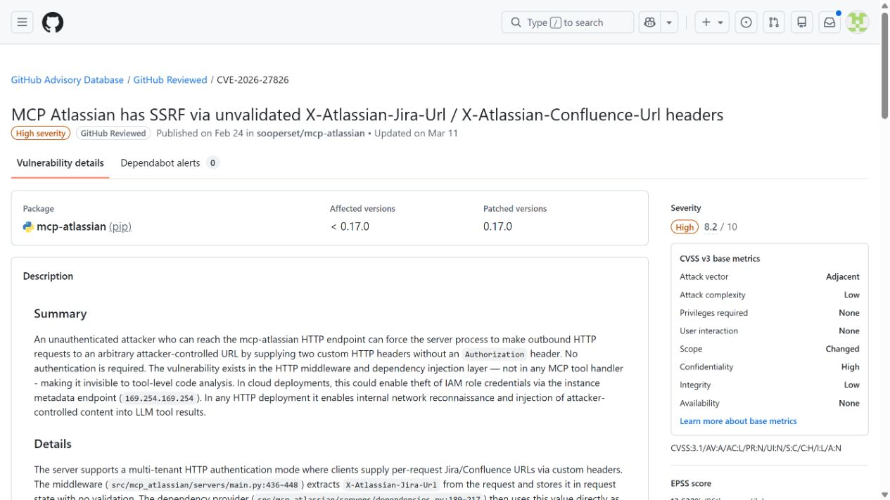
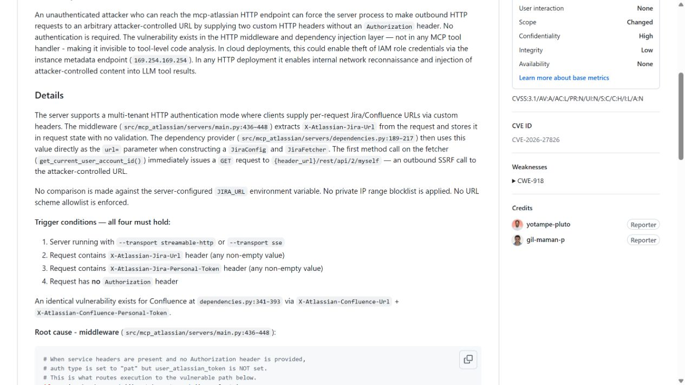
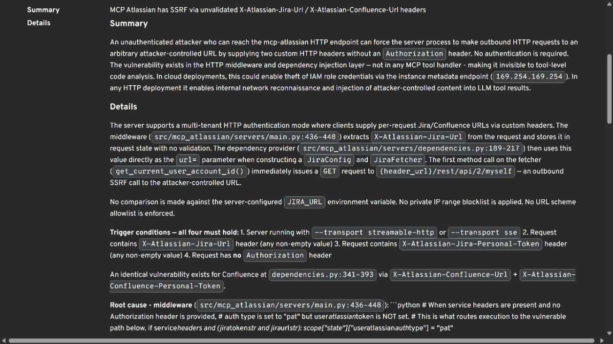
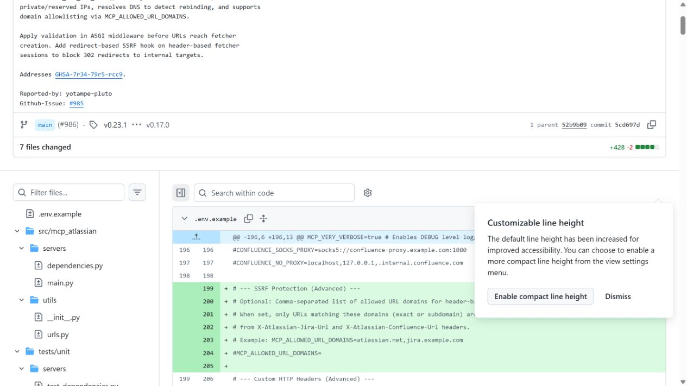
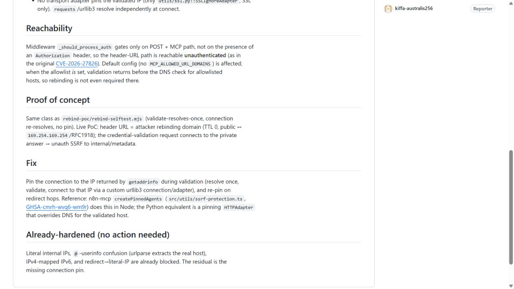

# MCP Atlassian SSRF and Tool Response Prompt Injection (2026)
> MCP Atlassian SSRF 与工具返回内容提示注入

| Field | Value |
|---|---|
| Category | code-vulns |
| Severity | High |
| CVE | CVE-2026-27826 |
| AI Tool | MCP Atlassian, LLM agents, Jira, Confluence |
| Language | Python |
| Real Incident | Yes |
| Reproducible | Yes |
| Disclosed | 2026-03-18 |

## TL;DR
MCP Atlassian 0.17.0 之前允许未认证请求用自定义头指定 Jira 或 Confluence 地址，服务器会访问该地址并把响应交给 LLM，形成 SSRF 与工具返回内容提示注入的组合入口。

---

## 详细分析 / Full Analysis

## 一、事件概况

MCP Atlassian 把 Jira 和 Confluence 内容提供给 LLM Agent。CVE-2026-27826 指出，0.17.0 之前的服务接受 `X-Atlassian-Jira-Url`、`X-Atlassian-Confluence-Url` 等请求头，用它们覆盖服务器目标地址，而相应入口不要求认证。攻击者可以让 MCP 服务访问任意 HTTP 目标，响应还可能被包装成工具结果送入模型。

这项漏洞同时涉及网络和语义两条边界。SSRF 允许借服务器网络位置探测内网；如果攻击者控制响应正文，还可以放入面向 Agent 的指令，尝试影响下一步工具调用。后者是 advisory 明确列出的潜在影响，不代表已发生公开的提示注入入侵。

## 二、公开材料与事实核对

项目 advisory、GitHub Advisory Database 和 OSV 对 CVE、8.2 分数及 0.17.0 修复版本一致。修复提交展示了目标地址限制，后来项目又发布重定向和 DNS 重绑定相关公告，说明 SSRF 防护必须覆盖连接全过程。

| 来源 | 类型 | 主要内容 |
|---|---|---|
| GitHub Advisory Database | 漏洞数据库 | CVE、评分和版本 |
| 项目 Advisory | 主证据 | 自定义头、SSRF 与返回内容风险 |
| OSV | 漏洞数据库 | 编号与包版本映射 |
| 修复提交 | 代码证据 | 目标 URL 处理变化 |
| 后续安全公告 | 修复复核 | 重定向与重绑定继续加固 |

## 三、攻击或事件链路

攻击者向暴露的 MCP HTTP 服务发送请求，在自定义头中填入本机地址、内网服务或自己控制的站点。旧版根据该头创建 Atlassian 客户端并发出请求。如果目标是内网，服务可充当网络跳板；如果目标由攻击者控制，返回值可伪装成 Jira issue 或 Confluence 页面。

Agent 随后看到的是格式化的工具结果，而不一定知道它并非来自组织的 Atlassian 实例。恶意正文可以要求读取其他工单、调用写工具或发送数据。是否成功仍取决于模型、可用工具和审批设置，但漏洞已经绕过了工具来源这一关键前提。

## 四、技术根因

旧设计把请求级覆盖 URL 视为部署便利功能，却没有把它当作权限。认证缺失使任意请求者都能改变服务端出站目标；初始 URL 校验若不覆盖重定向和 DNS 变化，仍可能在连接阶段转向内网。

返回内容的来源也没有强绑定。MCP 的结构化封装只能证明数据经过某个工具函数，不能证明正文来自获准的 Jira 租户。服务应固定允许的 Atlassian 基址、验证每次跳转和远端 IP，并在工具结果中保留租户和对象身份。

## 五、AI 安全问题

Agent 会把 Jira 和 Confluence 当作组织内部知识来源，优先级通常高于开放网页。攻击者如果控制该通道，不只获得一次 SSRF，还能借内部工具的外观提高提示注入可信度。这个风险由 MCP 的用途产生：数据读取与后续行动处在同一会话，响应文本可能直接影响写工单、修改页面或调用其他工具。

安全策略不能只检查“是否来自 MCP”。真正需要验证的是哪个服务器、哪个租户、哪个对象以及哪些字段可由普通用户编辑。即使 URL 固定，工单正文仍是低信任内容，不能成为授权依据。

## 六、影响、处置与排查

应升级到 0.17.0 以上，并继续采用项目后续包含重定向与 DNS 重绑定加固的版本。排查旧版访问日志时，重点查找自定义 URL 头、回环和私有网段目标、异常端口、短 TTL 域名以及非组织 Atlassian 域名。Agent 会话中如出现来源不明的工具返回和紧随其后的敏感操作，也要关联检查。

公开资料没有提供在野受害统计。内网请求成功与提示注入成功是两个阶段，调查时应分别确认网络连接、响应内容、模型决策和最终工具动作。

## 七、治理建议

部署方应在反向代理层删除所有不需要的目标覆盖头，并让 MCP 服务只能访问固定 Atlassian 域名。出站代理阻断私有地址和元数据服务，服务账户只授予必要空间和项目权限。

工具结果应区分系统元数据与用户可编辑正文，对正文进行来源标记；写操作、批量读取和外发数据需要独立审批。服务日志同时记录原始目标、每次重定向、实际连接 IP、Atlassian 租户和 Agent 会话，便于还原完整链路。

## 八、结论

CVE-2026-27826 不是单一的“URL 校验错误”，它让一个被信任的 Atlassian 工具失去固定来源。修复 SSRF 能阻止服务器访问任意目标，但 Agent 仍需把工单和页面正文视为不可信数据。网络来源约束与模型工具授权必须同时存在，才能避免伪造的工具响应继续驱动高权限动作。

### 参考来源

1. [GitHub Advisory Database GHSA-7r34-79r5-rcc9](https://github.com/advisories/GHSA-7r34-79r5-rcc9)
2. [Project security advisory GHSA-7r34-79r5-rcc9](https://github.com/sooperset/mcp-atlassian/security/advisories/GHSA-7r34-79r5-rcc9)
3. [OSV CVE-2026-27826 record](https://osv.dev/vulnerability/GHSA-7r34-79r5-rcc9)
4. [MCP Atlassian SSRF fix commit](https://github.com/sooperset/mcp-atlassian/commit/5cd697dfce9116ef330b8dc7a91291640e0528d9)
5. [MCP Atlassian redirect hardening advisory](https://github.com/sooperset/mcp-atlassian/security/advisories/GHSA-72fm-whvq-jghf)
