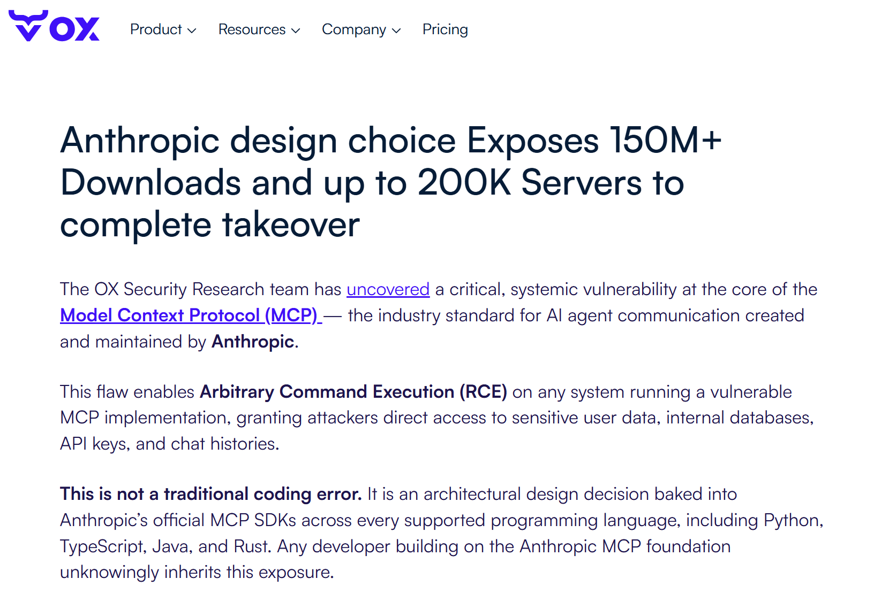
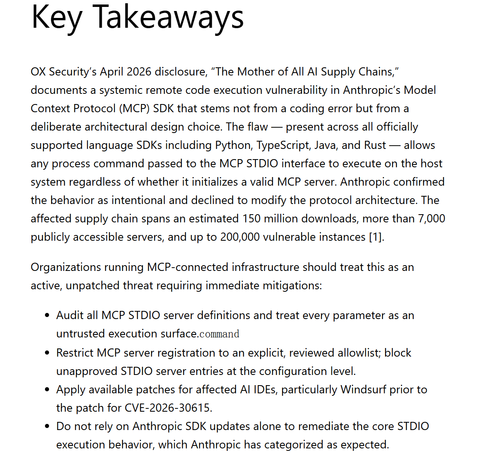
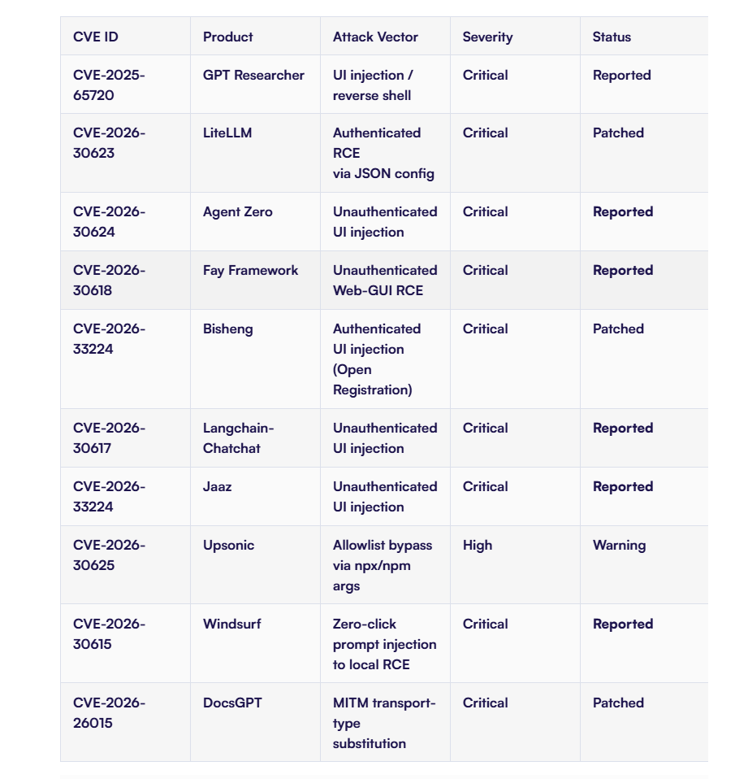
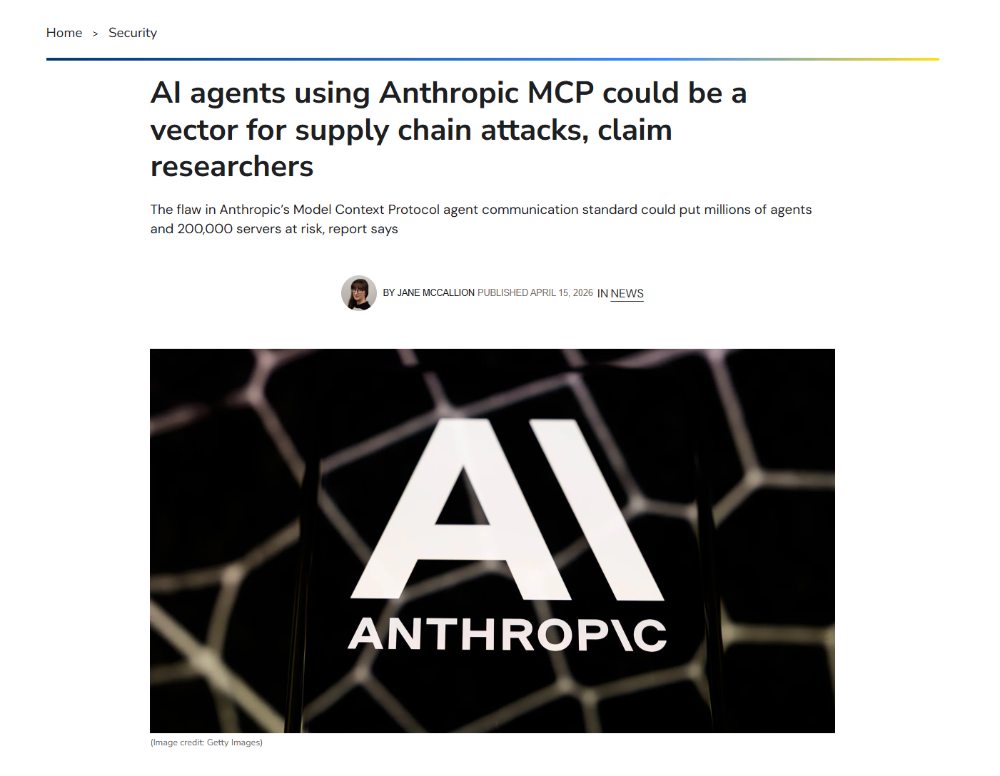
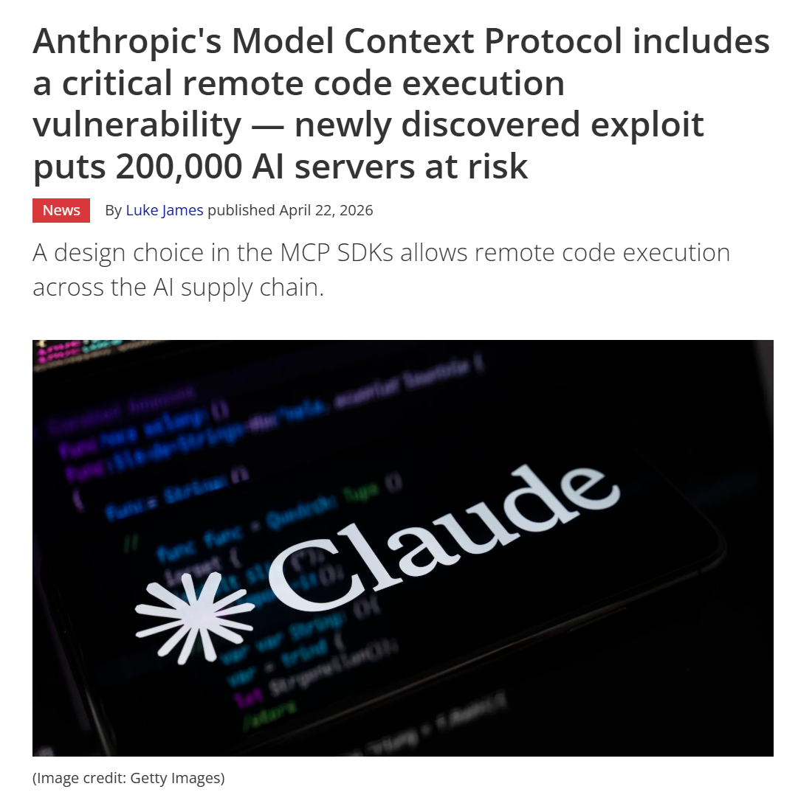

# MCP STDIO RCE Supply-Chain Risk Across AI Agent Ecosystem (2026)

> MCP STDIO 执行模型引发的 AI Agent 生态系统级 RCE 供应链风险

| Field         | Value                                                        |
| ------------- | ------------------------------------------------------------ |
| Category      | Agent Risks                                                  |
| Severity      | 🔴 Critical                                                   |
| AI Tool       | Model Context Protocol, Anthropic MCP SDK, MCP-enabled AI agents |
| Language      | Python, TypeScript, Java, Rust, Multiple                     |
| Real Incident | ✅                                                            |
| Reproducible  | ❌                                                            |
| Disclosed     | 2026-04-15                                                   |
| CVE           | Multiple                                                     |
| CVSS          | Multiple High/Critical CVEs                                  |

## TL;DR

MCP STDIO command handling created systemic RCE risk across AI agent tools and marketplaces.

> MCP STDIO 执行模型使部分 AI Agent 工具和 MCP 生态组件继承系统性命令执行风险，暴露出 Agent 工具调用、协议设计、插件市场和供应链治理不足问题。

------

## 详细分析 / Full Analysis

# MCP STDIO 执行模型引发的 AI Agent 生态系统级 RCE 供应链风险

## 基本信息

案例时间：2026 年 4 月
事件对象：Model Context Protocol 及其官方 SDK、MCP 生态工具、MCP 服务器和 AI Agent 集成平台
涉及工具：Anthropic MCP SDK、MCP-enabled AI agents、Windsurf、Cursor、Claude Code、Gemini CLI、LiteLLM、LangChain 相关组件、GPT Researcher、Agent Zero 等
事件类型：AI Agent 工具执行链路中的系统性远程代码执行风险、MCP 市场供应链风险、STDIO 配置注入风险
影响范围：OX Security 报告称该问题影响 150M+ 下载、7000+ 公开可访问服务器，最高可能涉及 200000 个 vulnerable instances；研究过程中产生 30+ responsible disclosures，并形成 10+ High/Critical CVEs。([OX Security](https://www.ox.security/blog/the-mother-of-all-ai-supply-chains-critical-systemic-vulnerability-at-the-core-of-the-mcp/))
风险归类：Agent 工具调用风险、AI 供应链风险、MCP 配置执行风险、提示注入到命令执行、插件市场投毒风险
案例定位：本案例可作为团队报告中 AI 代码安全风险从代码生成扩展到 Agent 执行环境、工具协议、插件市场和供应链治理的补充案例。

## 摘要

2026 年 4 月，OX Security 披露了 Model Context Protocol 生态中的系统性 RCE 风险。研究认为，MCP STDIO transport 的执行模型允许客户端根据配置中的 `command` 字段启动本地进程，而当该字段受到用户输入、提示注入、插件配置或市场分发内容影响时，任意操作系统命令可能在宿主机上执行。OX 将该问题称为 The Mother of All AI Supply Chains，认为它不是单个项目的普通编码错误，而是 MCP 官方 SDK 执行模型与下游 AI Agent 生态结合后形成的系统性风险。([OX Security](https://www.ox.security/blog/the-mother-of-all-ai-supply-chains-critical-systemic-vulnerability-at-the-core-of-the-mcp/))

Cloud Security Alliance 后续发布分析，将该问题定义为 MCP by Design: RCE Across the AI Agent Ecosystem。CSA 认为该风险存在于官方支持的 Python、TypeScript、Java 和 Rust SDK 中，关键点在于 STDIO 模式下任何传入 `command` 参数的进程命令都会先被执行，而 SDK 并不会先验证该进程是否成功初始化为合法 MCP server。CSA 还指出，Anthropic 将该行为视为预期行为并拒绝从协议架构层面修改，因此组织不能仅等待 SDK 层补丁，而应把所有 MCP STDIO server definition 视为高风险执行面。([Lab Space](https://labs.cloudsecurityalliance.org/research/csa-research-note-mcp-by-design-rce-ox-security-20260420-csa/))

从公开资料看，该事件不等同于某一次恶意攻击已经全面爆发，而是一次经研究人员负责任披露、并在多个真实生产平台上验证可执行命令的系统性漏洞披露。ITPro 报道称，OX 研究人员表示他们在六个真实公司、真实付费客户使用的官方服务上执行了命令，并完成了 30+ responsible disclosure，产生了 10 个 Critical/High CVEs。Tom’s Hardware 报道也指出，该风险影响 MCP 官方 SDK，并通过 AI agent 供应链扩散到多种主流 AI 开发环境和 MCP 工具生态。([IT Pro](https://www.itpro.com/security/ai-agents-using-anthropic-mcp-supply-chain-attacks-claim-researchers))

## 一、事件核验与证据边界

本案例的主要证据来自 OX Security 原始研究、Cloud Security Alliance 的独立分析，以及 ITPro、Tom’s Hardware 等媒体报道。OX Security 于 2026 年 4 月 15 日发布研究，称其发现 MCP 官方 SDK 中存在系统性 RCE 风险，影响 Python、TypeScript、Java、Rust 等多个语言生态。OX 还列出多条具体 CVE，包括 LiteLLM、Agent Zero、Fay Framework、LangChain-Chatchat、Windsurf、DocsGPT 等下游项目。([OX Security](https://www.ox.security/blog/the-mother-of-all-ai-supply-chains-critical-systemic-vulnerability-at-the-core-of-the-mcp/))

CSA 的分析进一步确认了该问题的核心机制：MCP 的 STDIO transport 需要由客户端根据配置启动本地进程，SDK 接受 `command` 字段并执行该命令；如果攻击者能够影响该字段，就可以把 MCP server 初始化逻辑转化为任意命令执行。CSA 还特别强调，执行发生在 SDK 判断 MCP server 是否有效之前，因此失败返回并不代表命令没有执行。([Lab Space](https://labs.cloudsecurityalliance.org/research/csa-research-note-mcp-by-design-rce-ox-security-20260420-csa/))

媒体复核提供了额外的独立视角。ITPro 报道称，该问题可使攻击者访问 user data、databases、API keys、chat histories 等敏感资源，并引用 OX 研究人员关于六个真实生产平台和 30+ responsible disclosures 的说法。Tom’s Hardware 则报道，该风险影响 150M+ 下载和最高 200000 个 server instances，并指出研究人员成功对 9 个 MCP registries 中的 11 个进行恶意试验提交测试，发现多数市场缺少有效审核。([IT Pro](https://www.itpro.com/security/ai-agents-using-anthropic-mcp-supply-chain-attacks-claim-researchers))

证据边界需要明确。该案例不是已经被公开确认的大规模黑产入侵事件，而是一次研究型披露和多项目负责任披露。OX 与 CSA 将其视为系统性架构风险，Anthropic 则据报道认为 STDIO 行为属于预期行为，开发者应自行限制可执行命令。ITPro 报道中也呈现了这一分歧：Anthropic 认为该行为需要用户许可和开发者控制，而 OX 认为把控制责任交给数以万计的实现者会造成供应链层面的不可控风险。([IT Pro](https://www.itpro.com/security/ai-agents-using-anthropic-mcp-supply-chain-attacks-claim-researchers))

## 二、系统背景与触发条件

MCP 是 Anthropic 在 2024 年提出的开放协议，用于让 AI 模型和 Agent 连接外部工具、数据源与服务。随着 2025 至 2026 年 MCP 被 Cursor、VS Code、Windsurf、Claude Code、Gemini CLI 等 AI 开发工具采用，它逐渐成为 Agent 工具调用和上下文扩展的重要基础设施。CSA 分析指出，MCP 提供 HTTP/SSE 与 STDIO 两类主要 transport，其中 STDIO 模式被广泛用于本地工具、文件系统连接器和开发环境集成。([Lab Space](https://labs.cloudsecurityalliance.org/research/csa-research-note-mcp-by-design-rce-ox-security-20260420-csa/))

STDIO 模式的关键机制是由宿主应用启动一个本地进程作为 MCP server，再通过标准输入输出与该进程通信。此设计在可信本地配置下是合理的，但在 AI Agent 生态中，配置来源可能来自仓库文件、插件市场、提示词生成、用户输入、远程 UI 参数或第三方工具包。一旦这些来源能够影响 `command` 字段，MCP client 就可能执行攻击者提供的任意命令。OX 和 CSA 均指出，问题关键不是某个函数写错，而是执行模型把配置字段转化为了操作系统命令。([OX Security](https://www.ox.security/blog/the-mother-of-all-ai-supply-chains-critical-systemic-vulnerability-at-the-core-of-the-mcp/))

该问题在 AI Agent 场景中尤其严重。传统 CLI 工具通常由开发者明确运行命令，而 AI Agent 会在处理任务时自动读取配置、启动工具、调用外部能力。若 Agent 接触到被污染的 MCP 配置，命令执行可能被包装为正常工具初始化过程。CSA 将其归入 Agent Execution Environment 的威胁面，认为当模型输出、提示注入或第三方配置能影响进程执行时，MCP 不应被视为普通集成细节，而应被视为高危代码执行面。([Lab Space](https://labs.cloudsecurityalliance.org/research/csa-research-note-mcp-by-design-rce-ox-security-20260420-csa/))

## 三、事故链路与攻击方式

OX Security 将该问题拆解为四类主要利用路径。第一类是 AI framework 的 unauthenticated UI injection，即攻击者通过未认证或弱认证的 Web UI 把恶意命令写入 MCP STDIO 配置。第二类是 protected environment bypass，即某些平台虽然声称有保护机制，但攻击者仍可通过 MCP 配置把输入传入命令执行路径。第三类是 AI coding IDE 中的 zero-click prompt injection，即 Agent 在读取恶意内容或处理仓库上下文时，把攻击者控制内容转化为 MCP 初始化命令。第四类是 MCP marketplace malicious distribution，即攻击者通过插件市场或注册表投放带有恶意启动命令的 MCP server。([OX Security](https://www.ox.security/blog/the-mother-of-all-ai-supply-chains-critical-systemic-vulnerability-at-the-core-of-the-mcp/))

在具体项目层面，OX 列出多个下游 CVE。LiteLLM 的 CVE-2026-30623 被标记为通过 JSON config 触发 authenticated RCE；Agent Zero 的 CVE-2026-30624 被标记为 unauthenticated UI injection；Windsurf 的 CVE-2026-30615 被标记为 zero-click prompt injection to local RCE；DocsGPT 的 CVE-2026-26015 被标记为 MITM transport-type substitution。该 CVE 列表说明，MCP STDIO 风险不是理论问题，而是已经通过多个真实 AI 平台和 Agent 工具形成下游漏洞。([OX Security](https://www.ox.security/blog/the-mother-of-all-ai-supply-chains-critical-systemic-vulnerability-at-the-core-of-the-mcp/))

ITPro 的报道对这一点进行了技术复述。报道中指出，OX 最初是在 GPT Researcher 的功能中发现用户可配置 custom STDIO MCP server，测试显示任意 OS command 会被执行，即使假 MCP server 启动失败，错误返回给用户时命令已经运行。研究人员最初以为问题位于 LangChain 的 MCP adapter，后续追溯到 Anthropic 原始 MCP 实现中的执行模型。([IT Pro](https://www.itpro.com/security/ai-agents-using-anthropic-mcp-supply-chain-attacks-claim-researchers))

该链路与普通软件供应链投毒不同。传统投毒通常依赖恶意依赖包进入构建或运行时；MCP 风险则把 Agent 工具初始化变成执行入口。用户或开发者安装一个看似正常的 MCP server，Agent 或 IDE 自动启动该 server，启动命令本身即成为攻击载荷。此时攻击面不再局限于代码包内容，而扩展到 Agent tool registry、workspace config、prompt-derived configuration 和 marketplace trust。([OX Security](https://www.ox.security/blog/the-mother-of-all-ai-supply-chains-critical-systemic-vulnerability-at-the-core-of-the-mcp/))

## 四、AI 参与证据与责任边界

该案例与 AI 的关联主要体现在三个层面。第一，MCP 是面向 AI Agent 的工具调用协议，用于让 AI 模型调用外部工具、数据源和服务。第二，受影响范围包括多个 AI coding IDE 和 Agent 工具，例如 Windsurf、Cursor、Claude Code、Gemini CLI 等。第三，部分利用路径直接依赖 prompt injection 或 Agent 自动工具启动，即 AI 系统处理的内容能够影响 MCP 配置或工具调用路径。([Lab Space](https://labs.cloudsecurityalliance.org/research/csa-research-note-mcp-by-design-rce-ox-security-20260420-csa/))

OX 与 CSA 倾向于将问题描述为 MCP 官方 SDK 的系统性设计风险，因为 SDK 执行 `command` 时没有在协议层提供强约束。Anthropic 据报道认为 STDIO 执行行为属于预期，开发者应自行限制可执行命令并确保配置来源可信。ITPro 引述的报道显示，Anthropic 认为这类行为需要用户许可并属于开发者责任，但 OX 反驳称不能期待大量实现者独立发现并缓解嵌入官方 SDK 的风险。([IT Pro](https://www.itpro.com/security/ai-agents-using-anthropic-mcp-supply-chain-attacks-claim-researchers))

因此，本事件不是Anthropic 单点失误，也不将其等同于某个具体产品的普通 RCE。更准确的定性是：MCP STDIO 执行模型在 AI Agent 生态扩张后暴露出协议设计、SDK 默认行为、插件市场审核和下游产品安全边界之间的系统性错配。该错配使看似正常的工具配置变成可传播的代码执行入口。

## 五、与团队技术报告风险框架的关系

团队报告关注 AI 代码生成从局部补全走向软件开发全生命周期后带来的供应链边界变化。本案例可以补充该框架中的 Agent 执行环境风险。MCP 本身并不生成业务代码，但它让 AI Agent 具备调用工具、启动进程和访问系统资源的能力；当这条工具链缺少边界控制时，风险会从代码内容扩展到工具协议和执行环境。

该案例首先补充了软件供应链边界重塑问题。过去供应链风险主要集中在 npm、PyPI、Docker 镜像、CI/CD 插件和 IDE 扩展。MCP 事件说明，AI Agent 时代的供应链还包括 MCP server、MCP registry、STDIO command、tool manifest 和 Agent marketplace。OX 的测试中 9 个 MCP registries 接受了恶意试验提交，说明 MCP 工具发现与安装链路已具备类似传统包生态的投毒风险。([OX Security](https://www.ox.security/blog/the-mother-of-all-ai-supply-chains-critical-systemic-vulnerability-at-the-core-of-the-mcp/))

其次，该案例补充了提示注入向实际执行后果升级的问题。传统提示注入可能导致模型输出错误信息或泄露上下文；在 MCP 场景中，提示注入可能影响 Agent 工具选择和 MCP 配置，进而变成 OS 命令执行。Tom’s Hardware 报道中明确提到 OX 识别了 zero-click prompt injection in AI coding IDEs，包括 Windsurf 和 Cursor 等场景。([Tom's Hardware](https://www.tomshardware.com/tech-industry/artificial-intelligence/anthropics-model-context-protocol-has-critical-security-flaw-exposed))

团队报告中强调，人类开发者应从代码编写者转向审查者与验证者。MCP 事件说明，验证对象不能只限于模型生成代码，还要包括 Agent 能启动哪些工具、MCP server 来自哪里、STDIO command 是否可被外部输入影响、插件市场是否具备审核机制、Agent 执行环境是否隔离。没有这些验证，Agent 的工具调用能力会把外部内容转化为系统级执行风险。

## 六、影响范围与风险评估

该事件的影响范围主要体现在生态规模、执行权限和供应链传播三个方面。生态规模方面，OX 与 CSA 均给出 150M+ downloads、7000+ publicly accessible servers、up to 200000 vulnerable instances 的估计。Tom’s Hardware 也引用该范围，并指出 MCP 已被 OpenAI、Google 以及多数主流 AI coding tools 采用。([OX Security](https://www.ox.security/blog/the-mother-of-all-ai-supply-chains-critical-systemic-vulnerability-at-the-core-of-the-mcp/))

执行权限方面，MCP STDIO server 通常以宿主进程权限运行。一旦启动命令被污染，攻击者可能获得开发者机器或服务器上的文件、环境变量、API keys、数据库连接和云凭据。ITPro 报道指出，该风险可能让攻击者访问 user data、databases、API keys、chat histories 等资源。([IT Pro](https://www.itpro.com/security/ai-agents-using-anthropic-mcp-supply-chain-attacks-claim-researchers))

供应链传播方面，MCP marketplace 和 registry 可能成为恶意工具分发入口。OX 报告称 9 个测试的 MCP registries 接受了恶意 PoC 提交；CSA 也指出，在缺少有效提交审核前，MCP marketplace package 应被视为类似未审查 npm 或 PyPI 依赖的供应链风险。([OX Security](https://www.ox.security/blog/the-mother-of-all-ai-supply-chains-critical-systemic-vulnerability-at-the-core-of-the-mcp/))

公开资料显示，OX 在负责任披露过程中对六个真实生产平台验证了命令执行，并帮助多个项目修复；目前并没有公开证据表明该漏洞族已被大规模黑产利用。报告中应避免写成已经造成大规模入侵，但可以明确写成已在真实生产平台验证、影响面巨大、且下游 CVE 已形成的系统性供应链风险。([IT Pro](https://www.itpro.com/security/ai-agents-using-anthropic-mcp-supply-chain-attacks-claim-researchers))

## 七、治理建议

该事件的治理重点不是简单禁用 MCP，而是将 MCP STDIO 执行模型纳入 Agent 执行环境的强制安全边界。首先，所有 MCP STDIO server definition 都应进入资产清单。企业应审计开发者工作站、CI/CD、内部 Agent 服务、AI IDE 配置和生产 Agent 平台中的 MCP 配置，确认 `command` 字段只指向已批准、已签名、来源明确的可执行程序。([Lab Space](https://labs.cloudsecurityalliance.org/research/csa-research-note-mcp-by-design-rce-ox-security-20260420-csa/))

其次，应建立 MCP server allowlist。任何来自外部市场、公共仓库、用户输入、模型输出或自动生成配置的 MCP server，都不应直接进入生产 Agent 环境。企业可将 MCP server 按本地文件访问、数据库访问、云 API 访问、代码执行、网络访问等能力分级，并对高危工具启用人工审批和运行时隔离。OX 的修复建议也包括只使用验证来源、限制敏感服务公网访问、将 MCP 服务放入 sandbox、监控工具调用和阻断异常外联。([OX Security](https://www.ox.security/blog/the-mother-of-all-ai-supply-chains-critical-systemic-vulnerability-at-the-core-of-the-mcp/))

应限制 STDIO 模式在生产 Agent 中的使用。对于需要稳定审计和权限控制的企业场景，应优先使用具备认证、授权、审计和网关策略的远程 MCP transport，而不是直接在客户端本地执行任意进程。若必须使用 STDIO，应通过容器、低权限用户、seccomp/AppArmor、文件系统只读挂载、网络出站限制等方式降低执行半径。

同时，AI coding IDE 和 Agent 平台应对 prompt injection 到 tool execution 建立专项测试。测试用例应覆盖恶意 README、恶意 issue、恶意网页内容、恶意 MCP marketplace 描述、恶意项目配置和自动生成 MCP 配置。评测目标不是只看模型是否产生危险回答，而是验证 Agent 是否会把外部内容转化为 `command`、`args`、tool config 或 server registration。

MCP marketplace 应建立与成熟包管理生态类似的安全机制。包括发布者身份验证、命名空间保护、恶意代码扫描、行为声明、权限 manifest、人工审核、下载异常监控和撤回机制。OX 的 registry poisoning 结果说明，MCP 工具市场不能只按功能分发工具，而必须把每个 MCP server 视为可执行软件包进行供应链治理。([OX Security](https://www.ox.security/blog/the-mother-of-all-ai-supply-chains-critical-systemic-vulnerability-at-the-core-of-the-mcp/))

## 八、结论

MCP STDIO RCE 风险是 2026 年 AI Agent 生态中具有代表性的系统性安全案例。它不是传统意义上的单一代码漏洞，也不是单个 AI IDE 的实现错误，而是 AI Agent 工具调用协议、SDK 执行模型、插件市场和下游平台共同形成的供应链风险。OX Security 披露的影响范围包括 150M+ 下载、7000+ 公开服务器、最高 200000 个 vulnerable instances、30+ responsible disclosures 和 10+ High/Critical CVEs；CSA 和多家媒体后续分析确认，该问题反映出 MCP STDIO 执行模型在 Agent 生态扩张后的安全边界不足。([OX Security](https://www.ox.security/blog/the-mother-of-all-ai-supply-chains-critical-systemic-vulnerability-at-the-core-of-the-mcp/))

该案例对 AI 代码安全研究的意义在于，它把风险从模型输出进一步推进到 Agent 执行环境。AI 工具不再只是生成代码，而是通过 MCP 启动进程、读取文件、访问数据库、调用 API 和连接外部服务。此时，安全治理对象必须覆盖 MCP server 来源、STDIO command、插件市场、Agent 执行权限和提示注入路径。若这些边界没有建立，AI Agent 的工具调用能力会把配置文件、插件描述和外部内容转化为真实系统命令。

## 参考来源

1. OX Security，The Mother of All AI Supply Chains: Critical, Systemic Vulnerability at the Core of Anthropic’s MCP。用于核验 MCP STDIO 风险、150M+ 下载、7000+ 公开服务器、200000 vulnerable instances、四类利用路径、10+ CVEs 和 Anthropic 响应。([OX Security](https://www.ox.security/blog/the-mother-of-all-ai-supply-chains-critical-systemic-vulnerability-at-the-core-of-the-mcp/))
2. Cloud Security Alliance，MCP by Design: RCE Across the AI Agent Ecosystem。用于核验 MCP STDIO execution model、execute-first 行为、官方 SDK 影响范围、CSA 风险判断和治理建议。([Lab Space](https://labs.cloudsecurityalliance.org/research/csa-research-note-mcp-by-design-rce-ox-security-20260420-csa/))
3. Tom’s Hardware，Anthropic's Model Context Protocol includes a critical remote code execution vulnerability。用于核验媒体复核、150M+ 下载、200000 server instances、主流 AI coding tool 采用、9/11 registry poisoning 和 10 个高危/严重 CVEs。([Tom's Hardware](https://www.tomshardware.com/tech-industry/artificial-intelligence/anthropics-model-context-protocol-has-critical-security-flaw-exposed))
4. ITPro，AI agents using Anthropic MCP could be a vector for supply chain attacks。用于核验六个真实生产平台命令执行、30+ responsible disclosures、10 个 High/Critical CVEs、Anthropic 与 OX 对责任边界的分歧。([IT Pro](https://www.itpro.com/security/ai-agents-using-anthropic-mcp-supply-chain-attacks-claim-researchers))