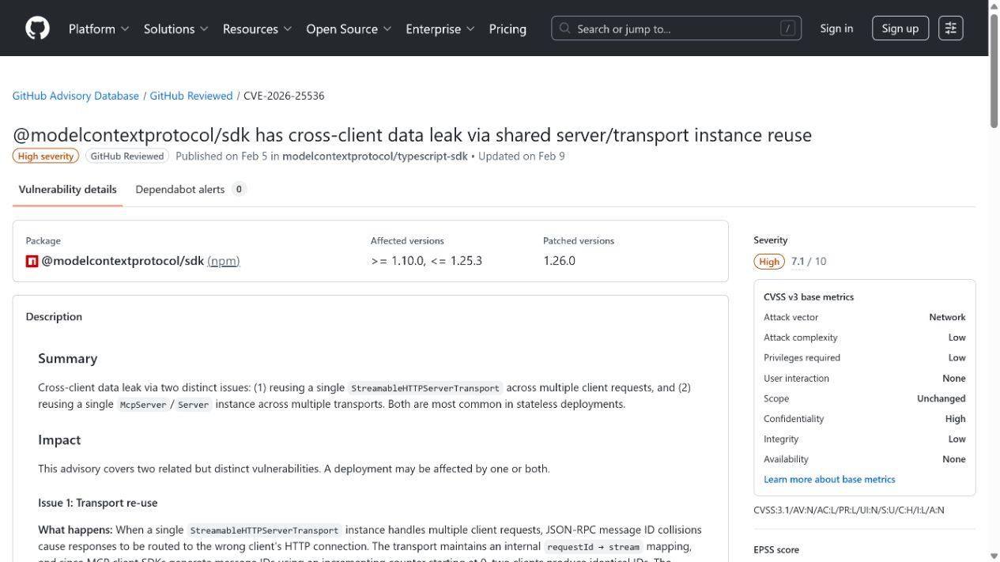
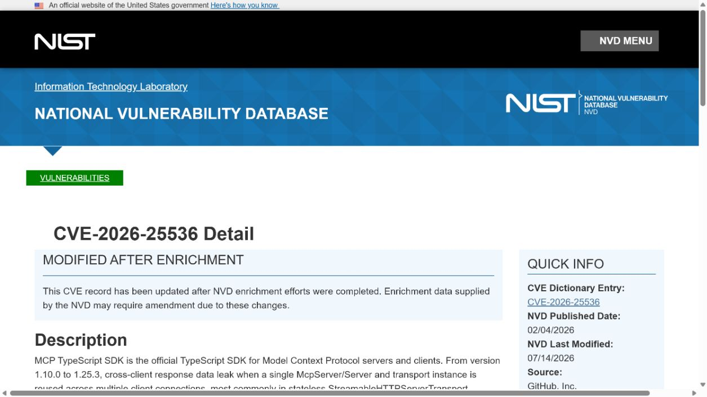
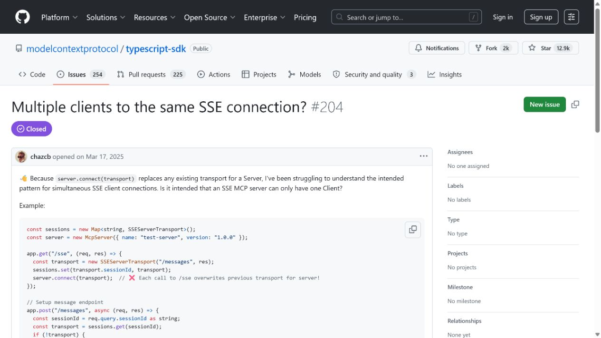
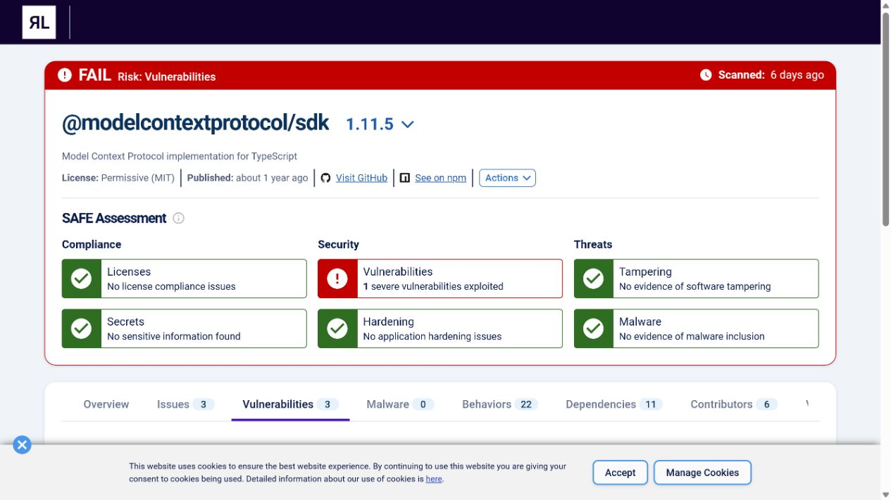
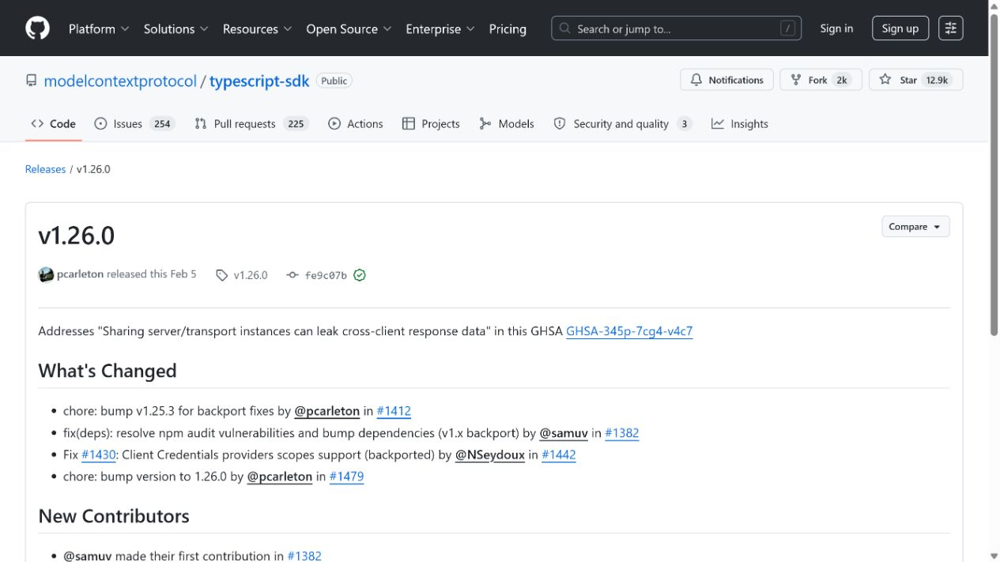

# MCP TypeScript SDK Cross-Client Response Data Leak (2026)
> MCP TypeScript SDK 跨客户端响应数据泄露漏洞

| Field | Value |
|---|---|
| Category | Agent Risks |
| Severity | High |
| AI Tool | Model Context Protocol TypeScript SDK, Streamable HTTP transport, MCP server |
| Language | TypeScript / HTTP / JSON-RPC |
| Real Incident | Yes |
| Reproducible | Yes |
| Disclosed | 2026-02-10 |
| CVE | CVE-2026-25536 |

## TL;DR
Reusing a single MCP server and transport across Streamable HTTP clients could route one client's response data to another client, causing cross-tenant exposure.
> 在 Streamable HTTP 部署中复用同一个 MCP server 和 transport 可能把一个客户端的响应路由给另一个客户端，造成跨租户数据暴露。

---

## 详细分析 / Full Analysis

## 一、基本信息与事件概况

CVE-2026-25536 影响 Model Context Protocol 官方 TypeScript SDK 1.10.0 至 1.25.3。问题出现在一种常见但并不安全的部署方式：应用在 Streamable HTTP 的无状态场景中复用同一个 McpServer/Server 和 transport 实例服务多个客户端。响应归属没有被正确隔离时，某个客户端的数据可能被送到另一个客户端。

这类漏洞的影响常被低估，因为每次 HTTP 请求看似独立，开发者却可能把长生命周期的 SDK 对象放在全局单例中。MCP 服务返回的内容可能包含文件、业务数据、工具结果或凭据相关信息，因此跨客户端错投不只是协议完整性问题，也是多租户保密性问题。

## 二、事件经过与公开材料

上游安全公告和 CVE 在 2026 年 2 月公开，修复版本为 1.26.0。NVD 后续补充了描述和外部参考，相关 SDK Issue、npm 生态安全数据库以及 CSA 的 Agentic Universe 报告都记录了共享实例造成的跨客户端泄露条件。

公共材料没有给出受影响部署的总数，也没有确认大规模现实泄露。本文仅将其作为官方 SDK 已修复的多客户端隔离缺陷，而不把所有 MCP HTTP 服务描述为已被入侵。

### 证据矩阵

| 来源 | 类型 | 证明内容 |
|---|---|---|
| GitHub Advisory: GHSA-345p-7cg4-v4c7 | 上游安全公告 | 共享实例条件、影响版本和 1.26.0 修复 |
| NVD: CVE-2026-25536 | 政府漏洞数据库 | 跨客户端泄露描述和外部参考 |
| MCP TypeScript SDK Issue 204 | 项目讨论 | 上游问题与部署讨论背景 |
| ReversingLabs package advisory | 独立依赖安全数据库 | npm 包版本与 CVE 收录 |
| MCP TypeScript SDK: v1.26.0 release | 技术复核 | MCP 多客户端身份与上下文风险背景 |

## 三、系统背景与触发条件

MCP 让客户端与工具服务通过结构化消息交换请求和结果。Streamable HTTP 可支持无状态、可扩展的部署，但服务端必须确保会话、响应 ID、transport 生命周期和客户端身份始终绑定。将对象复用当作性能优化，若缺少客户端维度的状态隔离，就会改变响应应该送达的主体。

在 AI Agent 应用中，单个客户端可能代表不同用户、企业租户或自动化任务。即便模型本身遵守权限策略，底层 transport 若把工具返回交给错误的会话，上层模型与应用就没有机会纠正这一泄露。

## 四、攻击链路或失效过程

目标部署使用受影响 SDK，并把同一 server/transport 实例暴露给多个 Streamable HTTP 客户端。攻击者与受害者并发或交错发起请求；服务在处理过程中将某个响应关联到错误的连接，攻击者收到原应属于受害者的工具结果。攻击的可行性取决于实现是否采用共享实例和请求时序。

漏洞不需要模型生成恶意指令，也不代表攻击者能够任意调用所有工具。它利用的是服务端响应路由层的隔离失效，后续可见数据范围取决于受害者请求和 MCP 工具本身返回了什么。

## 五、技术根因与 AI 风险分析

根因是把本应按连接或会话划分的 transport 状态复用为全局对象。无状态 HTTP 不等于无会话语义；请求和响应仍需要在逻辑层绑定到正确客户端。SDK 修复把这种绑定纳入实现，应用开发者则需避免手工复用不具多租户语义的实例。

设计上应为每个客户端创建独立 transport 或使用支持明确会话隔离的服务工厂；同时为响应 ID、认证主体和工具调用建立端到端审计。负载测试也应覆盖并发跨用户请求，而不只验证单客户端功能正确。

MCP 的交互经常包含模型上下文、工具结果和用户账户数据，这使“响应发给了错误客户端”不仅是普通并发缺陷。错误返回的内容可能被另一个 Agent 当作当前任务的可信上下文继续处理，进而在后续工具调用、摘要或回答中放大泄露。即使单次响应看似只是调试信息，也可能包含文件路径、令牌片段或来自其他用户的业务记录，因此会话隔离必须贯穿传输层和应用层。

服务端在压测时不应只验证吞吐量，还应构造不同身份、不同长连接和不同请求顺序的并发场景。每一条响应都应能追溯到发起请求的会话、认证主体和工具调用编号；当这些标识发生不一致时，服务应丢弃响应而不是尝试“尽力返回”。这类约束会增加实现上的明确性，却能避免共享 SDK 实例在多租户部署中悄然变成数据串线点。

## 六、影响范围与处置建议

受影响服务可能向错误客户端暴露工具输出，包括业务记录、文件内容、上下文或错误信息。用户应升级到 1.26.0 或更高版本，检查 Streamable HTTP 部署是否创建共享单例，并审计 2026 年 2 月前后的异常响应与租户边界日志。

没有公开利用统计。风险评估应集中在是否复用对象、服务是否多租户、工具返回内容是否敏感，以及是否有可追溯的客户端身份记录。

## 七、结论

CVE-2026-25536 说明 Agent 协议的安全不只在工具授权。连接生命周期和响应路由同样是数据隔离的一部分；单客户端测试通过，并不能证明多租户 MCP 服务安全。

## 八、参考来源

- [GitHub Advisory: GHSA-345p-7cg4-v4c7](https://github.com/advisories/GHSA-345p-7cg4-v4c7)
- [NVD: CVE-2026-25536](https://nvd.nist.gov/vuln/detail/CVE-2026-25536)
- [MCP TypeScript SDK Issue 204](https://github.com/modelcontextprotocol/typescript-sdk/issues/204)
- [ReversingLabs package advisory](https://secure.software/npm/packages/%40modelcontextprotocol/sdk/vulnerabilities/1.11.5)
- [MCP TypeScript SDK: v1.26.0 release](https://github.com/modelcontextprotocol/typescript-sdk/releases/tag/v1.26.0)
