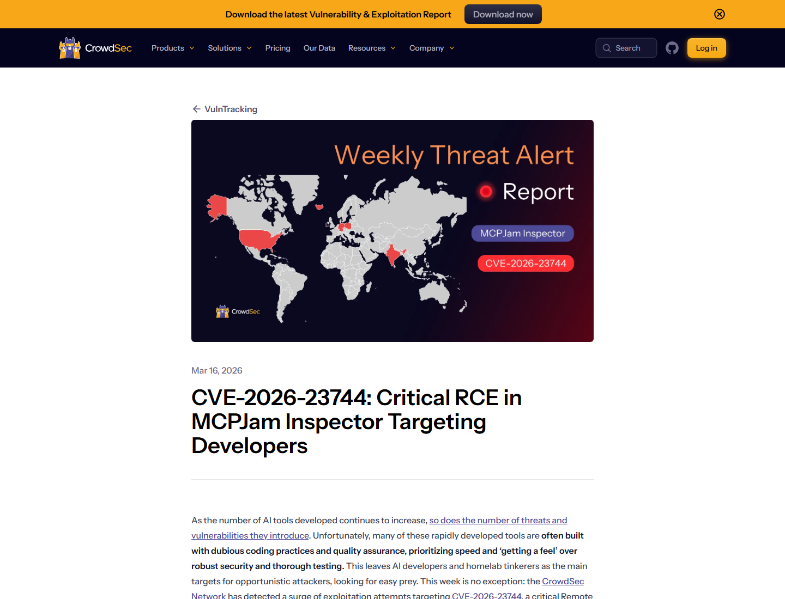
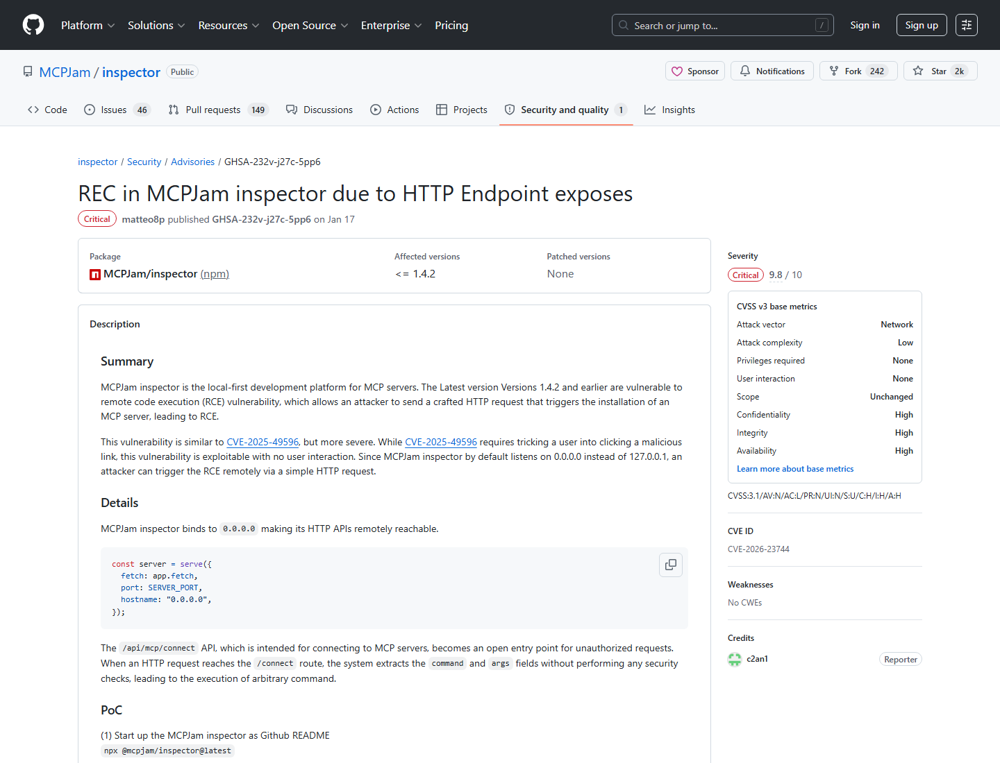
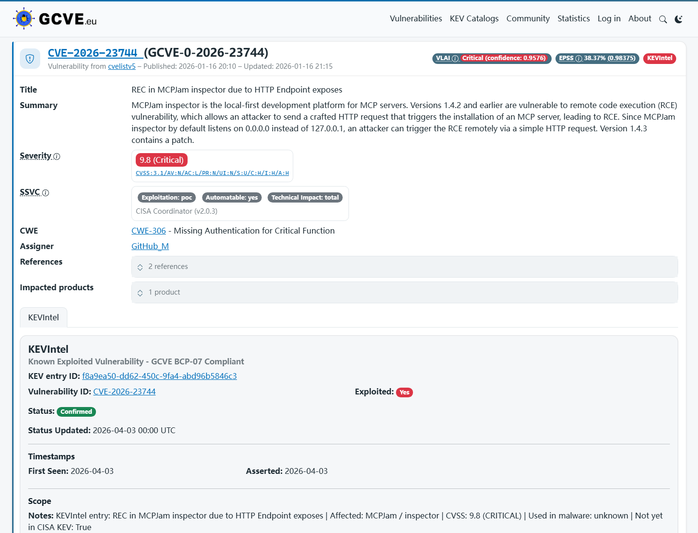
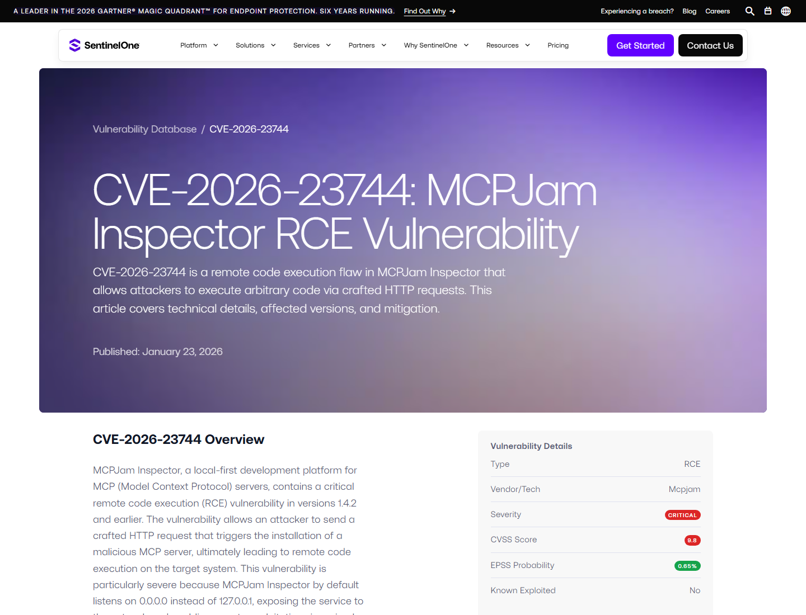
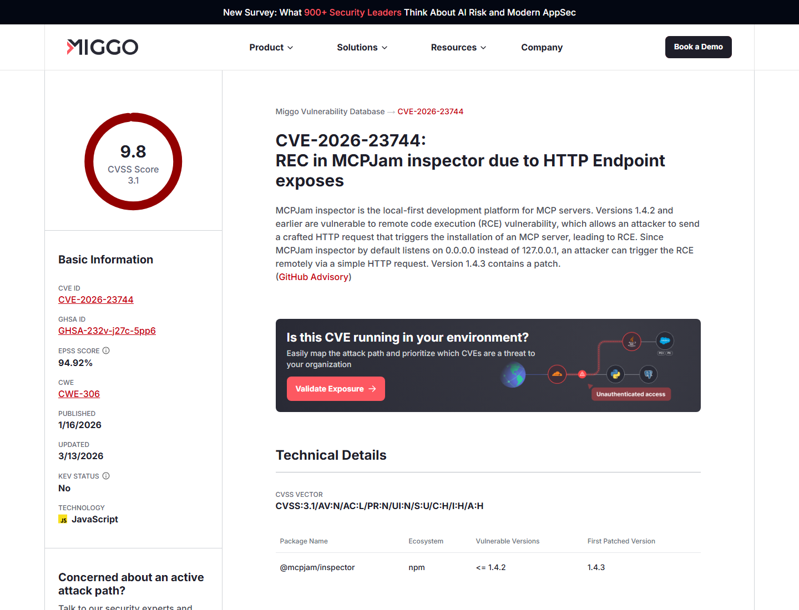
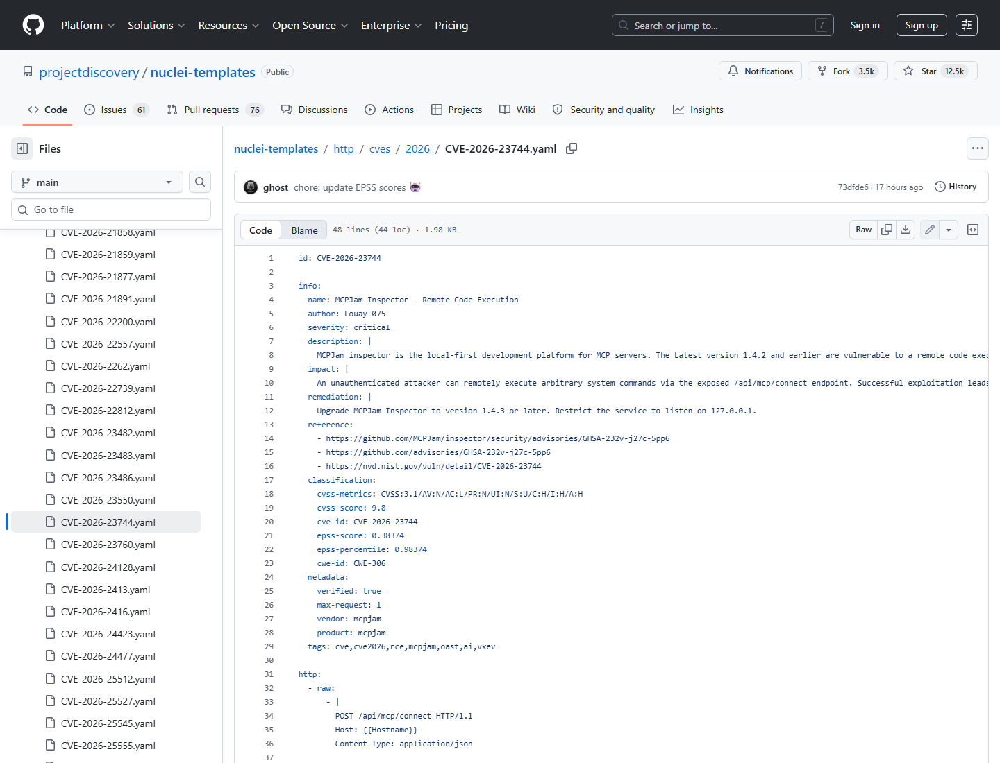

# MCPJam Inspector Default Bind Remote Code Execution (2026)
> MCPJam Inspector 默认监听导致远程代码执行

| Field | Value |
|---|---|
| Category | Agent Risk |
| Severity | Critical |
| AI Tool | MCPJam Inspector, Model Context Protocol development platform |
| Language | TypeScript / Node.js |
| Real Incident | Yes |
| Reproducible | Yes |
| Disclosed | 2026-01-16 |
| CVE | CVE-2026-23744 |
| CVSS | 9.8 |

## TL;DR
MCPJam Inspector 1.4.2 and earlier listened on `0.0.0.0` by default and exposed unauthenticated MCP endpoints; crafted HTTP requests could trigger MCP server installation and remote code execution.
> 这是 MCP 开发工具的典型“本地工具变网络服务”问题：调试器默认监听所有网卡，关键 endpoint 又缺少认证，远程攻击者可直接触发 MCP server 安装链路并执行代码。

---

## 详细分析 / Full Analysis

# MCPJam Inspector CVE-2026-23744 案例分析：MCP 开发工具默认暴露与 RCE

## 基本信息

MCPJam Inspector 是面向 Model Context Protocol 服务器的本地优先开发和测试平台。它用于调试 MCP server、连接工具、检查请求和验证 AI 应用与外部能力之间的交互。CVE-2026-23744 暴露了这类工具的一个高危默认：版本 1.4.2 及更早版本默认监听 `0.0.0.0`，而不是只绑定 `127.0.0.1`，并且关键 HTTP endpoint 缺少认证。

CrowdSec 报告称，其网络检测到针对 CVE-2026-23744 的利用尝试，攻击目标是暴露在网络上的 AI 开发工具。攻击路径围绕默认 `0.0.0.0` 监听和 `/api/mcp/connect` endpoint 展开：攻击者可远程发送 HTTP 请求，触发安装 MCP server 并进入代码执行链。[CrowdSec](https://www.crowdsec.net/vulntracking-report/cve-2026-23744)

## 一、事件核验与证据范围

### 证据矩阵

| 来源 | 类型 | 证明内容 | 备注 |
|---|---|---|---|
| MCPJam GitHub Advisory | 主证据 | GHSA-232v-j27c-5pp6、1.4.2 及更早版本、HTTP 请求触发安装 MCP server 导致 RCE | 项目 advisory |
| NVD | 主证据 | CVE-2026-23744、默认监听 `0.0.0.0`、1.4.3 修复、CVSS 9.8 | 标准化记录 |
| CrowdSec | 攻击观测 | 2026 年 2 月开始观测到利用尝试和针对开发环境的扫描 | 真实威胁信号 |
| SentinelOne / Miggo | 技术复核 | 远程 crafted HTTP request、MCP server installation flow、默认暴露 | 第三方复核 |
| GCVE / ProjectDiscovery | 情报和检测复核 | CVSS 9.8、SSVC automatable/total impact、nuclei detection template | 防御视角 |

GitHub Advisory 的摘要说明，MCPJam Inspector 1.4.2 及更早版本存在 RCE，攻击者可以发送 crafted HTTP request，触发 MCP server installation，最终导致远程代码执行。NVD 进一步指出，默认监听 `0.0.0.0` 让攻击不局限于本机浏览器，而是可以从网络远程触发。[MCPJam Advisory](https://github.com/MCPJam/inspector/security/advisories/GHSA-232v-j27c-5pp6)

## 二、系统背景与触发条件

MCP inspector 类工具的设计目标是降低开发门槛。开发者可以快速连接 MCP server、测试工具调用、查看返回结果，并在本地调试 AI 应用的工具层。问题在于，这类工具经常运行在开发者机器上，附近有源码、SSH key、云凭据、API token、内部服务访问能力和未提交代码。若本地调试服务意外暴露到局域网或公网，后果就不再是普通 demo 服务被访问。

触发条件是目标运行 MCPJam Inspector 1.4.2 或更早版本，并且服务可被攻击者访问。由于默认绑定 `0.0.0.0`，开发者在云主机、远程工作站、容器或公司网络中运行时，服务可能对外部网络开放。攻击者向 `/api/mcp/connect` 等相关 endpoint 发送 crafted request，即可触发安装或连接攻击者控制的 MCP server。

## 三、攻击链与处置过程

攻击链不依赖复杂社工。攻击者先扫描暴露的 MCPJam Inspector 服务，再向 connect/install endpoint 发送请求，利用 MCP server 安装和启动流程执行攻击者指定内容。MCP 的设计本来就允许连接工具和本地能力；如果安装/连接动作没有认证与来源限制，就会把开发便利变成远程执行入口。

修复版本是 1.4.3。公开材料的共同建议是升级、避免将 Inspector 暴露到不可信网络、绑定 localhost、并在反向代理或防火墙后限制访问。ProjectDiscovery 的 nuclei-templates 仓库也出现了针对 CVE-2026-23744 的检测模板，说明该漏洞已经进入自动化检测和暴露面排查视野。[ProjectDiscovery template](https://github.com/projectdiscovery/nuclei-templates/blob/main/http/cves/2026/CVE-2026-23744.yaml)

## 四、技术根因分析

根因首先是默认网络绑定错误。开发工具如果只监听 `127.0.0.1`，攻击者通常需要通过浏览器 CSRF、DNS rebinding 或本机权限绕过；一旦默认监听 `0.0.0.0`，同一网段或公网攻击者可以直接访问。对 MCP 调试器这种高权限工具而言，默认暴露所有接口是危险设计。

第二个根因是关键 endpoint 缺少认证。MCP server installation flow 是高敏感动作，因为它最终可能启动本地命令、加载工具、连接环境变量和执行代码。若 HTTP endpoint 接受未认证请求，就把“安装/连接工具”变成攻击者可远程调用的执行器。

## 五、AI 参与方式与风险归因

这个案例的 AI 参与方式在 MCP 工具生态。MCPJam Inspector 面向开发者调试 AI 应用如何连接外部工具和数据源。漏洞没有利用模型输出，而是利用 AI 工具协议周边的开发者基础设施。开发者为了调试 agent 能力而运行 Inspector，结果本地工具控制面被网络暴露。

风险归因应落在 MCP 开发工具的默认安全、认证和执行边界上。MCP server 通常代表“模型可调用的工具”，而 Inspector 又负责安装、连接和测试这些工具；一旦 Inspector endpoint 被远程控制，攻击者接管的是工具层，而不是聊天层。

## 六、与团队技术报告风险框架的关系

团队技术报告关注 AI agent 的工具调用风险。MCPJam Inspector 说明，风险不仅出现在生产 agent 中，也出现在开发/测试工具里。一个为了调试 MCP server 的本地 Web 工具，如果默认监听所有接口并缺少认证，就会把开发者机器暴露给远程 RCE。

这类案例也说明，MCP 的安全不能只讨论协议本身，还要覆盖 registry、inspector、SDK、server launcher、stdio transport 和开发者工作站。每一层都可能成为模型工具链的执行入口。

## 七、影响范围与社会后果

CrowdSec 观察到的利用尝试说明，攻击者已经把 AI 开发工具纳入扫描目标。MCPJam Inspector 面向的是构建下一代 AI-connected applications 的开发者和 tinkerer；这些人往往在拥有源码和凭据的机器上运行调试工具。攻击者若拿到 RCE，可能窃取代码、模型 provider key、云凭据、MCP server secrets 和内部 API token。

社会后果在于“本地优先”工具不等于“本地安全”。很多开发者默认相信调试器只在本机可见，但云主机、容器端口映射、公司 Wi-Fi、远程开发环境和 IDE tunnel 都可能把它暴露出去。AI 工具链越丰富，这类调试服务越需要安全默认值。

## 八、治理建议

MCPJam Inspector 用户应升级到 1.4.3 或更高版本，并确认服务只绑定 localhost。历史上运行过 1.4.2 或更早版本的环境，应检查是否有异常 MCP server 安装、未知进程、外连连接和凭据访问痕迹。暴露在公网或共享网络的开发主机，应轮换相关 API key、MCP secrets 和云凭据。

开发工具默认应采用 localhost-only、显式认证、随机 token、Origin/Host 校验和启动时醒目警告。MCP server 安装与执行应有 allowlist、用户确认和审计日志。企业应把 AI 开发工具纳入资产扫描，尤其关注默认端口、容器端口映射和远程 IDE 环境。

## 九、结论

CVE-2026-23744 展示了 MCP 生态开发工具的安全短板：本地调试器一旦默认暴露网络，又允许未认证请求触发工具安装，就会成为远程代码执行入口。MCPJam Inspector 的案例提醒团队，AI agent 的工具链安全要从开发环境开始，默认绑定、认证、安装流程和网络暴露面都必须按生产级控制来设计。

## 参考来源

- [CrowdSec: CVE-2026-23744 MCPJam Inspector critical RCE](https://www.crowdsec.net/vulntracking-report/cve-2026-23744)
- [MCPJam GitHub Advisory: GHSA-232v-j27c-5pp6](https://github.com/MCPJam/inspector/security/advisories/GHSA-232v-j27c-5pp6)
- [NVD: CVE-2026-23744](https://nvd.nist.gov/vuln/detail/CVE-2026-23744)
- [SentinelOne: MCPJam Inspector RCE](https://www.sentinelone.com/vulnerability-database/cve-2026-23744/)
- [Miggo: MCPJam Inspector Connect API RCE](https://www.miggo.io/vulnerability-database/cve/CVE-2026-23744)
- [GCVE / Vulnerability Lookup: CVE-2026-23744](https://db.gcve.eu/vuln/CVE-2026-23744)
- [ProjectDiscovery nuclei template: CVE-2026-23744](https://github.com/projectdiscovery/nuclei-templates/blob/main/http/cves/2026/CVE-2026-23744.yaml)
