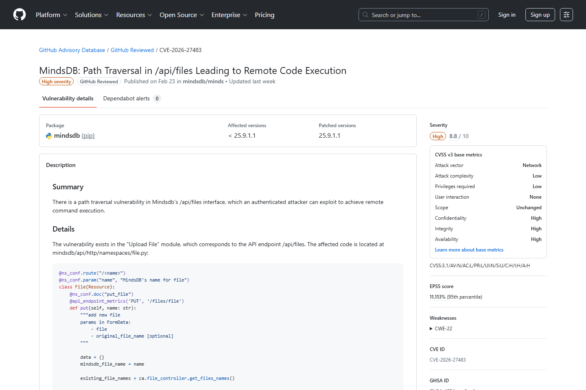
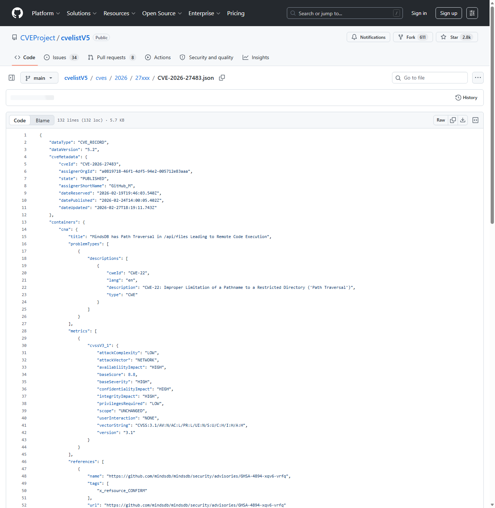
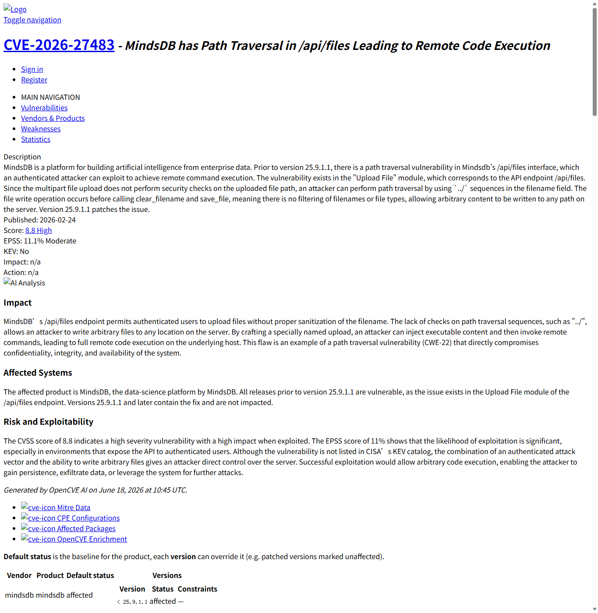
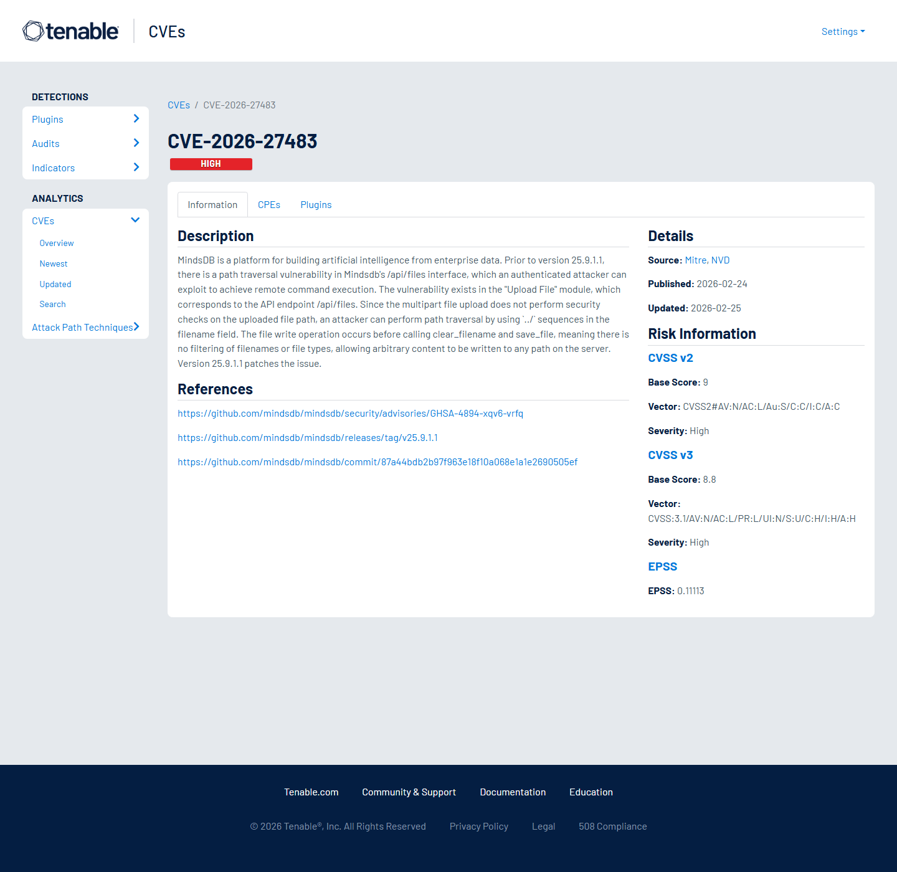
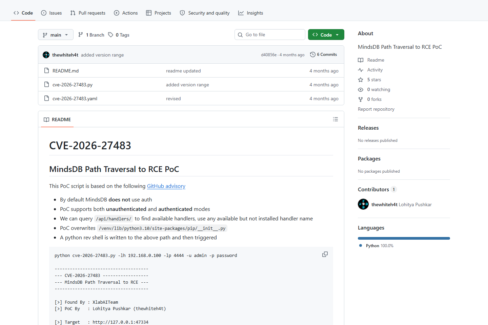
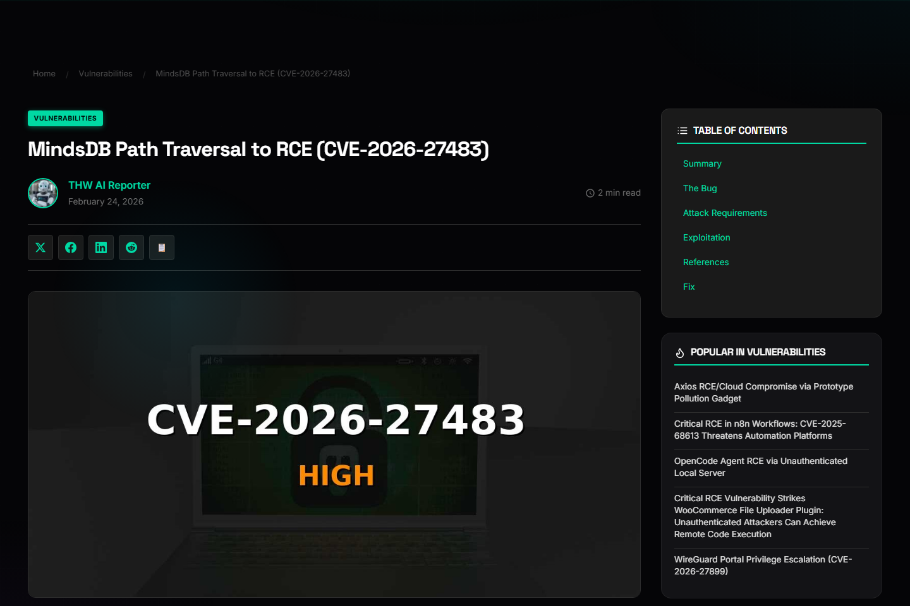

# MindsDB File Upload Path Traversal to RCE (2026)
> MindsDB 文件上传路径穿越到远程代码执行

| Field | Value |
|---|---|
| Category | domain-specific |
| Severity | High |
| AI Tool | MindsDB, AI from enterprise data platform, /api/files upload interface |
| Language | Python |
| Real Incident | Yes |
| Reproducible | Yes |
| Disclosed | 2026-02-27 |
| CVE | CVE-2026-27483 |
| CVSS | 8.8 |

## TL;DR
MindsDB file upload path traversal let authenticated users write files and reach RCE.
> MindsDB 文件上传路径穿越到远程代码执行：攻击者可写入恶意文件并触发远程命令执行，影响企业数据 AI 平台的主机和数据。

---

## 基本信息

| 项目 | 内容 |
|---|---|
| 案例时间 | 2026-02-27 |
| 事件对象 | MindsDB 25.9.1.1 之前版本 |
| 事件类型 | /api/files 文件上传路径穿越并升级到远程命令执行 |
| 攻击入口 | 已认证攻击者在 multipart 文件名中使用路径穿越序列，写入预期目录之外的位置。 |
| 主要影响 | 攻击者可写入恶意文件并触发远程命令执行，影响企业数据 AI 平台的主机和数据。 |
| 修复方向 | 升级到 25.9.1.1 或更高版本，并限制上传路径、文件类型和执行权限。 |

## 摘要

MindsDB 是面向企业数据构建 AI 能力的平台，CVE-2026-27483 发生在 /api/files 上传接口。CVEProject cvelistV5 和 GitHub Advisory 说明，受影响版本的上传模块存在路径穿越，已认证攻击者可以把文件写到预期目录之外，并进一步实现远程命令执行。
这个案例的关键不是“上传接口写错路径”这么简单，而是上传能力位于企业数据 AI 平台的入口层。MindsDB 通常连接数据库、模型、数据分析任务和自动化查询环境，写入位置一旦失控，攻击者可能从普通文件上传转向影响平台运行逻辑。

## 一、公开材料概况

GitHub Advisory、CVEProject cvelistV5、OpenCVE、Tenable、公开 PoC 仓库、TheHackerWire 和 Positive Technologies/DBugs 均围绕同一 CVE 给出材料。公开 PoC 与 Tenable 记录说明漏洞具有可复现利用路径；现有公开信息主要覆盖产品漏洞和上传执行链，没有提供大规模在野利用统计。
多类来源组合起来，能看出该漏洞已经从公告进入可操作的攻击知识库。Tenable 和公开 PoC 让防守方不能只把它当作理论缺陷处理；即使攻击需要认证，低权限账号、测试账号或被盗会话都可能成为利用前提。

| 来源 | 类型 | 证明内容 |
|---|---|---|
| GitHub Advisory: MindsDB Path Traversal in /api/files | 主证据 | 确认漏洞、影响版本和修复版本。 |
| CVEProject cvelistV5: CVE-2026-27483 | 主证据 | 确认 CVE 描述。 |
| OpenCVE: CVE-2026-27483 | 复核证据 | 复核路径穿越到 RCE 的影响。 |
| Tenable: CVE-2026-27483 | 技术证据 | 提供公开利用条目和 PoC 元数据。 |
| GitHub PoC: thewhiteh4t/cve-2026-27483 | 技术证据 | 展示公开 PoC 项目。 |
| TheHackerWire: MindsDB Path Traversal to RCE | 复核证据 | 复核漏洞链和影响。 |

## 二、系统背景与触发条件

MindsDB 的价值在于把企业数据源、AI 模型和自动化查询放在统一平台中。文件上传能力常用于导入数据、模型或辅助材料，看似是普通数据入口，但在服务器端 AI 平台中，写文件位置一旦可控，就可能触碰插件、脚本、配置和可执行路径。
在这类平台里，上传文件后往往还有解析、索引、训练、转换或调度步骤。文件不只是静态附件，而可能进入后续自动处理链。攻击者只要把文件写到会被加载或执行的位置，就能借助平台自己的生命周期完成放大。

## 三、攻击链路与处置过程

攻击者首先取得平台登录会话，然后向 /api/files 发送构造过的 multipart 上传请求。文件名或路径参数中的 ../ 序列突破目标目录限制，把内容写入攻击者指定位置。若写入位置会被 Python 解释器、平台加载器或系统服务执行，路径穿越就会升级为远程命令执行。
应急分析时，应把上传行为与后续进程行为关联起来。单看 HTTP 日志可能只能看到异常文件名，真正的危害往往发生在文件被解析、导入或后台任务加载时。对已经暴露的实例，应检查上传目录之外的新文件、异常 Python 模块、计划任务、启动脚本和最近修改的配置文件。

## 四、技术根因分析

根因是上传路径规范化和安全目录约束不足。文件名过滤只处理表层字符串时，容易漏掉编码、分隔符和路径归一化后的真实目标。AI 数据平台还常把上传文件和后续处理流程自动连接，进一步提高了危险文件被执行或加载的概率。
可靠的防护需要在路径解析完成后再做目录约束，而不是只过滤原始文件名。服务端应生成随机文件名，把文件写入固定不可执行目录，并在打开文件前校验真实路径仍位于允许根目录内。对需要保留原文件名的业务，也应把原名仅作为元数据保存。

## 五、AI 参与方式与风险归因

AI 参与方式体现在 MindsDB 是企业数据 AI 平台，上传文件可能进入模型、数据源或自动化处理链。漏洞技术形态是路径穿越，但影响对象是承载 AI 数据工作流的服务器。归因应覆盖上传接口、文件处理生命周期和平台运行权限。
风险还会随着数据连接数量增加而放大。一个接入多数据源的 MindsDB 实例，往往保存数据库凭据、查询历史和模型集成配置。攻击者获得服务器执行能力后，可能不再需要逐个破解业务系统，而是从 AI 数据平台集中读取连接信息。

## 六、与团队技术报告风险框架的关系

团队框架强调 AI 平台把传统 Web、数据和执行组件组合成新的供应链。MindsDB 案例说明，普通上传漏洞在 AI 数据平台中可能直接威胁模型工作区、企业数据连接和自动化执行环境。

## 七、影响范围与治理建议

CVSS 8.8 体现了认证后高影响。对企业部署而言，攻击者一旦获得低权限账号，就可能通过上传接口写入恶意文件，进而读取或篡改企业数据连接、模型配置和服务端环境。公开 Tenable 条目也让防守窗口更短。

治理上应限制上传功能的账户范围和文件类型，使用服务器端随机文件名并强制写入不可执行目录。上传后处理应在沙箱中执行，平台进程不能以高权限运行。监控上应关注上传路径中的 ../、异常扩展名和上传后立即触发的进程行为。
还应对 AI 数据平台采用分层凭据策略。平台进程不应持有超出当前任务所需的数据源权限，上传处理服务与查询执行服务也应隔离。发现异常上传后，除了删除文件和升级版本，还需要轮换数据源凭据，检查模型配置是否被篡改，并确认没有新增持久化任务。

## 八、结论

MindsDB 案例说明，AI 数据平台的文件入口就是执行边界。上传模块不能只按数据导入功能评估，而要按可能触达服务器执行环境的攻击面管理。
它也提醒使用方，认证后漏洞在 AI 数据平台里并不低危。只要低权限用户能上传文件，而平台又能自动解析和执行后续任务，上传接口就需要接近代码执行入口的防护强度。安全评估应覆盖文件路径、处理沙箱、凭据隔离和任务日志。

## 参考来源

1. [GitHub Advisory: MindsDB Path Traversal in /api/files](https://github.com/advisories/GHSA-4894-xqv6-vrfq)
2. [CVEProject cvelistV5: CVE-2026-27483](https://github.com/CVEProject/cvelistV5/blob/main/cves/2026/27xxx/CVE-2026-27483.json)
3. [OpenCVE: CVE-2026-27483](https://app.opencve.io/cve/CVE-2026-27483)
4. [Tenable: CVE-2026-27483](https://www.tenable.com/cve/CVE-2026-27483)
5. [GitHub PoC: thewhiteh4t/cve-2026-27483](https://github.com/thewhiteh4t/cve-2026-27483)
6. [TheHackerWire: MindsDB Path Traversal to RCE](https://www.thehackerwire.com/mindsdb-path-traversal-to-rce-cve-2026-27483/)
