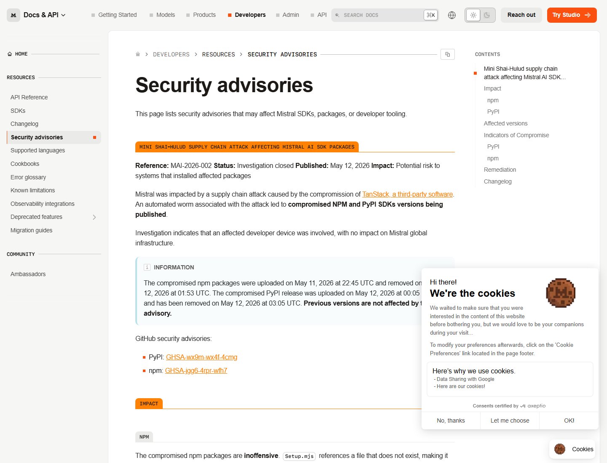
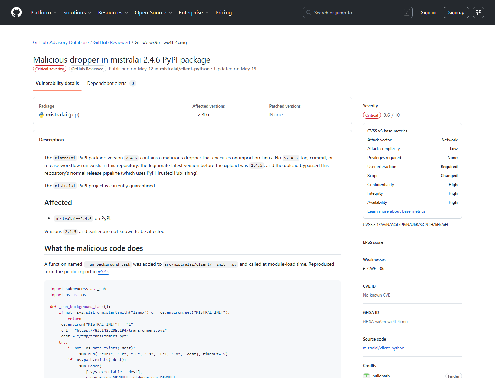
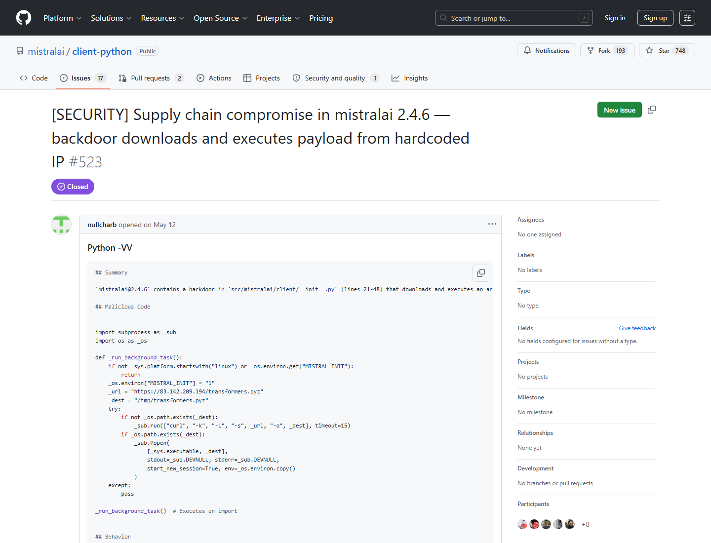
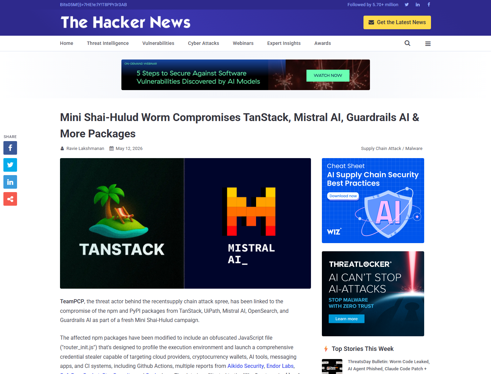

# Mistral AI SDK Mini Shai-Hulud Supply-Chain Compromise (2026)
> Mistral AI SDK Mini Shai-Hulud 供应链污染事件

| Field | Value |
|---|---|
| Category | Hallucination & Supply Chain |
| Severity | 🔴 Critical |
| AI Tool | Mistral AI SDK, mistralai PyPI package, @mistralai npm packages |
| Language | Python, JavaScript |
| Real Incident | ✅ |
| Reproducible | ❌ |
| Disclosed | 2026-05-12 |
| CVE | — |
| CVSS | — |

## TL;DR
Compromised Mistral AI SDK packages ran credential-stealing malware in AI developer environments.
> Mistral AI SDK 的 npm 与 PyPI 版本在 Mini Shai-Hulud 供应链攻击中被污染，Python 版本会在导入时下载并运行凭据窃取载荷。

---

## 详细分析 / Full Analysis

# Mistral AI SDK Mini Shai-Hulud 供应链污染事件分析：AI 开发 SDK 成为凭据窃取入口

## 基本信息

2026 年 5 月 12 日，Mistral AI 发布安全公告，确认其 SDK 包受到 Mini Shai-Hulud 供应链攻击影响。受影响版本包括 npm 包 `@mistralai/mistralai`、`@mistralai/mistralai-azure`、`@mistralai/mistralai-gcp` 的若干版本，以及 PyPI 包 `mistralai==2.4.6`。公告给出调查状态、受影响版本、上传与移除时间，并说明恶意 PyPI 包会在 Linux 导入时下载并执行 payload。

## 摘要

该事件展示了 AI SDK 作为高价值开发依赖的风险。`mistralai==2.4.6` 中被注入的代码位于 `src/mistralai/client/__init__.py`，触发点是 `import mistralai`。它在 Linux 上下载 `transformers.pyz` 到 `/tmp/transformers.pyz` 并以后台进程运行。更广泛的 Mini Shai-Hulud 攻击波还影响 TanStack、Guardrails AI、OpenSearch、UiPath 等多个生态，目标是开发者凭据、CI/CD token 和包发布身份。

## 一、事件核验与证据范围

### 证据矩阵

| 来源 | 类型 | 证明内容 | 边界 |
|---|---|---|---|
| Mistral AI Security Advisory | 主证据 | 受影响版本、上传/移除时间、PyPI import-time 恶意脚本、处置建议 | 厂商确认影响范围与处置建议 |
| GitHub Advisory GHSA-wx9m-wx4f-4cmg | 主证据 | `mistralai==2.4.6` 恶意 dropper、触发方式、推荐处置 | 未分析二阶段 payload 全部行为 |
| GitHub Issue #523 | 技术 / 生态证据 | `__init__.py` 恶意代码、IOC、Linux import 触发 | 用于补充代码级证据 |
| OX Security | 技术 / 影响证据 | 170+ 包、518M+ 月下载、379 个含被窃凭据仓库、Mistral/Guardrails PyPI | 广泛指标属于整波攻击背景 |
| The Hacker News | 复核证据 | 多来源复核 Mini Shai-Hulud、Mistral/Guardrails PyPI、凭据窃取和 wiper 行为 | 媒体综合多家研究，需要分清来源 |
| LiteLLM 安全更新 | 生态证据 | 说明 LiteLLM 不导入 `mistralai`，因此不受该路径影响 | 主要用于生态影响边界 |

Mistral 安全公告确认，Mini Shai-Hulud 供应链攻击导致其 npm 与 PyPI SDK 版本被污染。公告列出上传和移除时间：npm 包于 2026 年 5 月 11 日 22:45 UTC 上传并于 5 月 12 日 01:53 UTC 移除；PyPI 版本于 2026 年 5 月 12 日 00:05 UTC 上传并于 03:05 UTC 移除。公告还列出受影响版本，并说明 PyPI 包会在导入时运行恶意脚本。([Mistral AI](https://docs.mistral.ai/resources/security-advisories))

GitHub Advisory Database 记录 GHSA-wx9m-wx4f-4cmg，标题为 `Malicious dropper in mistralai 2.4.6 PyPI package`。该 advisory 指出，`mistralai==2.4.6` 没有对应 tag、commit 或正常 release workflow run，上传绕过了正常 PyPI Trusted Publishing 流程；恶意代码会在 Linux 上导入时下载并运行 `/tmp/transformers.pyz`。([GitHub Advisory](https://github.com/advisories/GHSA-wx9m-wx4f-4cmg))

项目 issue #523 提供了更细的代码级证据：`src/mistralai/client/__init__.py` 中加入 `_run_background_task()`，检查 Linux 与 `MISTRAL_INIT` 环境变量，使用 `curl -k` 下载 `https://83.142.209.194/transformers.pyz`，再用当前 Python 解释器以 detached background process 运行。([GitHub](https://github.com/mistralai/client-python/issues/523))

OX Security 报告把该事件放入更广泛的 Mini Shai-Hulud 攻击波，称影响 170+ npm/PyPI 包、月下载量合计 518M+，并发现数百个包含被窃凭据的 GitHub 仓库。报告列出 PyPI 受影响包包括 `mistralai@2.4.6` 和 `guardrails-ai@0.10.1`。([OX Security](https://www.ox.security/blog/shai-hulud-here-we-go-again-170-packages-hit-across-npm-pypi/))

The Hacker News 复核称，TeamPCP 被关联到 TanStack、UiPath、Mistral AI、OpenSearch、Guardrails AI 等包的污染；报道指出 Mistral AI 发布了 advisory，并说明当前调查显示受影响开发者设备参与其中。([The Hacker News](https://thehackernews.com/2026/05/mini-shai-hulud-worm-compromises.html))

### 证据范围

公开证据可以确认 Mistral AI SDK 的特定 npm 和 PyPI 版本被污染并已移除，`mistralai==2.4.6` 的恶意代码会在 Linux 导入时下载并执行二阶段 payload。该事件属于更广泛的 Mini Shai-Hulud 供应链攻击波，涉及多个 npm/PyPI 生态包；Mistral 也给出了检查、清理、凭据轮换和 C2 监控建议。本文将 Mistral SDK 作为该攻击波中被污染的 AI 开发依赖来分析，风险重点在开发者机器、CI/CD 环境和包发布身份。

## 二、系统背景与触发条件

Mistral AI SDK 是开发者调用 Mistral API、Azure/GCP 相关集成和构建 AI 应用的常用依赖。SDK 往往出现在本地开发环境、CI/CD、服务端应用和实验 Notebook 中，运行位置靠近 API key、云凭据、GitHub token、包发布 token 和环境变量。

典型触发路径是开发者或 CI 在暴露窗口内安装、升级到受影响的 npm 或 PyPI 版本；在 PyPI 路径中，Linux 环境导入 `mistralai==2.4.6` 即可触发 dropper。如果环境允许向恶意 IP 或 C2 域名出站连接，并且机器中存在可读取的云、Git、npm/PyPI、SSH 或模型平台凭据，污染 SDK 就可能演变成凭据泄露和后续供应链扩散。

## 三、攻击链路与处置过程

攻击入口是合法包管理器发布链。开发者通过正常 `pip install`、lockfile 更新或 CI 构建拉取受影响版本。包名、组织名和用途均真实可信，攻击者借用的是官方依赖身份。

AI 组件是 Mistral AI SDK。SDK 是 AI 应用接入模型 API 的关键依赖，通常与高价值凭据和开发流水线共处。关键权限来自开发者环境和 CI/CD。

失效边界包括开发者设备、第三方软件链、包发布身份和依赖更新策略。Mistral 公告称事件与 TanStack 第三方软件 compromise 相关，自动化 worm 导致受影响 SDK 版本被发布。GitHub Advisory 进一步指出 PyPI 上传绕过了正常 release pipeline。

执行结果在 PyPI 路径中是 import-time dropper：导入 `mistralai` 后下载 `transformers.pyz` 并后台执行。处置包括移除受影响版本、清理系统、轮换所有可达凭据、审计云日志、检查 `/tmp/transformers.pyz`、监控 C2 指标。

## 四、技术根因分析

根因之一是包发布身份和 CI/CD 身份被攻击者利用。Mini Shai-Hulud 的扩散价值来自可信发布链。包管理器、GitHub Actions、OIDC token、npm/PyPI 发布凭据构成了攻击路径。

根因之二是 SDK 的 import-time 执行面。Python 包只要在 `__init__.py` 中加入代码，就能在应用导入时执行。开发者常认为安装依赖后只有显式调用 API 才会产生行为，但 import 本身已经足以触发网络下载和进程启动。

根因之三是 AI 开发环境凭据密度高。AI SDK 常与模型 API key、云服务账号、GitHub token、数据平台凭据同处一个环境。攻击者污染 AI SDK 的收益很高，因为它能直接触达模型应用供应链和部署流水线。

## 五、AI 参与方式与风险归因

AI 参与方式明确：受影响对象是 Mistral AI 的官方 SDK 包，服务于 AI API 和模型应用开发；The Hacker News 和 OX 均将其列为 AI tooling / developer ecosystem 供应链攻击；Mistral 官方安全公告也定位为 SDK/package 事件。

风险归因集中在第三方供应链攻击、受影响开发者设备、包发布流程和 AI SDK 消费环境。Mistral 在公告中给出影响范围和修复建议，开发者侧需要把官方 SDK 也纳入依赖准入、凭据隔离和行为监控流程。

## 六、与团队技术报告风险框架的关系

团队技术报告强调 AI 进入软件开发全生命周期后，供应链、凭据、自动化偏见和执行边界会同步扩大。Mistral SDK 事件正是供应链风险与敏感数据泄露风险的交叉点。

AI SDK 被污染后的影响不止于应用功能故障。它可能窃取 GitHub token、云 key、npm/PyPI 凭据和模型平台凭据，从而影响后续软件发布和 AI 应用部署。报告提出的零信任人机协同治理可落地为依赖冷却期、包来源验证、CI/CD OIDC 最小权限、密钥隔离、egress 审计和导入时行为监控。

## 七、影响范围与社会后果

Mistral 维度的直接影响是安装受影响 SDK 的环境需要检查、清理和轮换凭据。更广泛的 Mini Shai-Hulud 影响体现为多生态联动：npm 和 PyPI 包、AI SDK、前端框架、自动化工具和 CI/CD 共同成为传播面。

社会后果在于 AI 应用开发越来越依赖官方 SDK、快速升级和自动化构建。一个 SDK 版本污染可触达本地开发机、CI runner、容器镜像和部署工件。攻击者瞄准的不只是最终用户，而是能继续发布软件和访问云资源的开发者身份。

## 八、治理建议

AI SDK 应启用依赖冷却期，生产或 CI 环境避免在发布后立即自动升级。对 Python 包导入阶段的网络连接和进程启动需要做行为监控，CI/CD 中的模型 API key、云 key、GitHub token、npm/PyPI token 也应分离存放并最小权限化。发现受影响版本后，应先隔离和取证，再轮换凭据，避免触发潜在破坏逻辑；长期治理上，即使是官方 SDK，也要经过 provenance、attestation、hash pinning 和私有包镜像准入审查。

## 九、结论

Mistral AI SDK Mini Shai-Hulud 事件说明，AI 应用依赖链已经成为攻击者争夺开发者身份和 CI/CD 权限的入口。官方 SDK 的可信品牌不能替代发布链验证。企业在接入 AI SDK 时，应将其视为高权限第三方依赖，用依赖治理、密钥隔离、行为检测和事件响应流程降低污染版本的爆炸半径。

## 参考来源

- [Mistral AI Security Advisory: Mini Shai-Hulud supply chain attack](https://docs.mistral.ai/resources/security-advisories)
- [GitHub Advisory Database: Malicious dropper in mistralai 2.4.6](https://github.com/advisories/GHSA-wx9m-wx4f-4cmg)
- [GitHub Issue #523: Supply chain compromise in mistralai 2.4.6](https://github.com/mistralai/client-python/issues/523)
- [OX Security: Shai-Hulud Here We Go Again - 170+ Packages Hit Across npm & PyPi](https://www.ox.security/blog/shai-hulud-here-we-go-again-170-packages-hit-across-npm-pypi/)
- [The Hacker News: Mini Shai-Hulud Worm Compromises TanStack, Mistral AI, Guardrails AI & More](https://thehackernews.com/2026/05/mini-shai-hulud-worm-compromises.html)
- [LiteLLM: Security Update - Mistral AI PyPI Supply Chain Attack](https://docs.litellm.ai/blog/mistral-supply-chain-attack-may-2026)
