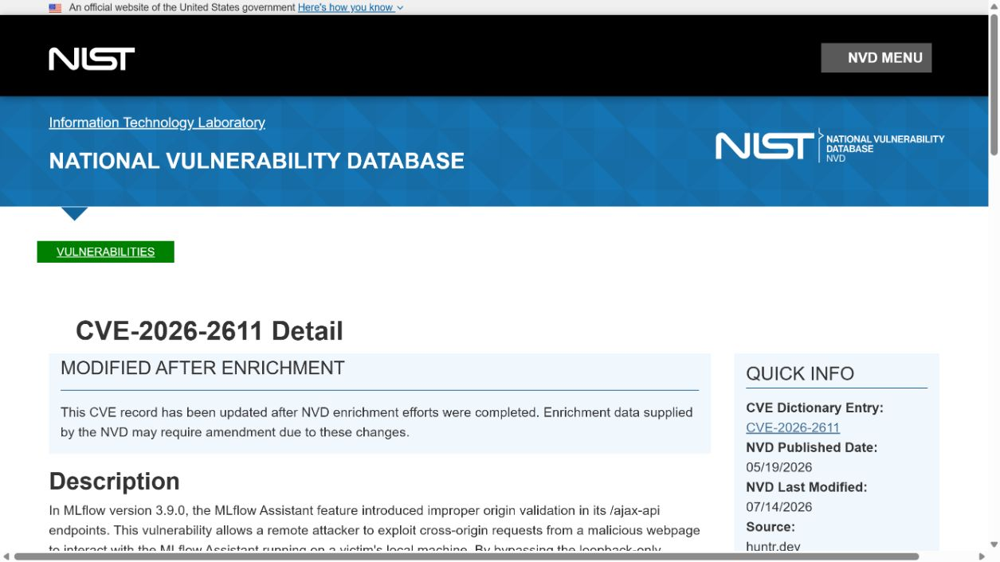
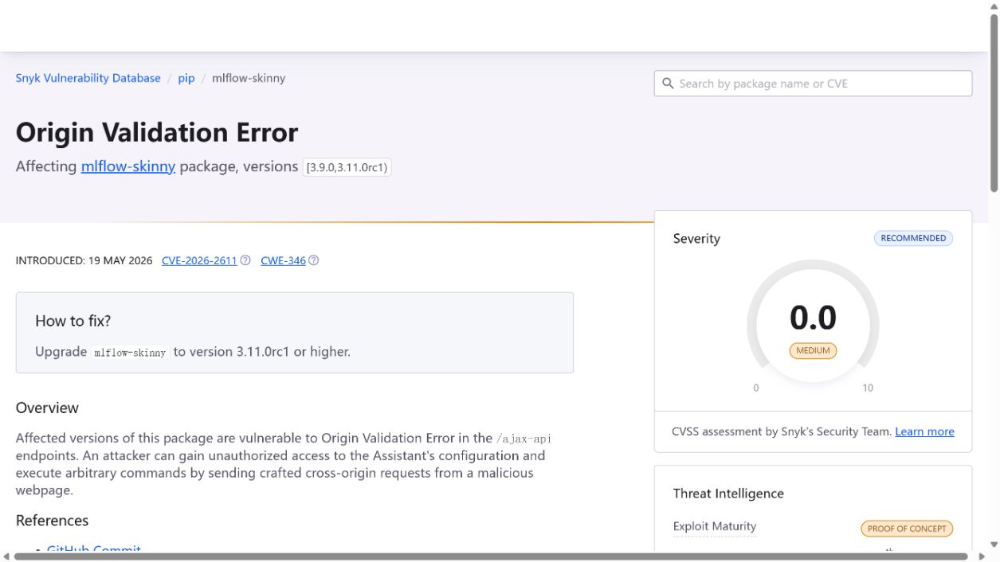
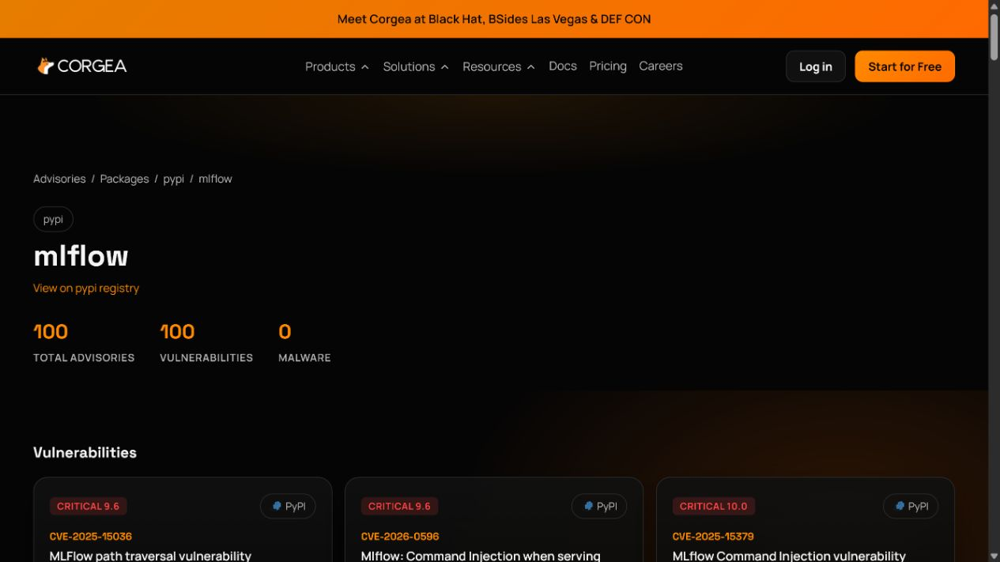
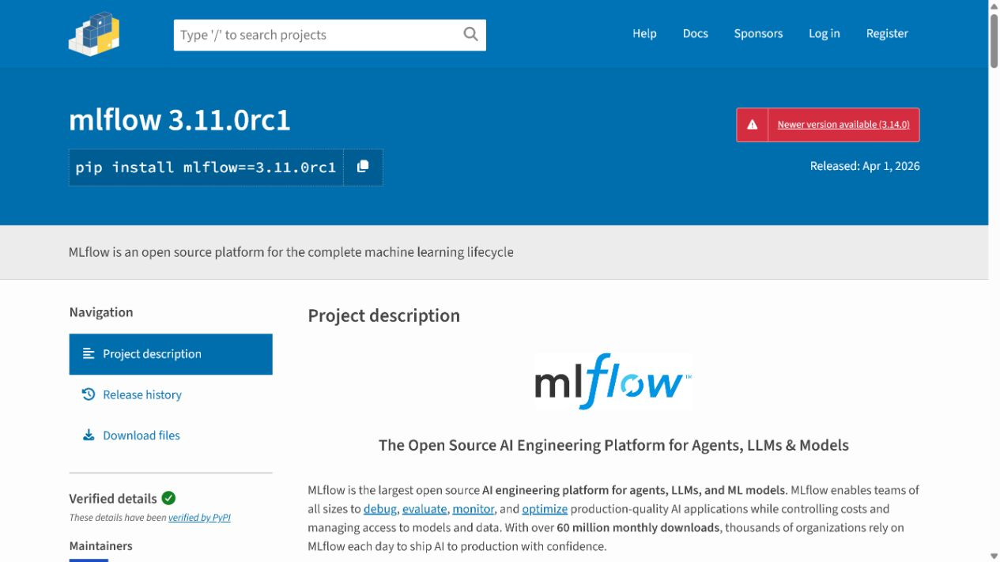
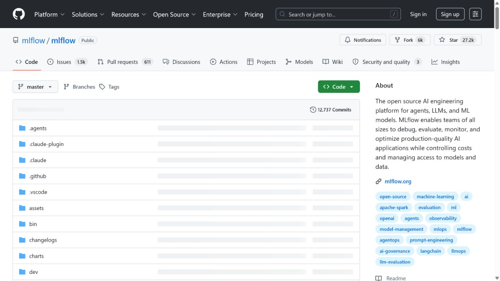

# MLflow Assistant Cross-Origin Command Execution (2026)
> MLflow Assistant 跨源请求导致的本地命令执行漏洞

| Field | Value |
|---|---|
| Category | Agent Risks |
| Severity | High |
| AI Tool | MLflow Assistant, Claude Code sub-agent, MLflow tracking server |
| Language | Python / HTTP / browser origin policy |
| Real Incident | Yes |
| Reproducible | Yes |
| Disclosed | 2026-05-19 |
| CVE | CVE-2026-2611 |
| CVSS | 9.6 |

## TL;DR
A malicious webpage could bypass MLflow Assistant's loopback trust assumption, change its configuration, and enable arbitrary commands through its Claude Code sub-agent.
> 恶意网页可绕过 MLflow Assistant 的本地回环信任假设，修改其配置并经 Claude Code 子 Agent 启用任意命令执行。

---

## 详细分析 / Full Analysis

## 一、基本信息与事件概况

CVE-2026-2611 影响 MLflow Assistant 相关的 ajax-api 端点。公开记录指出，恶意网页可通过跨源请求突破本地回环服务的信任假设，修改 Assistant 配置并启用完整访问能力；在该状态下，Assistant 可通过 Claude Code 子 Agent 执行任意命令。

这是一类浏览器到本地 Agent 的边界问题。服务可能只监听 127.0.0.1，开发者因此把它视为安全；但浏览器本身仍会访问本地端口，若 Origin 校验不正确，互联网上的页面就能借用户的浏览器向本地服务发请求。AI 子 Agent 将配置改变转化为命令能力，使影响超出普通 CSRF。

## 二、事件经过与公开材料

CVE-2026-2611 于 2026 年 5 月 19 日公开。NVD、Snyk、Corgea 与国家安全通报记录了漏洞描述、受影响范围和修复版本 3.11.0rc1。公开资料还链接到上游修复提交和报告平台，但没有披露在野利用或受害者统计。

由于攻击依赖受害者本地运行易受影响版本并访问恶意页面，风险评估必须结合浏览器使用场景、Assistant 是否启用以及其可以调用的本地工具，不能简单等同于公开服务器被未认证扫描即可接管。

### 证据矩阵

| 来源 | 类型 | 证明内容 |
|---|---|---|
| NVD: CVE-2026-2611 | 政府漏洞数据库 | 跨源请求、配置修改与 Claude Code 子 Agent 后果 |
| Snyk: MLflow Assistant origin validation error | 独立漏洞数据库 | 影响版本、修复版本和攻击前提 |
| Corgea MLflow advisories | 独立依赖安全数据库 | CVE 收录与项目生态背景 |
| MLflow release v3.11.0rc1 | 项目发布记录 | 修复版本的上游发布背景 |
| MLflow repository | 项目背景 | MLflow 与 Assistant 相关开发生态 |

## 三、系统背景与触发条件

MLflow 用于实验追踪、模型管理与评估。其 Assistant 功能把自然语言请求与本地开发工具连接起来，可能代表用户读取项目、调整配置或委派 Claude Code 执行任务。这样的助手通常需要本地控制接口，以便桌面或浏览器前端访问。

loopback 地址只限制网络路由，不自动限制浏览器来源。可靠的本地服务需要验证 Origin、Host、CSRF token 和用户交互语义；当服务还能授予 Agent 命令能力时，这些 Web 安全检查就成为操作系统级风险的第一道防线。

## 四、攻击链路或失效过程

攻击者托管恶意网页并诱使运行 MLflow Assistant 的用户访问。页面向本地 ajax-api 端点发送跨源请求，易受影响版本没有正确拒绝，Assistant 配置被修改为允许更高能力。随后攻击者借 Assistant 与 Claude Code 子 Agent 的执行路径触发本地命令。

攻击需要用户浏览器和本地服务同时存在，且实际可执行命令取决于 Assistant 的安装和权限。公开资料并未说明攻击者可以绕过操作系统权限或接管未运行 Assistant 的机器，因此本文将影响限定为已满足这些前提的开发环境。

## 五、技术根因与 AI 风险分析

根因是把回环监听误当作来源认证，并在配置接口与高能力 Agent 之间缺少额外确认。Origin 校验错误让网页来源越过本地服务边界，配置变更又能够把一个辅助功能提升为命令执行代理。两种失效叠加后，浏览器成为远端诱导与本地工具之间的桥梁。

修复应严格校验 Origin 和 Host，对敏感配置使用 CSRF 防护与显式用户确认，并将 Assistant 的命令执行能力拆分为短时、最小权限授权。开发者也应避免让本地 Agent 继承整个用户 shell、SSH agent 或云凭据环境。

MLflow Assistant 的价值在于把实验、追踪数据和开发工具交给对话式流程处理，但这也意味着浏览器中的一次配置变更可能影响具有本地执行能力的子 Agent。问题的危险性来自两层能力叠加：网页可触达回环服务，而 Assistant 又可把配置转换为后续的命令或任务。用户未必会把访问普通网站与改变本机 AI 工具的执行权限联系起来，这正是来源校验失效会造成较大影响的原因。

本地 AI 助手应像面向网络的管理接口一样处理高风险设置。除技术上的 Origin 和 Host 校验外，启用命令执行、切换 Agent 后端或扩大工作目录时都应显示清楚的变更内容，并要求与当前浏览器会话无关的显式确认。将 Assistant 运行在隔离环境、使用仅覆盖项目目录的凭据，也能把潜在后果限制在开发任务本身，避免它无意继承个人环境中的长期密钥。

## 六、影响范围与处置建议

已公开的影响是本地命令执行、项目文件和凭据暴露风险。团队应升级到修复版本，停止不需要的 Assistant 服务，检查浏览器历史与本地服务日志中的异常 ajax-api 调用，并轮换开发环境可访问的密钥。企业终端还可用浏览器策略和本地防火墙限制未知站点访问开发工具端口。

没有公开可靠的受害规模或在野利用证据。风险优先级取决于本地 Assistant 的实际权限、用户是否频繁访问不可信网页，以及机器是否拥有生产环境凭据。

## 七、结论

CVE-2026-2611 表明，本地 AI Assistant 不能因为绑定回环地址就被视为低风险。只要它能修改配置并委派命令，浏览器来源控制、用户确认和权限最小化就必须同时到位。

## 八、参考来源

- [NVD: CVE-2026-2611](https://nvd.nist.gov/vuln/detail/CVE-2026-2611)
- [Snyk: MLflow Assistant origin validation error](https://security.snyk.io/vuln/SNYK-PYTHON-MLFLOWSKINNY-16758001)
- [Corgea MLflow advisories](https://corgea.com/advisories/packages/pypi/mlflow)
- [MLflow release v3.11.0rc1](https://github.com/mlflow/mlflow/releases/tag/v3.11.0rc1)
- [MLflow repository](https://github.com/mlflow/mlflow)
