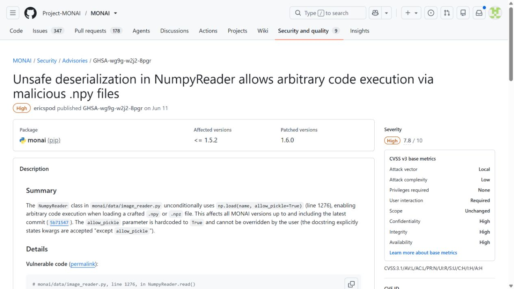
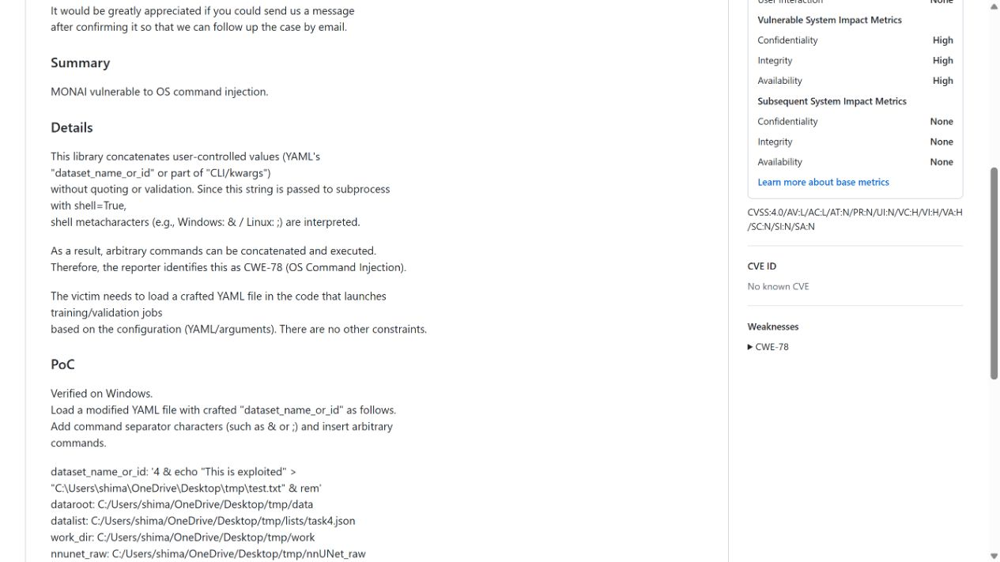
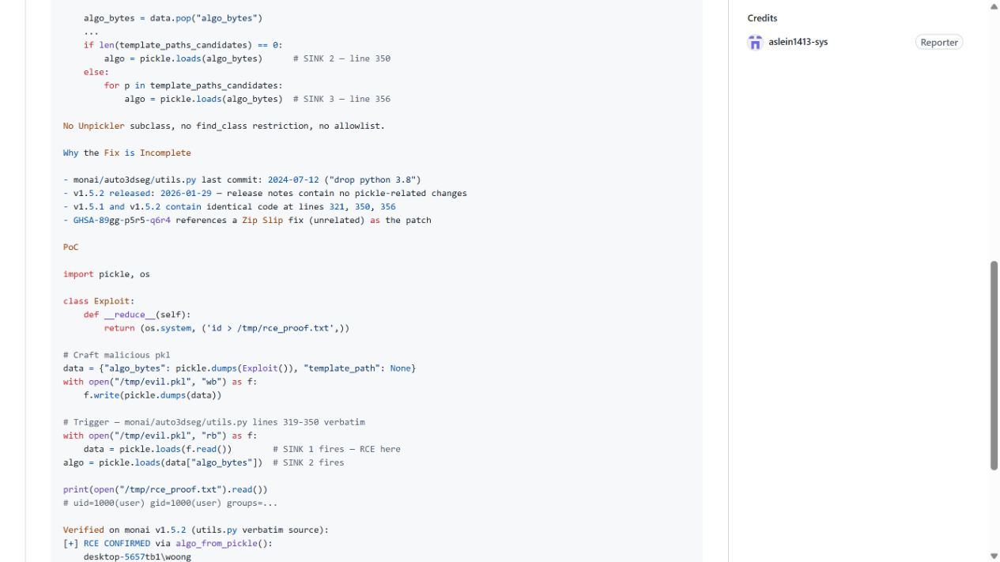
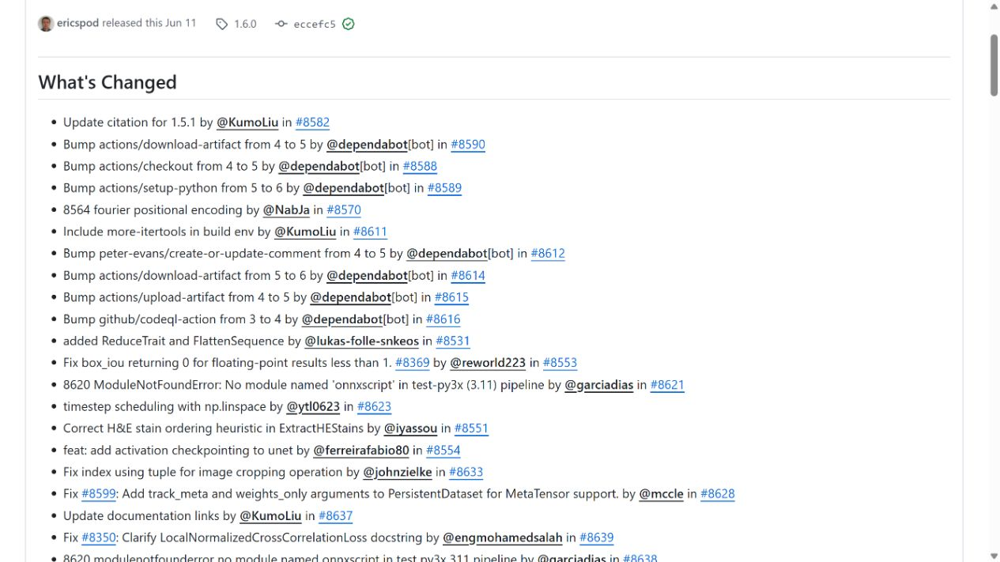
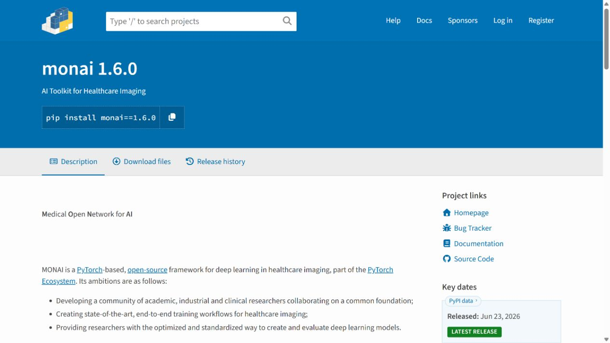

# MONAI Medical AI Artifact Loading Vulnerability Cluster (2026)
> MONAI 医疗 AI 数据与算法制品加载漏洞组

| Field | Value |
|---|---|
| Category | domain-specific |
| Severity | High |
| AI Tool | MONAI, Auto3DSeg, medical imaging pipelines |
| Language | Python |
| Real Incident | Yes |
| Reproducible | Yes |
| Disclosed | 2026-08-07 |

## TL;DR
MONAI 1.6.0 之前的多个数据与算法制品加载路径会把不可信 NumPy、pickle 或 YAML 元数据带入代码执行，医疗 AI 工作流中的数据包因而不能被当作纯数据。

---

## 详细分析 / Full Analysis

## 一、事件概况

MONAI 是面向医疗影像的开源 AI 框架，数据读取、Auto3DSeg 算法包和模型训练流程常被组合使用。2026 年 8 月公开的三份项目安全公告指出，1.6.0 之前的不同加载路径存在相互独立但后果相近的问题：NumpyReader 允许 pickle 对象反序列化，数据集元数据可进入 shell 命令，算法对象的 pickle 限制还能被绕过。

把三项问题作为一个制品安全案例，是因为它们共同发生在同一条医疗 AI 数据供应链上。攻击者不必直接修改训练代码，只要能影响待下载的数据集、算法 bundle 或配置文件，就可能让“载入数据”“分析数据集”这样的正常动作变成宿主代码执行。

## 二、公开材料与事实核对

项目 advisory 分别给出函数位置、触发条件和受影响版本，1.6.0 发布记录与 PyPI 包页面证明修复已进入可用版本。公开记录目前没有为这三项问题分配 CVE，因此材料中不设置 CVE 字段，也不使用 N/A 占位。

| 来源 | 类型 | 主要内容 |
|---|---|---|
| NumpyReader Advisory | 项目公告 | `allow_pickle=True` 带来的对象反序列化 |
| Dataset Metadata Advisory | 项目公告 | YAML 字段进入 `shell=True` 命令 |
| Algorithm Pickle Advisory | 项目公告 | 旧有保护的绕过方式 |
| MONAI 1.6.0 Release | 修复记录 | 安全修复所在版本 |
| PyPI | 包生态记录 | 1.6.0 可获取状态 |

## 三、攻击或事件链路

第一条路径出现在 NumPy 数据读取。NumPy 的对象数组并不是无害的数值矩阵，启用 pickle 后，文件可以携带对象还原逻辑。训练或推理脚本用 MONAI reader 打开攻击者提供的 `.npy` 或 `.npz` 文件时，恶意对象可能在读取阶段执行。第二条路径位于数据集分析流程，配置中的 `dataset_name_or_id` 被拼入 shell 命令，带有 shell 元字符的值能够改变原命令结构。

第三条路径涉及算法对象加载。项目此前已经尝试用 `algo_from_pickle` 等开关限制 pickle，但公告说明仍存在绕过，使不可信 bundle 可以触发反序列化。三条链路分别利用文件格式、命令构造和兼容逻辑，不是同一个漏洞的重复描述。它们的共同前提是工作流接收了攻击者能够控制或替换的 AI 制品。

## 四、技术根因

医疗 AI 工具经常把影像、标签、预处理配置、算法类和训练元数据放在同一个下载包中。代码审查容易关注 Python 源文件，却把 `.npy`、`.pkl`、YAML 和 bundle 清单视为数据。MONAI 这些问题说明，文件扩展名不能代表执行属性：NumPy 对象数组可以进入 pickle，YAML 字符串可以进入 shell，算法缓存可以恢复 Python 对象。

根因还包括信任决策过晚。文件已经下载到训练环境后，加载器才根据参数判断是否允许危险格式；而调用方往往只看到一个高级接口，不知道内部启用了什么兼容选项。修复需要在解析入口拒绝对象反序列化、用参数数组代替 shell 拼接，并让算法 bundle 的可执行部分有明确签名和来源。

## 五、AI 安全问题

这里的 AI 安全问题不是“医疗软件恰好有漏洞”，而是模型与数据制品具备代码级能力，却沿用普通数据集的分发方式。研究人员会从公开仓库、论文附件、挑战赛和模型平台取得 bundle，然后在拥有 GPU、患者影像访问权和云凭据的环境中运行。制品被污染后，执行发生在高价值训练节点，而不是隔离的文档查看器。

医疗场景还增加了完整性风险。攻击者不一定窃取数据，也可以悄悄修改预处理、标签映射或模型权重，使后续评估产生偏差。主机 RCE 是最直观的结果，但模型来源、数据谱系和训练可复现性同样需要纳入事件调查。

## 六、影响、处置与排查

三份 advisory 都把受影响范围指向 1.6.0 之前，升级应作为首要动作。没有证据表明这些路径已经造成公开的患者数据泄露，因此不能把可复现的代码执行直接写成医疗机构受害事件。风险等级来自可执行制品进入真实训练环境后的权限与数据价值。

排查时应回溯近期下载的 Auto3DSeg bundle、NumPy 对象文件、算法 pickle 和数据集 YAML，核对哈希与来源，检查加载时产生的异常子进程和网络连接。训练节点若保存对象存储密钥、实验跟踪令牌或患者数据访问凭据，应按制品来源和运行时间判断是否需要轮换。

## 七、治理建议

组织可把医疗 AI 制品拆成纯数据与可执行组件两类。纯数据通道拒绝 pickle 对象、禁止 shell 调用并验证 schema；可执行组件则要求固定版本、签名、哈希和人工审批。下载后的 bundle 应先在无凭据、无患者数据、限制外网的环境中展开和扫描，再进入训练区。

开发侧还应减少兼容模式的隐式启用。危险读取选项要在 API 名称和日志中清楚呈现，不能由深层默认值打开。对 YAML 字段使用参数化调用，对模型与算法类采用可审计的声明式格式，都能缩小“数据包携带程序”的空间。

## 八、结论

MONAI 事件把医疗 AI 供应链中常被忽略的一层暴露出来：训练代码即使没有变化，数据和算法包仍可能在加载时执行。1.6.0 修复了已公开的三条路径，但长期治理不能只靠屏蔽特定文件名。团队需要记录每个制品从哪里取得、以什么解析器打开、在什么权限下运行，并把这些信息与模型版本和临床数据访问记录关联起来。

### 参考来源

1. [MONAI unsafe NumPy artifact advisory](https://github.com/Project-MONAI/MONAI/security/advisories/GHSA-wg9g-w2j2-8pgr)
2. [MONAI dataset metadata command injection advisory](https://github.com/Project-MONAI/MONAI/security/advisories/GHSA-rghg-q7wp-9767)
3. [MONAI algorithm pickle bypass advisory](https://github.com/Project-MONAI/MONAI/security/advisories/GHSA-qxq5-qhx6-94qw)
4. [MONAI 1.6.0 release](https://github.com/Project-MONAI/MONAI/releases/tag/1.6.0)
5. [PyPI MONAI 1.6.0](https://pypi.org/project/monai/1.6.0/)
