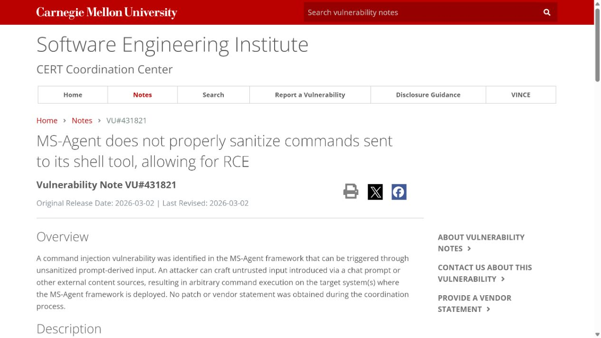
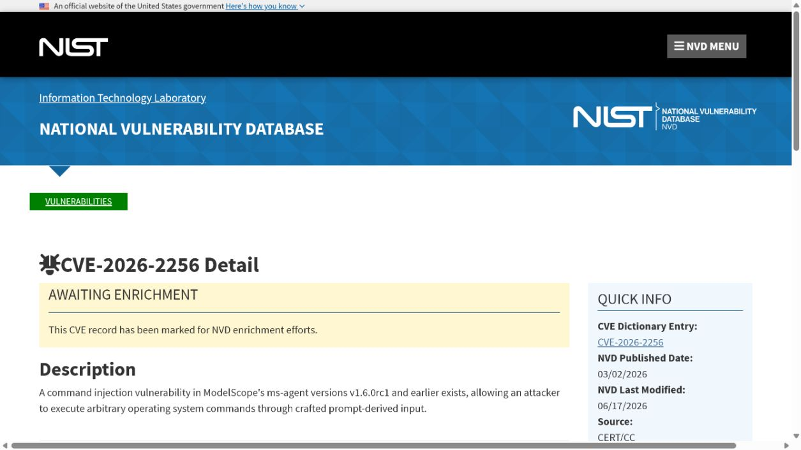
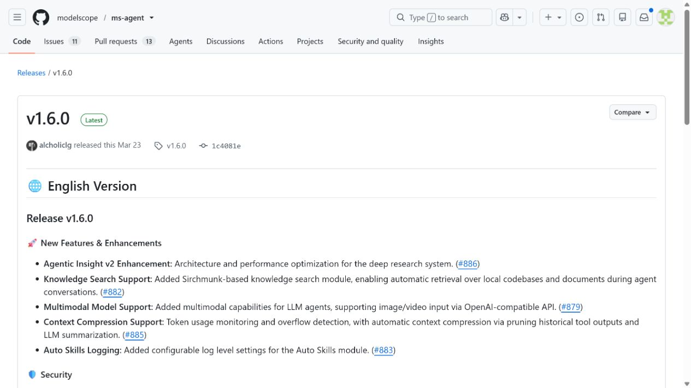
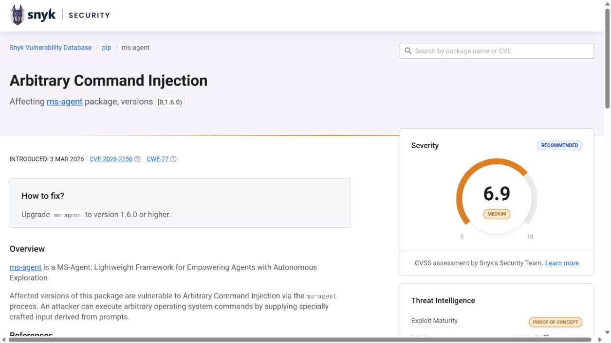
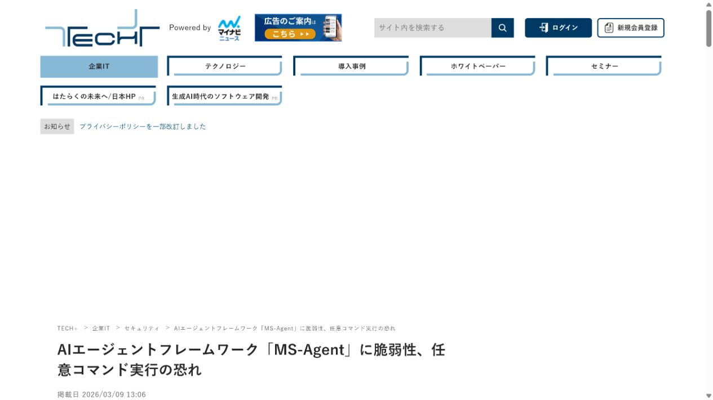

# MS-Agent Shell Tool Prompt-Derived Command Injection (2026)
> ModelScope MS-Agent Shell 工具提示词派生命令注入漏洞

| Field | Value |
|---|---|
| Category | agent-risk |
| Severity | medium（CISA-ADP CVSS 3.1：6.5） |
| AI Tool | ModelScope MS-Agent Shell tool |
| Language | Python |
| Real Incident | Yes（已公开确认的真实漏洞；不表示已有受害事件） |
| Reproducible | No |
| Disclosed | 2026-03-02 |
| CVE | CVE-2026-2256 |
| CVSS | 6.5 |

## TL;DR / 摘要

Prompt-derived input could bypass the Shell tool's regex denylist and reach operating-system command execution.

MS-Agent 的问题不在于模型会生成命令，而在于系统把不可信自然语言过早地转成可执行的 Shell 文本。把执行能力限制在结构化接口和隔离环境中，才是可验证的防线。

---

## 详细分析 / Full Analysis

### 一、事件概况与公开记录

MS-Agent 为检索、代码生成和任务执行提供工具化 Agent 能力，其中 Shell 工具负责把 Agent 生成的命令交给操作系统。模型输出、网页摘录、仓库文本和用户指令都可能影响这个工具的参数，因此工具层需要独立于提示词的边界控制。

CVE-2026-2256 的 NVD 条目与 CERT/CC 的 VU#431821 都将问题定位为 Shell 工具对命令清理不足。项目发布页记录了相关修复和代码执行迁移方向，Snyk 与独立技术媒体提供了第二来源复核。材料共同指向同一点：以正则表达式拦截少量危险片段，不能证明一条由模型拼出的命令是安全的。

### 二、AI 工作流与攻击入口

这是一类典型的 Agent 工具安全问题。传统命令注入的入口通常是 HTTP 参数，而本案的输入传播链还包含模型理解与任务规划：自然语言可以被模型转换为“看起来合理”的工具调用。安全判定因此不能只依赖提示词告诫或关键词过滤，必须在真正调用 Shell 前重建结构化、可审计的授权。

外部内容在这些工作流中并不总以“命令”或“程序”的形式出现。模型制品、提示词配置、连接器对象、缓存记录以及 Agent 工具参数往往先被视为普通数据，随后才在框架内部获得文件读取、解释执行或状态写入能力。

### 三、漏洞触发与技术路径

受影响实现将提示词派生的输入组成 Shell 命令，再依赖黑名单判断是否放行。研究者给出绕过表明，攻击者可在输入中利用命令语法、参数形式或编码变化避开规则，最终使内容进入系统命令解释器。这里的失效不要求模型具备恶意意图；只要它忠实地转述了不可信资料中的操作文本，工具就可能执行该文本。

### 四、技术根因

MS-Agent 试图用正则黑名单约束完整 Shell 语法，但命令解释器支持的组合、转义和参数形式远超规则能够覆盖的范围。更深层的问题是工具接收自由文本命令，而不是一组由系统定义、逐参数验证的操作。

### 五、利用前提与影响范围

攻击通常需要攻击者能够影响 Agent 看见的内容，例如任务描述、网页、文档、代码注释或检索结果，并且部署启用了受影响的 Shell 能力。命令成功后的权限等于运行 Agent 的用户权限，因此工作区、环境变量、SSH 配置和云访问令牌会成为现实影响面。公开资料没有给出统一的受害规模，本文不将漏洞记录延伸为未证实的在野入侵。

公开记录给出的受影响范围是：MS-Agent v1.6.0rc1 and earlier.

评估具体部署时，应逐项确认相关功能是否启用、是否接收第三方内容或制品、运行账户可访问哪些目录和令牌，以及组件是否已经升级。NVD 尚未给出 NIST 自有评分；本文采用页面列出的 CISA-ADP CVSS 3.1 6.5 Medium。Snyk 的 6.9 是另一套独立评估。

### 六、AI 安全问题分析

实践中，排查不应局限于聊天窗口。任何会进入 Agent 上下文的工单、网页抓取结果、README、终端日志或检索片段，都可能携带要求执行命令的文本。应先列出哪些任务会自动启用 Shell，再检查这些任务是否把模型输出原样传给命令解释器。对需要保留的系统操作，审批应看到标准化后的参数，而不是只看到模型生成的一句自然语言说明。

### 七、修复与处置

项目的处置方向是移除易受影响的 Shell 工具，并将 Code Genesis 的执行放入沙箱。使用方应同步升级，并为每个 Agent 设置独立的低权限账户、临时工作目录和最小化网络权限。对于确实需要系统操作的场景，优先提供固定动作的参数化 API；允许列表应基于命令和每个参数的语义，而不是仅检查命令名称。

公开材料给出的处置状态为：MS-Agent v1.6.0 removes the vulnerable Shell tool and moves project code execution to a sandbox.

### 八、部署排查与本地验证

升级验证可通过记录工具调用结构而不是记录完整敏感命令来完成：确认普通任务只能触发批准的二进制和参数组合，确认网页或文档中的额外指令不会改变调用结果。还应检查生产环境是否仍暴露历史 Shell 工具，及其运行账户是否能够读取不属于任务的凭据目录。

对于可能触发代码执行、文件读取或越权写入的案例，README 不提供可直接复制的攻击载荷。本地验收应检查版本、配置、已注册工具、缓存权限、文件挂载和审计日志，并在隔离测试环境中使用无害边界输入确认修复行为。

本案的证据链由 CERT/CC 的协调公告、NVD 的漏洞记录、项目发布信息和第三方漏洞数据库组成。CERT/CC 对“未正确清理命令”给出清楚定性，项目发布说明解释了工具移除和沙箱迁移。因而修复建议并非把黑名单写得更长，而是改变执行模型。

### 九、证据材料

| 来源 | 类型 | 证明内容 |
|---|---|---|
| CERT/CC VU#431821: MS-Agent Shell tool RCE | 协调披露 | 说明提示词派生输入到 Shell 工具的攻击链、黑名单绕过和项目处置 |
| NVD: CVE-2026-2256 | 漏洞数据库 | 核验受影响版本、公开日期及 CISA-ADP 6.5 Medium 评分 |
| MS-Agent v1.6.0 release | 项目发布 | 证明 v1.6.0 移除 Shell 工具并把代码执行迁入沙箱 |
| Snyk: CVE-2026-2256 | 独立漏洞库 | 复核命令注入机理、修复版本和 Snyk 自有评分 |
| MyNavi: MS-Agent CVE-2026-2256 coverage | 独立报道 | 复核漏洞公开、Agent 工具入口和主机命令执行影响 |

`assets/` 保存上述五个来源抓取时返回的原始 HTML，以及与同一页面对应的真实浏览器截图。动态网站离线打开时可能缺少外部样式或脚本，但源文件保留服务器返回内容，可用于复核标题、描述、版本和链接。

### 十、结论

MS-Agent 的问题不在于模型会生成命令，而在于系统把不可信自然语言过早地转成可执行的 Shell 文本。把执行能力限制在结构化接口和隔离环境中，才是可验证的防线。

完成版本修复后，仍应保留来源治理、最小权限、任务隔离和结构化授权。这些措施既用于缓解当前漏洞，也能限制后续模型制品、Agent 工具或 AI 框架解析缺陷造成的影响。

### 参考来源

- [CERT/CC VU#431821: MS-Agent Shell tool RCE](https://www.kb.cert.org/vuls/id/431821)
- [NVD: CVE-2026-2256](https://nvd.nist.gov/vuln/detail/CVE-2026-2256)
- [MS-Agent v1.6.0 release](https://github.com/modelscope/ms-agent/releases/tag/v1.6.0)
- [Snyk: CVE-2026-2256](https://security.snyk.io/vuln/SNYK-PYTHON-MSAGENT-15440541)
- [MyNavi: MS-Agent CVE-2026-2256 coverage](https://news.mynavi.jp/techplus/article/20260309-4189915/)
