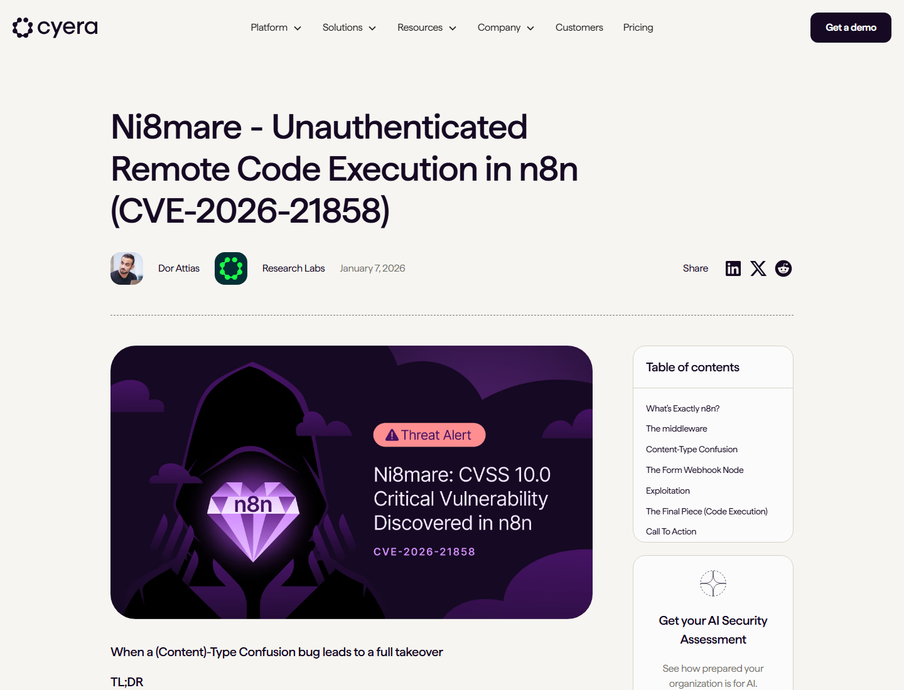
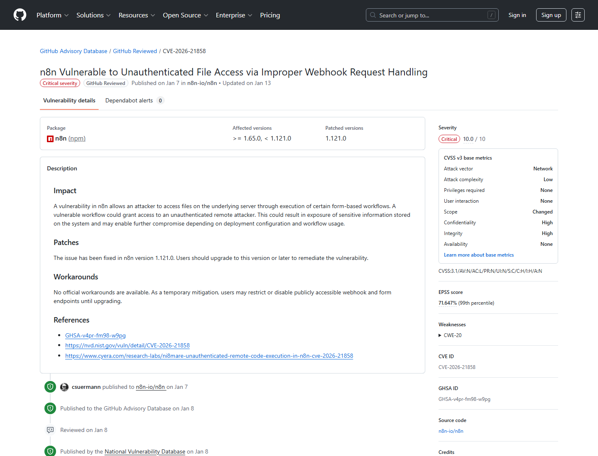
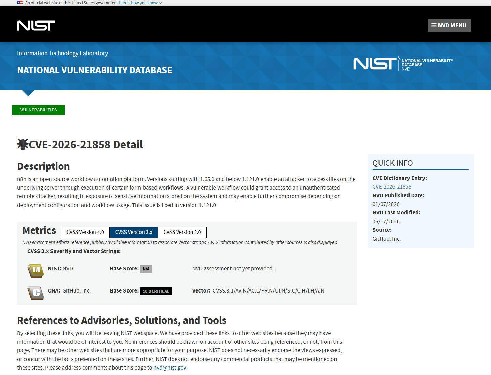
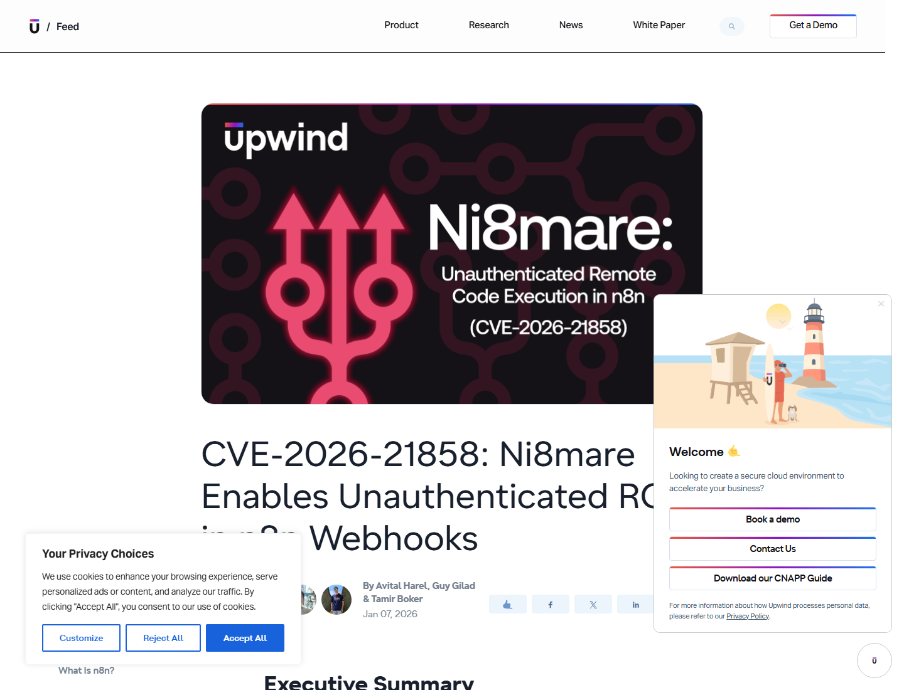
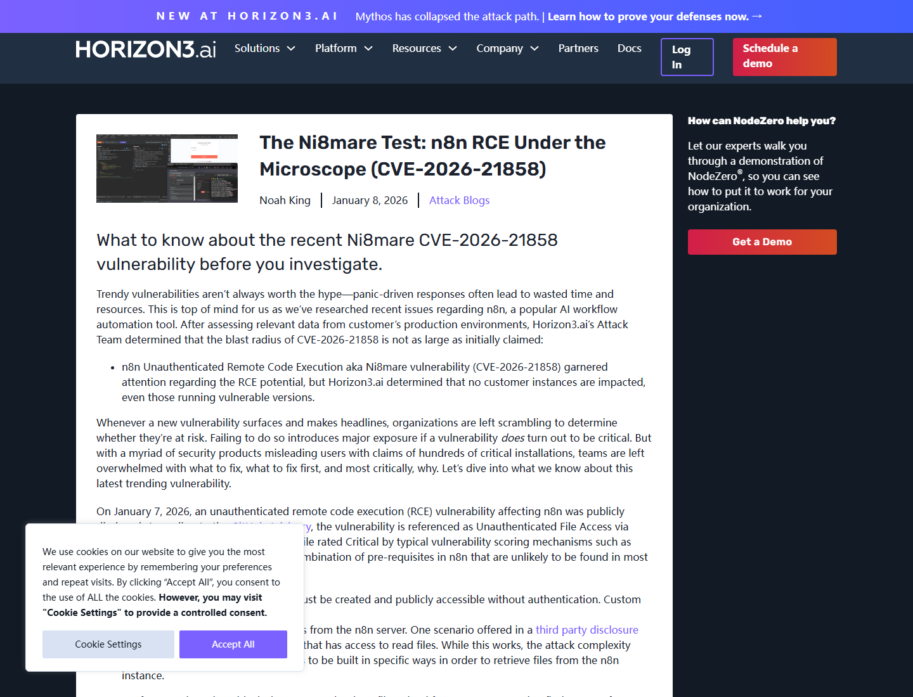
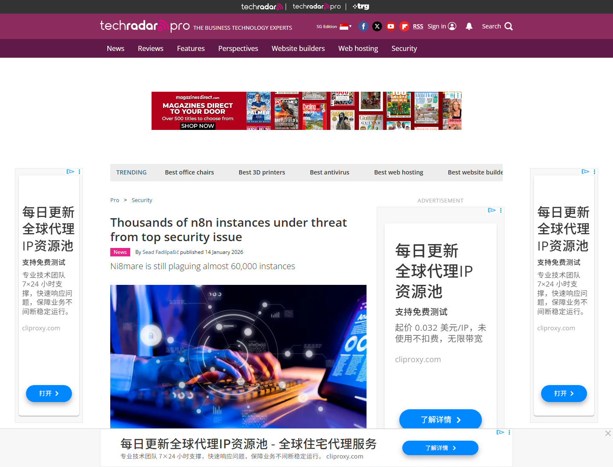

# n8n Ni8mare Webhook File Read to RCE Chain (2026)
> n8n Ni8mare Webhook 文件读取到远程代码执行链

| Field | Value |
|---|---|
| Category | Domain-Specific Risks |
| Severity | Critical |
| AI Tool | n8n, AI workflow automation, webhook/form workflows |
| Language | TypeScript / Node.js |
| Real Incident | Yes |
| Reproducible | Yes |
| Disclosed | 2026-01-07 |
| CVE | CVE-2026-21858 |
| CVSS | 10.0 in public reporting / critical advisory treatment |

## TL;DR
Ni8mare let unauthenticated attackers abuse n8n form workflow handling to read server files; research writeups showed how that primitive could expose secrets and be chained toward host command execution in self-hosted automation deployments.
> Ni8mare 的核心风险在于 n8n Webhook/Form 工作流处理文件上传时的类型混淆。攻击者可在未登录条件下读取宿主文件，并在特定部署条件下进一步触达凭据、会话和工作流执行能力。

---

## 详细分析 / Full Analysis

# n8n Ni8mare 案例分析：AI 自动化平台中的 Webhook 文件读取与 RCE 链

## 基本信息

n8n 是开源 workflow automation 平台，常用于把 SaaS、数据库、内部 API、LLM 节点、向量检索、文档处理和业务系统连成自动化流程。随着 AI agent 和企业自动化兴起，很多团队把 n8n 当作 AI 数据摄取、工具编排和凭据中枢使用。2026 年 1 月公开的 CVE-2026-21858，也就是 Ni8mare，暴露了这类平台的一个关键问题：公开 Webhook/Form 入口如果能触达宿主文件和工作流执行上下文，单个解析缺陷就可能影响整条自动化链路。

Cyera 的原始研究称，Ni8mare 可让攻击者接管本地部署的 n8n 实例，并建议升级到 1.121.0 或更高版本。GitHub Advisory 和 NVD 的基础描述更保守：漏洞允许攻击者通过特定 form-based workflows 访问底层服务器文件，造成敏感信息暴露，并可能根据部署配置和工作流使用方式造成进一步 compromise。[Cyera Research](https://www.cyera.com/research/ni8mare-unauthenticated-remote-code-execution-in-n8n-cve-2026-21858)

## 一、事件核验与证据范围

### 证据矩阵

| 来源 | 类型 | 证明内容 | 备注 |
|---|---|---|---|
| Cyera Research | 原始研究 | Ni8mare 名称、content-type confusion、文件读取到接管链条、升级建议 | 研究者视角，给出完整链条 |
| GitHub Advisory / NVD | 主证据 | CVE-2026-21858、影响版本、未认证文件访问、修复版本 1.121.0 | 漏洞数据库与 advisory 记录 |
| Upwind | 技术复核 | Webhook content-type confusion、伪造上传文件、读取本地文件、伪造会话与执行链 | 第三方技术分析 |
| Horizon3.ai | 复核 / 限定条件 | 真实环境前置条件、爆炸半径评估、并非所有部署都具备完整链条 | 有助于约束影响范围 |
| n8n Community Advisory | 厂商/社区通告 | 1.65-1.120.4 受影响，1.121.0 修复，自托管用户需升级 | 处置证据 |
| TechRadar | 影响证据 | 近 6 万暴露实例风险、地区分布、AI 数据摄取与自动化使用场景 | 生态和暴露面报道 |

GitHub Advisory Database 将该问题记录为 `GHSA-v4pr-fm98-w9pg`，影响 n8n 1.65.0 起至 1.121.0 之前版本。advisory 直接指出，攻击者可通过执行特定 form-based workflows 访问底层服务器文件，未认证远程攻击者可能因此获得敏感信息，并在部署配置和工作流条件允许时继续扩大影响。[GitHub Advisory](https://github.com/advisories/GHSA-v4pr-fm98-w9pg)

## 二、系统背景与触发条件

n8n 的高价值不只来自“自动化”，还来自它把大量系统凭据放进同一个工作流平台。一个典型自托管实例可能保存 OAuth token、API key、数据库连接、云服务凭据、LLM provider key、内部 webhook secret 和长期运行的工作流状态。AI 团队把 n8n 用作数据摄取、RAG 管道、客服自动化或 agent tool hub 时，这些凭据会变得更集中。

触发条件与公开 Webhook/Form workflow 有关。攻击者需要能访问暴露的 n8n form/webhook endpoint，并让请求进入存在缺陷的表单文件处理路径。Ni8mare 的关键是 content-type confusion：系统下游逻辑假设文件数据来自正常 multipart 上传结构，但攻击者可以改变请求类型和请求体结构，让服务端把攻击者控制的数据当成文件对象处理。这个入口先形成任意文件读取，再通过 n8n 的配置、加密密钥和工作流权限继续推进。

## 三、攻击链与处置过程

Upwind 将链条拆解为 webhook request handling 的类型混淆。攻击者伪造上传文件对象后，可读取本地文件；如果读到 n8n encryption key、数据库配置或会话相关材料，就可能解密 credential vault、伪造管理员会话，最后通过工作流节点或命令执行能力触达宿主系统。这个链条说明，自动化平台里的“文件读取”往往不是低影响问题，因为被读取的文件本身可能就是后续执行能力的钥匙。

n8n 社区通告称，团队在 2025 年 11 月获知影响 1.65-1.120.4 的关键漏洞，并在 1.121.0 中修复，面向自托管用户强调升级。对无法立刻升级的环境，公开材料普遍建议限制或关闭公开 webhook/form endpoints，并把 n8n 放在更严格的访问控制之后。[n8n Community Advisory](https://community.n8n.io/t/security-advisory-security-vulnerability-in-n8n-versions-1-65-1-120-4/247305)

## 四、技术根因分析

根因首先是请求解析层和业务节点层之间的结构信任。文件上传路径通常依赖 multipart parser 填充 `req.body.files`，而后续节点把这个结构当作可信文件对象使用；如果 handler 没有严格验证 Content-Type、字段来源和文件对象边界，攻击者就能构造看似合法的文件引用，诱导后端读取服务器上的任意可读路径。

第二个根因是 n8n 的凭据和工作流执行能力高度集中。许多自动化平台为了降低使用门槛，会把凭据管理、节点配置、执行日志、Webhook 入口和脚本节点放在同一应用边界内。文件读取一旦碰到加密密钥、数据库凭据或 session secret，攻击者就可能从“读文件”转向“读凭据、伪造身份、执行工作流”。Horizon3.ai 的分析提醒安全团队，实际影响取决于是否存在暴露的 vulnerable workflow、是否能读到关键文件、以及部署是否给了 n8n 足够多的系统权限。

## 五、AI 参与方式与风险归因

Ni8mare 不是模型输出错误，而是 AI 自动化平台的工程攻击面。n8n 常被用来连接 LLM、文档、业务系统和外部 API；当它承担 AI workflow hub 的角色时，平台本身就拥有跨系统访问能力。攻击者不需要诱导模型回答危险内容，只要打到公开 workflow 入口，就可能进入保存凭据和执行逻辑的自动化中枢。

风险应归因于 Webhook/Form 入口、文件对象解析、凭据集中存储和工作流执行权限之间的组合。AI 场景放大了后果：同一个 n8n 实例可能既连接客户数据，又连接模型 API，还连接内部 CRM、工单、云存储和数据库。文件读取到凭据泄露，再到工作流执行或横向移动，是 AI 自动化部署里必须单独评估的链路。

## 六、与团队技术报告风险框架的关系

团队技术报告关注 AI 代码与智能体系统里的“工具执行面”和“数据权限面”。Ni8mare 对应的是自动化编排层：LLM 只是工作流中的一个节点，真正的风险来自平台把很多系统的凭据和执行动作聚合到一个入口。这里的安全问题不在 prompt 文本，而在工作流引擎如何处理外部输入、如何隔离凭据、如何限制节点权限。

这类案例也说明，AI 应用安全不能只评估模型和代码仓库，还要评估“低代码/自动化/agent 编排平台”。这些平台往往由业务团队快速部署，暴露 webhook 后接入生产系统；一旦漏洞触发，攻击者拿到的不是单一应用数据，而是跨系统连接能力。

## 七、影响范围与社会后果

公开报道给出了较强的暴露面信号。TechRadar 引用 Shadowserver 相关数据称，2026 年 1 月仍有接近 6 万个互联网可达 n8n 实例处于 Ni8mare 风险中，并提到 n8n 在 AI 数据摄取和自动化场景中的使用增长。这个规模让 Ni8mare 不只是开发者框架漏洞，也成为自托管自动化生态的治理问题。

对企业而言，后果可能包括读取本地配置、泄露 OAuth token 和 API key、解密 n8n credential vault、伪造管理员会话、调用内部系统、篡改工作流、植入持久化自动化任务，甚至在具备命令执行节点或高权限运行环境时控制宿主机。影响强弱取决于具体部署，但自托管平台一旦暴露在公网，攻击面会直接面向互联网扫描和批量利用。

## 八、治理建议

n8n 用户应升级到 1.121.0 或更高版本，并确认没有仍在运行 1.65.0 到 1.120.x 的自托管实例。公开 webhook 和 form endpoints 应置于认证、IP allowlist、反向代理访问控制或专用网关之后；对需要公网接收事件的流程，应拆分最小权限实例，避免让同一个 n8n 服务同时保存高价值凭据和接收匿名输入。

平台侧应把文件上传对象与服务器路径彻底分离，严格校验 Content-Type 和解析器来源，对 workflow 节点使用 capability-based 权限，限制可读取路径和可执行节点范围。凭据管理应使用外部 secret manager 或短生命周期 token，避免让一个文件读取漏洞直接触达长期密钥。对 AI workflow 场景，还应审计哪些流程连接 LLM、客户数据、内部 API 和云账号，把自动化平台当作生产特权系统保护。

## 九、结论

Ni8mare 的教训在于，AI 自动化平台的入口看似只是 Webhook 和表单，背后却连着凭据库、工作流引擎和跨系统执行能力。CVE-2026-21858 从文件访问起步，研究链条展示了它如何在特定条件下推进到凭据泄露和宿主执行。对于正在把 n8n 等工具用作 AI agent 和业务自动化中枢的团队，Webhook 暴露、文件处理、凭据隔离和节点权限应被视为同一条安全边界。

## 参考来源

- [Cyera Research: Ni8mare unauthenticated remote code execution in n8n](https://www.cyera.com/research/ni8mare-unauthenticated-remote-code-execution-in-n8n-cve-2026-21858)
- [GitHub Advisory Database: GHSA-v4pr-fm98-w9pg](https://github.com/advisories/GHSA-v4pr-fm98-w9pg)
- [NVD: CVE-2026-21858](https://nvd.nist.gov/vuln/detail/CVE-2026-21858)
- [Upwind: CVE-2026-21858 Ni8mare in n8n webhooks](https://www.upwind.io/feed/cve-2026-21858-n8n-unauthenticated-rce)
- [Horizon3.ai: The Ni8mare Test](https://horizon3.ai/attack-research/attack-blogs/the-ni8mare-test-n8n-rce-under-the-microscope-cve-2026-21858/)
- [n8n Community: Security advisory for versions 1.65-1.120.4](https://community.n8n.io/t/security-advisory-security-vulnerability-in-n8n-versions-1-65-1-120-4/247305)
- [TechRadar: Thousands of n8n instances under threat](https://www.techradar.com/pro/security/thousands-of-n8n-instances-under-threat-from-top-security-issue)
