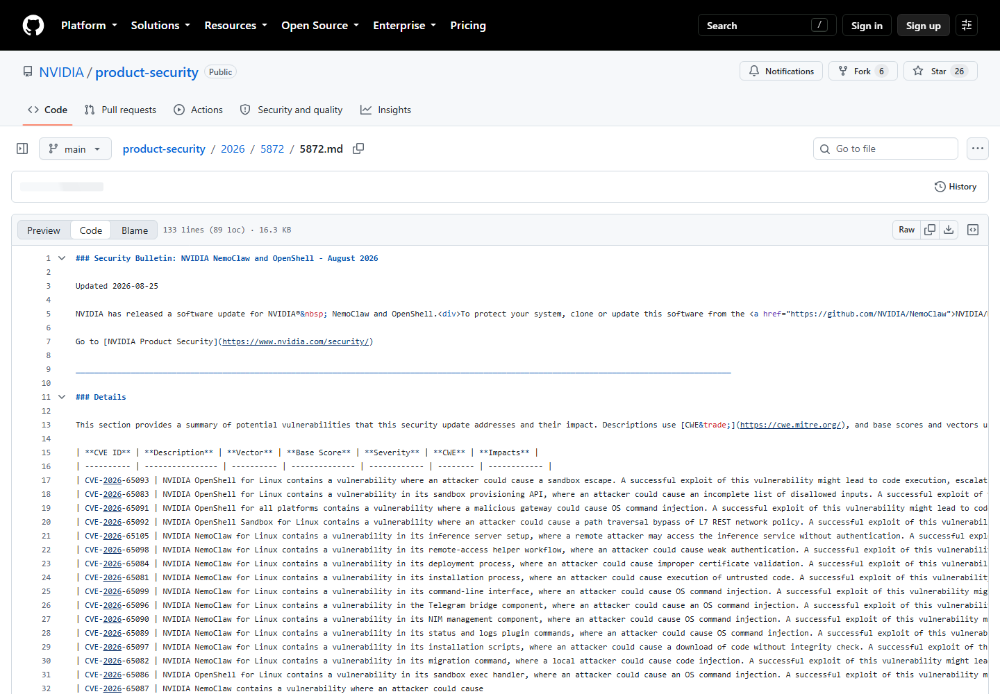
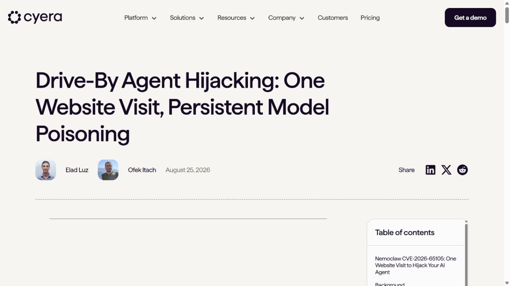
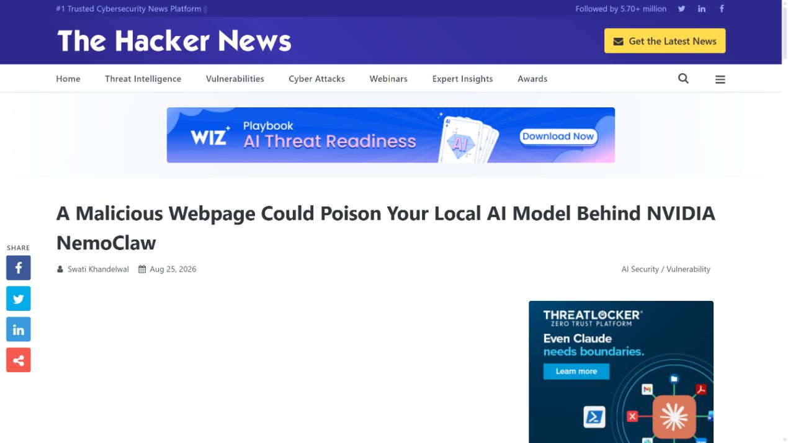
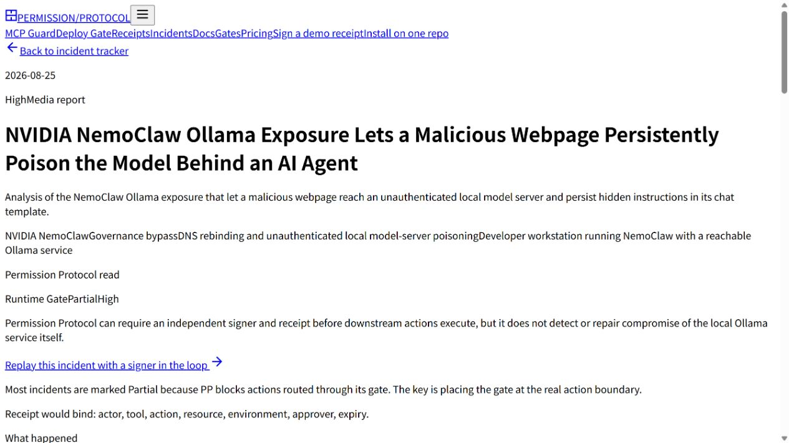

# NVIDIA NemoClaw Ollama Model Template Poisoning (2026)
> NVIDIA NemoClaw 本地模型模板持久化投毒

| Field | Value |
|---|---|
| Category | agent-risk |
| Severity | High |
| CVE | CVE-2026-65105 |
| AI Tool | NVIDIA NemoClaw, Ollama, OpenClaw agents |
| Real Incident | Yes |
| Reproducible | Yes |
| Disclosed | 2026-08-25 |

## TL;DR
NemoClaw 将 Ollama 推理服务绑定到所有网络接口后，恶意网页可借 DNS rebinding 访问未认证 API，并把持久化指令写入模型聊天模板，使后续 Agent 会话持续受到攻击者指令影响。

---

## 详细分析 / Full Analysis

## 一、事件概况

2026 年 8 月 25 日，NVIDIA 发布 NemoClaw 与 OpenShell 安全公告，其中 CVE-2026-65105 被评为 8.1 High。公告确认，NemoClaw 的推理服务配置可能允许远程攻击者在没有认证的情况下访问服务，受影响范围为 0 到 0.0.25。Oasis Security 随后公开了更完整的利用研究：NemoClaw 为了让沙箱中的 Agent 访问宿主机 Ollama，将 `OLLAMA_HOST` 设为 `0.0.0.0:11434`，却没有给这一接口补上独立认证和浏览器来源检查。

研究演示从一张攻击者控制的网页开始。页面利用 DNS rebinding，把原本解析到攻击服务器的域名重新解析到受害机器的回环地址，使浏览器在保留同源判断的同时访问本地 Ollama API。攻击者读取现有模型配置，再通过 `/api/create` 写入被修改的聊天模板。该模板会参与每次推理前的消息拼装，因此投毒效果跨会话存在，并可在服务重启后继续生效。公开材料没有报告在野利用或已确认受害者。

## 二、公开资料与事实核对

NVIDIA 公告记录了 CVE、评分、受影响范围和修复构建；Oasis Security 提供攻击链、请求接口、部署参数和持久化机制。The Hacker News、Permission Protocol 与 SiliconANGLE 分别复核了 DNS rebinding、Ollama 暴露和模型模板投毒三项关键事实。公告将 0 到 0.0.25 列为受影响范围，同时把 `f06796ff3; 0.0.25` 列为更新项，因此本文保留完整构建标识，不把两个同名版本简单解释成前后两个发布版。

8.1 分值来自 NVIDIA 公告，不扩展为公告中未列出的远程代码执行；研究演示表明，攻击者可以持续改变模型收到的系统上下文，具体后果取决于 Agent 被授予的工具、凭据和网络权限。CVSS 记录的是底层服务暴露，模型模板被持续修改后的业务影响还需结合代理权限判断。

| 来源 | 类型 | 主要核验内容 |
|---|---|---|
| [NVIDIA Security Bulletin 5872](https://github.com/NVIDIA/product-security/blob/main/2026/5872/5872.md) | 厂商安全公告 | CVE、评分与修复构建 |
| [Cyera Oasis Security research](https://www.cyera.com/research/nemoclaw-one-website-visit-to-hijack-your-ai-agent) | 原始技术研究 | 利用链与持久化机制 |
| [The Hacker News report](https://thehackernews.com/2026/08/a-malicious-webpage-could-poison-your.html) | 新闻复核 | 公开时间与技术复核 |
| [Permission Protocol incident record](https://www.permissionprotocol.com/agent-incident-tracker/nvidia-nemoclaw-ollama-dns-rebinding-model-poisoning) | 事件资料汇总 | 攻击链条目整理 |
| [SiliconANGLE report](https://siliconangle.com/2026/08/25/nvidia-nemoclaw-flaw-let-attackers-poison-the-model-behind-a-developers-ai-agent/) | 新闻复核 | 影响与处置复核 |

## 三、攻击或事件过程

攻击需要受害者运行受影响的 NemoClaw 配置，并使用浏览器打开攻击者控制的页面。浏览器最初访问正常公网地址，攻击者随后改变 DNS 响应，让同一域名指向 `127.0.0.1` 或可达的本机地址。由于 Ollama 没有按 Host、Origin 或认证令牌拒绝该请求，页面脚本可以直接调用推理服务接口。

攻击者先调用模型查询接口获得模板和模型信息，再构造新的模型定义，将恶意文本放进 Go template。随后调用创建接口，把被投毒的模型写回本地。以后无论用户通过 NemoClaw 发起什么任务，服务都会先按被修改的模板组织系统消息、历史和用户输入，攻击指令由此在普通会话内容之外长期存在。

这次利用直接修改模型对象，使恶意模板成为持久化载体。用户清空聊天记录或重启 Agent 不会自然清除模板；客户端通常也只看到正常的模型名称和返回值。若 Agent 能读取仓库、调用云 API 或操作内部系统，污染后的决策会沿这些授权通道继续向外扩散。

## 四、技术根因

根因由三层配置叠加形成。第一层是 NemoClaw 扩大 Ollama 监听范围，却没有把反向代理上的令牌保护同步到真实推理端口。第二层是 Ollama 接口缺少面向浏览器威胁的 Host 与 Origin 校验，使 DNS rebinding 能跨过“只在本机使用”的假设。第三层是模型聊天模板可通过管理接口重建，并直接参与后续每次推理。

这类问题很难靠提示词自我保护。被修改的模板位于用户输入进入模型之前，Agent 无法可靠区分它与开发者原本设置的系统指令。更稳妥的安全边界应落在网络监听、认证、来源校验、模型制品完整性和工具授权上。只要这些层面仍把本地服务当作天然可信，浏览器就可能成为跨越边界的代理。

## 五、AI 安全问题

攻击的持续性直接来自生成模型的消息模板。传统本地 API 暴露通常导致一次数据读取或命令调用；这里每个后续 Agent 任务都会自动带上被污染的上下文，模型模板和 Agent 决策环节属于攻击链的必要组成。

事件还揭示了本地模型部署的一种新资产：模型权重之外，聊天模板、system prompt、工具 schema 和记忆库同样决定实际行为。它们往往没有代码仓库那样的签名、变更审计和回滚机制，却能持续影响高权限自动化。安全团队在管理本地 AI 时，需要把这些配置视为可执行策略，而不是普通偏好设置。

## 六、影响、处置与排查

NVIDIA 公告要求更新到列出的修复版本；实际处置还应确认 Ollama 11434 端口没有监听不必要的外部接口，并用主机防火墙限制来源。已有部署应导出模型列表与模板，同可信基线比对，检查近期是否出现异常 `/api/show`、`/api/create` 请求或陌生模型派生项。仅升级客户端但保留已经污染的模型，不能完成历史清理。

排查时可以结合 DNS 日志、浏览器访问记录和本机服务日志，寻找同一网页域名在短时间内解析到公网地址和回环地址的变化。模型输出出现稳定、跨任务重复的陌生要求，也应触发模板与系统提示检查，而不是只当成偶发幻觉。

如果业务必须让沙箱访问宿主推理服务，应使用仅绑定回环或专用 IPC 的通道，并在服务端强制认证、Host/Origin 校验和速率限制。代理工具权限还应按任务临时授予，避免模板完整性问题直接获得长期云凭据或文件系统权限。

## 七、治理建议

产品设计应把推理服务、模型制品和 Agent 工具三个边界分别管理。推理端口默认只对必要进程开放；模型创建与模板修改属于管理操作，应与推理调用使用不同权限；Agent 工具执行则必须依据当前用户和当前任务重新授权。这样即便其中一层失守，攻击也难以直接跨到全部能力。

模型配置应具备哈希基线、签名或至少可查询的变更历史。组织可以在 Agent 启动前核对模型摘要，并对模板变更、模型派生和未认证管理请求告警。浏览器侧访问本地服务时，不应依赖 CORS 作为唯一防线，服务端仍要验证目标主机名、来源和会话身份。

开发测试中还应加入真实浏览器的 DNS rebinding 用例。单独用命令行测试“端口只在本机可达”无法覆盖网页脚本的攻击路径。对能持久修改模型上下文的接口，测试应验证重启、会话清除和模型重载后是否仍存在污染，并确保清理流程能恢复可信状态。

## 八、结论

CVE-2026-65105 展示的是一条完整的本地 AI 供应链：网络配置让浏览器进入未认证推理接口，模型管理能力把一次访问转成持久化模板修改，Agent 权限再决定最终影响。处置重点既包括升级，也包括核验本地模型状态、收紧推理端口和重新设计工具授权。

### 参考来源

1. [NVIDIA Security Bulletin 5872](https://github.com/NVIDIA/product-security/blob/main/2026/5872/5872.md)
2. [Cyera Oasis Security research](https://www.cyera.com/research/nemoclaw-one-website-visit-to-hijack-your-ai-agent)
3. [The Hacker News report](https://thehackernews.com/2026/08/a-malicious-webpage-could-poison-your.html)
4. [Permission Protocol incident record](https://www.permissionprotocol.com/agent-incident-tracker/nvidia-nemoclaw-ollama-dns-rebinding-model-poisoning)
5. [SiliconANGLE report](https://siliconangle.com/2026/08/25/nvidia-nemoclaw-flaw-let-attackers-poison-the-model-behind-a-developers-ai-agent/)
