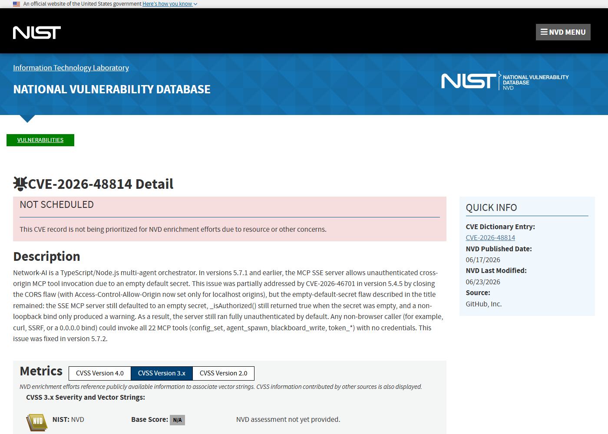
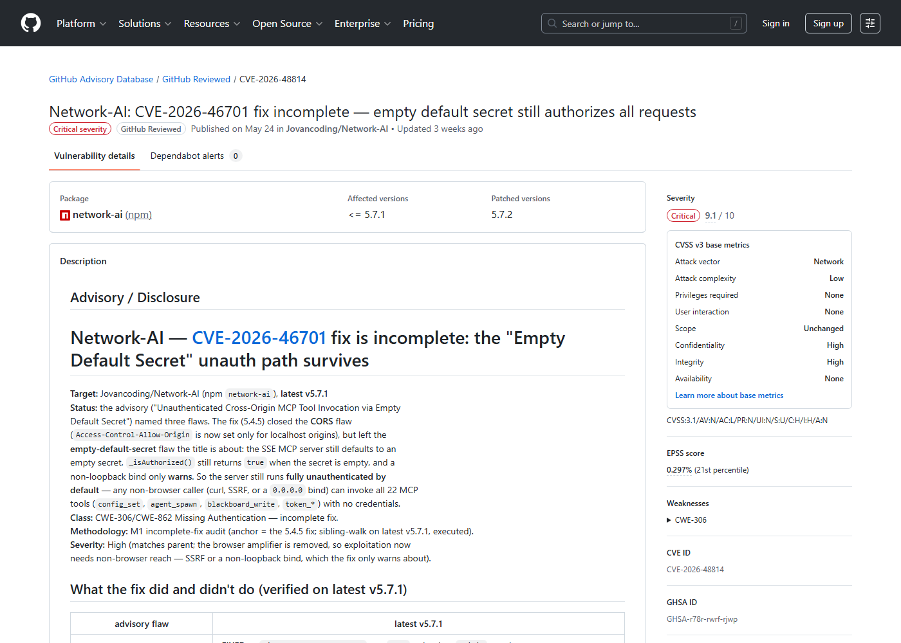
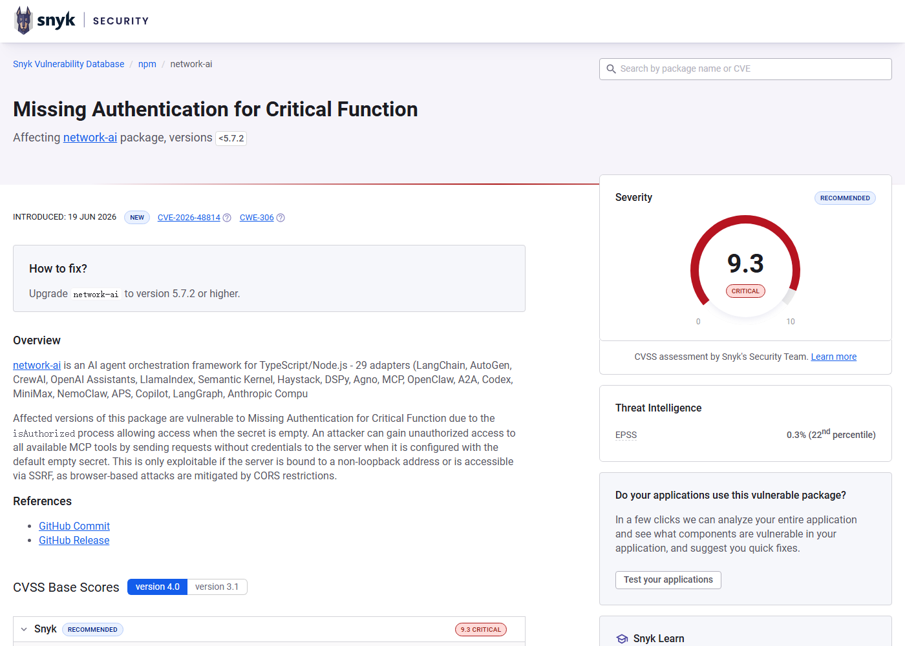
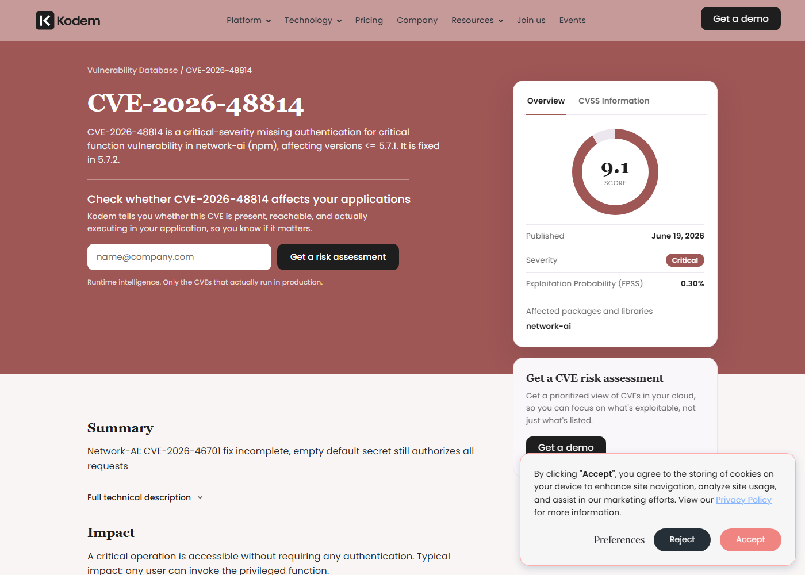

# Network-AI MCP Empty Secret Authentication Bypass (2026)
> Network-AI MCP 空默认密钥认证绕过

| Field | Value |
|---|---|
| Category | Agent Risks |
| Severity | Critical |
| AI Tool | Network-AI, MCP SSE server, multi-agent orchestrator |
| Language | TypeScript / Node.js |
| Real Incident | Yes |
| Reproducible | Yes |
| Disclosed | 2026-06-17 |
| CVE | CVE-2026-48814 |
| CVSS | 9.1 |

## TL;DR
Network-AI's MCP SSE server treated an empty default secret as authorized, allowing unauthenticated clients to invoke critical agent tools until version 5.7.2.
> Network-AI MCP SSE server 把空默认密钥视为通过认证，5.7.2 前未配置密钥的实例会允许未认证客户端调用关键 Agent 工具。

---

## 详细分析 / Full Analysis

## 一、基本信息

Network-AI 是 TypeScript/Node.js 多 Agent 编排项目，提供 MCP SSE server 来让外部客户端调用 Agent 工具。CVE-2026-48814 披露的是一个缺失认证问题：5.7.1 及更早版本中，MCP SSE server 默认密钥为空，而授权逻辑在密钥为空时仍会返回通过。结果是，未配置密钥的实例会允许未认证客户端调用所有 MCP 工具，包括 agent_spawn、配置修改、共享状态写入和 token 管理等高影响操作。

## 二、事件核验与公开材料范围

NVD、GitHub Advisory、Snyk、Kodem 和 OpenCVE 均确认该问题，修复版本为 5.7.2。GitHub Advisory 还说明这是早前 CVE-2026-46701 修复后仍残留的 empty default secret 问题。本文以 CVE-2026-48814 为主，因为它有独立 CVE、清晰修复版本和更明确的缺失认证描述。

### 证据矩阵

| 来源 | 类型 | 证明内容 |
|---|---|---|
| NVD: CVE-2026-48814 | 漏洞数据库 | Network-AI MCP SSE 空密钥缺失认证和影响版本 |
| GitHub Advisory: GHSA-r78r-rwrf-rjwp | 安全公告 | 5.7.1 及更早版本、5.7.2 修复和缺失认证描述 |
| Snyk: SNYK-JS-NETWORKAI-17753986 | 漏洞数据库 | empty secret 认证绕过和升级建议 |
| Kodem: CVE-2026-48814 | 复核资料 | 缺失认证、影响版本和修复版本 |
| OpenCVE: CVE-2026-48814 | 漏洞数据库 | CVE 记录、描述和参考链接 |
| SnailSploit: CVE-2026-48814 | 研究说明 | 空默认密钥让所有请求通过的机制说明 |

## 三、系统背景与触发条件

MCP 让 Agent 可以通过统一协议调用工具，提升了编排能力，也扩大了工具入口的重要性。一个多 Agent orchestrator 的 MCP server 往往能创建 Agent、修改配置、读写共享黑板、管理 token 或触发外部服务。与普通 API 相比，这些工具本身就是为自动化行动设计的，因此认证失败会直接变成能力暴露。空默认密钥属于典型安全默认值问题：部署者没有显式配置时，系统应该拒绝请求，而不是把空值当成合法凭据。

## 四、攻击链路与处置过程

攻击者找到运行中的 Network-AI MCP SSE server 后，无需提供有效密钥即可发起工具调用。由于授权函数在 secret 为空时返回通过，请求会被当成合法客户端处理。攻击者随后可以枚举或调用暴露工具，例如生成 Agent、改写配置、污染共享状态或访问 token 相关能力。若该 orchestrator 已经接入文件系统、云 API、数据库或内部工具，影响会沿着 Agent 工具链继续扩大。5.7.2 修复了这一默认认证逻辑。

## 五、技术根因与 AI 风险归因

根因是认证逻辑对空 secret 的处理方向反了。安全默认值应当是 fail closed：没有密钥就禁止远程调用；该实现却在空值情况下放行。AI Agent 系统中，这类错误比普通控制台 API 更敏感，因为工具调用不是只读查询，而是可能触发真实执行、配置变更和跨系统操作。MCP server 也常运行在开发者本机或内网，容易被误认为只有可信客户端能访问。

Network-AI 的问题看似只是空 secret 判断，但放在 Agent 编排器里，含义更重。MCP server 暴露的不是普通查询接口，而是一组给 Agent 使用的行动能力。agent_spawn 可以创建新的执行主体，配置工具可以改变后续调用路径，共享状态写入可以影响其他 Agent 的判断，token 管理能力则直接接触凭据。认证逻辑在空密钥时放行，相当于把这些能力交给任何能连到 SSE server 的客户端。

实际部署中，很多 Agent 开发环境会先在本机调试，再被放进内网机器、开发服务器或演示环境。开发者可能以为“没有配置 secret”只是临时模式，服务也只面向可信机器；但只要监听地址、端口映射、反向代理或隧道配置稍有变化，空 secret 就会变成真正的远程入口。MCP 的便利性在这里反过来提高了风险，因为攻击者一旦通过认证，就可以使用协议本身列举工具和执行动作，不需要猜测一堆私有 REST API。

## 六、影响范围与治理建议

受影响的是未升级且未正确配置密钥的 Network-AI 部署。直接风险是未认证工具调用，后果取决于连接的工具集合和运行权限。治理上应升级到 5.7.2 或更高版本，显式配置强随机 MCP secret，限制 SSE server 监听地址，使用反向代理认证，并为高风险工具加二次审批。审计时应检查历史 MCP 调用日志，重点关注 agent_spawn、配置写入、token 相关接口和异常来源 IP。

排查时应先确认所有 Network-AI 实例的版本和 secret 配置，再看 MCP SSE server 的监听地址与访问来源。日志中需要重点关注未带认证头或认证值为空的请求，以及短时间内出现的工具枚举、agent_spawn、配置写入和 token 相关调用。若实例曾经运行在可被其他主机访问的网络上，应轮换它能接触到的外部服务凭据，并检查共享状态里是否被写入异常指令或伪造结果。

后续治理应把 MCP server 当作高权限控制面处理。开发模式也应生成随机本地 secret，并明确显示当前监听地址；生产模式则需要认证、来源限制、工具级授权和审计。对危险工具，不能只依赖 server 级 secret，还应要求用户确认或策略审批。这样即使认证配置再次出错，攻击者也不能直接调用最高风险的 Agent 行动能力。

MCP server 的日志和审计也应比普通开发服务更细。一次工具调用可能对应真实文件写入、网络请求、Agent 创建或凭据访问，因此审计记录不能只写“请求成功”。更实用的记录应包括调用者身份、工具名、参数摘要、审批状态、执行结果和影响资源。这样即使出现空 secret 这类认证缺陷，团队也能追踪攻击者实际调用过哪些能力，而不是只能看到一串 SSE 连接。

同时，开发框架应避免把“没有配置”解释成“允许访问”。配置缺失、解析失败、环境变量为空、secret 文件不存在，都应进入拒绝状态，并在启动日志中明确提示。对 Agent 工具层来说，这种 fail closed 默认值非常重要，因为工具一旦暴露，模型和攻击者都能把它们组合成更长的行动链。

## 七、结论

CVE-2026-48814 是 Agent 工具层安全默认值失败的典型案例。MCP 的价值在于让模型和工具连接得更顺畅，但这也意味着认证、授权和审计必须先于便利性。空密钥不能代表“开发模式”，更不能代表“允许所有人调用”。

## 八、参考来源

- [NVD: CVE-2026-48814](https://nvd.nist.gov/vuln/detail/CVE-2026-48814)
- [GitHub Advisory: GHSA-r78r-rwrf-rjwp](https://github.com/advisories/GHSA-r78r-rwrf-rjwp)
- [Snyk: SNYK-JS-NETWORKAI-17753986](https://security.snyk.io/vuln/SNYK-JS-NETWORKAI-17753986)
- [Kodem: CVE-2026-48814](https://www.kodemsecurity.com/cve-archive/cve-2026-48814)
- [OpenCVE: CVE-2026-48814](https://app.opencve.io/cve/CVE-2026-48814)
- [SnailSploit: CVE-2026-48814](https://snailsploit.com/security-research/cves/cve-2026-48814/)
