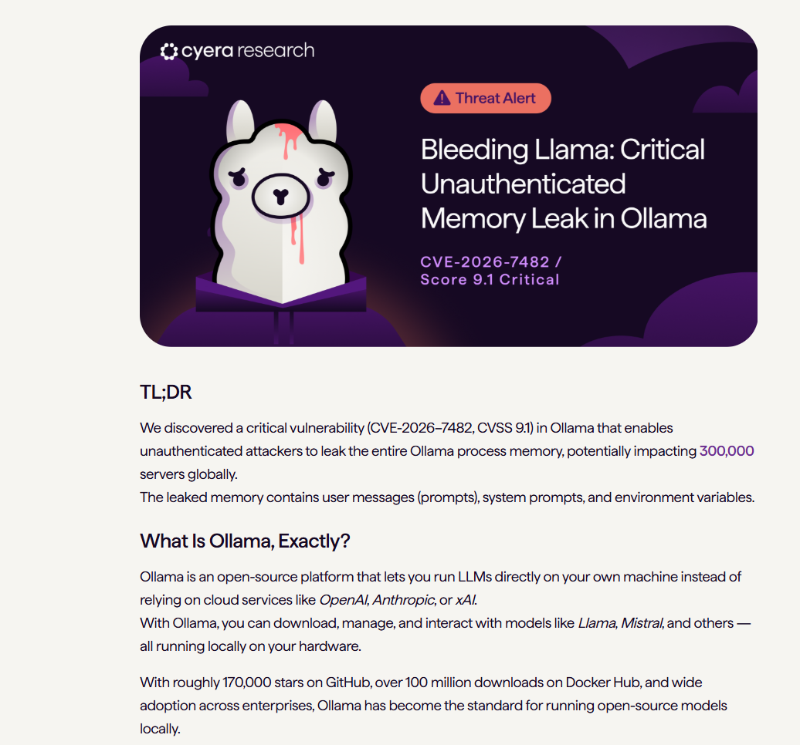
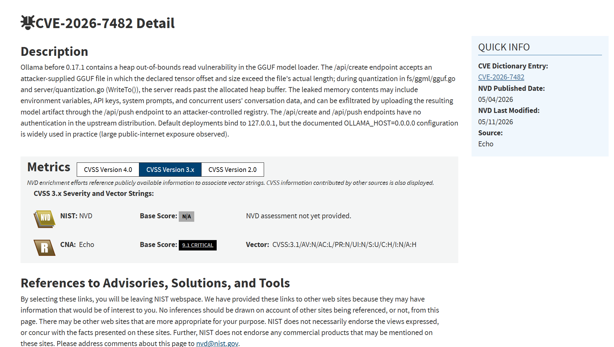
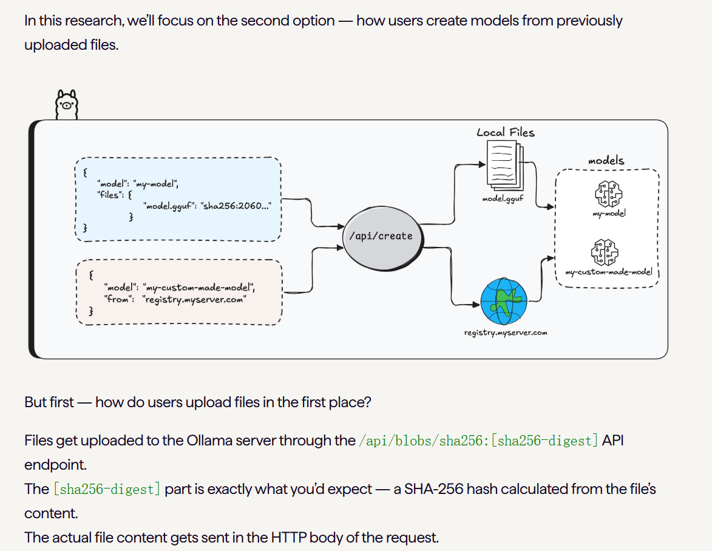
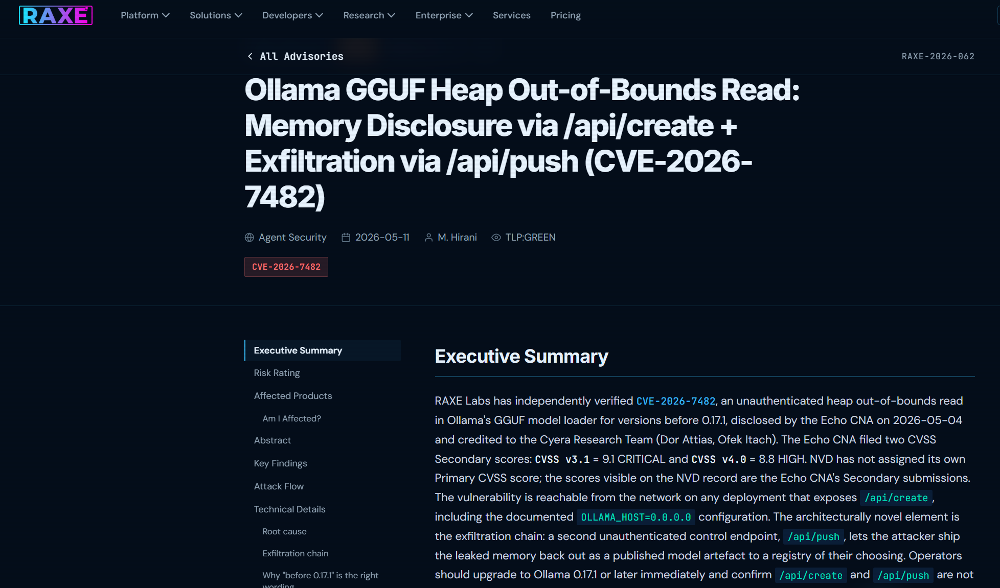
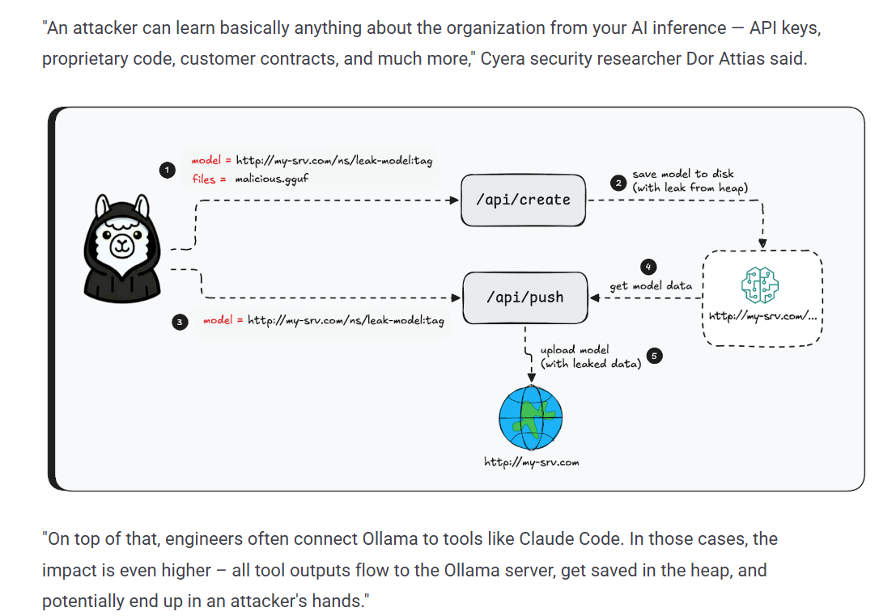
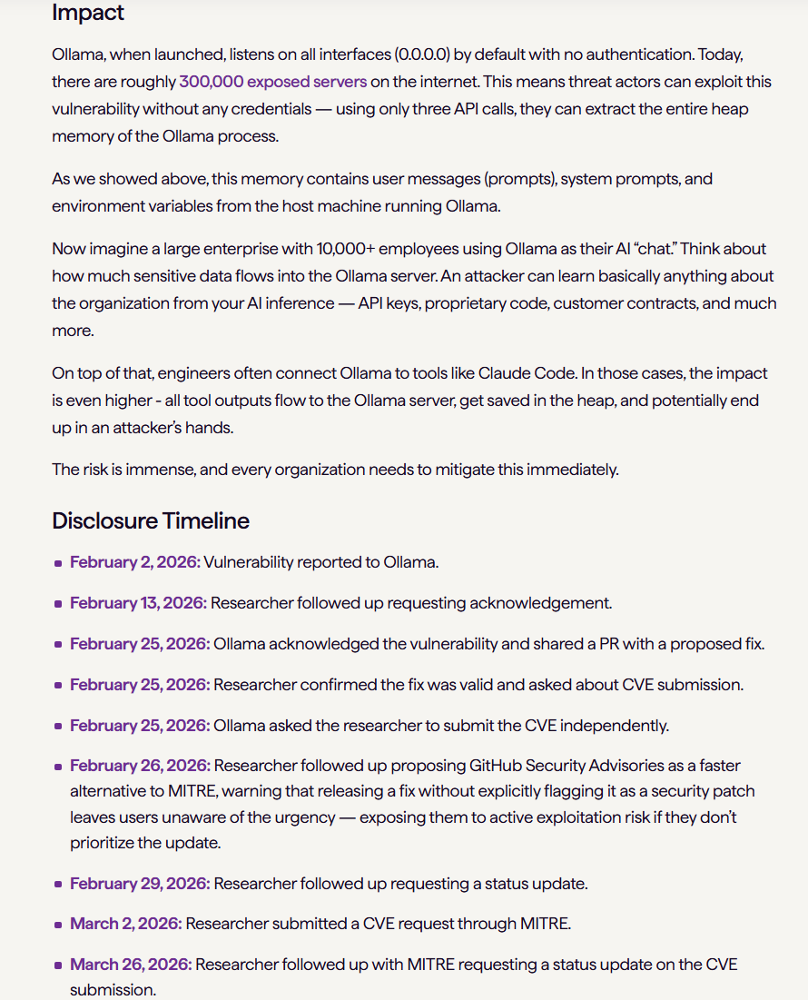
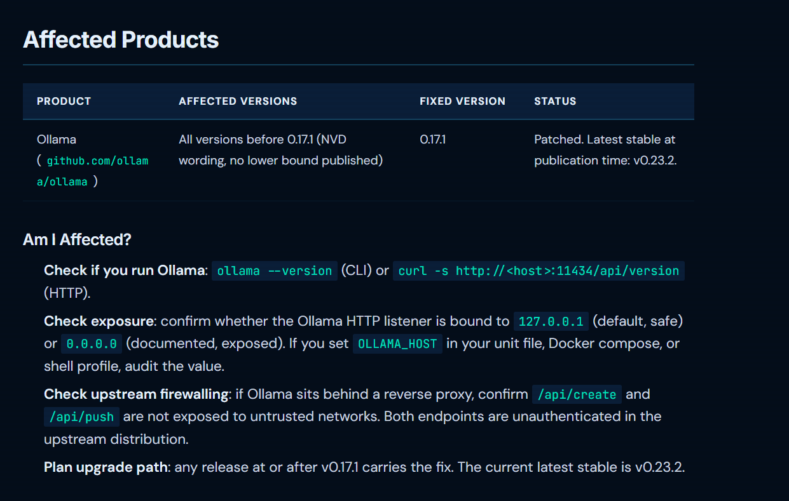

# Ollama Bleeding Llama Unauthenticated Memory Leak (2026)

> Ollama Bleeding Llama 未认证进程内存泄露事件

| Field         | Value                     |
| ------------- | ------------------------- |
| Category      | Agent Risks               |
| Severity      | 🔴 Critical                |
| AI Tool       | Ollama, Local LLM runtime |
| Language      | Go                        |
| Real Incident | ✅                         |
| Reproducible  | ✅                         |
| Disclosed     | 2026-05-04                |
| CVE           | CVE-2026-7482             |
| CVSS          | 9.1                       |

## TL;DR

Ollama CVE-2026-7482 leaked LLM server memory through unauthenticated /api/create and /api/push paths.

> Ollama 的 GGUF 模型加载链路存在未认证堆越界读取漏洞，攻击者可借助 `/api/create` 触发内存泄露，并通过 `/api/push` 将包含提示词、环境变量和 API Key 的模型产物外传。

------

## 详细分析 / Full Analysis

# Ollama Bleeding Llama 未认证进程内存泄露事件分析：本地 LLM 运行时中的提示词、密钥与会话数据外泄风险

## 基本信息

案例时间：2026 年 5 月
事件对象：Ollama 本地 LLM 运行平台
漏洞编号：CVE-2026-7482
漏洞别名：Bleeding Llama
漏洞类型：堆越界读取、未认证远程内存泄露、模型产物外传
影响版本：Ollama 0.17.1 之前版本
修复版本：Ollama 0.17.1 及之后版本
风险归类：本地 LLM 运行时风险、未认证 API 暴露、提示词与环境变量泄露、AI 基础设施数据外泄
案例定位：本案例可作为团队报告中 AI 代码安全风险从代码生成扩展到 AI 运行时、模型加载器、推理服务 API 和本地 LLM 数据边界的补充案例。

## 摘要

2026 年 5 月，Cyera Research 披露 Ollama 中的关键内存泄露漏洞，并将其命名为 Bleeding Llama。该漏洞被记录为 CVE-2026-7482，Cyera 给出的 CVSS 3.1 分数为 9.1 Critical。研究称，未认证攻击者可泄露 Ollama 进程的完整内存，潜在影响全球约 300,000 台服务器；泄露内容可能包含用户消息、系统提示词和环境变量。([Cyera](https://www.cyera.com/research/bleeding-llama-critical-unauthenticated-memory-leak-in-ollama))

NVD 对 CVE-2026-7482 的描述显示，Ollama 0.17.1 之前版本的 GGUF 模型加载器存在堆越界读取问题。`/api/create` 接口可接受攻击者提供的 GGUF 文件，该文件声明的 tensor offset 和 size 超出实际文件长度；在量化过程中，服务器会读取已分配堆缓冲区之外的数据。NVD 还记录，泄露内存可能包含环境变量、API Key、系统提示词和并发用户的会话数据，并可通过 `/api/push` 上传生成的模型产物到攻击者控制的 registry。([NVD](https://nvd.nist.gov/vuln/detail/CVE-2026-7482))

该事件与 AI 安全高度相关。Ollama 是广泛使用的本地 LLM 运行平台，常用于企业内部推理、开发者本地 Agent、私有 RAG、模型测试和内部自动化。与普通 Web 服务不同，Ollama 进程内存中可能同时存在系统提示词、用户提示词、模型配置、API Key、云服务凭据和多个用户的对话数据。该漏洞说明，本地 LLM 并不天然安全；当推理服务 API 暴露到网络且缺少认证时，模型运行时本身会成为敏感数据外泄入口。

## 一、事件核验与证据边界

本案例由多类来源交叉验证。NVD 提供 CVE-2026-7482 的漏洞描述、CWE、受影响版本、修复版本和 CNA 提供的 CVSS 分数；Cyera Research 给出漏洞发现、技术链路、影响数据和风险解释；The Hacker News 对漏洞进行媒体复核，确认其可使远程未认证攻击者泄露整个 Ollama 进程内存；RAXE Labs 对 CVE 记录和上游修复进行了独立验证。([NVD](https://nvd.nist.gov/vuln/detail/CVE-2026-7482))

NVD 记录显示，该漏洞影响 Ollama 0.17.1 之前版本。CVE 描述明确指出，`/api/create` 接受攻击者控制的 GGUF 文件，模型加载和量化过程中发生越界读取；泄露数据可经 `/api/push` 上传到攻击者控制的 registry。NVD 页面还显示，CNA Echo 提供的 CVSS 3.1 分数为 9.1 Critical，CVSS 4.0 分数为 8.8 High，弱点类型为 CWE-125 Out-of-bounds Read。([NVD](https://nvd.nist.gov/vuln/detail/CVE-2026-7482))

Cyera Research 的原始披露将影响面描述为约 300,000 台服务器，指出 Ollama 拥有约 170,000 个 GitHub stars、超过 100 million Docker Hub downloads，并已在企业中广泛采用。该研究还强调，泄露内存中可能包含用户消息、系统提示词和环境变量。([Cyera](https://www.cyera.com/research/bleeding-llama-critical-unauthenticated-memory-leak-in-ollama))

RAXE Labs 对该漏洞给出独立验证意见。其报告确认 CVE-2026-7482 是 Ollama GGUF 模型加载器中的未认证堆越界读取问题，并指出 `/api/create` 触发越界读取，`/api/push` 可将包含泄露内存的模型产物外传。RAXE 同时提醒，NVD 当时尚未给出自己的 Primary CVSS 分数，页面中显示的是 Echo CNA 的 Secondary 分数。([RAXE](https://raxe.ai/labs/advisories/RAXE-2026-062))

公开材料支持该漏洞真实存在、影响 Ollama 0.17.1 之前版本，并可造成未认证内存泄露。公开资料没有显示该漏洞已经造成某个命名企业的数据泄露事故，也没有确认固定金额损失。因此，本案例为已公开披露、可复现、影响面较大、可导致敏感提示词和凭据外泄的 AI 运行时漏洞。

## 二、系统背景与触发条件

Ollama 是开源本地 LLM 运行平台，允许用户在本地或自托管服务器上下载、管理和运行 Llama、Mistral 等模型。Cyera 将其描述为运行本地 LLM 的标准化平台之一，并指出其在 GitHub 和 Docker Hub 上具有较高采用度。([Cyera](https://www.cyera.com/research/bleeding-llama-critical-unauthenticated-memory-leak-in-ollama))

漏洞触发路径与 Ollama 的模型创建流程有关。Cyera 说明，Ollama 创建模型主要有两类方式：通过 `/api/pull` 从 registry 拉取现有模型，或通过 `/api/create` 基于上传文件创建自定义模型。文件可通过 `/api/blobs/sha256:[digest]` 上传，随后由 `/api/create` 在创建模型时引用。([Cyera](https://www.cyera.com/research/bleeding-llama-critical-unauthenticated-memory-leak-in-ollama))

CVE-2026-7482 的关键在于攻击者可构造恶意 GGUF 文件，使其中声明的 tensor offset 和 size 超出实际文件边界。Ollama 在量化过程中读取这些 tensor 数据时，越过已分配堆缓冲区，导致进程内存内容被混入生成的模型产物。([NVD](https://nvd.nist.gov/vuln/detail/CVE-2026-7482))

Ollama 默认绑定 `127.0.0.1`，但 NVD 记录明确指出，文档化的 `OLLAMA_HOST=0.0.0.0` 配置在实践中被广泛使用，并造成大量公网暴露。`/api/create` 与 `/api/push` 在上游发行版中没有认证机制，这使得暴露到不可信网络的实例可被远程攻击者直接利用。([NVD](https://nvd.nist.gov/vuln/detail/CVE-2026-7482))

触发条件与企业使用本地 LLM 的方式密切相关。企业部署 Ollama 往往是为了数据主权、离线推理或内部 AI 应用集成，但在容器、开发机、云主机或内部集群中暴露 API 后，推理服务可能从本地工具变成网络服务。只要网络边界、认证和端点访问控制没有同步建立，本地 LLM 运行时就会形成新的数据泄露面。

## 三、漏洞链路与技术根因

CVE-2026-7482 的技术链路由三个步骤构成。攻击者上传恶意 GGUF blob，经 `/api/create` 触发模型创建和量化流程，随后通过 `/api/push` 将生成的模型产物推送到攻击者控制的 registry。NVD 对这一链路的描述明确指出，泄露的内存内容可被包含在模型 artifact 中，并通过 `/api/push` 外传。([NVD](https://nvd.nist.gov/vuln/detail/CVE-2026-7482))

NVD 将根因归类为 GGUF 模型加载器中的堆越界读取。恶意 GGUF 文件通过声明不一致的 tensor offset 和 size，使量化代码读取超出文件实际长度的数据；相关路径涉及 `fs/ggml/gguf.go` 和 `server/quantization.go` 中的 `WriteTo()` 逻辑。([NVD](https://nvd.nist.gov/vuln/detail/CVE-2026-7482))

RAXE Labs 对这一点进行了独立复核。其报告称，`/api/create` 触发越界读取，`/api/push` 完成外传，三个相关端点在上游发行版中均无认证。RAXE 还将该漏洞称为 one-shot exfiltration chain，即攻击者不需要持续驻留在服务器上，也不需要反连 shell，仅通过模型创建与推送流程即可完成敏感内存外带。([RAXE](https://raxe.ai/labs/advisories/RAXE-2026-062))

该漏洞不属于提示注入，也不是模型输出错误。它发生在 LLM 运行时的底层模型文件处理逻辑中。GGUF 文件本应是模型权重与元数据的载体，但在创建自定义模型时变成了攻击输入。模型文件、模型 registry、推理服务 API 和模型产物推送共同构成了 AI 运行时供应链的一部分。

The Hacker News 对该漏洞的报道也将其描述为远程未认证进程内存泄露，并指出该漏洞可能影响 300,000 多台服务器。报道还引用了 CVE 对 `/api/create` 处理攻击者 GGUF 文件的描述。([The Hacker News](https://thehackernews.com/2026/05/ollama-out-of-bounds-read-vulnerability.html))

## 四、AI 参与证据与责任边界

本案例与 AI 的关联来自被攻击对象本身。Ollama 是本地 LLM 运行平台，用于下载、运行和管理大语言模型。漏洞位于模型文件加载、模型创建和模型产物推送流程中，直接影响 AI 推理服务的运行时数据边界。([Cyera](https://www.cyera.com/research/bleeding-llama-critical-unauthenticated-memory-leak-in-ollama))

该案例不为某个大模型生成了脆弱代码。公开证据显示，漏洞是 Ollama GGUF 模型加载器中的堆越界读取问题。AI 安全相关性在于：Ollama 进程内存中可能存在提示词、系统提示词、环境变量、API Key 和并发用户会话，而这些信息正是企业使用本地 LLM 时希望保留在内部环境中的敏感资产。([NVD](https://nvd.nist.gov/vuln/detail/CVE-2026-7482))

默认情况下 Ollama 绑定本地回环地址，风险主要发生在被配置为对外监听或暴露到不可信网络的部署中。NVD 明确提到 `OLLAMA_HOST=0.0.0.0` 配置在实践中被广泛使用，造成较大公网暴露面。([NVD](https://nvd.nist.gov/vuln/detail/CVE-2026-7482))

该漏洞的责任不能简单归结为用户配置错误。虽然公网暴露放大了风险，但 `/api/create` 和 `/api/push` 在上游发行版中没有认证，模型加载器又允许攻击者控制的 GGUF 文件触发越界读取。企业治理时应把模型运行时视为高价值服务，而不是普通开发工具。

## 五、与团队技术报告风险框架的关系

团队报告关注 AI 代码生成从局部补全扩展到软件开发全生命周期后的风险外溢。Bleeding Llama 可补充 AI 运行时基础设施这一层。它不是模型生成代码错误，也不是 Agent 误调用工具，而是 LLM 推理服务自身处理模型文件时发生内存泄露。风险对象从源码仓库和应用代码扩展到模型加载器、模型文件、推理服务 API 和模型 registry。

该事件与团队报告中软件供应链边界重塑的判断一致。传统供应链风险多聚焦包管理器、依赖库、构建脚本和镜像。Ollama 事件显示，模型文件和模型 artifact 也具备供应链属性。攻击者提供的 GGUF 文件可触发内存泄露，生成的模型 artifact 又能成为外传载体。模型创建与推送流程因此不再只是 AI 平台功能，而是需要认证、审计和隔离的安全边界。

该事件也补充了敏感数据泄露风险的讨论。团队报告中提到，AI 交互过程中可能暴露 API Key、专有算法和敏感代码。Ollama 的特殊性在于，泄露不发生在用户主动提交给云服务的提示词中，而发生在本地推理进程内存中。企业原本以为本地运行 LLM 可以降低外部数据暴露，但如果本地推理 API 被暴露，系统提示词、用户提示词和环境变量仍可能通过模型加载链路流出。

对于人机协同治理，本案例说明验证者职责不只包括审查模型生成代码，也包括审查 AI 基础设施的暴露面。开发者和平台团队需要确认本地推理服务绑定地址、API 认证、模型上传路径、模型推送权限、环境变量隔离和日志审计。Ollama 这类工具常被快速部署在开发机、实验服务器或容器环境中，若没有纳入正式资产管理，敏感提示词和密钥可能在无人察觉的情况下进入可被读取的进程内存。

## 六、影响范围与社会后果

Bleeding Llama 的直接影响是未认证进程内存泄露。NVD 记录的泄露内容包括环境变量、API Key、系统提示词和并发用户会话数据；Cyera 也指出泄露内存包含用户消息、系统提示词和环境变量。([NVD](https://nvd.nist.gov/vuln/detail/CVE-2026-7482))

影响范围来自 Ollama 的部署规模。Cyera 称 Ollama 拥有约 170,000 个 GitHub stars、超过 100 million Docker Hub downloads，并广泛用于企业本地推理。The Hacker News 报道称该漏洞可能影响 300,000 多台服务器。([Cyera](https://www.cyera.com/research/bleeding-llama-critical-unauthenticated-memory-leak-in-ollama))

对企业而言，进程内存泄露可能造成多层后果。系统提示词泄露会暴露企业内部 Agent 的行为约束、策略规则和安全提示；用户提示词泄露可能包含客户问题、源代码、需求文档、合同内容和内部知识；环境变量和 API Key 泄露会带来模型服务、数据库、云服务或内部系统的二次访问风险。并发会话数据泄露还意味着多用户共享 Ollama 实例时，一个攻击请求可能读取到其他用户近期交互内容。([NVD](https://nvd.nist.gov/vuln/detail/CVE-2026-7482))

该漏洞的社会影响不表现为单一企业停摆，而是本地 AI 基础设施的信任边界被削弱。许多组织采用 Ollama 是为了把模型推理留在本地，降低云端数据泄露风险。Bleeding Llama 说明，本地化并不等于安全；若本地推理服务缺少认证、暴露到网络并允许外部上传模型文件，敏感数据仍可能通过 AI 运行时被外带。

## 七、治理建议

受影响部署应升级到 Ollama 0.17.1 或更高版本。NVD 将 0.17.1 之前版本列为受影响范围，并将 v0.17.1 release、PR 和修复 commit 列为参考链接。RAXE 也建议立即升级到 0.17.1 或更新版本。([NVD](https://nvd.nist.gov/vuln/detail/CVE-2026-7482))

Ollama API 不应暴露在不可信网络中。默认绑定 `127.0.0.1` 更适合作为安全基线；若业务确需远程访问，应通过反向代理、VPN、零信任访问网关、mTLS 或 API gateway 增加认证和访问控制。`OLLAMA_HOST=0.0.0.0` 的部署需要逐台排查，确认 `/api/create`、`/api/blobs` 和 `/api/push` 不直接暴露给互联网。([NVD](https://nvd.nist.gov/vuln/detail/CVE-2026-7482))

模型上传和模型创建应按高风险操作治理。GGUF 文件不是普通静态文件，而是会被模型加载器解析并进入量化流程的输入。企业应限制谁可以上传 blob、谁可以调用 `/api/create`，并对模型文件来源、hash、registry、创建日志和推送目标进行审计。

敏感凭据不应长期驻留在推理服务进程环境中。对需要调用外部模型、数据库或云服务的 Ollama 集成，应使用短期凭据、密钥托管服务和最小权限账号。若曾运行受影响版本且服务对外暴露，应轮换可能出现在环境变量中的 API Key、数据库密码、云 token 和内部服务凭据。

共享 Ollama 实例应分离用户会话和敏感任务。NVD 明确提到并发用户的 conversation data 可能进入泄露范围。多团队共用同一推理服务时，应按团队、环境或敏感级别隔离实例，避免一个暴露端点泄露多个业务线的提示词和会话数据。([NVD](https://nvd.nist.gov/vuln/detail/CVE-2026-7482))

## 八、结论

Ollama Bleeding Llama 是 2026 年本地 LLM 基础设施安全中的代表性案例。CVE-2026-7482 暴露了一个未认证堆越界读取问题：攻击者可通过 `/api/create` 触发 GGUF 模型加载器越界读取进程内存，并通过 `/api/push` 将包含泄露数据的模型产物外传。NVD 记录的潜在泄露内容包括环境变量、API Key、系统提示词和并发用户会话数据。([NVD](https://nvd.nist.gov/vuln/detail/CVE-2026-7482))

该漏洞的关键价值在于，它把 AI 安全风险从应用代码和 Agent 工具调用推进到 LLM 运行时本身。Ollama 常被用于本地推理和企业内部 AI 应用，部署者往往关注模型性能、数据主权和推理成本，却容易忽略 API 暴露、模型文件解析和模型产物推送链路。Bleeding Llama 说明，模型加载器、模型文件、推理 API 和 registry 同样属于 AI 软件供应链的一部分。

## 参考来源

1. NVD，CVE-2026-7482。该来源用于核验漏洞描述、影响版本、`/api/create` 与 `/api/push` 攻击链、泄露内容、CWE-125、CNA CVSS 3.1 9.1 和修复版本。([NVD](https://nvd.nist.gov/vuln/detail/CVE-2026-7482))
2. Cyera Research，Bleeding Llama: Critical Unauthenticated Memory Leak in Ollama。该来源用于核验漏洞命名、披露时间、300,000 servers、170,000 GitHub stars、100 million Docker Hub downloads、用户消息/系统提示词/环境变量泄露风险。([Cyera](https://www.cyera.com/research/bleeding-llama-critical-unauthenticated-memory-leak-in-ollama))
3. The Hacker News，Ollama Out-of-Bounds Read Vulnerability Allows Remote Process Memory Leak。该来源用于核验媒体复核、远程未认证进程内存泄露、300,000 servers、CVE-2026-7482 和 Ollama 平台背景。([The Hacker News](https://thehackernews.com/2026/05/ollama-out-of-bounds-read-vulnerability.html))
4. RAXE Labs，Ollama GGUF Heap Out-of-Bounds Read: Memory Disclosure via `/api/create` + Exfiltration via `/api/push`。该来源用于核验第三方复核、CNA 分数边界、0.17.1 修复建议、`/api/create` 与 `/api/push` 外传链路和网络暴露治理建议。([RAXE](https://raxe.ai/labs/advisories/RAXE-2026-062))