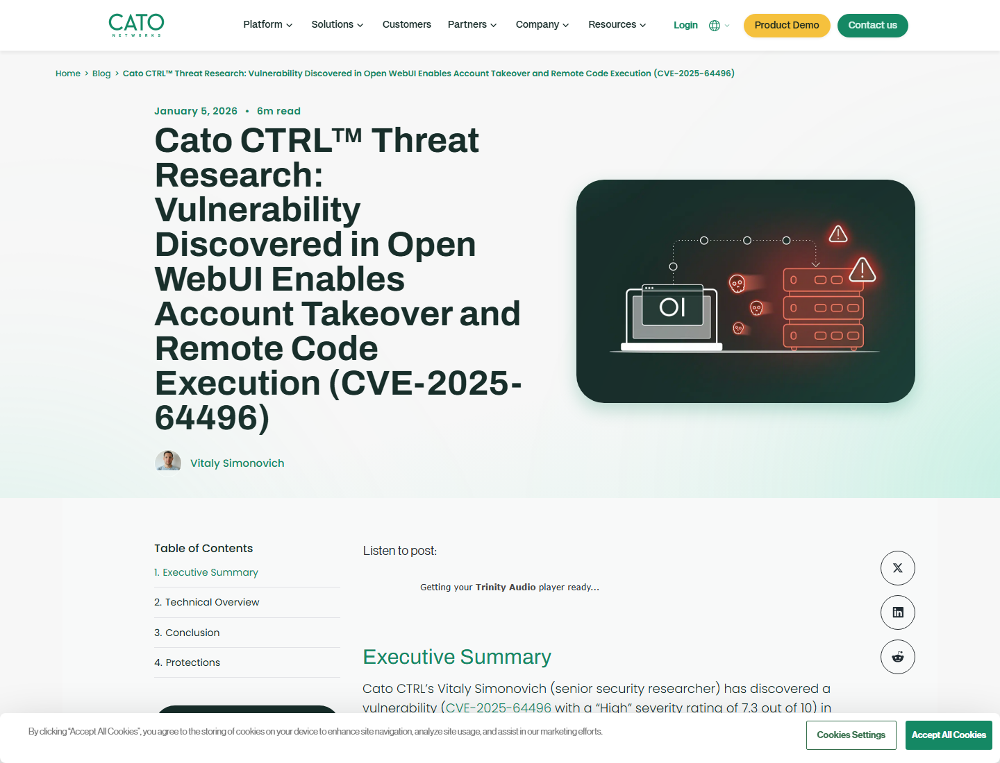
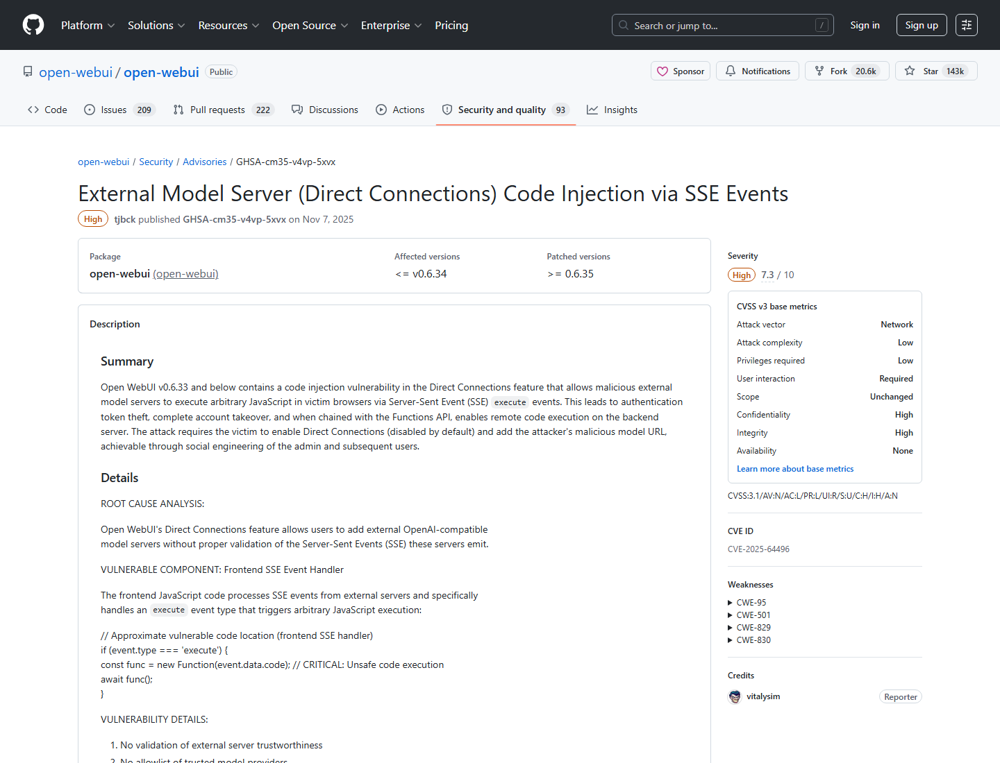
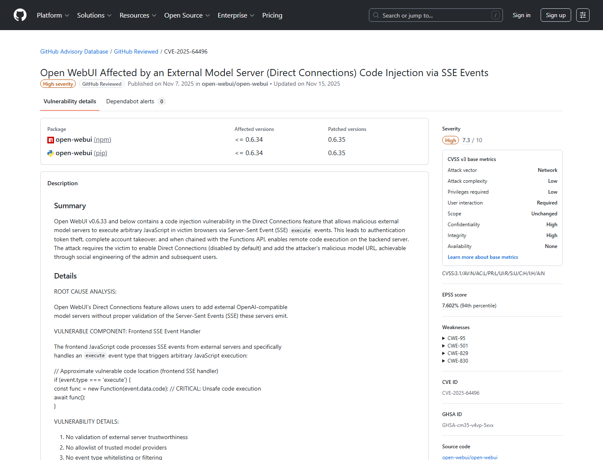
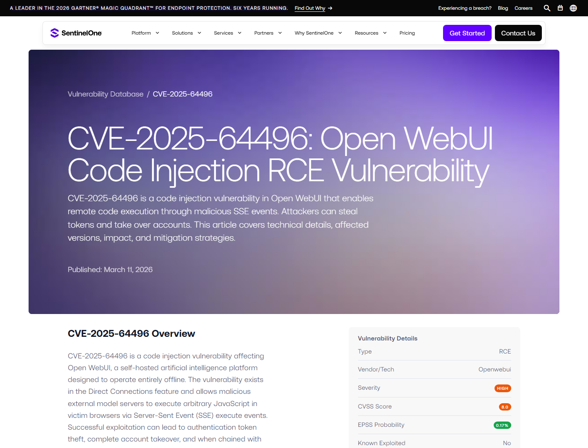
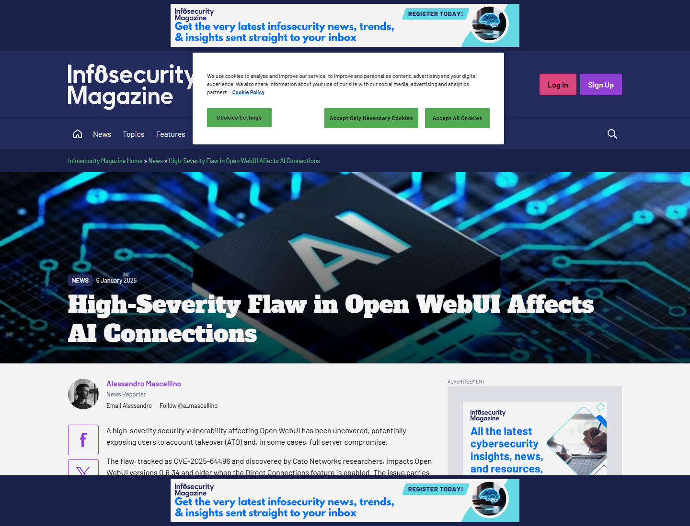
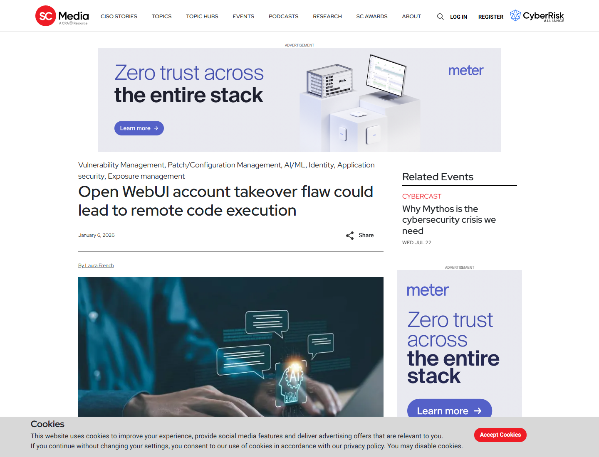

# Open WebUI Direct Connections SSE Code Injection to RCE (2026)
> Open WebUI Direct Connections SSE 代码注入到远程代码执行

| Field | Value |
|---|---|
| Category | Domain-Specific Risks |
| Severity | High |
| AI Tool | Open WebUI, Direct Connections, external model servers |
| Language | JavaScript / Python |
| Real Incident | Yes |
| Reproducible | Yes |
| Disclosed | 2026-01-05 |
| CVE | CVE-2025-64496 |

## TL;DR
Open WebUI's Direct Connections feature trusted SSE events from external model servers; a malicious server could run JavaScript in the user's browser, steal tokens, take over the account, and with tool permissions chain into backend Python execution.
> Direct Connections 让用户把 Open WebUI 连接到外部 OpenAI-compatible 模型服务器。CVE-2025-64496 的问题在于，恶意模型服务器可通过 SSE `execute` 事件进入浏览器执行路径，把“连接模型”变成账号接管和后端执行入口。

---

## 详细分析 / Full Analysis

# Open WebUI CVE-2025-64496 案例分析：外部模型服务器、SSE execute 事件与后端 RCE 链

## 基本信息

Open WebUI 是自托管 AI Web 界面，常用于连接本地或远程大模型服务、管理对话、上传文档、配置工具和运行函数。Direct Connections 功能允许用户直接连接外部 OpenAI-compatible model server。这个功能很实用，但也引入了新的信任边界：模型服务器不仅返回文本，还可以通过流式响应影响前端处理逻辑。

2026 年 1 月，Cato CTRL 披露 CVE-2025-64496，影响 Open WebUI 0.6.34 及更早版本。攻击者若诱导用户启用 Direct Connections 并连接到恶意模型服务器，就可让该服务器发送 Server-Sent Events 中的 `execute` 事件，触发浏览器端 JavaScript 执行。Cato 将影响拆成两层：先偷取 localStorage 中的认证 token 并接管账号；若被接管用户具备 `workspace.tools` 权限，则可通过 Tools/Functions API 执行任意 Python 代码。[Cato CTRL](https://www.catonetworks.com/blog/cato-ctrl-vulnerability-discovered-open-webui-cve-2025-64496/)

## 一、事件核验与证据范围

### 证据矩阵

| 来源 | 类型 | 证明内容 | 备注 |
|---|---|---|---|
| Cato CTRL | 原始研究 | Direct Connections、恶意模型服务器、SSE execute、token theft、ATO 到 RCE 链 | 主技术证据 |
| Open WebUI GHSA | 项目 advisory | GHSA-cm35-v4vp-5xvx、影响版本、修复版本 0.6.35、PoC 逻辑 | 项目主证据 |
| GitHub Advisory / NVD | 漏洞数据库 | CVE-2025-64496、CWE、影响范围、Direct Connections 条件 | 数据库复核 |
| SentinelOne | 技术复核 | SSE JavaScript execution、localStorage token、Functions API 链 | 第三方复核 |
| Infosecurity / SC World | 媒体复核 | 高危、账号接管、特定权限下后端 RCE、社工条件 | 影响解释 |

Open WebUI 的项目 advisory 对攻击过程给出清晰描述：外部模型服务器返回带 `execute` event type 的 SSE，前端用 `new Function()` 执行其中的代码，攻击者随后窃取 token。该 advisory 还说明 Direct Connections 默认关闭，攻击通常依赖社工让管理员或用户添加恶意模型 URL。[Open WebUI Advisory](https://github.com/open-webui/open-webui/security/advisories/GHSA-cm35-v4vp-5xvx)

## 二、系统背景与触发条件

Open WebUI 的 Direct Connections 面向灵活连接模型服务。企业或个人用户可能添加本地 vLLM、Ollama、OpenAI-compatible proxy、第三方模型 API 或测试环境端点。问题在于，外部模型服务器是数据源，也是事件流来源；如果前端把事件类型和事件内容当成可信控制指令处理，模型服务器就可以越过“只返回模型文本”的角色。

触发链条需要几个条件。Direct Connections 要被启用；用户需要添加攻击者控制的 model server URL；用户需要向该连接发送消息或触发流式响应；若要从账号接管升级到后端 RCE，被盗 token 对应的用户还需要拥有 `workspace.tools` 权限。这个条件组让风险更像“高影响社工链”，而不是无交互公网扫描漏洞。

## 三、攻击链与处置过程

攻击第一阶段发生在浏览器。恶意模型服务器返回 SSE，其中包含 `execute` 事件和 JavaScript payload。前端处理器执行这些代码后，攻击者可以读取 localStorage 中的 token，把它发送到外部服务器。token 有效后，攻击者就能以受害者身份访问聊天记录、文档、API keys 和相关配置。

第二阶段取决于权限。如果受害者拥有 `workspace.tools`，攻击者可以调用 Functions/Tools API 创建或执行恶意 Python tool。公开材料指出，相关后端执行路径缺少足够沙箱或验证时，账号接管会升级为服务器命令执行。Open WebUI 0.6.35 引入修复，通过 middleware 阻断来自 Direct Connections 的恶意 SSE execute 事件。

## 四、技术根因分析

根因是外部模型服务器输出被赋予了前端控制权。Direct Connections 的预期是把外部模型响应流接入 Open WebUI，但前端 SSE handler 接受了 `execute` 这类事件，并将事件数据转为 JavaScript 执行。这个设计把模型服务器从“内容提供方”提升成“浏览器脚本提供方”，破坏了 model response 与 UI code 之间的边界。

第二个根因是浏览器 token 与后端工具权限之间缺少更细的隔离。localStorage token 被盗后，攻击者继承受害者账号能力；若该账号拥有工具执行权限，后端就会按合法用户请求运行 Python tool。AI WebUI 中的工具系统通常为了扩展能力而开放，这也使 token theft 的后果比普通 Web 会话更重。

## 五、AI 参与方式与风险归因

该案例的 AI 参与方式在“外部模型连接”这一层。攻击者伪装成模型服务器，利用模型流式输出协议传递控制事件。模型是否真实生成文本并不重要；关键是 Open WebUI 把外部 AI endpoint 视为可信事件源。AI 应用为了兼容多模型、私有模型和代理服务，往往允许用户添加自定义端点，这也让 endpoint trust 成为安全边界。

风险归因应落在 Direct Connections 的事件过滤、前端代码执行、token 存储和工具权限上。SC World 的复核指出，恶意服务器发送的 SSE 可执行 JavaScript、窃取认证 token，并在 `workspace.tools` 权限存在时通过 Python `exec()` 达到后端 RCE。[SC World](https://www.scworld.com/news/open-webui-account-takeover-flaw-could-lead-to-remote-code-execution)

## 六、与团队技术报告风险框架的关系

团队技术报告关注 AI 系统中“外部工具和服务连接”的风险。Open WebUI 这个案例说明，外部模型服务器本身也可以成为攻击者控制的 tool/provider。AI 应用如果允许用户把不可信模型 endpoint 接入同一个 WebUI，会话、文档、API keys 和工具权限都会暴露在这个信任决策之后。

这也说明，AI 安全不应只验证 prompt 注入，还要验证 model endpoint 注入。流式协议、SSE event type、浏览器执行路径、token 生命周期和后端工具 API 都是同一条攻击链上的节点。

## 七、影响范围与社会后果

Open WebUI 被广泛用于本地和企业自托管 AI 交互。很多用户部署它，是为了把私有文档、聊天记录和 API key 留在自己环境内；但 Direct Connections 让外部模型服务器进入这个私有环境。若用户被诱导添加恶意 endpoint，攻击者可以获得聊天、上传文档、API keys、用户身份和工具执行能力。

社会后果在于“模型服务供应链”变成了 Web 安全入口。企业员工可能为了试用更便宜或更快的模型，把未知 OpenAI-compatible URL 加入 WebUI；安全团队如果只检查后端漏洞和依赖版本，而不管用户添加了哪些模型 endpoint，就会漏掉这类攻击面。

## 八、治理建议

Open WebUI 用户应升级到 0.6.35 或更高版本，禁用不必要的 Direct Connections，限制谁可以添加外部 model server URL。已使用 Direct Connections 的环境应审计已配置端点、检查异常 token 使用、轮换敏感 API keys，并复核哪些用户拥有 `workspace.tools` 权限。

平台侧应对外部模型 SSE event 做严格 allowlist，只接受文本生成所需事件；浏览器端不得执行来自模型服务器的代码；认证 token 应避免长期存放在 localStorage，并应具备合理过期与撤销能力。后端 Functions/Tools API 需要最小权限、沙箱、审计和单独授权，不能让普通会话 token 直接触达任意 Python 执行能力。

## 九、结论

CVE-2025-64496 展示了 AI WebUI 中的一个新信任边界：模型服务器不仅是推理服务，也可能成为前端事件源。Open WebUI Direct Connections 的 SSE execute 处理让恶意 endpoint 能从浏览器代码执行开始，逐步到账号接管和特定权限下的后端 RCE。对自托管 AI 平台而言，外部模型连接、浏览器 token 和工具执行权限必须一起治理。

## 参考来源

- [Cato CTRL: Open WebUI CVE-2025-64496](https://www.catonetworks.com/blog/cato-ctrl-vulnerability-discovered-open-webui-cve-2025-64496/)
- [Open WebUI Advisory: GHSA-cm35-v4vp-5xvx](https://github.com/open-webui/open-webui/security/advisories/GHSA-cm35-v4vp-5xvx)
- [GitHub Advisory Database: GHSA-cm35-v4vp-5xvx](https://github.com/advisories/GHSA-cm35-v4vp-5xvx)
- [NVD: CVE-2025-64496](https://nvd.nist.gov/vuln/detail/CVE-2025-64496)
- [SentinelOne: Open WebUI code injection RCE](https://www.sentinelone.com/vulnerability-database/cve-2025-64496/)
- [Infosecurity Magazine: High-severity flaw in Open WebUI](https://www.infosecurity-magazine.com/news/flaw-open-webui-affects-ai/)
- [SC World: Open WebUI account takeover flaw](https://www.scworld.com/news/open-webui-account-takeover-flaw-could-lead-to-remote-code-execution)
