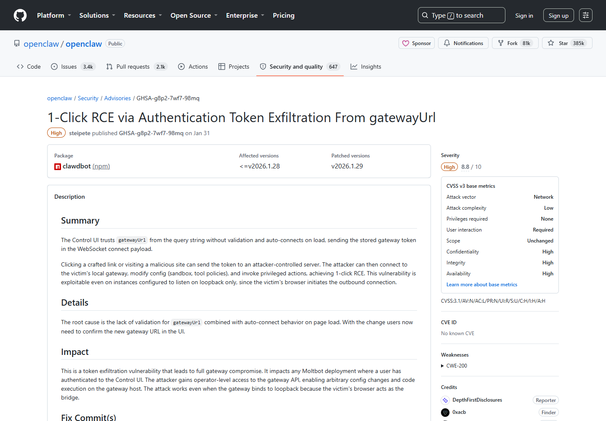
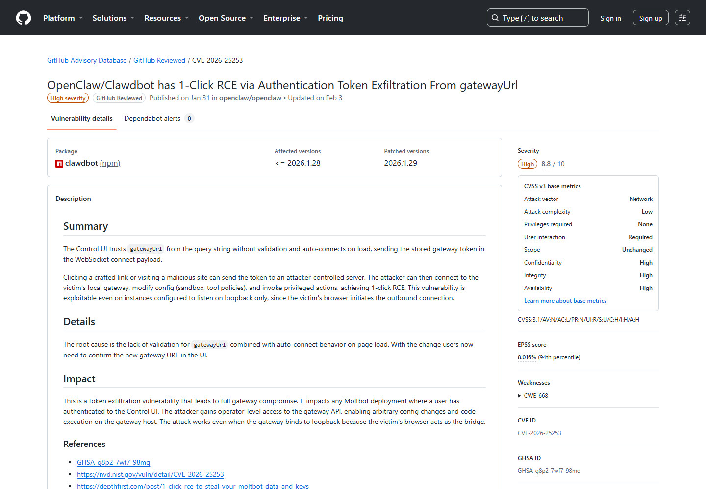
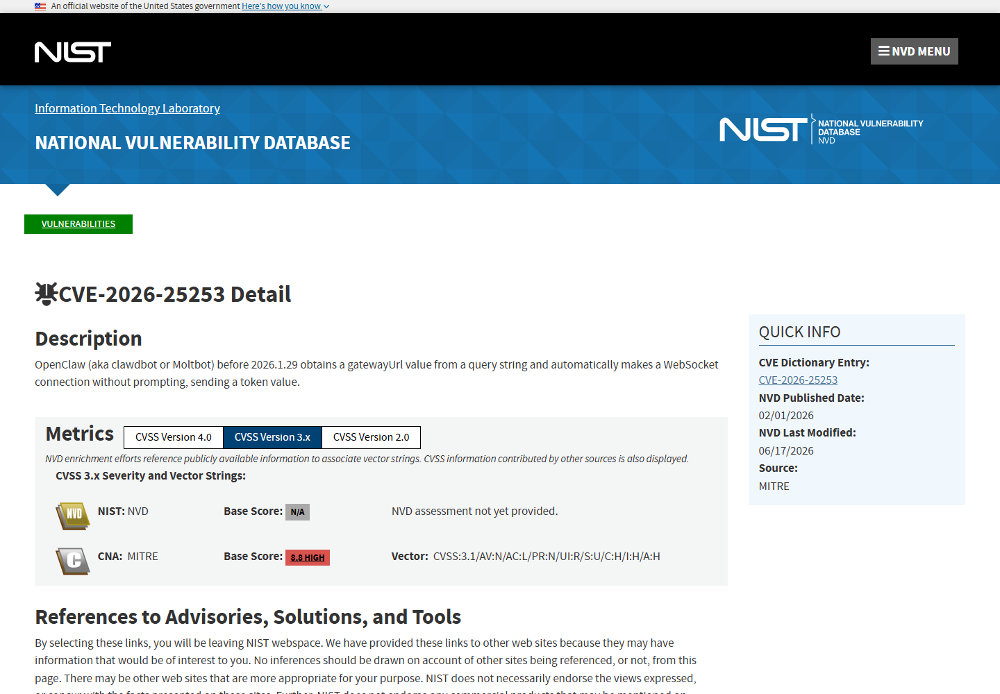
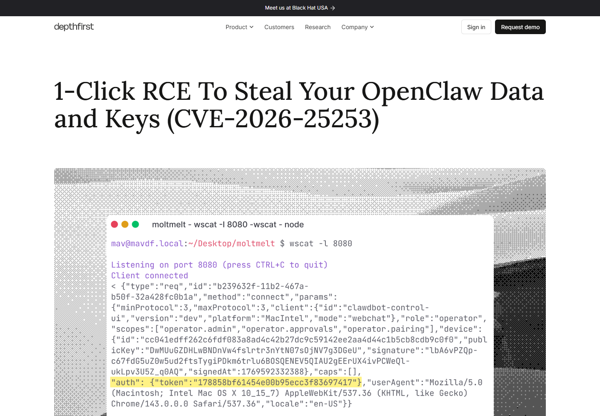
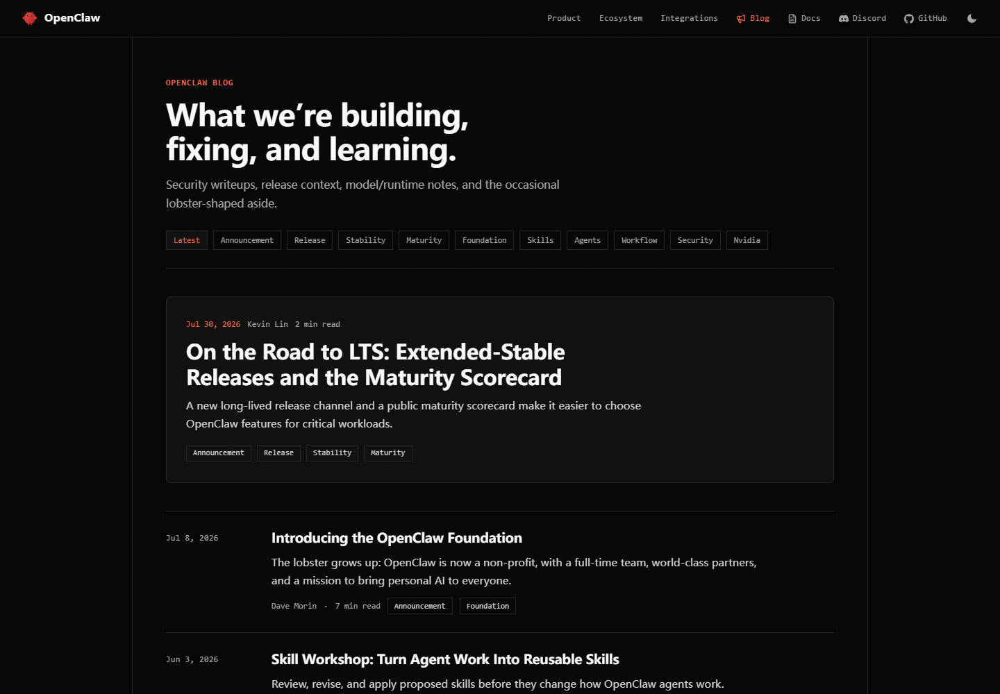

# OpenClaw Gateway Token Exfiltration and One-Click RCE (2026)
> OpenClaw 网关令牌外传与一键远程代码执行

| Field | Value |
|---|---|
| Category | agent-risk |
| Severity | high |
| AI Tool | OpenClaw, Clawdbot, Control UI, AI agent gateway |
| Language | TypeScript / WebSocket / Web UI |
| Real Incident | Yes |
| Reproducible | Yes |
| Disclosed | 2026-01-31 |
| CVE | CVE-2026-25253 |

## TL;DR
OpenClaw Control UI 信任查询参数中的 gatewayUrl 并自动连接，浏览器会把已保存网关令牌发给攻击者服务器；令牌随后可用于修改工具策略并在本地 Agent 网关执行代码。

---

## 详细分析 / Full Analysis

## 一、基本信息与事件概况

OpenClaw 的 Control UI 通过 WebSocket 管理本地 Agent 网关，网关具有配置、工具和执行权限。漏洞版本从 URL 查询参数读取 gatewayUrl，页面加载后无需确认就发起连接，并在连接载荷中包含已保存令牌。即使网关只监听回环地址，受害者浏览器仍能作为外部服务器与本地服务之间的桥梁。

受影响范围为 clawdbot 2026.1.28 及之前版本，修复版本为 2026.1.29。是否能够走到代码执行，取决于浏览器中是否保存有效令牌，以及该令牌能够控制哪些网关设置和工具。

## 二、公开披露与材料核验

仓库于 2026 年 1 月 31 日发布 GHSA-g8p2-7wf7-98mq，GitHub 随后审核并分配 CVE-2026-25253。受影响版本为 2026.1.28 及之前，2026.1.29 要求用户确认新的网关地址。独立研究文章给出攻击链，NVD 和 GitHub Advisory 对影响与版本范围的记录一致。

### 证据矩阵

| 来源 | 类型 | 证明内容 |
|---|---|---|
| OpenClaw repository advisory | 公开记录 | 版本、技术机制、修复或产品背景 |
| GitHub Advisory Database | 公开记录 | 版本、技术机制、修复或产品背景 |
| NVD CVE record | 公开记录 | 版本、技术机制、修复或产品背景 |
| DepthFirst technical disclosure | 公开记录 | 版本、技术机制、修复或产品背景 |
| OpenClaw project blog | 公开记录 | 版本、技术机制、修复或产品背景 |

## 三、系统背景与触发条件

受害者需要已经在 Control UI 中保存有效网关令牌，并访问攻击者构造的链接。网关即使只监听回环接口仍可能受影响，因为发起外连的是浏览器；后续代码执行能力则取决于令牌可修改的沙箱和工具策略。

`gatewayUrl` 设计用于让控制界面连接不同网关，但受影响版本把查询参数当作可直接使用的连接目标。页面没有把“切换网关”作为一次需要用户确认的安全操作，也没有在发送令牌前把目标与原先受信地址比较。攻击者因此只需控制链接，不必先接触本地网关端口。

令牌必须已经保存在 Control UI 可用的浏览器状态中，且用户需要打开恶意页面。没有保存令牌的新环境不会完成相同的泄露链；网关令牌只具备有限只读权限的部署，后续影响也会相应降低。公开公告中的 RCE 依赖令牌能够修改工具或沙箱设置并调用主机能力。

## 四、攻击链与失效过程

攻击者制作带恶意 gatewayUrl 的链接或网页，诱使已登录 Control UI 的用户访问。UI 自动连接到攻击者 WebSocket 并发送网关令牌。攻击者取得令牌后连接受害者本地网关，修改 sandbox 与工具策略，再调用具备主机权限的操作完成代码执行。整个链条只需要一次链接访问。

第一步发生在浏览器外连阶段。恶意 WebSocket 服务器拿到的是有效认证材料，而不是一次普通的跨站请求。第二步才回到受害者网关：攻击者使用令牌建立正式连接，所发请求在协议层看起来与 Control UI 的管理操作一致。

当令牌允许调整沙箱和工具策略时，攻击者可以先降低执行限制，再调用已经存在的 Agent 工具。这与直接利用操作系统内存破坏不同，代码执行来自控制面配置和高权限工具的组合。也正因此，仅把网关绑定在 `127.0.0.1` 上没有切断攻击链，受害者浏览器仍能连接本机服务。

## 五、技术根因与 AI 安全分析

本地监听不是浏览器应用的充分安全边界。只要网页能主动连接任意 WebSocket，远端站点就可能借浏览器访问本机服务。Agent 网关的令牌通常代表广泛工具权限，其保护级别应接近开发者凭据，而不是普通页面状态。客户端必须固定或严格验证网关目标，对目标变更进行明确确认，并避免把长期令牌自动发送给 URL 控制的目的地。

Agent 网关尤其敏感，因为同一连接往往同时承载对话、配置、文件和命令工具。令牌泄露后，攻击者不需要继续诱导模型，只需按网关协议调用已有能力。模型是否会拒绝危险提示并不是可靠防线，工具策略已经可以被攻击者直接修改。

客户端应把网关地址和令牌绑定保存，地址变化时重新认证，而不是复用旧令牌。服务端则应验证 WebSocket `Origin`、限制管理接口来源，并把“修改沙箱策略”与“执行工具”拆成不同权限。这样即使一个令牌泄露，也不至于同时具备解除限制和运行命令的能力。

## 六、影响范围与处置建议

用户应升级到 2026.1.29 或更高版本，撤销旧网关令牌，检查 Control UI 历史中的异常 gatewayUrl 和网关配置变更。若工具策略、沙箱设置或启动项被修改，还应按主机入侵进行排查。部署层可进一步限制 WebSocket Origin，并为高风险工具引入逐次授权。

浏览器历史、代理日志和 DNS 记录可以帮助发现用户是否访问过带陌生 `gatewayUrl` 的链接。网关侧应检查新来源连接、令牌使用时间、沙箱配置变更以及紧随其后的命令或文件操作，把两段时间线合并后再判断是否形成完整利用。

如果无法证明令牌未外传，单纯升级客户端不够。应生成新令牌、恢复可信工具策略，并检查 Agent 可写目录、启动配置和开发凭据。对多人共用控制界面的环境，最好为每名用户签发独立短期令牌，以便准确撤销和追踪。

## 七、结论

OpenClaw 事件说明，回环地址并不能替代浏览器端的目标校验。一个查询参数改变了令牌发送位置，泄露的高权限令牌又能重设工具策略，最终把一次链接访问扩展为本地代码执行。升级后仍需轮换令牌并核查网关配置。

## 八、参考来源

- [OpenClaw repository advisory](https://github.com/openclaw/openclaw/security/advisories/GHSA-g8p2-7wf7-98mq)
- [GitHub Advisory Database](https://github.com/advisories/GHSA-g8p2-7wf7-98mq)
- [NVD CVE record](https://nvd.nist.gov/vuln/detail/CVE-2026-25253)
- [DepthFirst technical disclosure](https://depthfirst.com/post/1-click-rce-to-steal-your-moltbot-data-and-keys)
- [OpenClaw project blog](https://openclaw.ai/blog)

