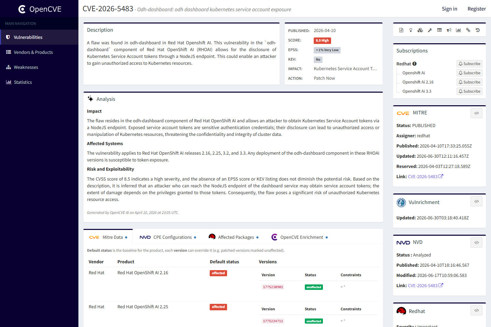
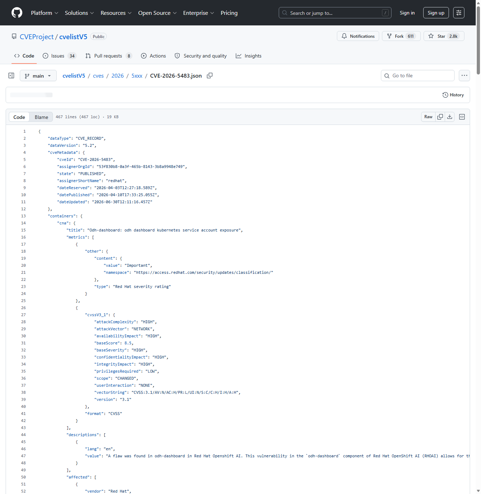
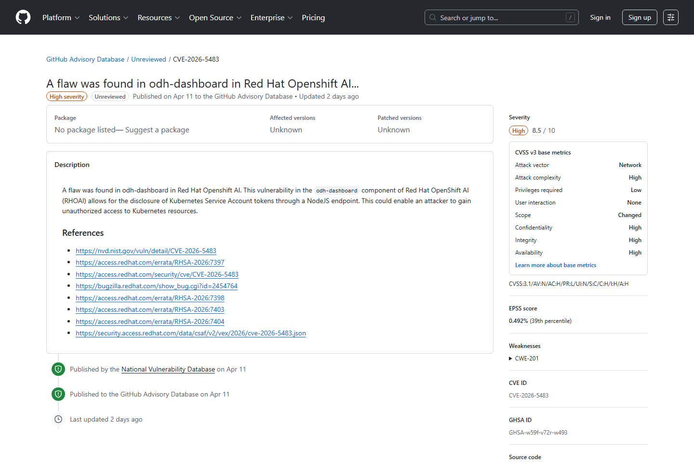
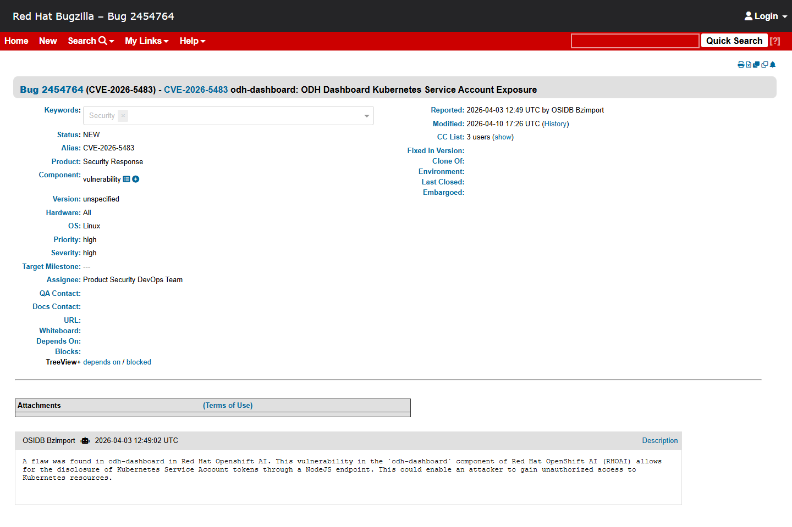
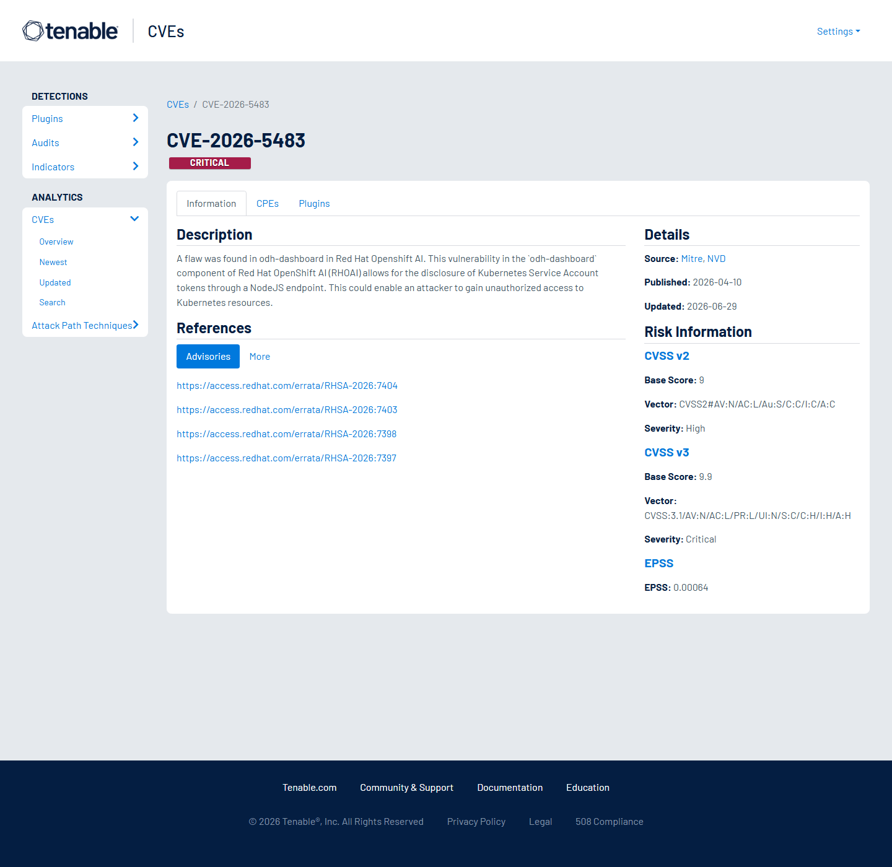
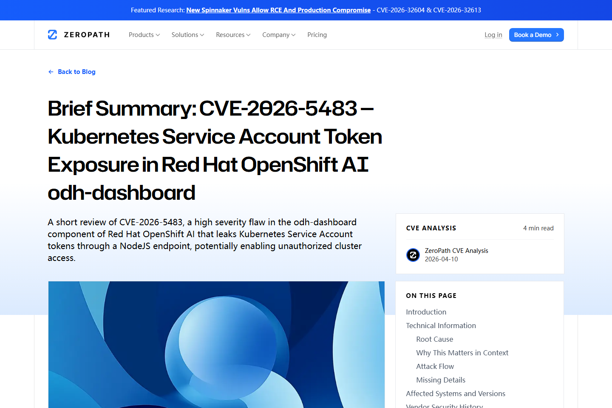

# OpenShift AI odh-dashboard Kubernetes Token Exposure (2026)
> OpenShift AI odh-dashboard Kubernetes 服务账号令牌泄露

| Field | Value |
|---|---|
| Category | cloud-iac |
| Severity | High |
| AI Tool | Red Hat OpenShift AI, odh-dashboard, Kubernetes service accounts |
| Language | JavaScript, Node.js, Kubernetes |
| Real Incident | Yes |
| Reproducible | No |
| Disclosed | 2026-04-10 |
| CVE | CVE-2026-5483 |
| CVSS | 8.5 |

## TL;DR
OpenShift AI odh-dashboard leaked Kubernetes service account tokens through a NodeJS endpoint.
> OpenShift AI odh-dashboard Kubernetes 服务账号令牌泄露：攻击者可能使用令牌访问 Kubernetes 资源，影响 OpenShift AI 集群内工作负载和数据。

---

## 基本信息

| 项目 | 内容 |
|---|---|
| 案例时间 | 2026-04-10 |
| 事件对象 | Red Hat OpenShift AI odh-dashboard 组件 |
| 事件类型 | Kubernetes Service Account token 通过 NodeJS endpoint 泄露 |
| 攻击入口 | 具备一定访问条件的攻击者访问 dashboard 相关端点，获取服务账号令牌。 |
| 主要影响 | 攻击者可能使用令牌访问 Kubernetes 资源，影响 OpenShift AI 集群内工作负载和数据。 |
| 修复方向 | 按 Red Hat 公告升级受影响组件，轮换令牌并审计服务账号权限。 |

## 摘要

CVE-2026-5483 影响 Red Hat OpenShift AI 的 odh-dashboard 组件。Red Hat 与 CVEProject cvelistV5 描述显示，该漏洞会通过 NodeJS endpoint 泄露 Kubernetes Service Account token，进而可能让攻击者获得未授权的集群资源访问能力。对于 AI 平台而言，这类令牌通常连接 Notebook、训练任务、模型服务和数据卷，影响面天然跨越应用与基础设施。
与普通 Web 应用中的信息泄露不同，Kubernetes 服务账号令牌可以直接代表组件访问集群 API。OpenShift AI 场景中，dashboard 既是用户入口，也是调度 Notebook、模型服务和数据科学工作负载的控制面。令牌一旦被错误暴露，攻击者获得的是基础设施身份，而不只是页面数据。

## 一、公开材料概况

Red Hat CVE 页面、CVEProject cvelistV5、GitHub Advisory、Bugzilla、Tenable 和 ZeroPath 对漏洞位置、影响组件和 CVSS 向量给出了交叉确认。公开材料没有披露具体客户环境被入侵的细节，但足以说明 OpenShift AI 控制面令牌暴露会带来 AI 工作负载层面的基础设施风险。
多来源材料都指向 odh-dashboard 与 NodeJS endpoint，这使风险定位相对清晰。需要注意的是，托管在 Kubernetes 上的 AI 平台往往由多个命名空间、服务账号和控制器共同组成，单个 dashboard 组件的凭据问题可能通过 RBAC 扩散到模型构建、数据访问和部署配置。

| 来源 | 类型 | 证明内容 |
|---|---|---|
| OpenCVE: CVE-2026-5483 | 主证据 | 确认 OpenShift AI odh-dashboard 令牌暴露。 |
| CVEProject cvelistV5: CVE-2026-5483 | 主证据 | 确认 CVSS、CWE 和描述。 |
| GitHub Advisory: GHSA-w59f-v72r-w493 | 主证据 | 复核漏洞描述。 |
| Red Hat Bugzilla: CVE-2026-5483 | 生态证据 | 提供厂商缺陷跟踪记录。 |
| Tenable: CVE-2026-5483 | 复核证据 | 复核 token exposure 影响。 |
| ZeroPath: OpenShift AI odh-dashboard token exposure | 技术证据 | 解释 NodeJS endpoint 与 Kubernetes token 风险。 |

## 二、系统背景与触发条件

OpenShift AI 用于在 Kubernetes/OpenShift 上运行数据科学和模型工作负载。odh-dashboard 是用户与平台能力交互的重要入口，背后需要代表用户或组件访问 Kubernetes API。服务账号令牌一旦被暴露，攻击者就可能绕过正常 UI 流程，以 API 身份访问资源。
触发条件取决于受影响端点的可达性和集群访问策略。很多企业会把 OpenShift AI 暴露给内部研发网络、VPN 用户或共享平台租户，这些访问者未必拥有同等 Kubernetes 权限。漏洞使得应用层访问条件可能被放大为基础设施层访问能力。

## 三、攻击链路与处置过程

攻击链从 dashboard 端点进入。攻击者满足访问条件后，通过存在缺陷的 NodeJS 端点获得服务账号令牌，再使用该令牌请求 Kubernetes API。令牌权限的实际范围决定后续影响：读取项目资源、访问模型工作负载、枚举 Secret 或修改与 AI 任务相关的对象。
应急处置需要把“漏洞修复”和“身份失效”分开处理。修复 dashboard 只能阻断新的泄露，已经暴露的 token 仍可能在生命周期内被使用。安全团队应轮换相关服务账号令牌，检查 Kubernetes audit log 中异常的 user agent、源地址、namespace 访问和 Secret 读取行为。

## 四、技术根因分析

根因是控制面组件把基础设施凭据暴露给了不应接触该凭据的请求路径。AI 平台往往需要在用户体验和后台自动化之间桥接权限，若端点访问控制不严，服务账号就会从内部执行身份变成外部可用凭据。
这类问题的本质是身份委托边界错误。dashboard 可以代用户发起某些操作，但不应把组件自身的底层凭据交给请求者。安全设计应区分用户会话、组件服务账号和临时任务身份，并确保任何返回给前端的内容都不包含可直接调用 Kubernetes API 的凭据。

## 五、AI 参与方式与风险归因

AI 参与方式体现在受影响对象是 OpenShift AI 平台控制面。漏洞本身是云原生令牌暴露，但风险落点是模型开发、训练和部署环境。归因应覆盖 dashboard 访问控制、Kubernetes RBAC 和服务账号最小权限。
AI 平台常被看作应用层服务，但它的安全根基在云原生控制面。模型训练数据、Notebook 运行环境、镜像拉取凭据和模型服务配置，都可能通过 Kubernetes 对象表达。令牌暴露会绕过产品 UI 中的权限提示，直接进入更底层的资源访问路径。

## 六、与团队技术报告风险框架的关系

团队框架中的云与 IaC 风险在这里体现为 AI 平台基础设施凭据暴露。随着 AI 工作负载进入 Kubernetes，模型服务安全不只取决于推理 API，也取决于 dashboard、控制器、服务账号和命名空间隔离。

## 七、影响范围与治理建议

CVSS 8.5 的向量包含作用域变化和高机密性、完整性影响。若服务账号权限过宽，令牌泄露可能影响模型镜像、训练数据、Notebook 会话和部署配置。企业还需要审计令牌是否被用于异常 Kubernetes API 调用。

治理上应缩短服务账号令牌生命周期，启用 bound service account token，限制 dashboard 组件的 RBAC 权限，并将 AI 平台命名空间与普通业务命名空间隔离。漏洞修复后应轮换相关 token，审查审计日志并验证不存在持久化访问。
长期治理应把 AI 平台组件纳入 Kubernetes 凭据基线：默认禁用长期 secret token，给 dashboard 单独服务账号，按命名空间和资源类型拆分权限，并对 Secret、ConfigMap、Notebook 和 InferenceService 的访问建立告警。平台升级也应伴随 RBAC diff 审查，避免修复版本上线后仍保留过宽权限。

## 八、结论

OpenShift AI 案例说明，AI 平台安全与云原生身份管理已经紧密绑定。保护模型工作负载，需要同等重视 dashboard 端点、服务账号令牌和 Kubernetes RBAC。
对于企业 AI 平台团队，这个案例的价值在于把“组件漏洞”翻译成“集群身份风险”。只要 Agent、Notebook 或模型服务运行在 Kubernetes 上，服务账号设计就属于 AI 安全架构的一部分，而不是基础设施团队的外围问题。

## 参考来源

1. [OpenCVE: CVE-2026-5483](https://app.opencve.io/cve/CVE-2026-5483)
2. [CVEProject cvelistV5: CVE-2026-5483](https://github.com/CVEProject/cvelistV5/blob/main/cves/2026/5xxx/CVE-2026-5483.json)
3. [GitHub Advisory: GHSA-w59f-v72r-w493](https://github.com/advisories/GHSA-w59f-v72r-w493)
4. [Red Hat Bugzilla: CVE-2026-5483](https://bugzilla.redhat.com/show_bug.cgi?id=2454764)
5. [Tenable: CVE-2026-5483](https://www.tenable.com/cve/CVE-2026-5483)
6. [ZeroPath: OpenShift AI odh-dashboard token exposure](https://zeropath.com/blog/cve-2026-5483-openshift-ai-odh-dashboard-token-exposure)
