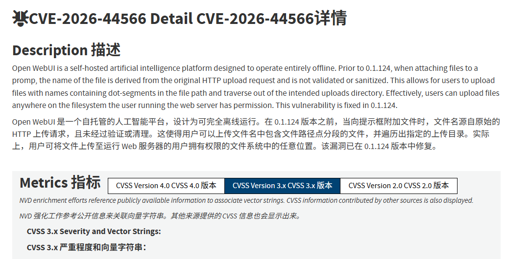
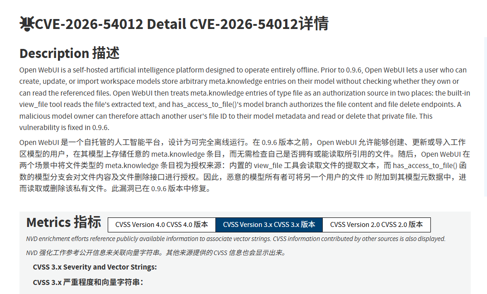
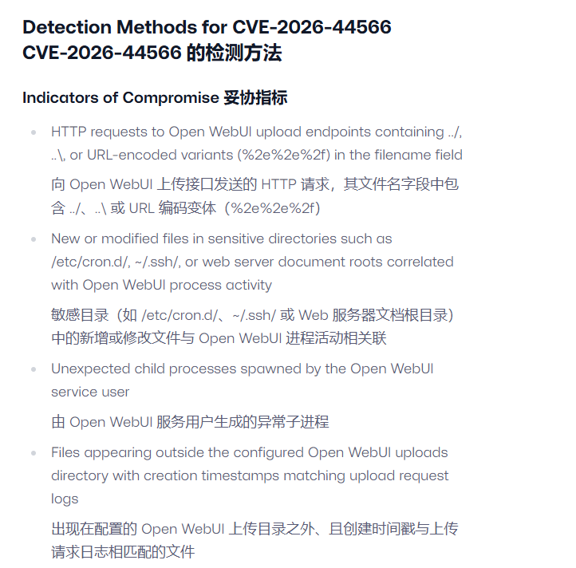
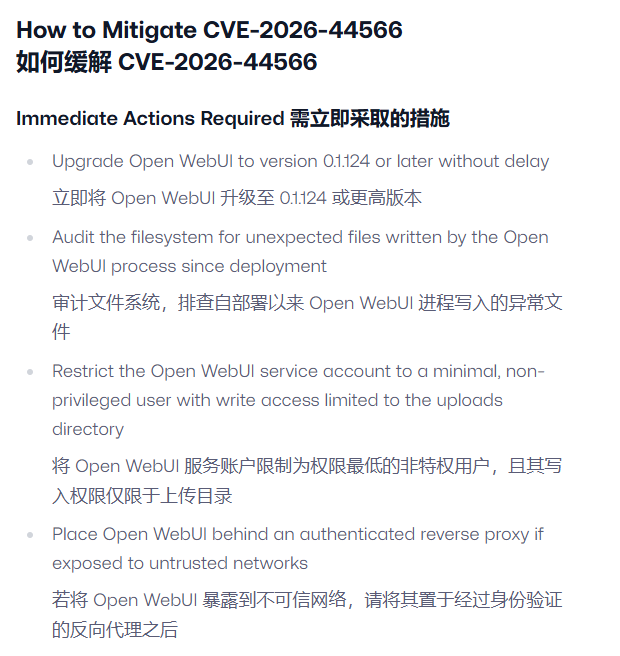

# OpenWebUI Dual Traversal & Cross-Tenant IDOR Composite Vulnerabilities
> OpenWebUI 双重路径遍历+越权访问复合漏洞，本地LLM知识库跨用户文件窃取、任意文件覆写风险

| Field | Value |
|---|---|
| Category | code-vulns / agent-risk |
| Severity | high |
| AI Tool | OpenWebUI (Ollama前端管理面板) |
| Language | Python |
| Real Incident | ✅ |
| Reproducible | ✅ |
| Disclosed | 2026-05-21 |

## TL;DR
Two linked high-risk flaws CVE-2026-44566 (path traversal arbitrary file write) and CVE-2026-54012 (IDOR cross-user file access) were disclosed in May 2026 for OpenWebUI, the mainstream self-hosted LLM management frontend. Authenticated attackers upload malicious files with traversal filenames to overwrite host system configs, and forge model metadata to read/delete private knowledge documents belonging to other tenants on the same platform. Multiple small AI startups suffered internal RAG knowledge base leakage incidents.
2026年5月21日开源本地大模型管理面板OpenWebUI曝出两组联动高危漏洞CVE-2026-44566、CVE-2026-54012。已登录攻击者上传带路径跳转字符的恶意文件可覆写服务器系统配置；同时伪造模型元数据，绕过权限校验读取、删除同平台其他用户私有知识库文件，多家小型AI创业公司发生内部RAG文档批量泄露事件。
> Malicious upload filenames enable arbitrary file overwriting; forged model metadata breaks multi-user isolation to steal cross-tenant private knowledge base files on self-hosted LLM service platforms.

---

## 详细分析 / Full Analysis
### 一、事件概况
OpenWebUI是对接Ollama最流行的开源Web管理面板，企业、个人开发者普遍用来搭建私有化RAG知识库、多用户本地大模型服务，支持多人分租户隔离使用私有文档库。2026年5月安全厂商SentinelOne同步披露两处联动漏洞，受影响版本为0.1.124以下、0.9.6以下全量程序。

第一处漏洞存在文件上传接口：后端直接复用客户端原始文件名，未执行basename路径归一化，`../../`跳转字符可跳出上传目录覆写系统脚本、SSH密钥、服务启动配置。第二处越权漏洞源于模型知识库元数据无校验，攻击者自定义model内meta.knowledge字段绑定其他用户私有文件ID，调用内置查看接口即可读取对方完整文档内容，甚至发起删除操作。

某AI外包服务商内部多租户OpenWebUI平台出现数据泄露：一名外包测试账号上传带遍历名称的恶意文件篡改服务启动脚本植入后门，同时伪造模型配置读取数十个客户的私有行业知识库，包含金融风控文档、客户业务方案，数据流出后引发客户解约与索赔。漏洞公开后出现批量扫描脚本，大量无加固多用户实例被探测。

### 二、风险细节及危害
#### （一）漏洞底层成因
1. 文件上传模块缺少路径清洗：直接采信前端传入完整文件名，未剥离父目录跳转路径，触发CWE-22路径遍历覆写；
2. 多租户权限校验逻辑缺失：模型元数据`meta.knowledge`字段未校验目标文件归属，仅校验当前用户模型编辑权限，形成垂直越权；
3. 产品默认多租户隔离逻辑轻量化，研发默认同平台用户相互隔离，忽略元数据伪造攻击路径；
4. 知识库文件存储企业高价值私有资料，一旦越权读取直接造成商业机密外泄。

#### （二）核心风险特征
1. 联动攻击放大危害：单账号可同时完成服务器文件篡改+跨租户知识库窃取，兼具系统控制与数据泄露双重风险；
2. 仅需普通登录权限，无需管理员账号，内部低权限人员、被盗访客账号均可利用；
3. 多租户环境专属攻击面，传统单用户LLM面板不存在该越权风险，容易被运维忽略；
4. 常规文件上传审计仅监控文件内容，不会校验文件名内路径跳转字符，日志难以定位越权读取行为。

#### （三）实际落地危害
1. 覆写系统配置植入后门：篡改服务启动脚本、SSH authorized_keys实现持久服务器控制；
2. 跨租户知识库批量窃取：同平台其他客户私有合同、技术文档、风控数据全部泄露；
3. 知识库恶意销毁：攻击者可直接删除其他用户完整RAG文件，造成业务数据永久丢失；
4. 企业商业泄密、客户流失，触发数据安全合规处罚。

### 四、与《AI生成代码在野安全风险研究报告（2025.12）》关联说明
#### 1. 印证报告3.2自动化偏见与AI运维工具原生缺陷
报告指出私有化LLM运维面板普遍存在“默认安全”思维误区，开发人员默认多租户、文件上传功能自带完整隔离校验，省略二次路径与权限校验。本次OpenWebUI两处漏洞均是产品简化安全逻辑、使用者不加防护部署导致，完美匹配报告“AI配套工具重易用、轻隔离”设计通病。

#### 2. 匹配报告5.2 AI基础设施漏洞分布规律
报告统计本地LLM、RAG管理平台高危漏洞集中在文件处理、多租户权限绕过两类场景，且多为可联动复合漏洞。本案例路径遍历+垂直越权组合漏洞完全契合该统计规律，属于报告重点标注知识库泄露类高风险缺陷。

#### 3. 对应报告6.3人机协同AI基础设施零信任治理要求
报告针对私有化多用户AI知识库提出三层管控：上传文件强制路径清洗、资源访问校验资源归属、多租户环境独立数据存储。受害企业均未落地三层防护，直接证明报告管控规范具备落地必要性。

#### 4. 印证报告4.1行业发展演化趋势
漏洞披露后大量企业升级OpenWebUI至修复版本、关闭对外开放注册、单独隔离各租户知识库存储目录，行业从快速搭建多用户LLM服务转向分层权限管控，和报告总结AI工具从盲目部署到安全共治路径完全一致。

### 五、修复防御建议
1. 版本升级：OpenWebUI同步升级至0.1.124（修复文件遍历）、0.9.6（修复越权访问）及以上稳定版；
2. 上传文件名强制处理：全局统一使用basename截断目录跳转字符，拦截包含`../`的上传名称；
3. 多租户强隔离：不同客户知识库分磁盘目录存储，新增文件归属校验接口，禁止跨ID读取；
4. 访问日志审计：开启知识库文件读写、模型元数据修改全量日志，定期检索跨用户文件访问行为；
5. 权限最小化：普通业务账号关闭文件上传、自定义模型编辑权限，仅管理员开放配置修改入口。

### 六、参考链接
1. SentinelOne官方漏洞分析：https://www.sentinelone.com/vulnerability-database/cve-2026-44566
2. GitHub安全公告GHSA-j3fw-wc48-29g3：https://github.com/advisories/ghsa-j3fw-wc48-29g3
3. NVD CVE-2026-44566收录页：https://nvd.nist.gov/vuln/detail/CVE-2026-44566
4. NVD CVE-2026-54012收录页：https://nvd.nist.gov/vuln/detail/CVE-2026-54012
