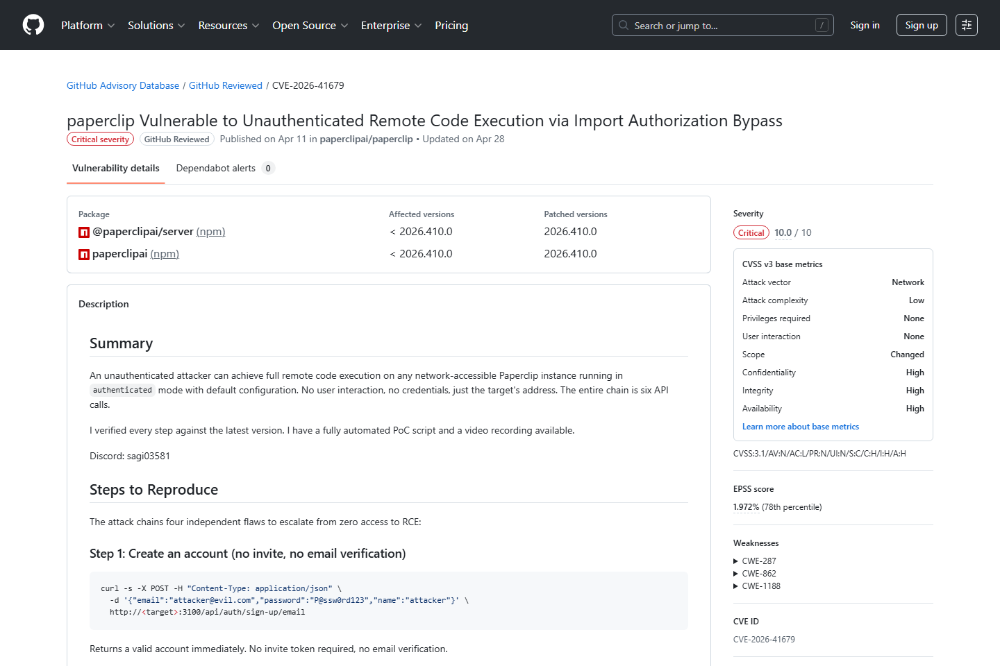
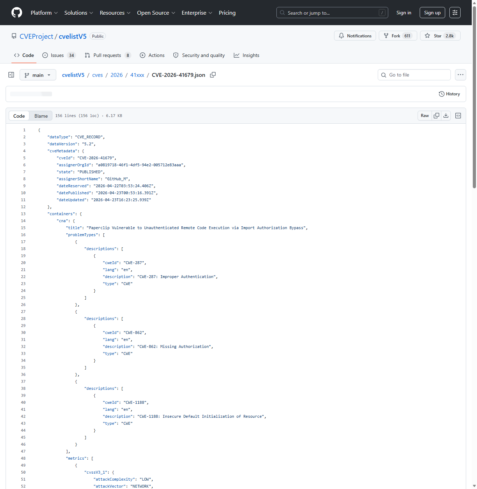
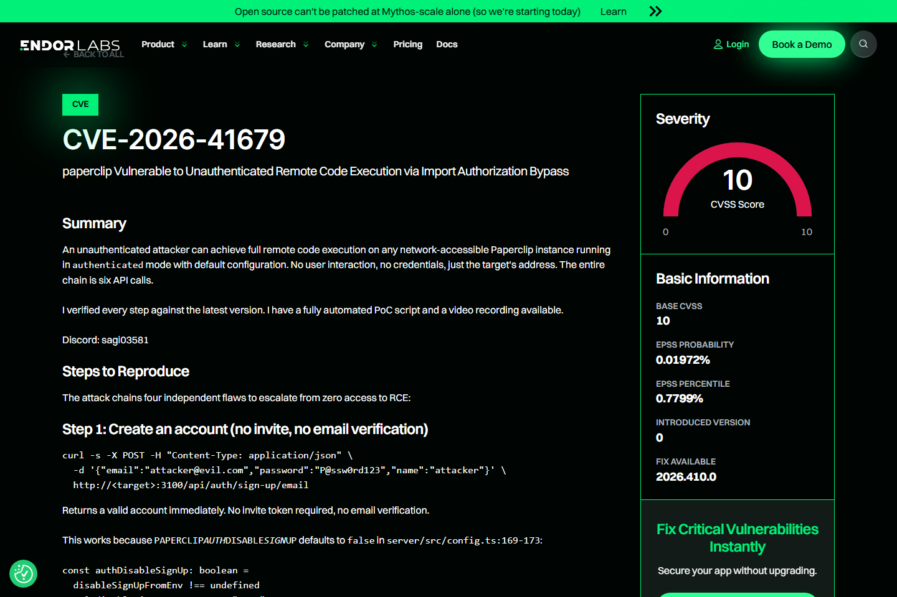
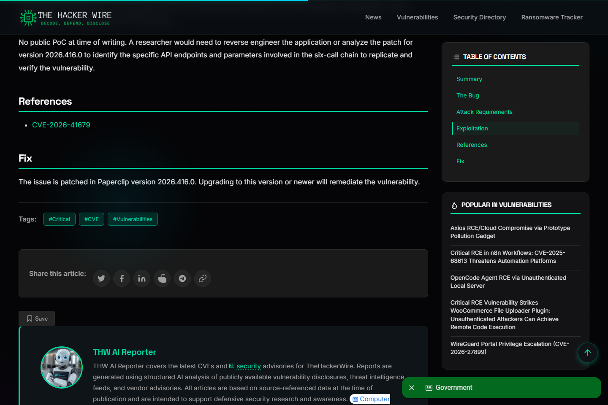
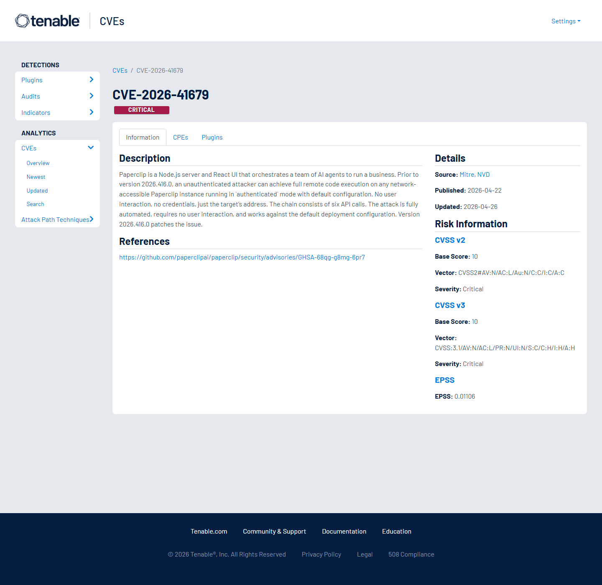
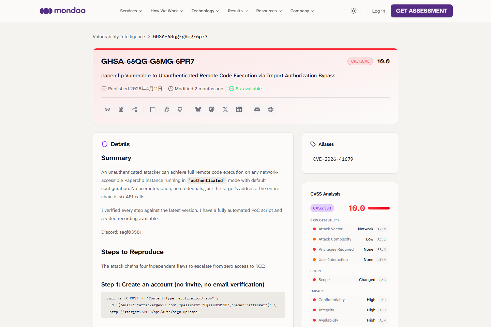

# Paperclip AI Agent Import Authorization Bypass RCE (2026)
> Paperclip AI Agent 导入授权绕过到远程代码执行

| Field | Value |
|---|---|
| Category | agent-risk |
| Severity | Critical |
| AI Tool | Paperclip, @paperclipai/server, AI agent orchestration server |
| Language | Node.js, React |
| Real Incident | Yes |
| Reproducible | Yes |
| Disclosed | 2026-04-23 |
| CVE | CVE-2026-41679 |
| CVSS | 10 |

## TL;DR
Paperclip default deployments could be taken over through a six-call unauthenticated import chain.
> Paperclip AI Agent 导入授权绕过到远程代码执行：可在 Paperclip 服务器主机上执行任意命令，影响 Agent 编排平台和业务自动化环境。

---

## 基本信息

| 项目 | 内容 |
|---|---|
| 案例时间 | 2026-04-23 |
| 事件对象 | Paperclip @paperclipai/server 2026.416.0 之前版本 |
| 事件类型 | 导入授权绕过导致未认证远程代码执行 |
| 攻击入口 | 攻击者访问网络可达的 Paperclip 实例，利用默认 authenticated mode 下的导入授权缺陷。 |
| 主要影响 | 可在 Paperclip 服务器主机上执行任意命令，影响 Agent 编排平台和业务自动化环境。 |
| 修复方向 | 升级到 2026.416.0 或后续修复版本，并限制导入接口、Agent 凭据和外部访问。 |

## 摘要

Paperclip CVE-2026-41679 是一个 CVSS 10.0 的 Agent 编排平台漏洞。公开 Advisory 描述，攻击者无需凭据或用户交互，只要目标 Paperclip 实例网络可达且处于默认 authenticated mode，就可以通过六个 API 调用完成未认证远程代码执行。
这个评分反映出攻击门槛和影响范围同时很极端。Paperclip 的定位是编排 AI agent 与业务流程，导入功能本应帮助迁移或复用配置，但一旦导入对象可以改变执行链，授权缺陷就不再只是管理接口问题，而会直接触达服务器命令执行面。

## 一、公开材料概况

GitHub Advisory、CVEProject cvelistV5、Endor Labs、TheHackerWire、Tenable 和 Mondoo 覆盖了漏洞事实、影响版本、CVSS、默认配置和六步 API 链。公开材料还提到 PoC 和视频记录，这些内容说明利用路径已经比较明确；本案重点呈现漏洞链和影响等级层面的事实。
这些来源共同说明，风险来自默认部署、导入授权和执行能力之间的组合。TheHackerWire 对六个 API 调用的复核让该漏洞更接近可操作攻击链，而不仅是抽象的权限绕过。对防守方来说，任何网络可达的 Paperclip 实例都应被视作需要立即确认版本和配置的高优先级资产。

| 来源 | 类型 | 证明内容 |
|---|---|---|
| GitHub Advisory: Paperclip Import Authorization Bypass RCE | 主证据 | 确认 CVSS 10.0、影响版本和漏洞链。 |
| CVEProject cvelistV5: CVE-2026-41679 | 主证据 | 确认 CVE 描述。 |
| Endor Labs: CVE-2026-41679 | 复核证据 | 复核六 API 调用链和影响。 |
| TheHackerWire: Paperclip RCE via six API calls | 复核证据 | 复核默认配置和利用条件。 |
| Tenable: CVE-2026-41679 | 复核证据 | 提供漏洞影响摘要。 |
| Mondoo Vulnerability Intelligence: GHSA-68qg-g8mg-6pr7 | 生态证据 | 复核 CVSS 10.0 和修复状态。 |

## 二、系统背景与触发条件

Paperclip 是用于编排 AI agents 运行商业流程的 Node.js/React 平台。Agent 平台的导入功能通常用于迁移任务、模板或配置；导入对象一旦能改变 Agent 运行逻辑，就会触达服务器执行环境和业务自动化链。
在企业场景中，Agent 编排平台往往连接工单、邮件、CRM、代码仓库或内部脚本。导入对象不只是页面配置，而可能包含工具定义、流程节点、触发器和执行参数。攻击者如果能未授权写入这些对象，就等同于把自己的流程塞进平台执行路径。

## 三、攻击链路与处置过程

攻击链从导入接口进入。外部请求利用授权校验缺陷，通过一组 API 调用创建或导入可控对象，再把控制权推进到服务器命令执行。Advisory 中强调该链不需要用户交互或已有凭据，这也是 CVSS 10.0 的关键原因。
应急处置要覆盖应用层和主机层。除升级 Paperclip 外，还应检查近期导入记录、异常项目、陌生流程节点、可疑命令执行、外联连接和新增文件。因为该链可直接达到 RCE，单纯删除可疑导入对象并不足够，还需要确认服务器没有被持久化。

## 四、技术根因分析

根因是导入流程把结构化配置、Agent 身份和服务器执行能力连接得过于直接。授权校验没有覆盖导入对象最终产生的执行后果，默认部署又让攻击路径更容易成立。对 Agent 平台而言，导入不是普通数据写入，而是潜在执行图变更。
安全设计上，导入流程应被视为高危管理动作。它需要独立认证、权限分级、对象签名、字段白名单和导入前预览。更重要的是，导入后的对象不能立即获得服务器级执行能力，而应经过策略检查、沙箱运行和最小权限绑定。

## 五、AI 参与方式与风险归因

AI 参与方式体现在 Paperclip 的核心功能就是编排 AI Agent 团队。攻击者利用的是 Agent 平台对导入配置和执行能力的信任关系。归因应覆盖导入授权、Agent 身份边界和服务器命令执行适配器。
这类漏洞说明，Agent 平台的“配置”在安全上更接近代码。它定义谁可以调用工具、何时触发任务、用哪些凭据访问外部系统。只要配置能驱动 Agent 行动，它就应进入代码审查、供应链签名和运行时策略控制。

## 六、与团队技术报告风险框架的关系

团队风险框架中关于 Agent 工作流供应链的判断，在 Paperclip 中表现为配置导入链可直接影响执行链。AI Agent 平台需要把模板、导入包、插件和适配器纳入供应链安全，而不能只审查模型输出。

## 七、影响范围与治理建议

CVSS 10.0 表明攻击复杂度、权限和交互要求都极低，且影响完整覆盖机密性、完整性和可用性。若 Paperclip 连接企业应用或自动化凭据，服务器 RCE 会进一步威胁业务系统和 Agent 管理的敏感数据。

治理上应关闭公网导入入口，要求管理员二次确认和签名导入包。Agent 适配器应以最小权限运行，导入对象需要做 schema、来源、签名和危险字段检查。对已暴露实例，应升级、轮换 Agent API key，并检查异常导入和进程执行日志。
企业还应将 Agent 编排平台纳入变更管理。新模板、新导入包和第三方示例项目不应直接进入生产空间；即便来自可信团队，也要经过权限和危险能力审查。监控上应关注短时间内大量 API 调用、导入后立即执行、以及 Agent 进程启动 shell 或网络工具的行为。

## 八、结论

Paperclip 案例说明，Agent 平台的配置导入链可以等同于代码供应链。只要导入对象能影响执行器，授权缺陷就可能直接升级为服务器接管。
它的治理重点不是简单禁用导入，而是让导入具备与代码发布相同的安全流程。签名、审查、沙箱、回滚和审计都应成为 Agent 平台导入功能的默认组成部分。

## 参考来源

1. [GitHub Advisory: Paperclip Import Authorization Bypass RCE](https://github.com/advisories/GHSA-68qg-g8mg-6pr7)
2. [CVEProject cvelistV5: CVE-2026-41679](https://github.com/CVEProject/cvelistV5/blob/main/cves/2026/41xxx/CVE-2026-41679.json)
3. [Endor Labs: CVE-2026-41679](https://www.endorlabs.com/vulnerability/cve-2026-41679)
4. [TheHackerWire: Paperclip RCE via six API calls](https://www.thehackerwire.com/paperclip-rce-unauthenticated-remote-code-execution-via-six-api-calls/)
5. [Tenable: CVE-2026-41679](https://www.tenable.com/cve/CVE-2026-41679)
6. [Mondoo Vulnerability Intelligence: GHSA-68qg-g8mg-6pr7](https://mondoo.com/vulnerability-intelligence/vulnerability/GHSA-68qg-g8mg-6pr7)
