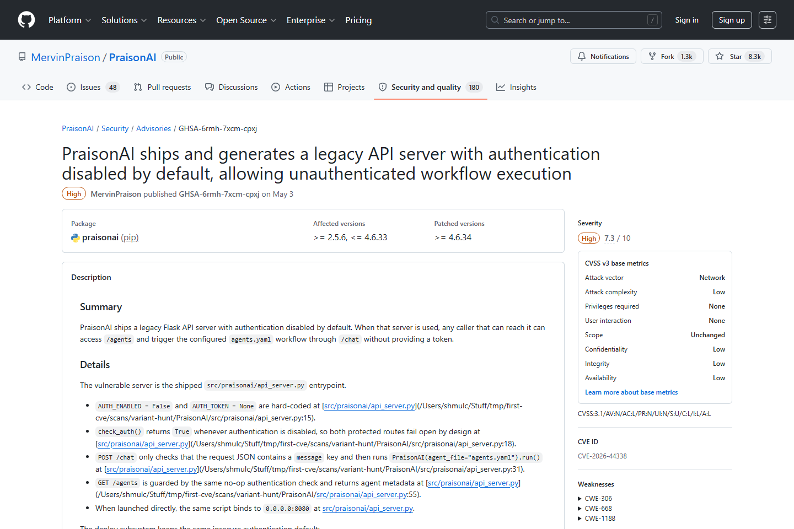
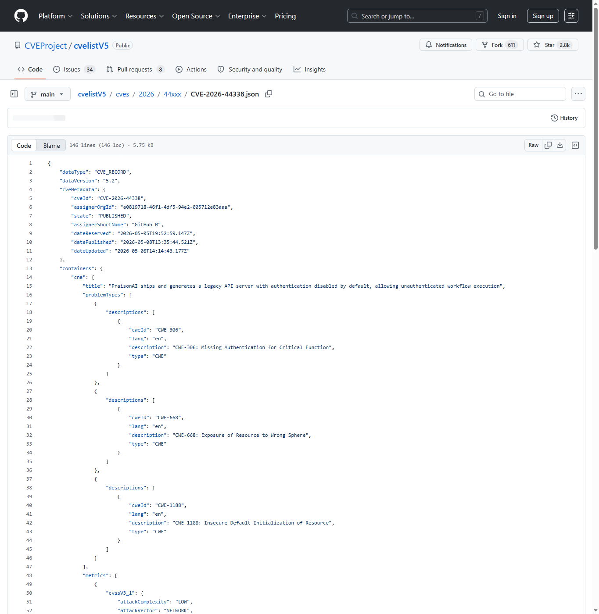
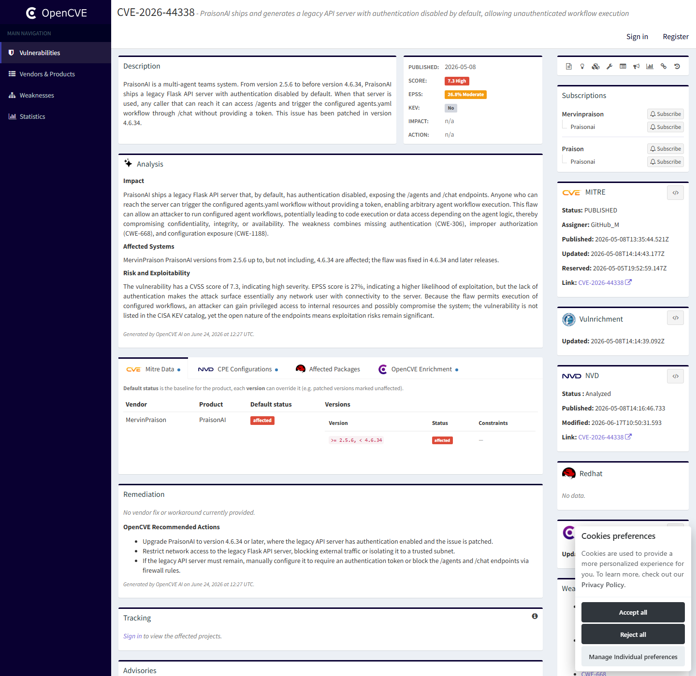
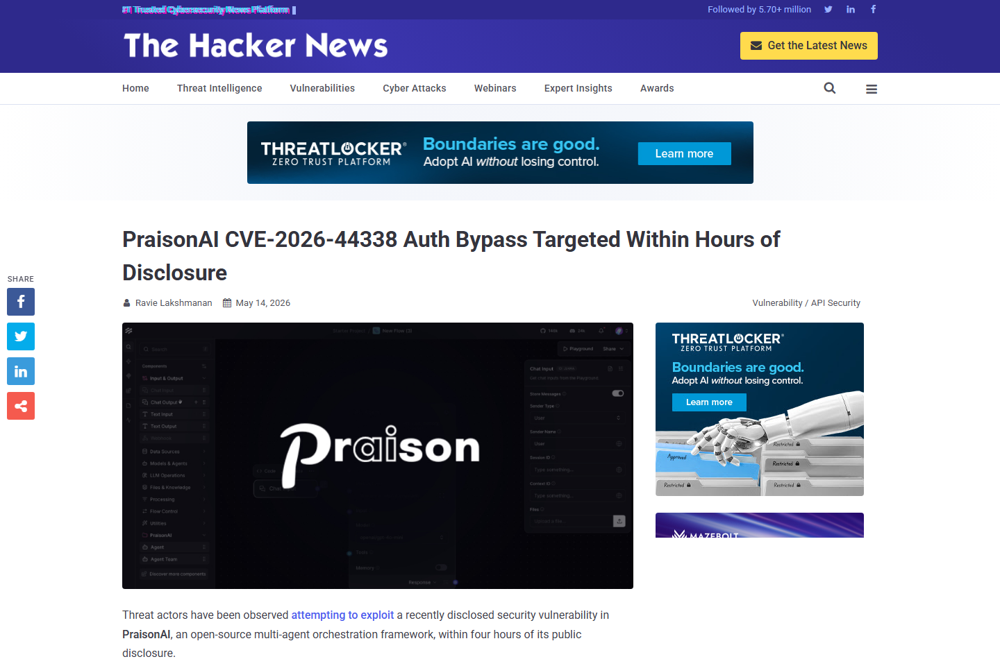
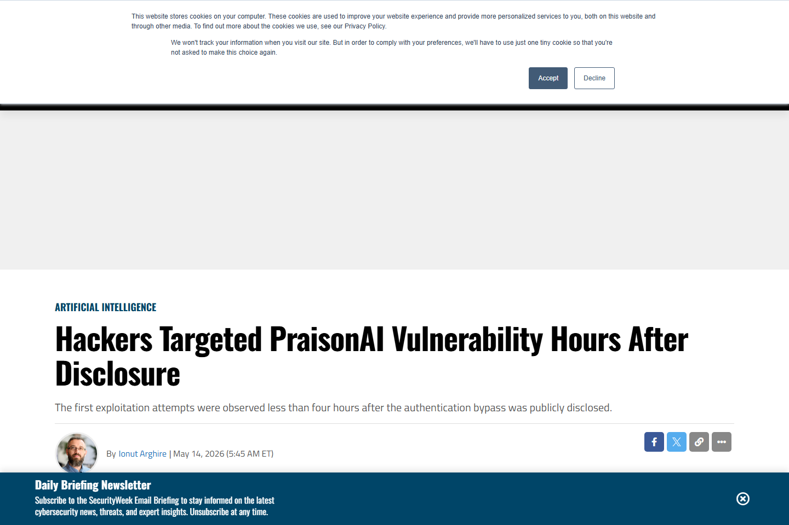
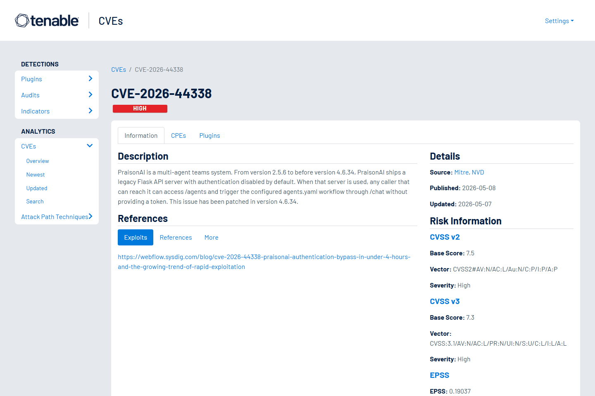

# PraisonAI Legacy API Auth Bypass Rapid Exploitation (2026)
> PraisonAI 旧版 API 默认无认证与快速探测

| Field | Value |
|---|---|
| Category | agent-risk |
| Severity | High |
| AI Tool | PraisonAI, Legacy Flask API server, agents.yaml workflows |
| Language | Python |
| Real Incident | Yes |
| Reproducible | Yes |
| Disclosed | 2026-05-11 |
| CVE | CVE-2026-44338 |
| CVSS | 9.8 |

## TL;DR
PraisonAI legacy API shipped without default auth and was probed within hours of disclosure.
> PraisonAI 旧版 API 默认无认证与快速探测：可未授权触发 Agent 工作流，进而访问工具、凭据或业务系统，Sysdig 观测到披露后不到四小时的定向探测。

---

## 基本信息

| 项目 | 内容 |
|---|---|
| 案例时间 | 2026-05-11 |
| 事件对象 | PraisonAI 2.5.6 至 4.6.34 之前的旧版 Flask API 使用方式 |
| 事件类型 | 默认无认证导致 Agent API 暴露和工作流触发 |
| 攻击入口 | 攻击者访问暴露在网络上的旧 API，读取 /agents 并通过 /chat 触发 agents.yaml 工作流。 |
| 主要影响 | 可未授权触发 Agent 工作流，进而访问工具、凭据或业务系统，Sysdig 观测到披露后不到四小时的定向探测。 |
| 修复方向 | 升级到 4.6.34 或更高版本，关闭旧 API 暴露面，并对公网 Agent 服务强制认证和网络隔离。 |

## 摘要

PraisonAI CVE-2026-44338 的重要性在于时间尺度。GitHub Advisory 和 CVEProject cvelistV5 描述了旧版 Flask API 默认认证关闭的问题，The Hacker News 与 SecurityWeek 后续报道披露后 3 小时 44 分钟即出现针对脆弱端点的探测请求。这使它不再只是配置失误，而是 AI Agent 框架暴露面被快速武器化的案例。
在 Agent 框架里，API 暴露的后果通常比普通管理后台更重。调用者不只是读取页面或修改配置，而是可能触发一组已经绑定工具、密钥和业务动作的自动化流程。PraisonAI 的旧接口问题说明，默认值和遗留兼容路径会在真实部署中变成攻击入口。

## 一、公开材料概况

GitHub Security Advisory、CVEProject cvelistV5、The Hacker News、SecurityWeek、Tenable 和 OpenCVE 共同覆盖了漏洞事实、影响版本、修复版本和快速探测时间线。公开报道确认了针对 /agents 的探测活动，相关材料更能支持“快速探测与可触发风险”，而不是每一次探测都已成功执行 /chat 工作流。
这些材料把漏洞披露和攻击者关注放在同一时间线上。披露后不到四小时出现精确端点探测，意味着攻击者能够迅速把安全公告转化为扫描规则。对 AI Agent 框架而言，这个窗口足以覆盖大量测试环境、个人服务器和未纳入资产管理的实验部署。

| 来源 | 类型 | 证明内容 |
|---|---|---|
| GitHub Security Advisory: PraisonAI authentication bypass | 主证据 | 确认漏洞、影响版本和修复版本。 |
| CVEProject cvelistV5: CVE-2026-44338 | 主证据 | 确认旧 API 默认无认证和 CVE 描述。 |
| OpenCVE: CVE-2026-44338 | 复核证据 | 复核 PraisonAI 认证绕过影响、受影响版本和缓解建议。 |
| The Hacker News: PraisonAI auth bypass targeted | 复核证据 | 复核端点、时间线和探测行为。 |
| SecurityWeek: Hackers Targeted PraisonAI Vulnerability Hours After Disclosure | 复核证据 | 独立报道快速利用窗口。 |
| Tenable: CVE-2026-44338 | 生态证据 | 复核 CVE 描述、评分、参考链接和风险摘要。 |

## 二、系统背景与触发条件

PraisonAI 用于组织多 Agent 团队和自动化工作流。Agent 框架通常会把 API key、工具配置、数据库连接和业务动作写入工作流配置中。一旦管理或执行 API 被公网访问，攻击者面对的就不是普通 Web 页面，而是一个可以调度自动化任务的执行入口。
触发条件也并不苛刻：旧版服务、默认无认证、网络可达和可枚举端点叠加即可形成风险。很多团队会把 Agent 框架作为原型工具部署在云主机、Notebook 或临时容器里，运维基线往往弱于生产系统。这样的环境一旦被扫描到，攻击者就可能先读取 Agent 列表，再判断是否存在可滥用工具。

## 三、攻击链路与处置过程

攻击链从旧版 Flask API 开始。未授权访问者可以调用 /agents 了解配置的 Agent，再通过 /chat 触发 agents.yaml 中的工作流。若工作流已经配置外部工具或内部凭据，攻击者就可能借助合法 Agent 能力完成数据访问、任务执行或横向探测。The Hacker News 与 SecurityWeek 转述的日志时间线显示，披露当天就出现了精确端点检查。
处置上不能只关闭一个 URL。需要确认是否仍有旧版服务进程、反向代理转发、容器镜像和自动重启配置保留了旧 API。若曾暴露在公网，还应检查 /agents、/chat 访问日志、异常提示内容、工具调用记录和下游系统操作痕迹，并轮换工作流中可能被 Agent 使用过的凭据。

## 四、技术根因分析

根因是默认认证策略与 Agent 执行面没有对齐。传统后台 API 暴露已属高风险，Agent API 的风险更高，因为调用者触发的是一组可继续调用工具的自动化实体。旧 API 兼容性与默认无认证叠加，使部署者很容易在不知道风险的情况下把 Agent 控制面放到网络上。
默认安全策略应该跟随能力等级变化。只读状态接口和能触发工具链的执行接口不能使用同一套宽松默认值。Agent 框架一旦支持远程触发，就应在启动阶段强制认证、生成随机管理密钥或绑定本地地址，而不是把认证配置留给部署者事后补齐。

## 五、AI 参与方式与风险归因

AI 参与方式体现在被触发对象是 Agent 工作流，而不是静态接口。攻击者利用的是 Agent 平台把业务动作封装成可远程调用流程的特性。归因应放在认证默认值、旧接口生命周期管理和部署网络边界上。
这个归因也解释了为什么扫描 /agents 具有价值。Agent 列表本身可能暴露角色、工具、任务名称和业务意图，足以帮助攻击者选择后续目标。即使没有立即执行 /chat，枚举信息也可能泄露系统结构和内部自动化边界。

## 六、与团队技术报告风险框架的关系

团队框架强调 AI 工作流平台会改变软件供应链中的执行边界。PraisonAI 说明，Agent 平台的 API 安全需要按生产执行系统管理，不能按普通开发辅助工具处理。任何能触发 Agent 的接口，都应进入身份、授权、审计和速率限制体系。

## 七、影响范围与治理建议

该漏洞的公开影响由两部分构成：一是 CVSS 9.8 级别的未授权访问能力，二是披露后数小时内出现的互联网探测。即使公开报告未确认大规模数据泄露，快速探测本身也说明攻击窗口极短，组织需要把 AI Agent 框架纳入漏洞响应和暴露面管理。

治理上应盘点所有 Agent 框架的公网入口，关闭旧版 API，要求默认认证开启，并限制 /agents、/chat 等执行端点的来源网络。工作流中的密钥应采用短期凭据和最小权限，Agent 执行日志需能还原外部请求、工具调用和结果。
同时，团队需要把实验性 Agent 服务纳入统一资产清单。很多此类实例不在传统 CMDB 中，却连接真实 SaaS 密钥或数据库令牌。漏洞响应流程应覆盖云安全组、隧道服务、临时域名、开发者个人主机和演示环境，避免“非生产”成为最容易被利用的生产入口。

## 八、结论

PraisonAI 案例把 Agent 框架从开发便利工具推到了互联网暴露面管理问题。默认无认证的旧接口一旦连接到工作流执行能力，漏洞披露后的响应时间就要按小时计算。
它的教训很直接：Agent API 默认就应该按执行系统保护，不能等到接入真实工具后再补认证。对框架维护者来说，安全默认值和旧接口退役策略与功能能力同等重要；对使用者来说，任何可触发 Agent 的公网端点都应进入高优先级巡检。

## 参考来源

1. [GitHub Security Advisory: PraisonAI authentication bypass](https://github.com/MervinPraison/PraisonAI/security/advisories/GHSA-6rmh-7xcm-cpxj)
2. [CVEProject cvelistV5: CVE-2026-44338](https://github.com/CVEProject/cvelistV5/blob/main/cves/2026/44xxx/CVE-2026-44338.json)
3. [OpenCVE: CVE-2026-44338](https://app.opencve.io/cve/CVE-2026-44338)
4. [The Hacker News: PraisonAI auth bypass targeted](https://thehackernews.com/2026/05/praisonai-cve-2026-44338-auth-bypass.html)
5. [SecurityWeek: Hackers Targeted PraisonAI Vulnerability Hours After Disclosure](https://www.securityweek.com/hackers-targeted-praisonai-vulnerability-hours-after-disclosure/)
6. [Tenable: CVE-2026-44338](https://www.tenable.com/cve/CVE-2026-44338)
