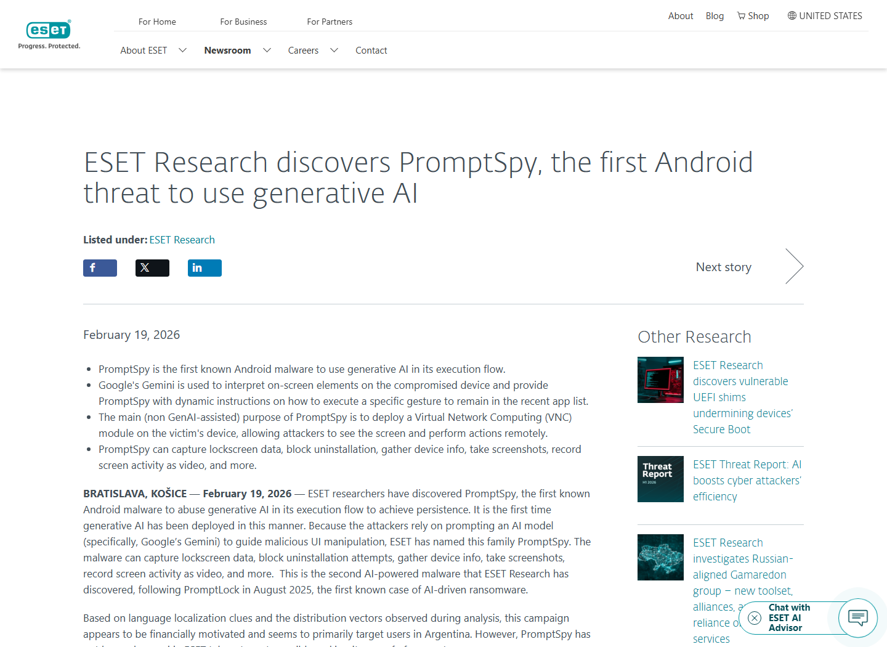
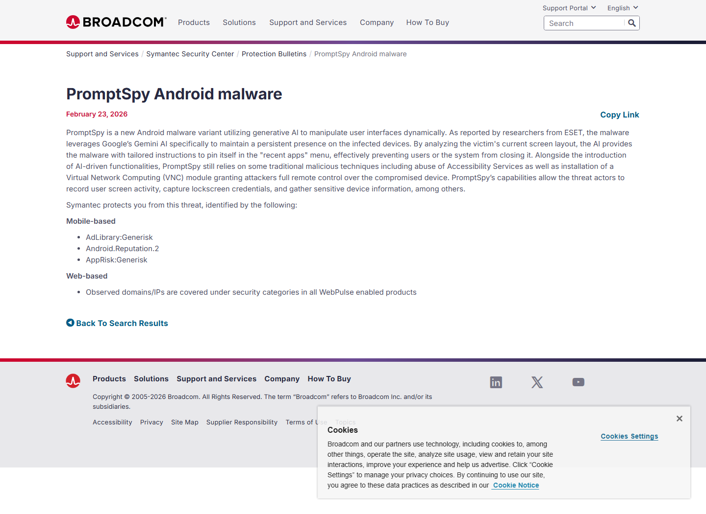
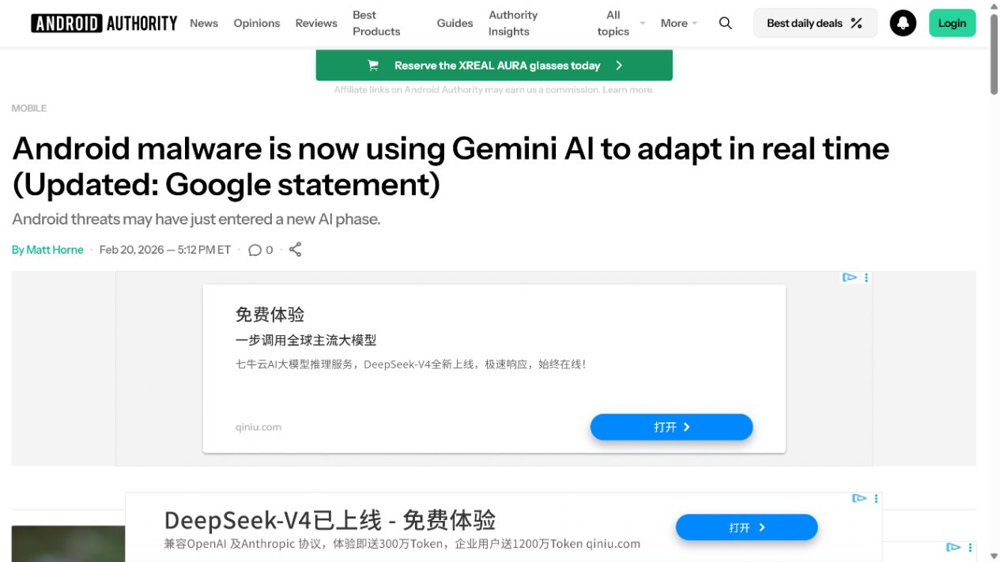

# PromptSpy Uses Gemini at Runtime for Android Malware Persistence (2026)
> PromptSpy 在运行时利用 Gemini 实现 Android 恶意软件驻留

| Field | Value |
|---|---|
| Category | Human Factor |
| Severity | High |
| AI Tool | Google Gemini, PromptSpy, Android Accessibility Service |
| Language | Android / Kotlin or Java / XML / JSON |
| Real Incident | Yes |
| Reproducible | No |
| Disclosed | 2026-02-19 |

## TL;DR
PromptSpy sent Android screen XML to Gemini and executed the model's contextual gestures to keep its malicious app pinned, while a VNC payload enabled remote control and data capture.
> PromptSpy 在运行时把 Android 屏幕 XML 发送给 Gemini，并执行模型返回的点击、滑动步骤以保持驻留；其 VNC 模块还可远程控制设备并采集锁屏和屏幕数据。

---

## 详细分析 / Full Analysis

## 一、基本信息与事件概况

2026 年 2 月，ESET 分析了一个此前未知的 Android 恶意软件家族 PromptSpy。它把当前屏幕的 UI XML、元素文本、控件类型和坐标连同固定提示发送给 Google Gemini，模型返回 JSON 格式的点击、长按或滑动指令。恶意软件通过 Accessibility Service 执行这些动作，直到把自身锁定在最近任务列表中，降低被用户划走或系统结束的概率。

Gemini 被直接接入 PromptSpy 的运行流程。屏幕状态变化后，恶意程序会重新收集 XML、请求下一步动作并继续执行。远程查看和操作设备、采集锁屏信息、截图、录屏及阻止卸载等能力仍由 VNC 模块提供。ESET 将其称为首个已知在 Android 恶意执行流中使用生成式 AI 的样本家族。

## 二、事件经过与公开材料

ESET 发现的早期 VNCSpy 样本于 1 月 13 日从香港上传至 VirusTotal；2 月 10 日，四个更先进的 PromptSpy 样本从阿根廷上传。2 月 19 日，ESET 发布技术分析与新闻公告，并把样本信息共享给 Google。BleepingComputer、Android Authority、TechRadar 和 Broadcom 随后复核了 Gemini 交互、VNC 能力和防护建议。

公开材料同时保留重要限制：ESET 没有在自身遥测中观察到感染，样本可能属于概念验证；但 VirusTotal 样本、专用分发域名、仿冒银行页面和签名关联也不能排除有限传播。案例据此记录已确认的恶意软件实现，不写成已经造成大规模受害的活动。

### 证据矩阵

| 来源 | 类型 | 证明内容 |
|---|---|---|
| WeLiveSecurity: PromptSpy Ushers in the Era of Android Threats Using GenAI | 原始技术分析 | 样本、Gemini 提示循环、UI XML、VNC 能力和传播线索 |
| ESET Newsroom: PromptSpy First Android Threat Using GenAI | 研究机构公告 | 发现时间、核心能力、遥测限制和 Google 协作 |
| TechNadu: PromptSpy Leverages Generative AI | 独立报道 | 运行时 Gemini 调用、XML 输入、VNC 控制和仿冒分发线索 |
| Broadcom Protection Bulletin: PromptSpy Android Malware | 安全厂商通告 | 恶意软件识别、生成式 AI 用途和防护状态 |
| Android Authority: Android Malware Uses Gemini AI | 独立报道 | Google 回应、设备适配和用户风险背景 |
| TechRadar: PromptSpy Uses Gemini to Ensure Infection | 独立报道 | 固定提示、动态手势、VNC 与反卸载能力 |

## 三、系统背景与触发条件

Android 恶意软件常依赖固定坐标、资源 ID 或控件文本完成自动化，但不同厂商系统、语言和布局会让硬编码步骤失效。PromptSpy 让 Gemini解释每次屏幕 XML，并根据当前状态规划下一步手势，从而把原本需要针对设备适配的逻辑交给生成式模型。

要执行模型建议，恶意软件仍需诱导用户安装 APK 并授予 Accessibility Service 权限。该权限允许读取界面内容和模拟交互。Gemini 提高的是适应性与循环决策能力，不会绕过 Android 的全部基础权限；安装诱导、权限滥用、VNC 控制和 AI 指令共同组成完整链路。

## 四、攻击链路或失效过程

分发端使用 MorganArg 名称和仿冒银行页面诱导安装 dropper。用户手动安装 payload 并授予辅助功能权限后，PromptSpy 打开最近任务界面，序列化可见控件为 XML，并把用户目标、设备信息和当前 UI 一起发送给 Gemini。模型返回结构化动作，恶意软件执行并把新状态继续反馈，直至确认应用已被锁定。

驻留完成后，内置 VNC 服务连接硬编码命令控制地址。操作员可以观察屏幕、执行手势、获取已安装应用列表、截取锁屏 PIN 或图案、录制屏幕并按需截图。透明覆盖层还会挡住停止、清除和卸载按钮，受害者可能需要进入安全模式才能移除应用。

## 五、技术根因与 AI 风险分析

PromptSpy 的运行依赖三个条件：用户安装站外 APK，应用获得高权限的辅助功能控制，云端模型再把动态界面解释成可执行手势。由于操作序列和坐标会随设备状态变化，依赖固定行为序列的检测更难获得稳定特征。

风险控制需要同时覆盖模型 API 滥用与终端权限。模型服务可以检测持续提交移动 UI XML、请求生成点击坐标和循环状态确认的异常模式；Android 端应限制未知来源安装，审查辅助功能权限，并对应用锁定最近任务、覆盖系统设置页和异常屏幕采集进行检测。

生成式模型把设备差异从恶意代码中外置到了云端决策过程：攻击者不必为每个厂商界面维护选择器，只需持续提供当前状态并执行模型动作。由此产生的行为路径会随设备和模型回复变化，静态 IOC 的寿命更短。防守方需要识别“屏幕状态上传、模型返回结构化手势、辅助功能执行、结果再次反馈”的闭环，而不是只寻找某一组固定点击坐标。

## 六、影响范围与处置建议

已分析样本具备完整远程控制和敏感屏幕采集能力，若在真实设备运行，可能导致账号凭据、锁屏数据和应用内容泄露。Google Play Protect 已对已知版本提供自动防护，且样本未在 Google Play 分发。组织仍应把站外 APK、异常辅助功能服务和与生成式模型 API 的后台通信纳入移动威胁检测。

事件响应应撤销恶意应用的辅助功能权限、在安全模式卸载、轮换设备上使用过的账号凭据，并检查屏幕录制与 VNC 通信痕迹。模型供应商和移动平台之间也需要共享滥用指标，因为单看云端提示或单看终端 APK都难以还原完整行为。

## 七、结论

PromptSpy 清楚展示了生成式 AI 如何进入恶意软件运行时：模型持续解释设备状态并给出下一步动作，使恶意代码适应不同界面。它的公开传播规模尚不明确，但样本、网络通信和执行逻辑均有技术证据，适合作为 AI 驱动恶意软件的真实案例。

## 八、参考来源

- [WeLiveSecurity: PromptSpy Ushers in the Era of Android Threats Using GenAI](https://www.welivesecurity.com/en/eset-research/promptspy-ushers-in-era-android-threats-using-genai/)
- [ESET Newsroom: PromptSpy First Android Threat Using GenAI](https://www.eset.com/us/about/newsroom/research/eset-research-discovers-promptspy-first-android-threat-using-genai/)
- [TechNadu: PromptSpy Leverages Generative AI](https://www.technadu.com/promptspy-first-documented-android-malware-to-leverage-generative-ai-likely-impersonated-a-jpmorgan-chase-bank/620591/)
- [Broadcom Protection Bulletin: PromptSpy Android Malware](https://www.broadcom.com/support/security-center/protection-bulletin/promptspy-android-malware)
- [Android Authority: Android Malware Uses Gemini AI](https://www.androidauthority.com/android-malware-promptspy-uses-generative-ai-gemini-3642832/)
- [TechRadar: PromptSpy Uses Gemini to Ensure Infection](https://www.techradar.com/pro/the-ai-model-and-prompt-are-predefined-in-the-code-and-cannot-be-changed-experts-say-promptspy-is-the-first-known-android-malware-to-use-gemini-to-ensure-infection)
