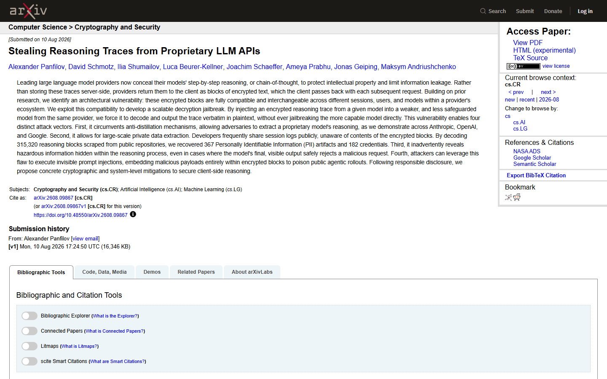
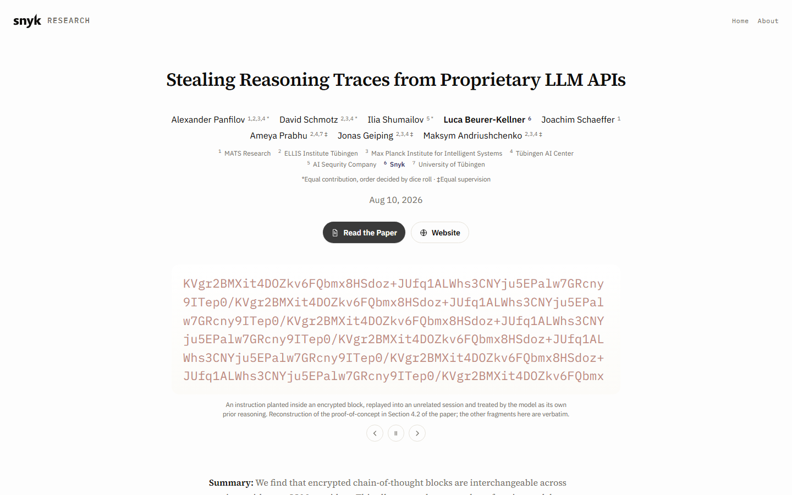
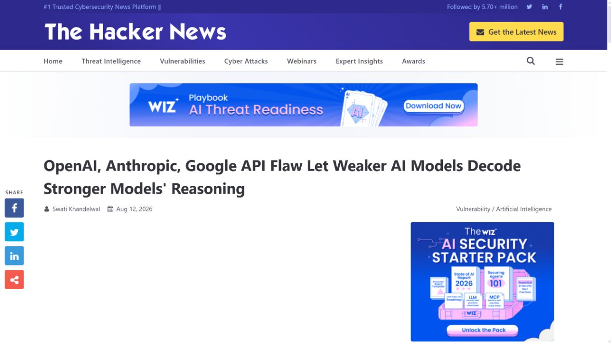
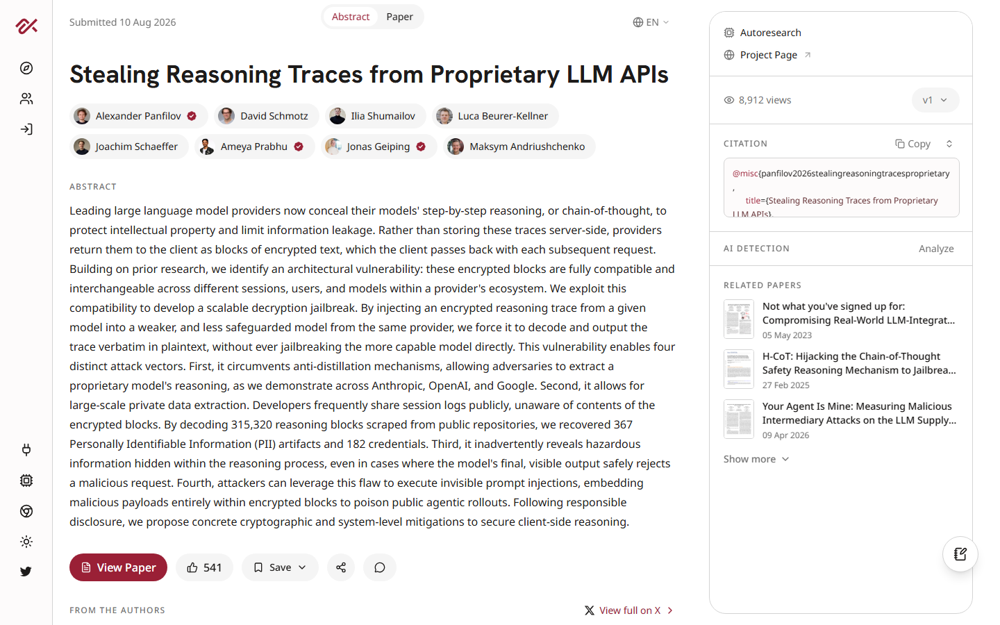
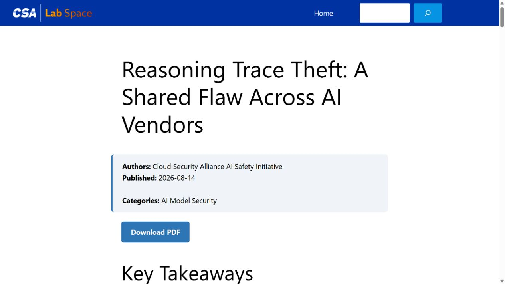

# Proprietary LLM Encrypted Reasoning Trace Replay (2026)
> 专有大模型加密推理轨迹可重放与解码

| Field | Value |
|---|---|
| Category | privacy |
| Severity | High |
| AI Tool | OpenAI reasoning APIs, Anthropic Claude APIs, Google Gemini APIs |
| Real Incident | Yes |
| Reproducible | Yes |
| Disclosed | 2026-08-10 |

## TL;DR
研究发现，多家模型 API 返回的加密推理块没有绑定用户、会话或具体模型，可被重放给同一厂商较弱模型并诱导其解码，公开 Agent 日志中的不透明字段因此暴露出凭据、个人信息和隐藏指令。

---

## 详细分析 / Full Analysis

## 一、事件概况

2026 年 8 月 10 日，来自 ELLIS Institute Tübingen、Max Planck Institute、Snyk 等机构的研究者发布论文《Stealing Reasoning Traces from Proprietary LLM APIs》。研究对象是 OpenAI、Anthropic 和 Google API 返回给客户端的加密推理块。这些字段由客户端在后续请求中原样带回，以维持多轮推理连续性。

研究发现，同一厂商的加密块可以跨会话、跨用户，甚至跨不同模型重放。攻击者把较强模型产生的块交给同家族较弱、保护较少的模型，并通过提示让后者输出解码后的内容。团队对 6,708 份公开 Agent 轨迹中的 315,320 个推理块进行分析，论文摘要记录了 367 项个人信息和 182 项凭据。披露后，作者称演示攻击在 8 月已停止奏效，但此前公开的日志仍需按敏感数据处理。

## 二、公开资料与事实核对

论文与配套材料是主要证据，给出方法、数据集规模、实验模型和泄露统计。Snyk 的研究文章由参与作者发布，补充攻击解释和修复思路；The Hacker News 用于核对公开报道，alphaXiv 与 Cloud Security Alliance 分别提供论文讨论和独立安全分析。

统计口径采用论文版本。公开报道有时把隐私项目、凭据和全部 artifact 混在一起，报告只使用论文摘要可直接核对的 367 项 PII 与 182 项凭据，不沿用更高但定义不同的二手数字。材料也没有证明这些凭据均被第三方滥用，因此“恢复”与“实际盗用”分开描述。

| 来源 | 类型 | 主要核验内容 |
|---|---|---|
| [arXiv research paper](https://arxiv.org/abs/2608.09867) | 原始论文 | 方法、样本与统计 |
| [Snyk research article](https://research.snyk.io/blog/stealing-reasoning-traces/) | 共同作者技术解读 | 实验解释与修复思路 |
| [The Hacker News report](https://thehackernews.com/2026/08/openai-anthropic-google-api-flaw-let.html) | 新闻复核 | 公开时间与影响复核 |
| [alphaXiv paper page](https://www.alphaxiv.org/abs/2608.09867) | 论文索引与讨论 | 论文版本与讨论 |
| [Cloud Security Alliance research note](https://labs.cloudsecurityalliance.org/research/csa-research-note-llm-reasoning-trace-theft-20260814-csa-sty/) | 行业研究复核 | 云安全影响分析 |

## 三、攻击或事件过程

开发者在调用推理模型时收到一个不可读的加密块，并把完整 API 记录写入调试日志或公开 Agent trajectory。由于字段看似密文，发布者可能认为它不包含可读隐私。攻击者收集这些日志，提取块及必要的消息结构。

随后，攻击者向同一提供商的兼容模型提交该块。服务端仍能验证并解密它，因为块没有绑定原始账户、会话或模型。较弱模型在解密后的上下文中看到原始推理，再被提示逐字转写。整个过程不需要破解加密算法或获取服务端密钥。

解码结果可能包含模型在最终回答中没有显示的用户数据、凭据、危险内容或系统指令。攻击者还可反向利用不透明块，把隐藏提示注入公开轨迹，等待其他 Agent 重放时触发。这样，同一兼容性设计同时形成机密性和完整性问题。

## 四、技术根因

根因是加密提供了保密外观，却缺少上下文绑定。一个安全的推理封装应至少与租户、用户、会话、模型版本和用途关联，并在任何一项不匹配时拒绝解密。现有实现强调无状态 API 的可移植性，使服务端把来自别处的有效块仍当作当前请求的可信历史。

日志实践放大了影响。Agent 框架常把完整请求与响应上传到调试平台、公开基准或开源仓库，其中包含开发者主动提供的密钥、工具结果和私有上下文。字段被加密不等于适合公开；只要提供商仍能在另一上下文解密，它就是可重放的敏感对象。

## 五、AI 安全问题

AI 机制是漏洞成立的核心。这些加密块是模型服务为了延续隐藏推理而设计的协议对象；解码通道又依赖同一模型家族理解并转写服务端恢复出的内部推理。跨模型重放正是借助这套推理 API 兼容机制完成。

案例还影响 AI 安全评估的可观测性。隐藏推理有时包含最终回答已经拒绝的危险细节，或包含可改变后续模型行为的指令。安全团队若只审计可见回答，会漏掉不透明状态在多轮 Agent 中的传播。保护隐私、模型知识产权和提示完整性需要同一套上下文绑定。

## 六、影响、处置与排查

提供商应轮换相关密钥或封装版本，并将推理块绑定到租户、会话和模型；跨上下文使用应返回明确错误。旧格式需要设置短有效期和撤销机制，避免永久可重放。对于已公开日志，单纯修复新请求不能收回已经暴露的对象。

开发者应立刻停止记录和发布完整推理块，清理公共仓库、评测轨迹和可下载日志中的相关字段。若日志曾包含密钥、密码或访问令牌，应按明文泄露处理并轮换，而不是等待证明有人成功解码。

企业监测可以关注同一推理块在不同账户、会话或模型之间重复出现，以及弱模型收到异常长的加密历史后输出高相似度内部文本。调查需要保存请求 ID 与账户映射，但避免再次把原始块扩散到更多日志系统。

## 七、治理建议

API 设计应采用带关联数据的认证加密，把提供商、租户、模型、会话、消息位置、时间和用途纳入验证。即使底层密钥共享，关联字段不同也应导致重放失败。对需要模型升级或故障转移的场景，可使用受控迁移令牌，而不是默认所有模型互通。

Agent 可观测平台应默认对推理块做删除或不可逆摘要，只保留长度、版本和错误码等诊断信息。导出、分享和公开基准流程要将不透明字段视为秘密，与 API key 和 cookie 使用同一级别的扫描与审批。

研究与披露中还应记录数据来源和泄露定义。公开轨迹由开发者主动发布不代表其中所有内容都获得了公开授权；研究团队在验证风险时需要最小化二次暴露，并为真实凭据提供安全通知与删除渠道。

## 八、结论

这项研究没有破解三家厂商的加密算法，而是利用服务端对有效密文的宽泛兼容性。修复的关键是让推理块只能在预定身份、会话和模型中使用，同时把任何客户端持有的不透明推理字段当作可恢复的敏感数据。

### 参考来源

1. [arXiv research paper](https://arxiv.org/abs/2608.09867)
2. [Snyk research article](https://research.snyk.io/blog/stealing-reasoning-traces/)
3. [The Hacker News report](https://thehackernews.com/2026/08/openai-anthropic-google-api-flaw-let.html)
4. [alphaXiv paper page](https://www.alphaxiv.org/abs/2608.09867)
5. [Cloud Security Alliance research note](https://labs.cloudsecurityalliance.org/research/csa-research-note-llm-reasoning-trace-theft-20260814-csa-sty/)
