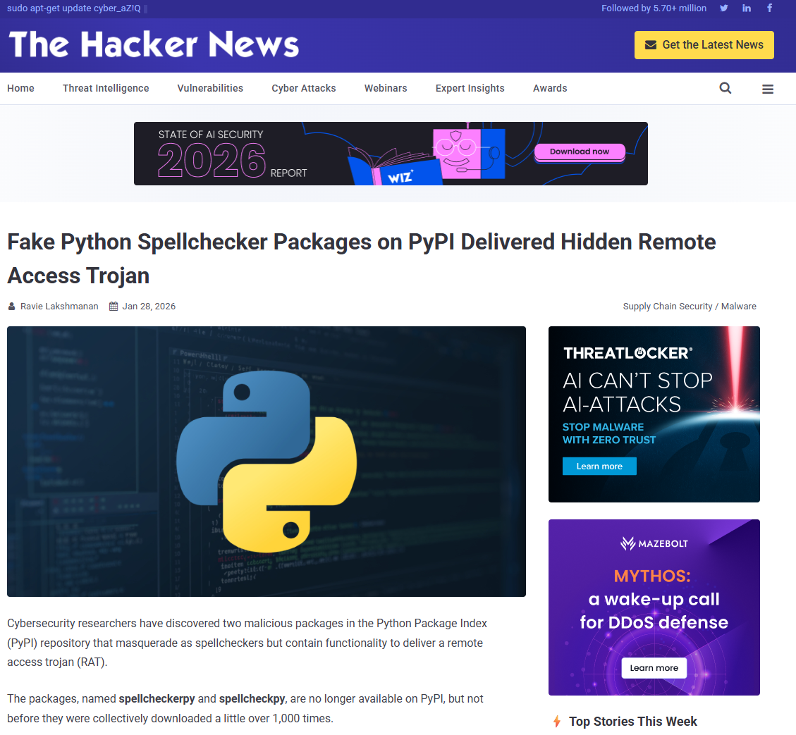
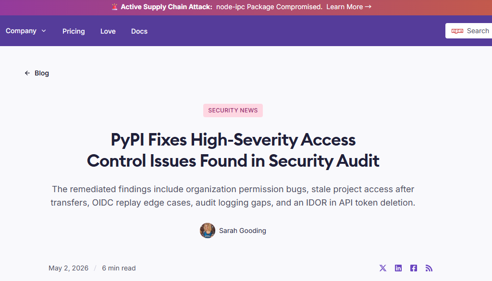

# PyPI Supply Chain Attack Utilizing AI-Generated Masquerade Packages (2026)
> PyPI 供应链遭遇利用 AI 生成代码伪装的恶意包攻击事件

| Field | Value |
|---|---|
| Category | Hallucination & Supply Chain |
| Severity | 🟠 High |
| AI Tool | Unspecified LLM |
| Language | Python |
| Real Incident | ✅ |
| Reproducible | ❌ |
| Disclosed | 2026-01 |
| CVE | — |
| CVSS | — |

## TL;DR
In January 2026, malicious actors flooded PyPI with packages that used LLM-generated boilerplate code to masquerade as legitimate utilities and deliver RATs.
> 2026年1月，黑客利用大模型生成的标准样板代码为伪装外壳，在 PyPI 生态中大批量投毒，绕过传统静态审计并植入远程控制木马。

---

## 详细分析 / Full Analysis

## 基础信息
- **发生时间**：2026-01-28正式披露
- **风险类型**：供应链投毒 / AI 工具滥用 / 第三方依赖安全风险
- **影响范围**：全球 Python 开发者、企业研发项目、CI/CD 自动化构建流水线
- **严重等级**：高，可静默植入 RAT 后门、窃取研发环境凭证、控制本地终端设备

## 一、事件背景与经过
2024至2025年，行业聚焦的 AI 代码安全风险主要集中于开发者误用大模型幻觉生成的不存在组件、漏洞代码等**被动安全隐患**。进入2026年，供应链攻防态势发生颠覆性演变，攻击者开始主动武器化大语言模型，打造标准化、高仿真的恶意软件伪装外壳，发起精准的供应链投毒攻击。

2026年1月28日，权威安全媒体《The Hacker News》曝光一起大规模 PyPI 生态投毒事件。安全监测团队捕获海量伪装类 Python 组件，这些包伪装成拼写校验工具、数学计算工具、基础通用工具类常规开源库，具备极高的迷惑性。

传统供应链安全防护体系会自动拦截结构简陋、内容缺失、无注释的低质量空包。为突破该防护机制，攻击者依托大模型批量生成**语法规范、结构完整、注释完善、排版标准**的高质量样板代码作为伪装外壳，完美模拟正规开源项目特征。在绕过平台初审与常规静态安全检测后，恶意包内置的动态加载逻辑会隐秘下载、激活远程访问木马（RAT），实现对开发者本地终端、研发服务器的远程控制。

## 二、风险细节与深远影响
1. **AI工具**
未公开商用/开源大语言模型，被攻击者用于批量生成标准化样板代码、完成恶意包伪装洗稿。

2. **风险根因**
攻击者主动武器化 AI 代码生成能力，利用 AI 代码标准化、同质化、高可读性的固有特征；同时传统静态启发式扫描、SAST 检测工具对 AI 生成规范化代码存在判定盲区，默认放行高合规度 AI 代码，最终导致供应链防护体系失效。

3. **漏洞表现**
攻击者充分利用大模型输出代码**语法严谨、格式统一、注释规范、无低级语法错误**的特点，批量生成伪装代码外壳。传统静态安全审计工具会将这类标准化代码判定为合规的人工/AI 辅助开发产物，降低风险告警等级并直接放行，彻底绕过传统供应链安全筛查机制，隐藏底层恶意加载逻辑。

4. **影响结果**
携带 RAT 后门的恶意依赖包可沿软件供应链快速扩散，入侵个人开发终端与企业自动化构建环境。该事件标志着 AI 工具的安全风险完成迭代升级：AI 不再仅是产生代码漏洞的被动风险源，已成为攻击者**对抗安全审计、实现隐蔽投毒**的主动攻击工具，引发全行业 AI 供应链信任危机。

## 三、关联报告风险点
本次2026年新型 AI 供应链投毒事件，全方位验证《AI_GenCode_Technical_Capability_Report.pdf》中关于 AI 风险暴露面、工具双面性、供应链零信任治理的核心前瞻性结论，匹配度极高：

### 1. 印证报告4.2节 高资源语言风险暴露面量化规律
报告4.2节及对应图表明确提出，Python 这类开源生态庞大、开发者使用率极高的高资源编程语言，AI 代码渗透率遥遥领先，**高普及度必然带来更高的攻击暴露面**，极易成为 AI 衍生攻击的核心目标。
本次攻击者精准选择 PyPI 生态实施投毒，正是利用 Python 社区对 AI 生成代码的高接纳度、庞大的依赖流转体量，让恶意 AI 伪装包完美隐匿在海量正规 AI 生成项目中，大幅提升攻击成功率与隐蔽性，完全契合报告的量化风险预判。

### 2. 印证报告5.1节 AI 工具的攻防双面性特征
报告5.1、5.3节明确界定了大模型的**安全双面属性**：AI 既是提升开发效率、修复漏洞的赋能工具，也可被恶意滥用，成为新型安全风险的滋生源头。
本次攻击是 AI 工具恶意滥用的典型落地案例，攻击者反向利用 AI 高效、标准化、批量生成代码的能力，将其改造为“恶意代码洗稿、伪装工具”，打破了传统安全体系中“代码规范=安全”的固有认知，充分验证报告对 AI 系统性安全风险、双面性危害的核心论断。

### 3. 呼应报告6.3节 供应链全流程零信任治理核心战略
报告6.3节明确提出软件供应链安全重构核心方案：必须搭建 AI 时代的供应链零信任机制，明确开发者安全主体责任，对自动化生成、外部引入的代码与组件强制实施沙箱隔离、动态安全校验，杜绝无条件信任外部资源。
本次事件暴露出传统黑白名单、静态语法扫描的彻底失效，直接证明报告治理策略的必要性。面对 AI 伪装类新型攻击，企业必须摒弃固有信任逻辑，对所有带 AI 特征、外部引入的第三方依赖默认标记为高风险，通过沙箱隔离、DAST 动态检测、人工深度审计筑牢防线，精准匹配报告的零信任治理体系。

## 四、修复与长效治理方案
### 1. 紧急修复措施
- **依赖项紧急阻断**：同步更新企业私有源、制品库黑名单，批量拦截、下线所有 AI 伪装类恶意 Python 组件，阻断恶意包扩散链路。
- **全域风险消杀**：对所有拉取过异常依赖的开发终端、Jenkins、GitHub Actions 构建服务器进行全面排查，批量轮换系统凭证、密钥、账号权限，彻底清除潜伏的 RAT 后门与持久化恶意程序。

### 2. 长效治理方案
- **工具层安全升级**
在供应链检测环节新增 AI 代码特征识别能力，搭建专属 AI 代码成分分析（SCA）与数字水印追踪机制。不再仅依赖传统 CVE 漏洞匹配，针对短时间批量涌现、高度同质化、标准化的 AI 样板代码组件，动态下调信誉评分并主动拦截，精准防御 AI 伪装投毒攻击。

- **人机协同深度治理**
严格落实供应链零信任规范，彻底关停外部依赖自动引入、自动合并的“直通车”机制。将所有 AI 参与生成、第三方开源引入的组件统一归类为高风险资产，强制实施沙箱隔离运行、DAST 动态安全测试与人工逻辑审计三重校验，从流程层面杜绝 AI 伪装类恶意包入侵，持续提升企业软件供应链安全韧性。

## 五、参考来源
1. The Hacker News: Massive PyPI Supply Chain Attack Utilizing AI-Generated Masquerade Packages (2026)
https://thehackernews.com/2026/01/fake-python-spellchecker-packages-on.html
2. PyPI Fixes High-Severity Access Control Issues Found in Security Audit
https://socket.dev/blog/pypi-fixes-high-severity-issues-found-in-security-audit