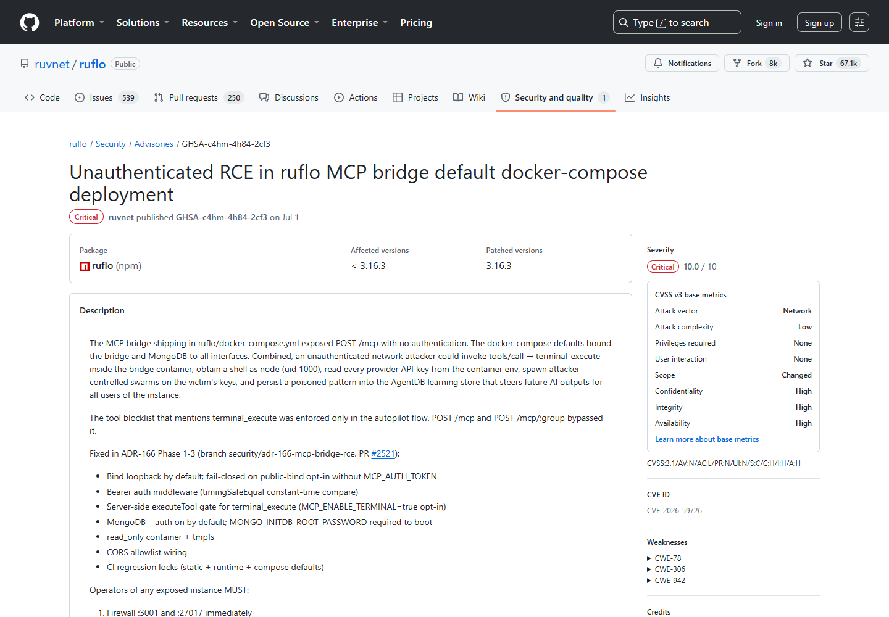
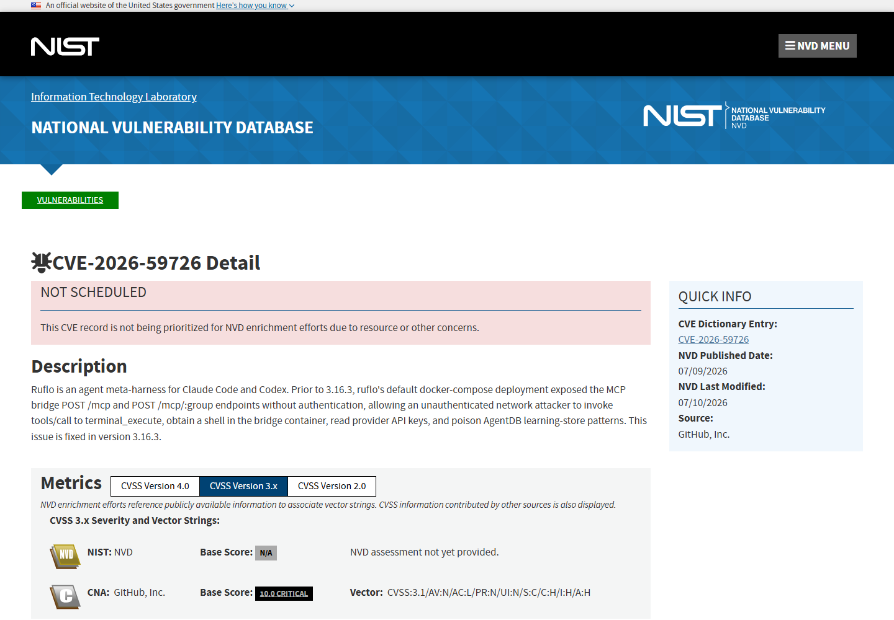
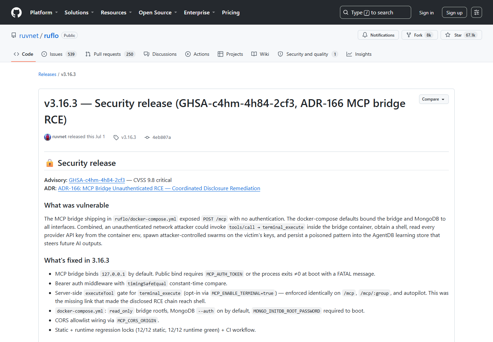
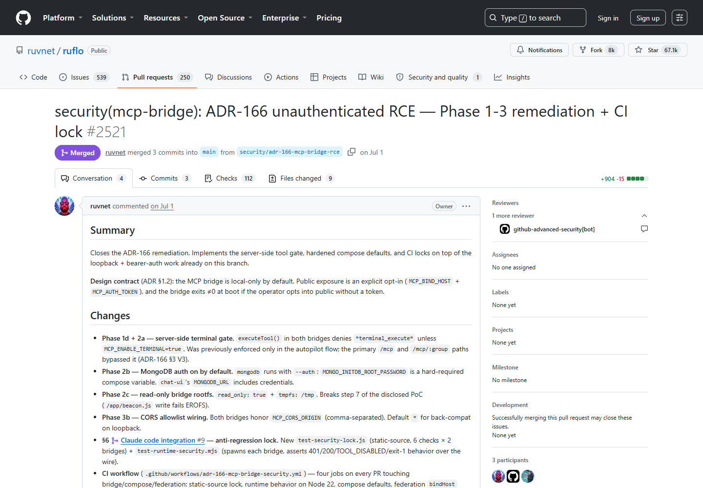
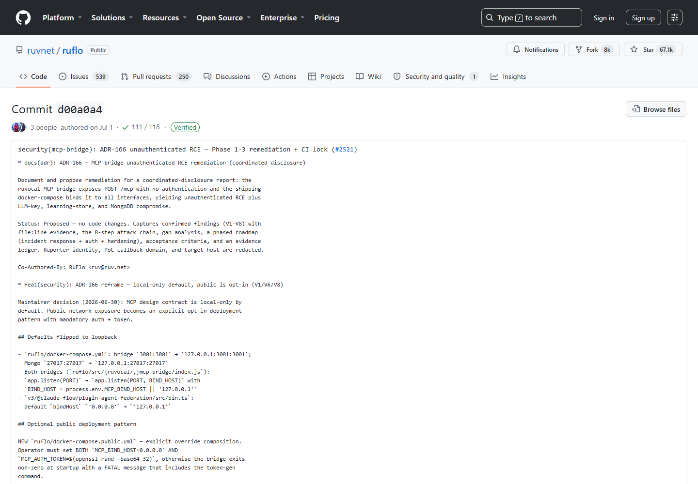

# Ruflo MCP Bridge Unauthenticated RCE and Agent Memory Poisoning (2026)
> Ruflo MCP Bridge 未授权远程执行与 Agent 记忆污染

| Field | Value |
|---|---|
| Category | agent-risk |
| Severity | critical |
| AI Tool | Ruflo, Claude Code, Codex, MCP, AgentDB |
| Language | TypeScript / Docker / MCP |
| Real Incident | Yes |
| Reproducible | Yes |
| Disclosed | 2026-07-09 |
| CVE | CVE-2026-59726 |

## TL;DR
Ruflo 默认容器部署对外开放未认证的 MCP Bridge，网络攻击者可调用 terminal_execute 获取容器 Shell、读取模型服务密钥，并篡改 AgentDB 学习数据。

---

## 详细分析 / Full Analysis

## 一、基本信息与事件概况

Ruflo 是用于 Claude Code、Codex 等编程代理的多 Agent 编排层。它的 MCP Bridge 把外部请求转成工具调用，并可连接终端执行与 AgentDB。漏洞版本的默认 docker-compose 配置让 POST /mcp 和 POST /mcp/:group 在没有认证的情况下可达，导致网络访问本身就等同于获得工具调用能力。

受影响范围为 Ruflo 3.16.3 之前版本的默认 `docker-compose` 部署，修复版本为 3.16.3。自行关闭 Bridge 端口或另外增加认证的部署未必具有相同暴露面，仍需按实际编排文件和网络策略核对。

## 二、公开披露与材料核验

该问题在 2026 年 7 月 9 日以 CVE-2026-59726 和仓库安全公告公开，CNA 给出 10.0 分。项目在 3.16.3 中加入修复，补丁提交、拉取请求和版本发布可以相互对应。NVD 记录的影响范围为 3.16.3 之前版本，并明确列出 terminal_execute、API 密钥读取和 AgentDB 模式污染三类后果。

### 证据矩阵

| 来源 | 类型 | 证明内容 |
|---|---|---|
| Ruflo repository advisory | 公开记录 | 版本、技术机制、修复或产品背景 |
| NVD CVE record | 公开记录 | 版本、技术机制、修复或产品背景 |
| Ruflo 3.16.3 release | 公开记录 | 版本、技术机制、修复或产品背景 |
| Ruflo security pull request 2521 | 公开记录 | 版本、技术机制、修复或产品背景 |
| Ruflo patch commit | 公开记录 | 版本、技术机制、修复或产品背景 |

## 三、系统背景与触发条件

主要风险集中在采用默认 `docker-compose`、并让 MCP Bridge 端口对不可信网络可达的部署。Bridge 进程还需要能够调用终端工具或写入 AgentDB，攻击结果才会分别扩展为容器命令执行和持久记忆污染。

MCP Bridge 本来承担的是协议转换和工具分发。客户端连入后，可以发现工具、提交参数，再由 Bridge 代为访问终端、数据库和其他 Agent 服务。默认编排把这条控制面暴露出来，却没有在请求进入工具路由前确认客户端身份，导致“能够连到端口”和“获得工具权限”成为同一件事。

实际影响随容器配置变化。未挂载敏感目录、没有供应商密钥且禁用终端工具的实例，后果会小于公告中的完整攻击链；反之，如果 Bridge 继承宿主目录、云凭据或持久化 AgentDB 数据卷，攻击者取得的就不再是一次性测试环境。

## 四、攻击链与失效过程

攻击者扫描到可访问的 MCP Bridge 后，无需凭据即可初始化调用并选择 terminal_execute。命令在 Bridge 容器内执行后，可继续读取容器环境中的模型供应商密钥；如果 AgentDB 数据卷可写，还能插入恶意学习模式。后者不会只影响一次会话，后续 Agent 可能把被篡改的模式当作历史经验继续使用。

第一阶段是未认证的 MCP 会话建立。协议握手本身看起来正常，服务端也会返回合法工具清单，因此传统只按异常 HTTP 状态码告警的监控未必能够发现。第二阶段才是高风险工具调用：`terminal_execute` 把协议层权限转成操作系统命令，读取环境变量或配置文件后即可获得后续访问模型服务、代码仓库或云平台的凭据。

AgentDB 污染构成另一条后果链。攻击者可写入貌似正常的经验、模式或记忆，使后续任务在检索时取回恶意内容。即便管理员替换容器镜像，持久卷中的记录仍可能存在；如果这些记录又被多个 Agent 共用，影响还会沿编排关系扩散。

## 五、技术根因与 AI 安全分析

这个案例同时破坏了 Agent 的执行边界和长期状态完整性。普通未授权 RCE 主要关注主机控制，而带持久记忆的编排系统还需要考虑攻击输入是否被写入检索库、技能库或学习存储。即使容器随后重启，被污染的数据卷仍可能继续影响任务选择。MCP 网络传输必须具备强认证、来源限制和工具级授权，终端工具还应由独立沙箱承载，不能仅依赖容器网络默认值。

在多 Agent 系统里，记忆数据库通常被当作可信的内部知识，而不是外部输入。这个假设一旦失效，模型可能在没有新攻击请求的情况下重复使用污染内容。与普通数据库篡改相比，问题更难从输出中直接识别，因为恶意记录会经过检索、摘要和模型重新表述，最后表现为看似合理的任务选择。

网络认证只是最前面的一层。Bridge 还应根据客户端身份限制可见工具，为终端执行设置独立审批和命令沙箱，并给 AgentDB 写操作留下可追溯的主体、时间和来源。否则，一枚权限过宽的统一令牌仍会把所有能力重新捆在一起。

## 六、影响范围与处置建议

受影响部署应升级到 3.16.3 或更高版本，撤销并轮换容器中出现过的供应商密钥，同时检查 AgentDB 中新增或异常修改的模式。只替换镜像不足以处理持久卷污染；应将修复前后的数据库快照、MCP 请求日志和容器命令历史一起纳入排查。

排查顺序可以从网络入口开始：确认 Bridge 曾绑定在哪个地址、端口是否经过反向代理、访问控制列表是否真正生效。随后关联 MCP 初始化请求、工具枚举和 `terminal_execute` 调用，检查相同来源是否读取过环境配置或访问凭据目录。

对于 AgentDB，建议按修复时间点导出新增和修改记录，抽查来源不明、措辞异常或突然获得高使用频率的模式。无法证明数据完整性时，使用可信备份重建比逐条删除更稳妥；恢复后还应观察 Agent 是否继续出现相同的异常决策。

## 七、结论

Ruflo 事件把两类风险放在了同一个入口上：未认证的远程工具调用可以立即取得终端能力，也可以悄悄改变 Agent 的长期记忆。升级和封闭端口只能处理当前入口，凭据轮换、持久数据核验与工具权限拆分同样不可缺少。

## 八、参考来源

- [Ruflo repository advisory](https://github.com/ruvnet/ruflo/security/advisories/GHSA-c4hm-4h84-2cf3)
- [NVD CVE record](https://nvd.nist.gov/vuln/detail/CVE-2026-59726)
- [Ruflo 3.16.3 release](https://github.com/ruvnet/ruflo/releases/tag/v3.16.3)
- [Ruflo security pull request 2521](https://github.com/ruvnet/ruflo/pull/2521)
- [Ruflo patch commit](https://github.com/ruvnet/ruflo/commit/d00a0a40cd8bdbca877ac7f675f416bdc69accd1)

