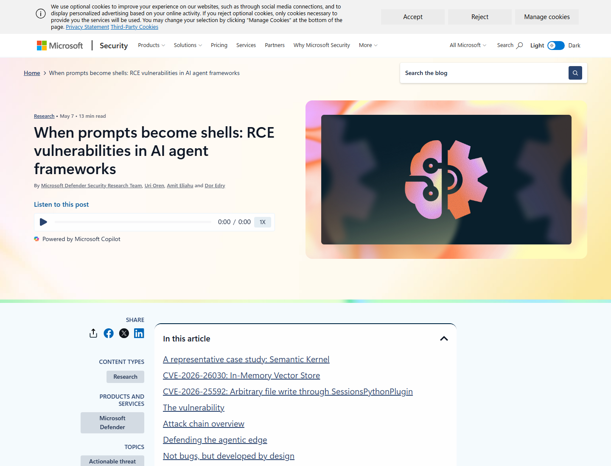
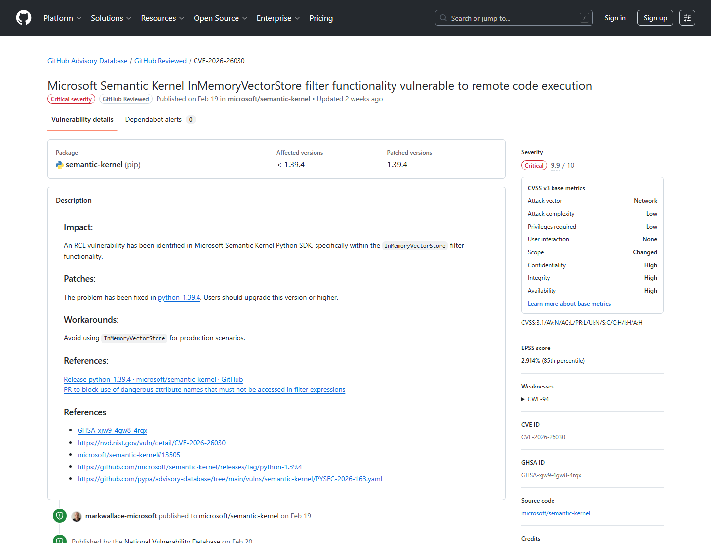
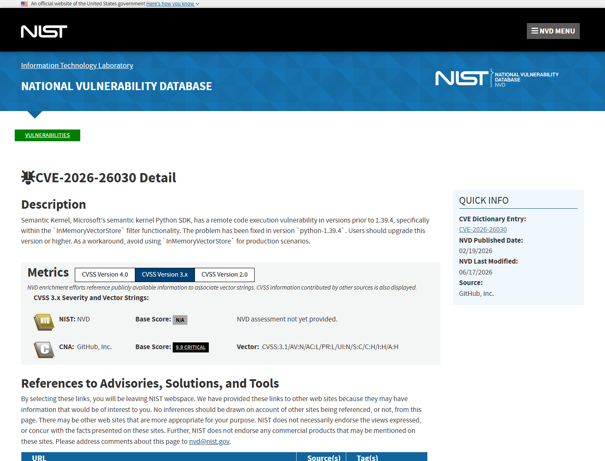
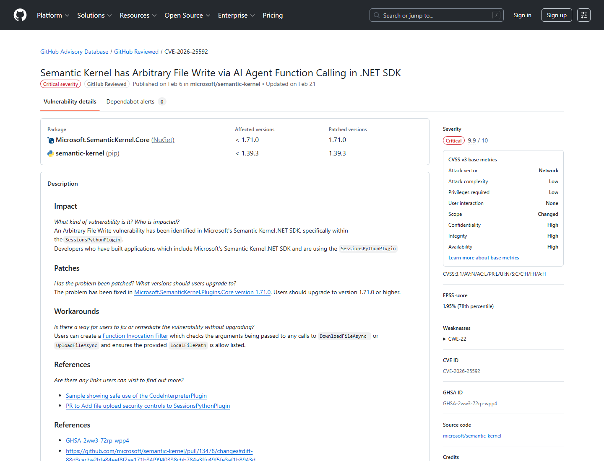
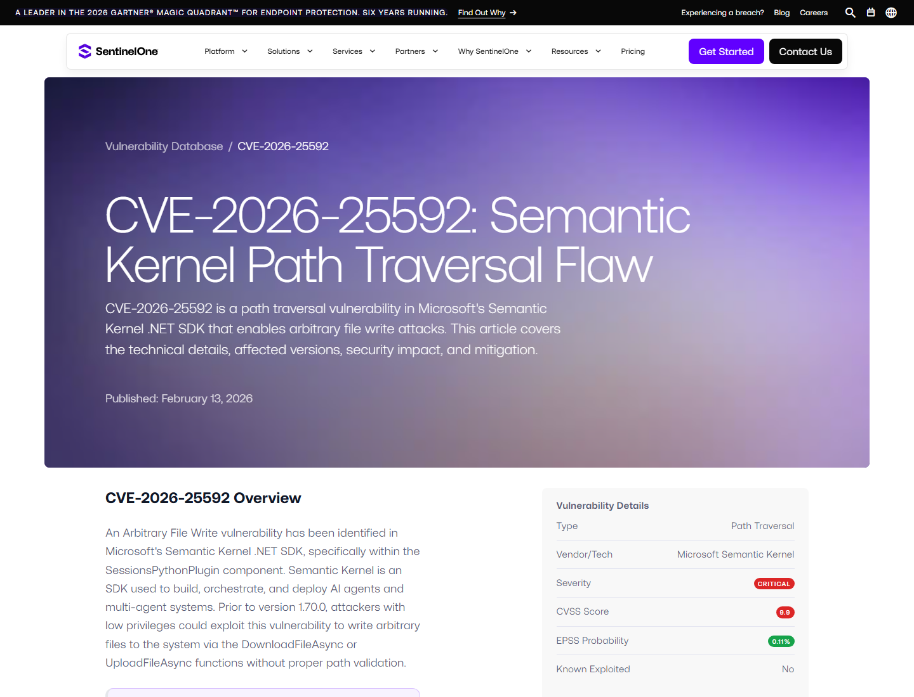
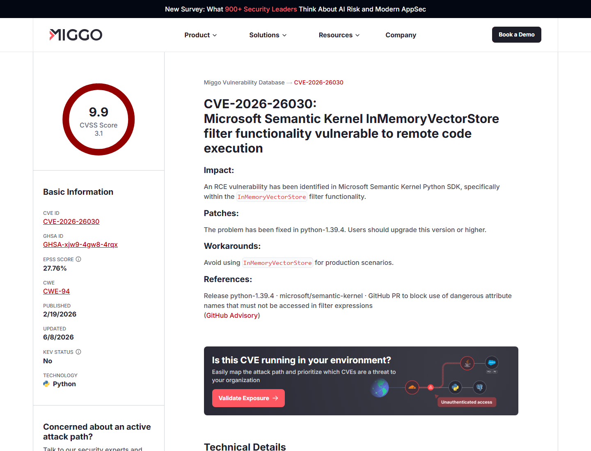

# Semantic Kernel Prompt Injection to Host RCE (2026)
> Semantic Kernel 提示注入到宿主机远程代码执行

| Field | Value |
|---|---|
| Category | Agent Risk |
| Severity | Critical |
| AI Tool | Microsoft Semantic Kernel, AI agent framework |
| Language | Python / .NET |
| Real Incident | Yes |
| Reproducible | Yes |
| Disclosed | 2026-05-07 |
| CVE | CVE-2026-26030 / CVE-2026-25592 |

## TL;DR
Microsoft showed two Semantic Kernel flaws where prompt injection could steer model-callable tools into host-level execution: one through Python vector-store filter evaluation, and one through .NET file-transfer functions.
> 这个案例的核心是“提示注入不只影响回答文本”。当 agent 连接搜索插件、代码解释器和文件传输函数后，模型可控输入可能变成 filter expression、文件路径或工具参数，最终触达宿主机执行面。

---

## 详细分析 / Full Analysis

# Semantic Kernel 案例分析：提示注入如何从 agent 输入升级为宿主机 RCE

## 基本信息

Semantic Kernel 是 Microsoft 的开源 AI agent framework，用于编排模型、插件、工具调用和多 agent 工作流。2026 年 5 月，Microsoft Defender Security Research Team 发表 “When prompts become shells”，系统复盘了两个已修复漏洞：CVE-2026-26030 影响 Python SDK 的 `InMemoryVectorStore` filter 功能；CVE-2026-25592 影响 .NET SDK 中 `SessionsPythonPlugin` 的文件上传/下载函数。

微软的研究重点不是单纯列 CVE，而是展示了 agent 架构中的安全转折点：模型一旦被接到工具，prompt injection 就可能从内容安全问题变成代码执行 primitive。CVE-2026-26030 中，攻击者影响 agent 输入，输入再进入 vector-store filter；CVE-2026-25592 中，模型可调用的文件传输函数接受未经充分约束的本地路径。[Microsoft Security Blog](https://www.microsoft.com/en-us/security/blog/2026/05/07/prompts-become-shells-rce-vulnerabilities-ai-agent-frameworks/)

## 一、事件核验与证据范围

### 证据矩阵

| 来源 | 类型 | 证明内容 | 备注 |
|---|---|---|---|
| Microsoft Security Blog | 原始研究 | 两个漏洞、prompt injection 到 host RCE、利用条件和修复思路 | 主技术叙述 |
| GHSA-xjw9-4gw8-4rqx / NVD | 主证据 | CVE-2026-26030、Python SDK <1.39.4、InMemoryVectorStore RCE | 漏洞记录 |
| GHSA-2ww3-72rp-wpp4 / NVD | 主证据 | CVE-2026-25592、.NET SDK <1.71.0、SessionsPythonPlugin 任意文件写入 | 漏洞记录 |
| SentinelOne | 复核证据 | Path traversal、arbitrary file write、AI agent function calling 风险 | 第三方复核 |
| Miggo | 复核证据 | VectorStore RCE、危险 filter expression 和修复版本 | 第三方复核 |

GitHub Advisory 对 CVE-2026-26030 的描述是：Semantic Kernel Python SDK 在 1.39.4 之前，`InMemoryVectorStore` filter 功能存在 RCE；建议升级到 `python-1.39.4` 或更高版本，并避免在生产场景使用 `InMemoryVectorStore`。NVD 将其归类为 CWE-94，CVSS 9.9。[GitHub Advisory CVE-2026-26030](https://github.com/advisories/GHSA-xjw9-4gw8-4rqx)

## 二、系统背景与触发条件

Semantic Kernel 允许开发者把模型、memory、search plugin、function calling 和代码解释器组合成 agent。CVE-2026-26030 的前提是 agent 存在 prompt injection 向量，并且使用了基于 `InMemoryVectorStore` 默认配置的 Search Plugin。攻击者影响记录字段或查询内容后，模型可控值进入 filter expression，最终到达 Python 执行语义。

CVE-2026-25592 的前提是应用使用 `.NET` SDK 中的 `SessionsPythonPlugin`，并暴露了文件上传或下载函数。问题在于这些函数可被模型作为 kernel function 调用，且本地路径缺少充分 canonicalization 和 allowlist。攻击者通过 prompt injection 或工具参数操纵，让 agent 写入或读取预期目录之外的文件。

## 三、攻击链与处置过程

在 Python VectorStore 链条中，问题来自 filter 表达式处理。微软披露称，攻击者可让模型输入进入 filter 语义，绕过原有阻断逻辑，并触发任意 Python 代码执行。修复侧通过阻断危险属性名访问、加强表达式校验和版本升级来降低风险。

在 .NET SessionsPythonPlugin 链条中，模型可调用的 `DownloadFileAsync` / `UploadFileAsync` 接收本地路径。路径没有被严格限制时，攻击者可让 agent 写文件到敏感位置，或读取敏感文件并外传。微软在修复中加入路径 canonicalization、目录 allowlist 和 opt-in dangerous file operation 控制，使模型不能默认自主触发这些函数。[GitHub Advisory CVE-2026-25592](https://github.com/advisories/GHSA-2ww3-72rp-wpp4)

## 四、技术根因分析

两个漏洞的共同根因，是 model-controlled data 到达了 high-impact interpreter。CVE-2026-26030 中，high-impact interpreter 是 filter expression/eval-like 逻辑；CVE-2026-25592 中，high-impact interpreter 是文件系统路径和文件传输函数。传统应用里，这些输入通常来自显式用户操作；agent 应用里，它们可能来自模型根据上下文“自主选择”的工具参数。

第二个根因是把 AI 模型当成了隐含安全边界。模型会总结、推理和选择工具，但它不能可靠区分开发者意图、用户输入和攻击者嵌入指令。只要工具参数能被 prompt injection 影响，安全控制就必须在宿主层、工具层和参数 schema 层完成，而不能指望模型“不要这么做”。

## 五、AI 参与方式与风险归因

这里的 AI 参与方式非常直接：攻击者通过 prompt injection 影响 agent 行为，agent 再调用 Semantic Kernel 暴露的工具。模型不是漏洞的唯一原因，但它是连接不可信内容与高权限函数的调度器。微软在文章中把这条线描述为 “prompts become shells”，正是因为工具层让自然语言输入有机会变成 host execution。

Miggo 对 CVE-2026-26030 的复核也强调，问题发生在 `InMemoryVectorStore` filter functionality，修复版本是 1.39.4；对防御者而言，关键不是只过滤提示词，而是限制 filter 语言、拒绝危险属性访问，并避免把 production search 绑定到不安全的内存实现。[Miggo](https://www.miggo.io/vulnerability-database/cve/CVE-2026-26030)

## 六、与团队技术报告风险框架的关系

团队技术报告关注 agent 工具调用的执行边界。Semantic Kernel 这个案例可以作为框架级证据：当 agent 具备搜索、文件、代码解释器和插件能力时，prompt injection 的影响不再停留在“输出错误答案”。它会通过工具参数进入 eval、路径、shell、HTTP、数据库或文件系统。

这也说明，agent 框架的默认函数暴露要尽可能保守。能写文件、下载文件、执行代码、筛选表达式、发起网络请求的函数，都应有独立权限、参数 allowlist、审计日志和人类确认。

## 七、影响范围与社会后果

Semantic Kernel 是 Microsoft 生态中重要的 agent framework，广泛用于企业和开发者构建 tool-using agents。两个 CVE 的共同后果是，攻击者可把不可信内容转化为本机执行或任意文件写入。对企业 agent 而言，这可能影响源代码、凭据、内部文件、模型 API key、工作流状态和业务系统访问。

社会后果在于安全认知改变。过去 prompt injection 常被写成数据泄露或越权输出问题；Semantic Kernel 的公开复盘表明，在接入工具后，prompt injection 可以成为 RCE 的上游触发条件。对使用 agent 框架的团队来说，漏洞管理必须覆盖 SDK 版本、插件配置、工具权限和提示注入测试。

## 八、治理建议

Semantic Kernel 用户应升级 Python SDK 到 1.39.4 或更高版本，升级 .NET SDK 到 1.71.0 或更高版本，并复核是否使用 `InMemoryVectorStore`、Search Plugin、`SessionsPythonPlugin` 或文件传输函数。生产环境应避免使用不安全的内存 filter 实现，文件上传/下载应开启 allowlist 和路径 canonicalization。

架构上，agent 工具应按 capability 授权；模型可调用函数应默认最小化；高危函数需要明确用户确认和审计。防御不应只依赖 prompt filter，而应在工具参数进入解释器、文件系统或网络请求前做强校验。对已暴露的 agent，应审计异常文件写入、脚本执行、plugin 调用和模型上下文中的外部指令。

## 九、结论

Semantic Kernel 两个 CVE 把 agent 安全中的一句抽象警告落到了实处：模型不是安全边界。提示注入可以影响工具参数，工具参数可以进入 filter evaluation 或文件系统，最终触发宿主机执行。AI agent 框架需要把每个模型可调用函数都当成潜在攻击面管理，而不是只审查模型回复内容。

## 参考来源

- [Microsoft Security Blog: When prompts become shells](https://www.microsoft.com/en-us/security/blog/2026/05/07/prompts-become-shells-rce-vulnerabilities-ai-agent-frameworks/)
- [GitHub Advisory: CVE-2026-26030](https://github.com/advisories/GHSA-xjw9-4gw8-4rqx)
- [GitHub Advisory: CVE-2026-25592](https://github.com/advisories/GHSA-2ww3-72rp-wpp4)
- [NVD: CVE-2026-26030](https://nvd.nist.gov/vuln/detail/CVE-2026-26030)
- [NVD: CVE-2026-25592](https://nvd.nist.gov/vuln/detail/CVE-2026-25592)
- [SentinelOne: CVE-2026-25592 Semantic Kernel path traversal](https://www.sentinelone.com/vulnerability-database/cve-2026-25592/)
- [Miggo: CVE-2026-26030 Semantic Kernel VectorStore RCE](https://www.miggo.io/vulnerability-database/cve/CVE-2026-26030)
