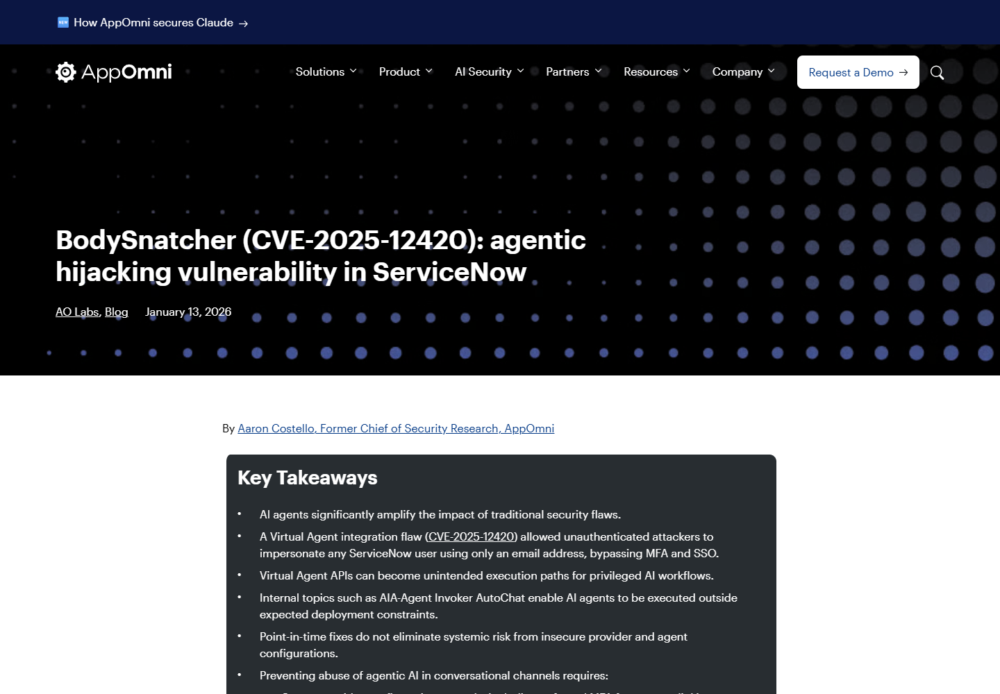
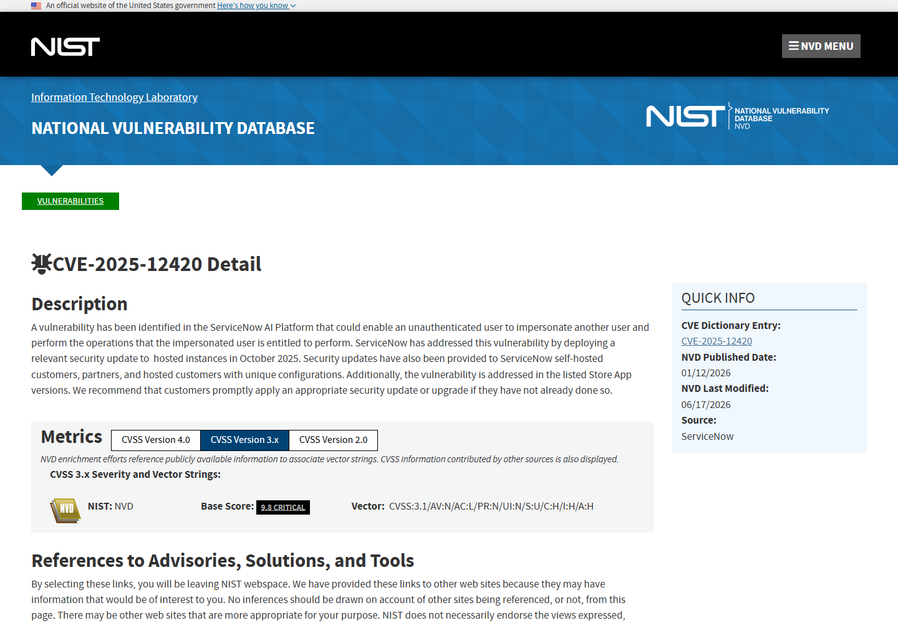
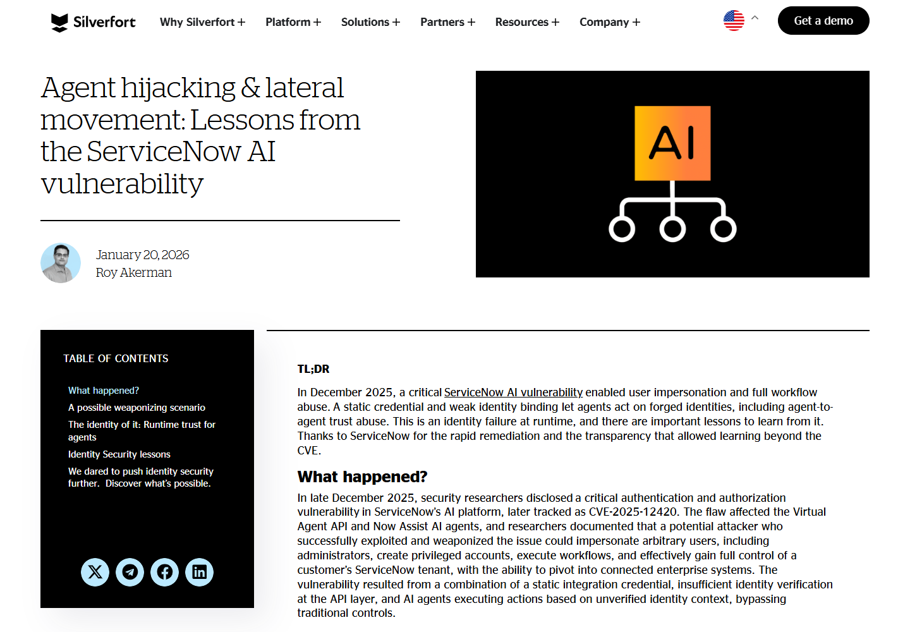
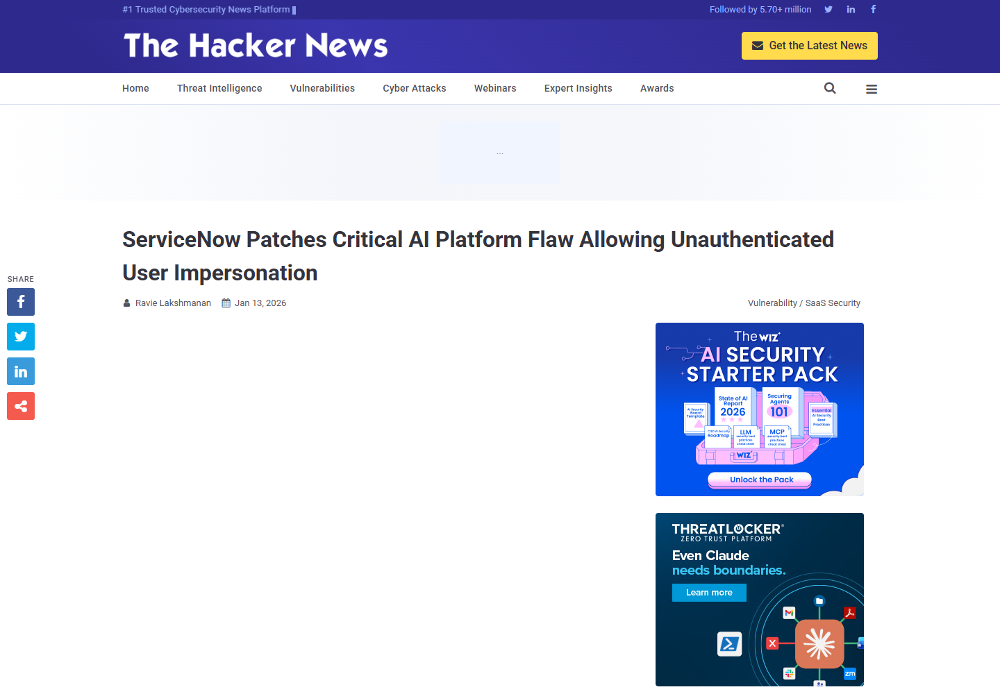
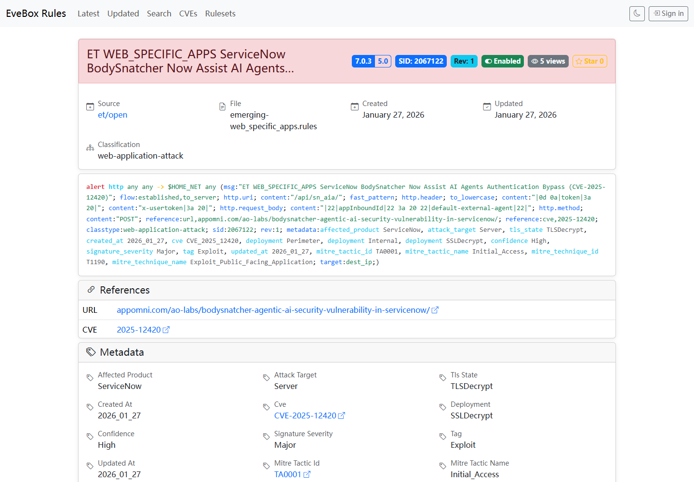

# ServiceNow BodySnatcher Virtual Agent User Impersonation (2026)
> ServiceNow BodySnatcher 虚拟代理用户冒充漏洞

| Field | Value |
|---|---|
| Category | agent-risk |
| Severity | critical |
| AI Tool | ServiceNow Now Assist AI Agents, Virtual Agent API |
| Language | SaaS / REST API / Agentic AI |
| Real Incident | Yes |
| Reproducible | Yes |
| Disclosed | 2026-01-12 |
| CVE | CVE-2025-12420 |

## TL;DR
ServiceNow Virtual Agent 的外部集成信任链允许未认证攻击者仅凭邮箱冒充用户，绕过 MFA 与 SSO，并以被冒充身份驱动 Now Assist AI Agent 执行有权限的操作。

---

## 详细分析 / Full Analysis

## 一、基本信息与事件概况

BodySnatcher 影响 ServiceNow Virtual Agent API 与 Now Assist AI Agents。研究者发现，外部 Agent 接入使用平台级共享秘密，并通过邮箱自动关联 ServiceNow 用户。攻击者可以利用这一组合，在没有目标用户密码、MFA 或 SSO 会话的情况下建立被冒充身份，并把自然语言请求交给企业 AI Agent 执行。

受影响范围为 Now Assist AI Agents 5.0.24-5.1.17、5.2.0-5.2.18；Virtual Agent API 3.15.1 及之前、4.0.0-4.0.3，修复版本为 sn_aia 5.1.18/5.2.19；sn_va_as_service 3.15.2/4.0.4。最终影响由外部接入配置、被冒充用户角色和 Agent 工具权限共同决定。

## 二、公开披露与材料核验

AppOmni 于 2025 年 10 月 23 日向 ServiceNow 报告问题，ServiceNow 在 10 月 30 日向托管实例部署修复并通知客户。CVE-2025-12420 和详细技术分析在 2026 年 1 月公开，CVSS 为 9.3。ServiceNow、AppOmni、NVD、政府安全通报和检测规则对受影响组件及修复版本的描述一致。

### 证据矩阵

| 来源 | 类型 | 证明内容 |
|---|---|---|
| AppOmni BodySnatcher research | 公开记录 | 版本、技术机制、修复或产品背景 |
| NVD CVE record | 公开记录 | 版本、技术机制、修复或产品背景 |
| Silverfort identity security analysis | 独立安全分析 | Agent 身份劫持与横向移动风险 |
| The Hacker News independent report | 独立安全报道 | 厂商修复、受影响组件与版本范围 |
| Emerging Threats detection rule | 公开记录 | 版本、技术机制、修复或产品背景 |

## 三、系统背景与触发条件

完整利用依赖 Virtual Agent 外部接入、邮箱自动关联和可执行高权限动作的 Now Assist Agent。被冒充用户拥有的角色以及 Agent 已配置的工具决定最终影响，普通低权限会话与管理员身份的后果差异很大。

ServiceNow 的正常登录可以由 SSO 和 MFA 保护，但 Virtual Agent 外部集成走的是另一条身份建立流程。研究中，平台级共享秘密用于证明接入方身份，具体终端用户又根据邮箱地址映射。共享秘密一旦可被滥用，邮箱便从普通标识符变成了决定执行身份的关键字段。

漏洞的价值还取决于实例中启用了哪些 Now Assist 技能。只提供知识问答的 Agent 与能够创建用户、修改角色或执行工单动作的 Agent 不在同一风险等级。评估时应从实际工具清单和被冒充用户权限出发，而不是只根据组件是否安装做结论。

## 四、攻击链与失效过程

攻击者先利用 Virtual Agent 外部 API 的信任配置，以目标邮箱建立身份映射。API 随后把请求视为该用户发起，Now Assist Agent 继承其可访问的数据和工作流能力。研究演示中，攻击者能够让 Agent 创建后门账户并授予高权限角色；实际可执行动作取决于被冒充用户及已配置 Agent 的权限。

攻击链先绕过的是身份认证，而不是直接调用某个管理员接口。Virtual Agent 接受会话后，后续自然语言请求已经带着被冒充用户的上下文，Agent 再按正常方式选择工具、组织参数并执行多个步骤。对下游审计系统而言，这些动作可能显示为合法用户和合法 Agent 发起，增加了溯源难度。

研究演示把创建账户和授予角色串联起来，说明 Agent 的多步执行能力会放大一次身份冒充。即使某个单独工具无法完成接管，多个权限有限的动作仍可能组合出持久访问。实例中没有相应高权限工具时，影响会收缩到该用户原本可查询或修改的数据。

## 五、技术根因与 AI 安全分析

该案例发生在企业身份转换为 Agent 执行上下文的环节。MFA 和 SSO 保护正常登录流程，第三方 Agent 集成使用的弱身份链路却绕开了这些控制。一次冒充还可被 Agent 扩展为涉及账号、角色、工单和业务数据的多步骤工作流。外部通道必须采用每租户或每客户端独立凭据，并对高风险工具再次确认用户身份。

企业 Agent 通常被设计成“替用户完成工作”，因此用户身份不仅决定能看到什么，也决定工具调用以谁的权限执行。若身份来自未经验证的邮箱映射，Agent 的自动化能力会忠实地替错误的人执行任务。仅在模型提示词中要求谨慎无法修复这种身份错误，因为模型收到的会话上下文本身已经把攻击者标成可信用户。

外部接入应使用可验证、不可由调用者任意替换的主体标识，并把集成方认证与终端用户认证分开。创建账户、授予角色和导出敏感数据等动作还应要求重新认证或独立审批，使单个 Agent 会话不能连续完成整条提权链。

## 六、影响范围与处置建议

受影响客户应核对应用版本、ServiceNow 的修复通知与实例更新状态，并审计 Virtual Agent API 调用、异常邮箱映射、AI Agent 创建记录和角色变更。目前公开通报未提及在野利用，历史外部 Agent 会话仍应按真实日志逐项回溯。

日志关联应从外部会话建立开始，检查调用来源、邮箱映射、会话标识以及随后触发的 Agent 工具。重点关注短时间内创建用户、修改角色、重置凭据或批量读取记录的会话，并与目标用户真实登录时间和设备信息比较。

补丁完成后，还要清理攻击者可能创建的账户、令牌和持久化工作流。若实例曾向合作方发放共享接入秘密，应确认其轮换情况，并缩小每个外部客户端可代表的用户和可调用的 Agent 范围。

## 七、结论

BodySnatcher 暴露的是企业 Agent 的身份继承问题：入口处一次错误的邮箱映射，会被后续工具当作真实用户授权继续使用。修复组件版本之外，实例还需要回溯外部会话和高风险动作，并重新审视 Agent 是否拥有连续完成账户提权的能力。

## 八、参考来源

- [AppOmni BodySnatcher research](https://appomni.com/ao-labs/bodysnatcher-agentic-ai-security-vulnerability-in-servicenow/)
- [NVD CVE record](https://nvd.nist.gov/vuln/detail/CVE-2025-12420)
- [Silverfort identity security analysis](https://www.silverfort.com/blog/agent-hijacking-lateral-movement-lessons-from-the-servicenow-ai-vulnerability/)
- [The Hacker News independent report](https://thehackernews.com/2026/01/servicenow-patches-critical-ai-platform.html)
- [Emerging Threats detection rule](https://rules.evebox.org/pub/et/open/2067122)

